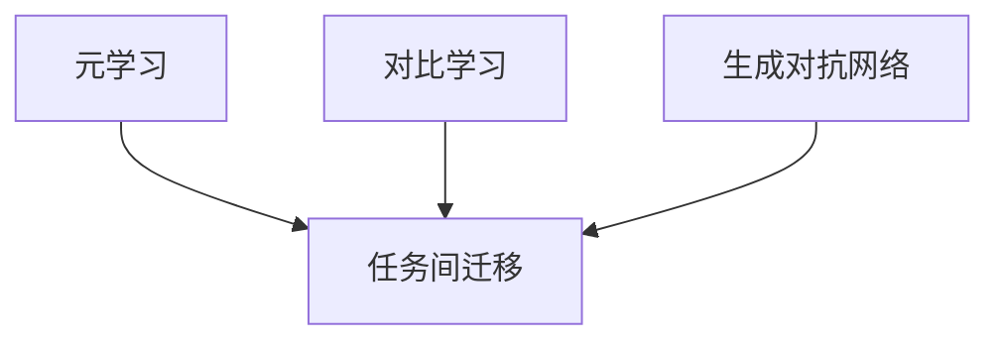

                 

# 企业AI Agent的少样本学习：快速适应新业务场景

## 关键词：企业AI Agent，少样本学习，快速适应，业务场景，算法原理，系统架构

## 摘要：  
企业AI Agent在现代商业环境中扮演着越来越重要的角色，然而，传统机器学习方法在面对新业务场景时，往往需要大量标注数据才能有效工作。少样本学习作为一种新兴的技术，能够在数据 scarce的情况下快速适应新场景，从而为企业AI Agent提供了更灵活和高效的支持。本文从背景、核心概念、算法原理、系统架构、项目实战到最佳实践，全面解析企业AI Agent的少样本学习技术，帮助企业快速实现新业务场景的智能化转型。

---

# 第1章: 企业AI Agent的少样本学习背景

## 1.1 少样本学习的背景

### 1.1.1 传统机器学习的局限性  
传统机器学习方法（如支持向量机、随机森林等）在处理新业务场景时，通常需要大量的标注数据来训练模型。这种数据需求在企业环境中往往难以满足，尤其是在业务场景快速变化的情况下。

### 1.1.2 少样本学习的提出与意义  
少样本学习（Few Shot Learning）是一种新兴的机器学习范式，旨在利用少量样本数据进行模型训练和推理。其核心目标是降低对数据量的依赖，同时保持较高的模型性能。

### 1.1.3 企业AI Agent的适应性需求  
企业AI Agent需要快速适应新的业务场景，例如客服系统中的新问题类型、供应链中的新供应商数据等。少样本学习能够有效解决这些问题，从而提高企业的灵活性和效率。

## 1.2 问题背景与问题描述

### 1.2.1 企业业务场景的多样性  
企业的业务场景复杂多样，每个场景可能需要不同的模型和算法支持，而数据获取成本往往很高。

### 1.2.2 数据获取的挑战  
在某些业务场景中，获取大量标注数据可能耗时、耗力且成本高昂，尤其是在处理新兴业务时。

### 1.2.3 快速适应新场景的需求  
企业需要在短时间内快速部署AI Agent，以应对市场变化和客户需求，这要求AI Agent能够快速学习和适应新场景。

## 1.3 少样本学习的核心目标

### 1.3.1 快速适应新任务  
通过少量样本数据，快速训练出适用于新任务的模型。

### 1.3.2 降低数据依赖性  
减少对大量标注数据的依赖，提高模型的通用性和适应性。

### 1.3.3 提高模型泛化能力  
在数据 scarce的情况下，依然保持较高的模型性能和泛化能力。

## 1.4 企业AI Agent的少样本学习边界

### 1.4.1 适用场景与限制  
适用于数据量少但业务场景变化快的情况，但在数据完全不足的情况下可能效果有限。

### 1.4.2 与其他学习范式的区别  
与传统监督学习和无监督学习的区别在于，少样本学习在少量数据下仍能有效工作。

### 1.4.3 核心要素与组成结构  
主要包括小样本数据、适应性算法和快速推理机制。

---

# 第2章: 少样本学习的核心概念与联系

## 2.1 核心概念原理

### 2.1.1 元学习的定义与特点  
元学习是一种通过学习如何学习的方法，能够在少量样本下快速适应新任务。

### 2.1.2 对比学习的原理与优势  
对比学习通过对比不同样本的特征，增强模型的区分能力。

### 2.1.3 生成对抗网络的作用机制  
生成对抗网络通过生成样本和对抗训练，提高模型的泛化能力。

## 2.2 核心概念对比分析

### 2.2.1 不同少样本学习方法的对比表格  
以下是对几种少样本学习方法的对比分析：

| 方法         | 优点                           | 缺点                           |
|--------------|--------------------------------|--------------------------------|
| 元学习       | 适应性强，任务间迁移能力好     | 对某些特定任务效果有限         |
| 对比学习     | 特征提取能力强                 | 需要设计合适的对比策略         |
| 生成对抗网络 | 数据生成能力强                 | 训练过程可能不稳定               |

### 2.2.2 基于Mermaid的实体关系图架构  
以下是少样本学习方法的实体关系图：

---

## 总结  
通过上述分析，我们介绍了少样本学习的背景、核心概念以及几种主要方法。在后续章节中，我们将深入探讨这些方法的算法原理、系统架构以及实际应用，帮助企业更好地理解和应用少样本学习技术。

