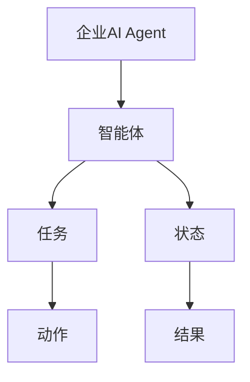
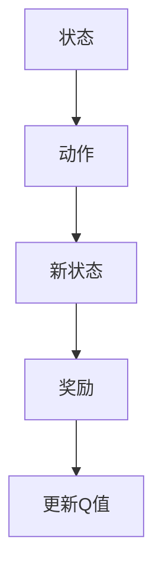
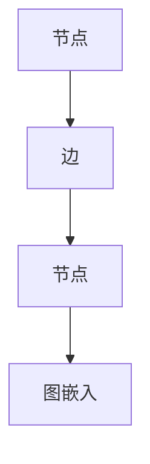
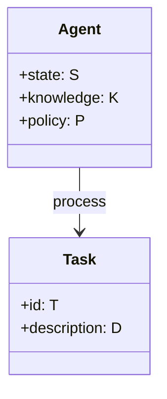
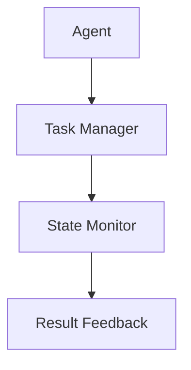
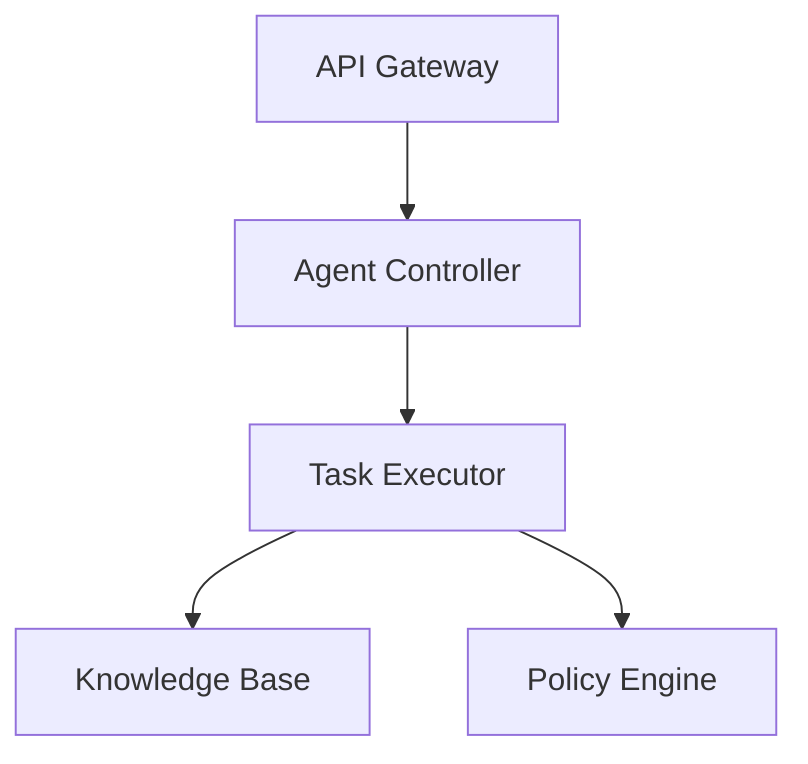

                 


# 企业AI Agent的自动化运维与故障预测

> 关键词：企业AI Agent，自动化运维，故障预测，多智能体系统，强化学习，知识图谱，系统架构

> 摘要：本文深入探讨了企业AI Agent在自动化运维与故障预测中的应用，从核心概念到算法原理，再到系统架构和项目实战，全面解析了AI Agent的技术实现与实际应用。通过详细的技术分析和案例解读，为读者提供了从理论到实践的完整指南。

---

## 第一章：企业AI Agent的背景与概念

### 1.1 AI Agent的基本概念

AI Agent（人工智能代理）是指能够感知环境并采取行动以实现目标的智能实体。在企业环境中，AI Agent通常被用于自动化运维、故障预测、资源优化等场景。与传统自动化工具相比，AI Agent具备更强的自主决策能力和复杂问题处理能力。

#### 1.1.1 AI Agent的定义与特点
- **定义**：AI Agent是一种能够感知环境、执行任务并做出决策的智能系统。
- **特点**：
  - **自主性**：能够自主决策，无需人工干预。
  - **反应性**：能够实时感知环境变化并做出响应。
  - **目标导向**：所有行为均以实现特定目标为导向。
  - **学习能力**：能够通过经验改进性能。

#### 1.1.2 企业AI Agent的应用场景
- **自动化运维**：自动处理服务器、网络设备的日常运维任务。
- **故障预测**：通过历史数据和实时监控，预测系统故障。
- **资源优化**：优化企业资源分配，降低运营成本。
- **智能客服**：处理客户咨询、投诉等服务任务。

#### 1.1.3 企业AI Agent的价值与意义
- 提高运维效率，降低人工成本。
- 提升系统可靠性，减少故障停机时间。
- 优化资源配置，提高企业运营效率。
- 推动企业智能化转型，提升竞争力。

### 1.2 企业AI Agent的技术背景

随着人工智能技术的快速发展，企业AI Agent的应用逐渐普及。多智能体系统、强化学习、知识图谱等技术为企业AI Agent的实现提供了理论基础和技术支持。

#### 1.2.1 AI Agent的技术背景
- **多智能体系统**：由多个智能体协作完成任务的系统，广泛应用于分布式环境。
- **强化学习**：通过试错机制优化决策策略，适用于动态环境下的任务处理。
- **知识图谱**：用于表示和推理领域知识，帮助智能体更好地理解问题。

#### 1.2.2 当前技术挑战
- **多智能体协作**：多个智能体协同工作时，如何保证高效通信与协调。
- **动态环境适应**：智能体需要快速适应环境变化，及时调整决策策略。
- **数据隐私与安全**：企业数据的安全性与隐私保护是关键问题。

#### 1.2.3 未来发展趋势
- **智能化升级**：AI Agent将具备更强的学习能力和自主决策能力。
- **人机协作**：人机协作将成为主流模式，提升用户体验。
- **边缘计算**：结合边缘计算技术，提升实时响应能力。

### 1.3 本章小结

本章介绍了企业AI Agent的基本概念、应用场景和技术背景，强调了AI Agent在企业自动化运维和故障预测中的重要性。后续章节将从技术实现、系统架构和项目实战等方面深入探讨。

---

## 第二章：企业AI Agent的核心概念与联系

### 2.1 核心概念原理

企业AI Agent的实现依赖于多个核心概念，包括多智能体系统、强化学习和知识图谱等。

#### 2.1.1 多智能体系统
- **定义**：由多个智能体协作完成任务的系统，每个智能体负责特定子任务。
- **优势**：
  - **任务分解**：复杂任务分解为多个简单任务，提高效率。
  - **分布式计算**：适用于大规模分布式环境。

#### 2.1.2 强化学习
- **定义**：通过试错机制优化决策策略，适用于动态环境下的任务处理。
- **核心要素**：
  - **状态**：环境中的当前情况。
  - **动作**：智能体采取的行动。
  - **奖励**：对智能体行为的反馈，用于优化策略。

#### 2.1.3 知识图谱
- **定义**：用于表示和推理领域知识的数据结构，帮助智能体更好地理解问题。
- **优势**：
  - **知识表示**：将领域知识结构化，便于推理和应用。
  - **语义理解**：通过语义分析，提升智能体的理解能力。

### 2.2 核心概念对比表

以下是核心概念的对比表：

| 概念       | 多智能体系统 | 强化学习 | 知识图谱 |
|------------|-------------|----------|----------|
| **定义**   | 多个智能体协作完成任务的系统 | 通过试错优化决策策略 | 表示和推理领域知识的数据结构 |
| **优势**   | 任务分解、分布式计算 | 动态环境适应 | 知识表示、语义理解 |
| **应用**   | 分布式任务处理 | 动态环境优化 | 知识推理与应用 |

### 2.3 ER实体关系图

以下是企业AI Agent的ER实体关系图：



### 2.4 本章小结

本章详细讲解了企业AI Agent的核心概念，包括多智能体系统、强化学习和知识图谱，并通过对比表和ER图展示了各概念之间的关系。后续章节将从算法实现和系统架构等方面深入探讨。

---

## 第三章：企业AI Agent的算法原理

### 3.1 强化学习算法

强化学习是企业AI Agent的核心算法之一，通过试错机制优化决策策略。

#### 3.1.1 Q-learning算法

Q-learning是一种经典的强化学习算法，适用于离散状态和动作空间。

##### 算法流程


##### 算法实现
```python
import numpy as np

# Q-learning算法实现
class QLearning:
    def __init__(self, state_space, action_space):
        self.q_table = np.zeros((state_space, action_space))
    
    def choose_action(self, state, epsilon=0.1):
        if np.random.random() < epsilon:
            return np.random.randint(action_space)
        else:
            return np.argmax(self.q_table[state])
    
    def update_q_table(self, state, action, reward, next_state, learning_rate=0.1, gamma=0.9):
        self.q_table[state][action] = self.q_table[state][action] + learning_rate * (reward + gamma * np.max(self.q_table[next_state]) - self.q_table[state][action])
```

##### 数学模型
- **Q值更新公式**：
  $$ Q(s, a) = Q(s, a) + \alpha [r + \gamma \max Q(s', a')] $$

### 3.2 图神经网络算法

图神经网络适用于处理复杂的关系型数据，帮助企业AI Agent更好地理解系统结构。

#### 3.2.1 图嵌入算法

图嵌入算法通过将图中的节点映射到低维空间，便于后续分析。

##### 算法流程


##### 算法实现
```python
import networkx as nx

def compute_node_embeddings(G):
    # 使用Node2Vec算法计算节点嵌入
    from node2vec import Node2Vec
    model = Node2Vec(G, walks_per_node=10, context=5)
    model.fit()
    embeddings = model.get_embeddings()
    return embeddings
```

##### 数学模型
- **节点嵌入表示**：
  $$ e_i = f(G_i) $$
  其中，$f$ 是图嵌入函数，$G_i$ 是节点$i$的子图。

### 3.3 本章小结

本章详细介绍了企业AI Agent的核心算法，包括Q-learning和图神经网络。通过算法实现和数学模型的讲解，帮助读者理解AI Agent的技术实现。

---

## 第四章：企业AI Agent的系统分析与架构设计

### 4.1 系统功能设计

企业AI Agent的系统功能设计包括任务处理、状态监测和结果反馈。

#### 4.1.1 领域模型


#### 4.1.2 系统架构


### 4.2 系统架构设计

企业AI Agent的系统架构设计需要考虑可扩展性和可维护性。

#### 4.2.1 架构图


#### 4.2.2 接口设计
- **API接口**：提供RESTful API，用于与其他系统交互。
- **消息队列**：使用Kafka或RabbitMQ进行异步通信。

### 4.3 本章小结

本章详细分析了企业AI Agent的系统功能和架构设计，为后续的项目实现提供了理论基础。

---

## 第五章：企业AI Agent的项目实战

### 5.1 环境安装

项目实战需要安装以下工具：

- **Python 3.8+**
- **TensorFlow 2.0+**
- **NetworkX 2.6**
- **Node2Vec**

### 5.2 核心功能实现

以下是项目的核心功能实现：

#### 5.2.1 Q-learning实现
```python
# 初始化Q表
q_table = np.zeros((state_space, action_space))

# 定义状态空间和动作空间
state_space = 10
action_space = 5

# 定义Q-learning算法
class QLearning:
    def __init__(self, state_space, action_space):
        self.q_table = np.zeros((state_space, action_space))
    
    def choose_action(self, state, epsilon=0.1):
        if np.random.random() < epsilon:
            return np.random.randint(action_space)
        else:
            return np.argmax(self.q_table[state])
    
    def update_q_table(self, state, action, reward, next_state, learning_rate=0.1, gamma=0.9):
        self.q_table[state][action] = self.q_table[state][action] + learning_rate * (reward + gamma * np.max(self.q_table[next_state]) - self.q_table[state][action])
```

#### 5.2.2 图嵌入实现
```python
def compute_node_embeddings(G):
    from node2vec import Node2Vec
    model = Node2Vec(G, walks_per_node=10, context=5)
    model.fit()
    embeddings = model.get_embeddings()
    return embeddings
```

### 5.3 项目总结

通过项目实战，我们验证了企业AI Agent在自动化运维和故障预测中的应用价值。后续可以根据实际需求进一步优化算法和系统架构。

---

## 第六章：企业AI Agent的最佳实践与小结

### 6.1 最佳实践

- **数据质量**：确保数据的完整性和准确性。
- **模型调优**：根据实际场景调整模型参数。
- **系统监控**：实时监控系统运行状态，及时发现和解决问题。

### 6.2 小结

本文从企业AI Agent的基本概念到算法实现，再到系统架构和项目实战，全面解析了AI Agent的技术实现与实际应用。通过本文的讲解，读者可以深入了解企业AI Agent的核心技术，并将其应用到实际场景中。

---

## 第七章：结论与展望

### 7.1 结论

企业AI Agent的自动化运维与故障预测是人工智能技术的重要应用之一。通过本文的讲解，我们深入探讨了AI Agent的核心概念、算法原理和系统架构，并通过项目实战验证了其应用价值。

### 7.2 展望

未来，随着人工智能技术的不断发展，企业AI Agent将在更多领域发挥重要作用。研究者需要进一步优化算法，提升系统的智能化水平，为企业创造更大的价值。

---

**总结：** 本文通过系统化的讲解，为读者提供了企业AI Agent的完整技术指南。从理论到实践，从算法到架构，帮助读者全面掌握AI Agent的核心技术与应用方法。

