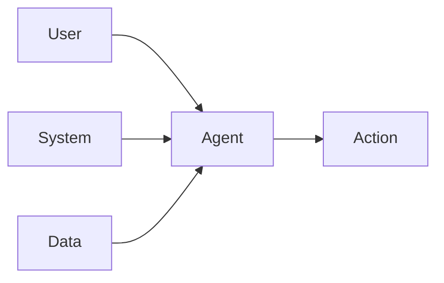
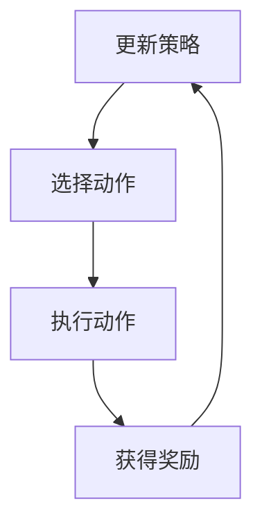
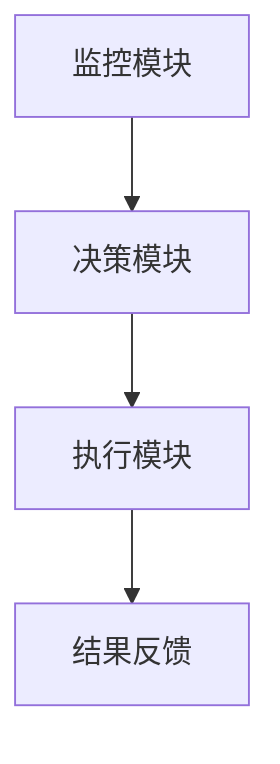
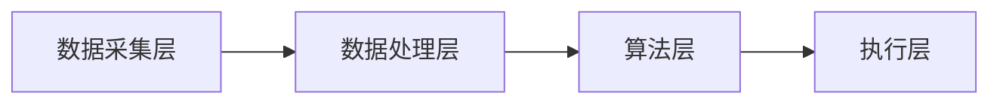

                 


# 企业AI Agent的自动化运维系统

> 关键词：AI Agent, 自动化运维, 强化学习, 系统架构, 运维效率

> 摘要：本文深入探讨了企业AI Agent在自动化运维系统中的应用，从背景、核心概念、算法原理到系统架构和项目实战，全面剖析了AI Agent如何提升企业运维效率。通过理论与实践相结合，结合数学公式、算法流程图和系统架构图，详细阐述了AI Agent在企业运维中的具体实现和实际案例。本文旨在为企业技术团队提供一套可参考的AI驱动自动化运维解决方案，助力企业数字化转型。

---

# 第一部分: 企业AI Agent的背景与概念

# 第1章: 企业AI Agent的背景与概念

## 1.1 问题背景

### 1.1.1 传统企业运维的痛点
传统企业运维模式依赖人工操作，存在以下痛点：
- **低效性**：人工运维效率低下，难以应对快速变化的业务需求。
- **高成本**：需要大量运维人员，人力成本高昂。
- **不一致性**：操作依赖个人经验，难以保证一致性和准确性。

### 1.1.2 AI技术在运维中的应用潜力
AI技术在运维中的潜力主要体现在以下方面：
- **智能化决策**：通过AI算法优化资源分配，提高运维效率。
- **自动化执行**：实现从问题识别到解决方案的端到端自动化。
- **预测性维护**：基于历史数据和实时监控，预测系统故障，提前进行维护。

### 1.1.3 自动化运维的必要性
随着企业系统规模的不断扩大和复杂性增加，传统运维方式已无法满足需求。自动化运维是提升效率、降低成本的必然选择。

## 1.2 问题描述

### 1.2.1 运维效率低下
传统运维模式中，人工操作占主导地位，导致效率低下。

### 1.2.2 人工成本高昂
随着企业规模的扩大，运维团队的人力成本急剧增加。

### 1.2.3 系统复杂性增加
现代企业系统越来越复杂，人工运维难以应对复杂的系统架构和多样化的运维需求。

## 1.3 问题解决

### 1.3.1 AI Agent的核心作用
AI Agent通过智能化决策和自动化执行，显著提升运维效率，降低人工成本。

### 1.3.2 自动化运维的目标
自动化运维的目标是实现从问题识别到解决方案的全自动化，最大限度减少人工干预。

### 1.3.3 技术实现路径
- 引入AI技术，构建智能化的运维系统。
- 通过自动化工具实现运维操作的标准化和流程化。

## 1.4 核心概念与边界

### 1.4.1 AI Agent的定义与外延
AI Agent是一种能够感知环境、做出决策并执行操作的智能体。

### 1.4.2 自动化运维的边界
自动化运维的边界包括系统监控、日志分析、资源管理等，但不包括核心业务逻辑的实现。

### 1.4.3 系统架构的核心要素
- **感知模块**：负责收集系统运行数据。
- **决策模块**：基于数据进行分析和决策。
- **执行模块**：根据决策结果执行操作。

## 1.5 本章小结
本章从背景、问题描述、问题解决等方面，全面阐述了企业AI Agent的自动化运维系统的核心概念和必要性。通过对比传统运维与AI驱动运维的特点，为后续章节的深入分析奠定了基础。

---

# 第二部分: AI Agent的核心概念与原理

# 第2章: AI Agent的基本原理

## 2.1 AI Agent的定义与特征

### 2.1.1 AI Agent的定义
AI Agent是一种能够感知环境、做出决策并执行操作的智能体。

### 2.1.2 AI Agent的核心特征对比表
| 特征 | 描述 |
|------|------|
| 感知能力 | 能够感知环境中的信息 |
| 决策能力 | 基于感知信息做出决策 |
| 执行能力 | 根据决策结果执行操作 |
| 自适应能力 | 能够根据环境变化调整自身行为 |

### 2.1.3 AI Agent与传统程序的区别
- **传统程序**：基于固定的规则执行任务，不具备学习能力。
- **AI Agent**：具备学习和自适应能力，能够根据环境变化优化自身行为。

## 2.2 AI Agent的组成与功能

### 2.2.1 感知模块
- **功能**：负责收集系统运行数据，如CPU使用率、内存占用等。
- **实现方式**：通过传感器或API接口获取数据。

### 2.2.2 决策模块
- **功能**：基于感知数据进行分析和决策，确定下一步操作。
- **实现方式**：使用强化学习算法或其他AI算法。

### 2.2.3 执行模块
- **功能**：根据决策结果执行具体操作，如重启服务、调整资源分配等。
- **实现方式**：通过调用系统API或执行脚本实现。

## 2.3 AI Agent的实体关系图


## 2.4 本章小结
本章详细介绍了AI Agent的基本原理、组成与功能，并通过实体关系图展示了AI Agent与外部系统的交互关系。这些内容为后续章节的系统设计和实现奠定了基础。

---

# 第三部分: AI Agent的算法原理与数学模型

# 第3章: AI Agent的核心算法

## 3.1 状态空间与动作空间

### 3.1.1 状态空间的定义
状态空间是指系统在某一时刻的所有可能状态的集合。

### 3.1.2 动作空间的定义
动作空间是指系统在某一状态下可以执行的所有可能动作的集合。

### 3.1.3 状态与动作的数学表示
- 状态表示：$s \in S$，其中$S$是状态空间。
- 动作表示：$a \in A$，其中$A$是动作空间。

## 3.2 基于强化学习的AI Agent

### 3.2.1 强化学习的基本原理
强化学习是一种通过试错机制，学习如何在环境中做出最优决策的算法。

### 3.2.2 Q-learning算法
Q-learning是一种基于值函数的强化学习算法，其核心思想是通过学习状态-动作对的值函数，找到最优策略。

### 3.2.3 算法流程图


### 3.2.4 数学公式
Q-learning算法的数学公式如下：
$$ Q(s,a) = Q(s,a) + \alpha (r + \gamma \max Q(s',a')) $$

其中：
- $Q(s,a)$：当前状态$s$和动作$a$的Q值。
- $\alpha$：学习率。
- $r$：立即奖励。
- $\gamma$：折扣因子。
- $Q(s',a')$：下一个状态$s'$下的最大Q值。

## 3.3 数学模型与公式

### 3.3.1 Q-learning的数学公式
$$ Q(s,a) = Q(s,a) + \alpha (r + \gamma \max Q(s',a')) $$

### 3.3.2 动作选择策略
在Q-learning算法中，动作选择策略通常采用$\epsilon$-贪心策略：
$$ P(a|s) = \epsilon + \frac{1-\epsilon}{n} $$

其中：
- $\epsilon$：探索概率。
- $n$：动作空间的大小。

## 3.4 本章小结
本章详细介绍了AI Agent的核心算法，包括状态空间、动作空间的定义，以及Q-learning算法的数学模型和流程图。通过这些内容，读者可以理解AI Agent如何通过强化学习实现智能决策。

---

# 第四部分: 系统分析与架构设计

# 第4章: 系统分析与架构设计

## 4.1 问题场景介绍

### 4.1.1 运维场景描述
企业需要实现系统监控、资源分配、故障修复等运维任务的自动化。

### 4.1.2 系统规模
- 服务器数量：N台。
- 服务数量：M个。
- 用户数量：K个。

## 4.2 系统功能设计

### 4.2.1 系统功能模块
- **监控模块**：实时监控系统运行状态。
- **决策模块**：基于监控数据进行分析和决策。
- **执行模块**：根据决策结果执行具体操作。

### 4.2.2 功能流程图


## 4.3 系统架构设计

### 4.3.1 分层架构
- **数据采集层**：负责收集系统数据。
- **数据处理层**：对数据进行清洗和转换。
- **算法层**：实现AI算法，进行决策。
- **执行层**：根据决策结果执行操作。

### 4.3.2 系统架构图


## 4.4 系统接口设计

### 4.4.1 API接口
- **监控接口**：提供系统状态数据。
- **决策接口**：接收决策结果。
- **执行接口**：执行具体操作。

### 4.4.2 接口交互流程图


## 4.5 本章小结
本章从问题场景出发，详细分析了系统的功能模块和架构设计。通过分层架构和接口设计，确保系统的可扩展性和可维护性。

---

# 第五部分: 项目实战

# 第5章: 项目实战

## 5.1 环境安装

### 5.1.1 系统要求
- 操作系统：Linux。
- Python版本：3.8以上。
- 依赖库：TensorFlow、Pandas、Matplotlib。

### 5.1.2 安装命令
```bash
pip install tensorflow pandas matplotlib
```

## 5.2 系统核心实现源代码

### 5.2.1 监控模块实现
```python
import tensorflow as tf
import pandas as pd
import matplotlib.pyplot as plt

# 数据采集
data = pd.read_csv('system_data.csv')
```

### 5.2.2 决策模块实现
```python
# Q-learning算法实现
class Agent:
    def __init__(self, state_space, action_space):
        self.state_space = state_space
        self.action_space = action_space
        self.Q = {}
        # 初始化Q值
        for s in state_space:
            for a in action_space:
                self.Q[(s, a)] = 0.0

    def choose_action(self, state, epsilon=0.1):
        if random.random() < epsilon:
            return random.choice(self.action_space)
        else:
            return max(self.Q[(state, a)] for a in self.action_space)

    def update_Q(self, state, action, reward, next_state):
        self.Q[(state, action)] += self.alpha * (reward + self.gamma * max(self.Q[(next_state, a)] for a in self.action_space))
```

### 5.2.3 执行模块实现
```python
# 执行操作
def execute_action(action):
    if action == 'restart':
        os.system('restart_service.sh')
    elif action == 'allocate':
        os.system('allocate_resource.sh')
```

## 5.3 代码应用解读与分析

### 5.3.1 代码实现细节
- **数据采集**：使用Pandas读取CSV文件中的系统数据。
- **Q-learning算法**：通过定义Q表，实现状态-动作对的值更新。
- **动作执行**：根据决策结果，执行具体的系统操作。

### 5.3.2 代码优势
- **可扩展性**：支持多种动作和状态的扩展。
- **可维护性**：通过模块化设计，确保代码的可维护性。

## 5.4 实际案例分析

### 5.4.1 案例背景
某企业希望实现服务器资源的自动化分配。

### 5.4.2 案例实现
- **数据采集**：收集服务器CPU、内存使用率。
- **决策模块**：根据使用率，决定是否需要分配资源。
- **执行模块**：自动分配资源或释放资源。

### 5.4.3 案例结果
- **效率提升**：资源分配自动化，减少人工干预。
- **成本降低**：通过优化资源使用，降低运维成本。

## 5.5 本章小结
本章通过实际案例，详细介绍了企业AI Agent的自动化运维系统的实现过程。从环境安装到代码实现，再到案例分析，为读者提供了一套完整的实施方案。

---

# 第六部分: 总结与展望

# 第6章: 总结与展望

## 6.1 最佳实践

### 6.1.1 技术选型
- 选择适合的AI算法，如强化学习。
- 确保数据质量和完整性。

### 6.1.2 系统设计
- 采用分层架构，确保系统的可扩展性和可维护性。
- 使用模块化设计，方便功能扩展。

## 6.2 本章小结
本章总结了企业AI Agent的自动化运维系统的实现过程，并提出了未来的发展方向。通过最佳实践的分享，为读者提供了宝贵的参考价值。

## 6.3 注意事项

### 6.3.1 数据隐私
在实现AI Agent时，需注意数据隐私问题，确保数据的安全性和合规性。

### 6.3.2 系统稳定性
确保系统的稳定性，避免因算法错误导致的重大事故。

## 6.4 拓展阅读

### 6.4.1 推荐书籍
- 《强化学习入门》。
- 《机器学习实战》。

### 6.4.2 推荐博客
- 人工智能前沿技术博客。
- 运维自动化技术博客。

## 6.5 本章结束语
企业AI Agent的自动化运维系统是一项复杂的系统工程，需要技术团队的共同努力。通过本文的分享，希望为企业技术团队提供一套可参考的解决方案，助力企业数字化转型。

---

# 结语

企业AI Agent的自动化运维系统是未来发展的趋势，通过AI技术的引入，企业能够显著提升运维效率，降低成本。本文从背景、核心概念、算法原理到系统架构和项目实战，全面剖析了AI Agent在企业运维中的具体实现和实际案例。希望本文能够为企业技术团队提供一套可参考的AI驱动自动化运维解决方案，助力企业数字化转型。

