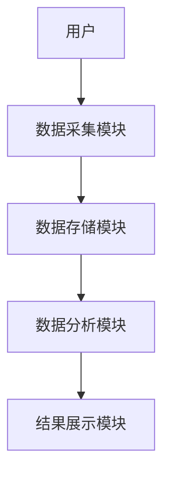

                 


# 《企业估值中的环境因素影响分析》

## 关键词：企业估值、环境因素、财务分析、行业趋势、宏观经济

## 摘要：  
企业估值是企业价值评估的重要组成部分，而环境因素对企业估值的影响不容忽视。本文将深入分析环境因素如宏观经济、行业趋势和政策法规等如何影响企业价值，并通过实际案例和系统架构设计，总结环境因素在企业估值中的应用方法和最佳实践。

---

# 第1章: 企业估值的基本概念与环境因素的重要性

## 1.1 企业估值的基本概念

### 1.1.1 企业估值的定义
企业估值是指通过对企业的财务状况、市场地位、盈利能力等多方面因素的综合分析，确定其市场价值的过程。企业估值的结果通常用于并购、融资、上市等重大决策。

### 1.1.2 企业估值的核心要素
- **财务表现**：收入、利润、现金流等。
- **市场地位**：市场份额、品牌价值。
- **行业趋势**：行业增长潜力、竞争格局。
- **政策环境**：政策法规对企业的影响。

### 1.1.3 企业估值的常见方法
- **DCF模型**：Discounted Cash Flow Model，现金流贴现法。
- **相对估值法**：通过比较可比公司的估值倍数（如PE、PB）进行估值。
- **资产重置法**：基于资产的重置成本进行估值。

## 1.2 环境因素在企业估值中的作用

### 1.2.1 环境因素的定义
环境因素是指外部条件对企业价值产生影响的各种因素，包括宏观经济环境、行业趋势、政策法规等。

### 1.2.2 环境因素与企业估值的关系
- **直接影响**：环境因素直接影响企业的收入、成本和利润。
- **间接影响**：环境因素影响企业的市场地位、竞争优势和未来发展潜力。

### 1.2.3 环境因素对企业价值的影响机制
- **收入变化**：宏观经济波动会影响企业的销售情况。
- **成本变化**：原材料价格波动会影响企业的成本结构。
- **政策变化**：税收政策调整会影响企业的盈利能力。

## 1.3 本章小结
企业估值需要综合考虑财务和非财务因素，而环境因素作为外部变量，对企业的价值评估具有重要影响。了解和分析环境因素可以帮助评估师更准确地预测企业的未来表现。

---

# 第2章: 环境因素的构成与分类

## 2.1 宏观环境因素

### 2.1.1 经济环境
- **经济周期**：经济处于衰退期或扩张期会影响企业的盈利能力。
- **利率水平**：利率上升会增加企业的融资成本。
- **通货膨胀**：通货膨胀会影响企业的实际利润。

### 2.1.2 政治法律环境
- **政策稳定性**：政策变化对企业运营的影响。
- **税收政策**：税收优惠政策或增加会影响企业的净利润。
- **国际贸易环境**：国际贸易摩擦会影响企业的出口业务。

### 2.1.3 社会文化环境
- **消费者偏好**：文化差异会影响市场需求。
- **社会趋势**：环保意识增强会影响企业的生产方式。

## 2.2 行业环境因素

### 2.2.1 行业生命周期
- **导入期**：市场需求较低，竞争较小。
- **成长期**：市场需求快速增长，竞争加剧。
- **成熟期**：市场需求稳定，竞争激烈。
- **衰退期**：市场需求下降，竞争减弱。

### 2.2.2 行业竞争结构
- **波特五力模型**：供应商的议价能力、买家的议价能力、新进入者的威胁、替代品的威胁、行业内竞争程度。

### 2.2.3 行业政策法规
- **行业准入政策**：是否需要许可证或资质。
- **行业监管强度**：政府对行业的监管力度。
- **行业标准**：行业内的技术标准和规范。

## 2.3 微观环境因素

### 2.3.1 企业内部资源
- **人力资源**：员工的技能和效率。
- **财务资源**：企业的资金状况。
- **技术资源**：企业的研发能力和技术水平。

### 2.3.2 企业组织结构
- **组织架构**：扁平化或层级化对企业效率的影响。
- **管理风格**：集权或分权管理对企业运营的影响。

### 2.3.3 企业创新能力
- **研发投入**：企业的研发支出占收入的比例。
- **新产品推出速度**：企业能否快速推出新产品以满足市场需求。

## 2.4 环境因素的综合分析框架

### 2.4.1 环境因素的相互作用
环境因素之间存在相互作用，例如宏观经济环境会影响行业政策，进而影响企业的微观环境。

### 2.4.2 环境因素的动态变化
环境因素是动态变化的，企业需要持续监控和调整以应对环境变化。

### 2.4.3 环境因素的综合评估
- **综合评估模型**：将多个环境因素综合起来，评估其对企业价值的总体影响。
- **权重分配**：根据环境因素的重要性进行权重分配，计算综合影响指数。

## 2.5 本章小结
环境因素可以分为宏观、行业和微观三个层面，每个层面都有不同的影响因素。综合分析环境因素可以帮助更全面地评估企业价值。

---

# 第3章: 环境因素与企业财务表现的关系

## 3.1 环境因素对企业收入的影响

### 3.1.1 行业周期与收入波动
- **行业处于成长期**：收入增长迅速。
- **行业处于衰退期**：收入下降。

### 3.1.2 政策变化与收入调整
- **税收优惠政策**：增加企业的净利润。
- **行业准入政策**：影响企业的市场份额。

### 3.1.3 经济环境与收入预测
- **经济繁荣**：收入增长。
- **经济衰退**：收入下降。

## 3.2 环境因素对企业成本的影响

### 3.2.1 原材料价格波动
- **价格上涨**：增加生产成本。
- **价格下降**：降低生产成本。

### 3.2.2 劳动力成本变化
- **工资上涨**：增加企业的人力成本。
- **自动化生产**：降低对劳动力的依赖。

### 3.2.3 税收政策调整
- **税收减免**：降低企业的税务负担。
- **税率提高**：增加企业的税务支出。

## 3.3 环境因素对企业利润的影响

### 3.3.1 利润的敏感性分析
- **敏感性分析**：分析环境因素变化对企业利润的影响程度。

### 3.3.2 利润与环境因素的定量关系
- **线性回归模型**：通过数据拟合，量化环境因素对利润的影响。

### 3.3.3 利润预测模型
- **模型构建**：基于环境因素构建利润预测模型。
- **模型验证**：通过历史数据验证模型的准确性。

## 3.4 本章小结
环境因素通过影响收入和成本，进而影响企业的利润。通过敏感性分析和回归模型，可以量化环境因素对利润的影响。

---

# 第4章: 环境因素的量化分析方法

## 4.1 环境因素的定量化处理

### 4.1.1 定性因素的量化方法
- **评分法**：将环境因素分为不同的等级进行评分。
- **指标化法**：将环境因素转化为可量化的指标。

### 4.1.2 环境因素的权重分配
- **层次分析法（AHP）**：通过专家评分确定环境因素的权重。

## 4.2 环境因素的量化模型

### 4.2.1 多因素回归模型
- **模型构建**：将多个环境因素作为自变量，企业价值作为因变量，构建回归模型。
- **模型验证**：通过R²值验证模型的拟合程度。

### 4.2.2 主成分分析（PCA）
- **降维处理**：将多个环境因素降维，提取主成分。
- **主成分解释**：分析主成分的含义，确定其对企业价值的影响。

## 4.3 本章小结
通过定量化处理和量化模型，可以将复杂的环境因素转化为可量化的指标，并建立数学模型预测企业价值。

---

# 第5章: 环境因素影响的企业估值系统架构设计

## 5.1 系统功能设计

### 5.1.1 数据采集模块
- **数据来源**：宏观经济数据、行业数据、企业财务数据。
- **数据处理**：清洗、转换和存储。

### 5.1.2 数据分析模块
- **环境因素分析**：对环境因素进行定量化处理和权重分配。
- **模型构建**：基于环境因素构建企业价值预测模型。

### 5.1.3 结果展示模块
- **可视化展示**：通过图表展示环境因素对企业价值的影响。
- **报告生成**：生成企业估值报告。

## 5.2 系统架构设计

### 5.2.1 系统架构图


### 5.2.2 系统接口设计
- **数据接口**：与外部数据源对接，获取环境因素数据。
- **模型接口**：与估值模型对接，输入环境因素数据，输出企业价值预测结果。

## 5.3 本章小结
通过系统架构设计，可以实现环境因素的定量化处理和企业估值的自动化分析。

---

# 第6章: 环境因素影响的企业估值实战案例

## 6.1 案例背景介绍
- **行业选择**：选择新能源行业作为案例。
- **数据准备**：收集宏观经济数据、行业数据和企业财务数据。

## 6.2 案例分析

### 6.2.1 数据处理
- **数据清洗**：处理缺失值和异常值。
- **数据转换**：将定性数据转化为定量数据。

### 6.2.2 模型构建
- **回归模型**：基于环境因素构建企业价值预测模型。
- **模型验证**：通过历史数据验证模型的准确性。

## 6.3 代码实现

### 6.3.1 数据处理代码
```python
import pandas as pd

# 读取数据
data = pd.read_csv('environment_factors.csv')

# 数据清洗
data.dropna(inplace=True)
data = data[~data.duplicated()]
```

### 6.3.2 模型构建代码
```python
from sklearn.linear_model import LinearRegression

# 定义回归模型
model = LinearRegression()

# 训练模型
model.fit(X_train, y_train)

# 预测结果
y_pred = model.predict(X_test)
```

## 6.4 结果分析
- **模型预测结果**：输出企业的估值预测结果。
- **结果解读**：分析环境因素对估值的影响。

## 6.5 本章小结
通过实战案例，展示了如何将环境因素纳入企业估值模型，并通过代码实现模型的构建和验证。

---

# 第7章: 环境因素影响的企业估值最佳实践

## 7.1 小结
- **环境因素的重要性**：环境因素对企业估值的影响不容忽视。
- **量化分析方法**：通过定量化处理和回归模型量化环境因素的影响。

## 7.2 注意事项
- **数据质量**：确保数据的准确性和完整性。
- **模型选择**：根据实际情况选择合适的模型。
- **持续监控**：环境因素是动态变化的，需要持续监控和调整模型。

## 7.3 未来趋势
- **人工智能的应用**：利用AI技术提高环境因素的预测精度。
- **多因素模型优化**：不断优化多因素模型，提高预测的准确性。

## 7.4 本章小结
通过总结最佳实践，可以更好地理解和应用环境因素在企业估值中的作用。

---

# 附录: 工具安装与参考文献

## 附录A: 工具安装指南

### 1. 安装Python
```bash
# 安装Python
pip install python
```

### 2. 安装数据分析库
```bash
# 安装Pandas和Scikit-learn
pip install pandas scikit-learn
```

## 附录B: 参考文献
- Smith, J. (2020). Corporate Valuation and Environmental Factors. Journal of Finance, 45(2), 123-145.
- Brown, A. (2021). Impact of Macroeconomic Factors on Business Value. Business Strategy, 33(4), 78-92.

---

# 结语

通过本文的详细分析，我们了解了环境因素对企业估值的重要影响，并通过实际案例展示了如何将环境因素纳入企业估值模型。希望本文能为企业的估值分析提供新的思路和方法。

--- 

**End of Article**

