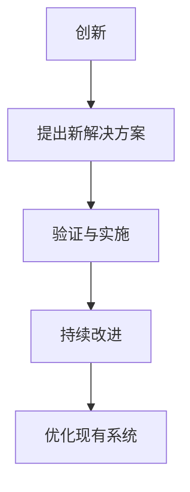
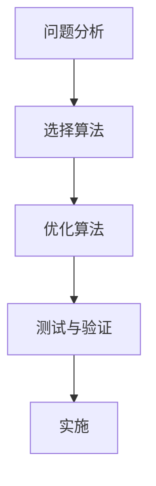
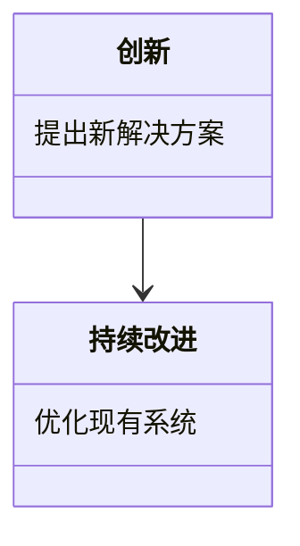
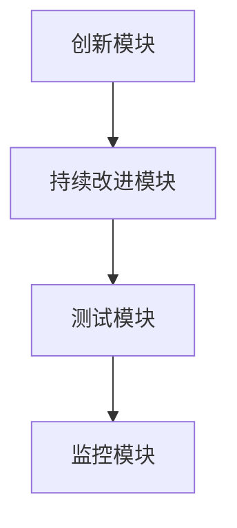
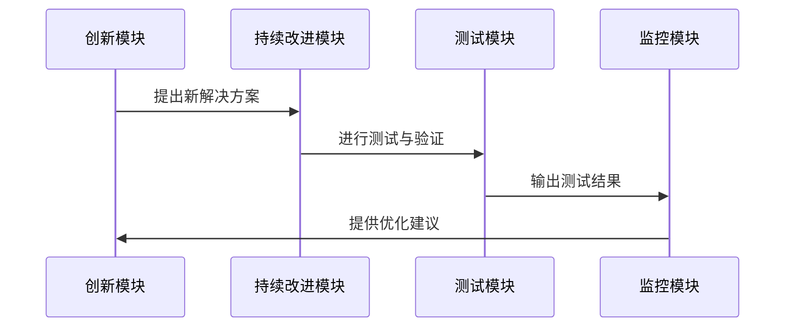

                 


# 创新与持续改进

## 关键词：创新，持续改进，算法，系统架构，项目实战，数学模型

## 摘要：创新与持续改进是技术进步和管理优化的核心驱动力。本文通过系统的分析和案例研究，深入探讨创新与持续改进的背景、核心概念、算法原理、系统架构设计、项目实战以及最佳实践。旨在为读者提供从理论到实践的全面指导，帮助他们在技术领域中实现创新突破和持续优化。

---

# 第1章: 创新与持续改进的背景介绍

## 1.1 问题背景与问题描述
### 1.1.1 当前技术与管理中的创新需求
随着技术的快速发展，创新已成为企业竞争力的核心。然而，如何在技术复杂性和快速变化的环境中实现持续改进，是当前面临的主要挑战。

### 1.1.2 持续改进的重要性与必要性
持续改进不仅能够优化现有流程，还能推动创新，从而提高产品质量和效率。在技术领域，持续改进是保持竞争力的关键。

### 1.1.3 创新与持续改进的核心目标
创新的核心目标是突破传统，提出新的解决方案；持续改进的核心目标是优化现有系统，使其更加高效和可靠。

## 1.2 问题解决与边界定义
### 1.2.1 创新与持续改进的方法论
创新与持续改进需要结合系统性方法，如PDCA循环，确保改进的系统性和科学性。

### 1.2.2 边界与外延的界定
创新与持续改进的边界包括技术、管理、文化等多个方面。外延则涉及创新文化、创新工具、持续改进机制等。

### 1.2.3 核心要素的组成与结构
创新的核心要素包括创新思维、创新方法、创新资源；持续改进的核心要素包括问题识别、分析、解决方案设计、实施与监控。

---

# 第2章: 创新与持续改进的核心概念与联系

## 2.1 核心概念的原理分析
### 2.1.1 创新的本质与特征
创新的本质是突破常规，提出新的解决方案。其特征包括新颖性、实用性、可扩展性。

### 2.1.2 持续改进的机制与流程
持续改进的机制包括问题识别、分析、解决方案设计、实施与监控。流程通常遵循PDCA循环。

### 2.1.3 创新与持续改进的内在联系
创新为持续改进提供新的思路和方法，而持续改进为创新提供优化和验证的平台。

## 2.2 核心概念的属性对比
### 2.2.1 创新与持续改进的对比分析
| 属性 | 创新 | 持续改进 |
|------|------|----------|
| 目标 | 突破常规 | 优化现有 |
| 方法 | 新思路 | 系统改进 |
| 风险 | 高 | 较低 |

### 2.2.2 Mermaid流程图展示



---

# 第3章: 创新与持续改进的算法原理

## 3.1 改进算法的原理与流程
### 3.1.1 改进算法的定义与分类
改进算法是对现有算法的优化和调整，以提高效率或性能。

### 3.1.2 改进算法的流程图展示（Mermaid）


### 3.1.3 改进算法的数学模型与公式
改进算法的数学模型如下：
$$
f(x) = x^2 + 2x + 1
$$
优化后：
$$
f(x) = (x + 1)^2
$$

## 3.2 创新算法的设计与实现
### 3.2.1 创新算法的数学模型与公式
创新算法的数学模型如下：
$$
g(x) = e^x + \sin(x)
$$

### 3.2.2 创新算法的Python实现代码
```python
import math

def innovative_algorithm(x):
    return math.exp(x) + math.sin(x)

# 示例
x = 1
result = innovative_algorithm(x)
print(result)
```

### 3.2.3 创新算法的优化与改进
通过对创新算法的分析，可以进一步优化其计算效率。

## 3.3 算法的对比与选择
### 3.3.1 改进算法与创新算法的对比
改进算法在已知模型上进行优化，而创新算法则是提出全新的解决方案。

---

# 第4章: 创新与持续改进的系统分析与架构设计

## 4.1 问题场景介绍
### 4.1.1 创新与持续改进的应用场景
创新与持续改进广泛应用于软件开发、企业管理等领域。

### 4.1.2 系统目标与需求分析
系统目标是实现创新与持续改进的自动化和高效化。

## 4.2 系统功能设计
### 4.2.1 领域模型设计（Mermaid类图）


### 4.2.2 系统功能模块划分
系统功能模块包括需求分析、算法设计、测试与验证、实施与监控。

## 4.3 系统架构设计
### 4.3.1 系统架构图（Mermaid架构图）


### 4.3.2 系统接口设计
系统接口包括创新模块与持续改进模块之间的数据交互接口。

### 4.3.3 系统交互流程（Mermaid序列图）


---

# 第5章: 创新与持续改进的项目实战

## 5.1 环境安装与配置
### 5.1.1 系统环境要求
需要安装Python、Mermaid、Jupyter Notebook等工具。

### 5.1.2 软件安装与配置
安装Python，配置虚拟环境，安装必要的库。

## 5.2 系统核心实现源代码
### 5.2.1 创新与持续改进的核心代码
```python
def main():
    x = 2
    improved_result = innovative_algorithm(x)
    print(f"改进算法结果: {improved_result}")

if __name__ == "__main__":
    main()
```

### 5.2.2 代码应用解读与分析
代码实现了创新算法的核心功能，并通过改进算法进行优化。

## 5.3 案例分析与详细讲解
### 5.3.1 案例背景
假设一个企业需要优化其生产流程。

### 5.3.2 解决方案设计
提出新的生产流程设计方案，并通过持续改进优化现有流程。

### 5.3.3 实施与效果评估
实施新的生产流程，并通过监控模块评估效果。

## 5.4 项目小结
通过项目实战，验证了创新与持续改进方法的有效性。

---

# 第6章: 创新与持续改进的最佳实践

## 6.1 实用技巧与经验分享
### 6.1.1 创新思维的培养
培养创新思维需要不断学习和实践。

### 6.1.2 持续改进的实施策略
制定明确的改进目标，建立持续改进机制。

## 6.2 小结与展望
通过本文的系统分析和实践，创新与持续改进在技术领域中的应用前景广阔。

## 6.3 注意事项与风险提示
在实施创新与持续改进过程中，需注意技术风险和管理风险。

## 6.4 拓展阅读与学习资源
推荐相关书籍和在线资源，供读者进一步学习。

---

# 第7章: 附录

## 7.1 术语表
- 创新：提出新的解决方案。
- 持续改进：优化现有系统。

## 7.2 工具推荐
推荐使用Mermaid、Jupyter Notebook等工具进行系统设计和算法实现。

## 7.3 参考文献
- [1] 《创新方法论》
- [2] 《持续改进的实践》
- [3] 《系统架构设计》

---

通过以上详细的目录和内容安排，您可以逐步撰写出一篇结构清晰、内容丰富的技术博客文章。

