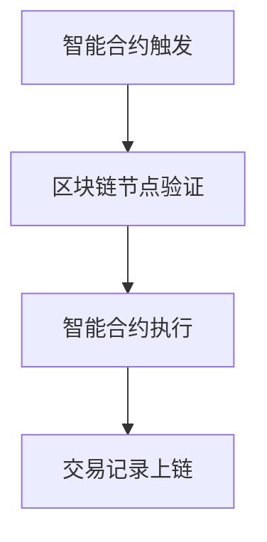
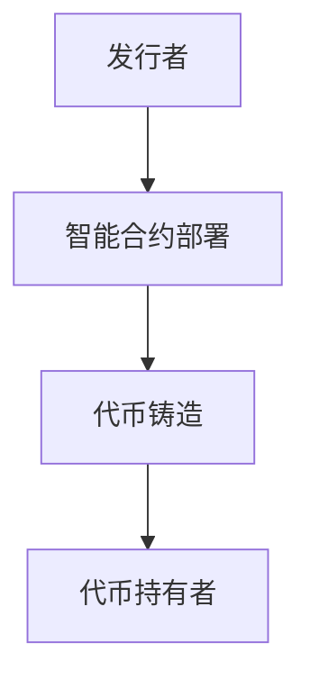
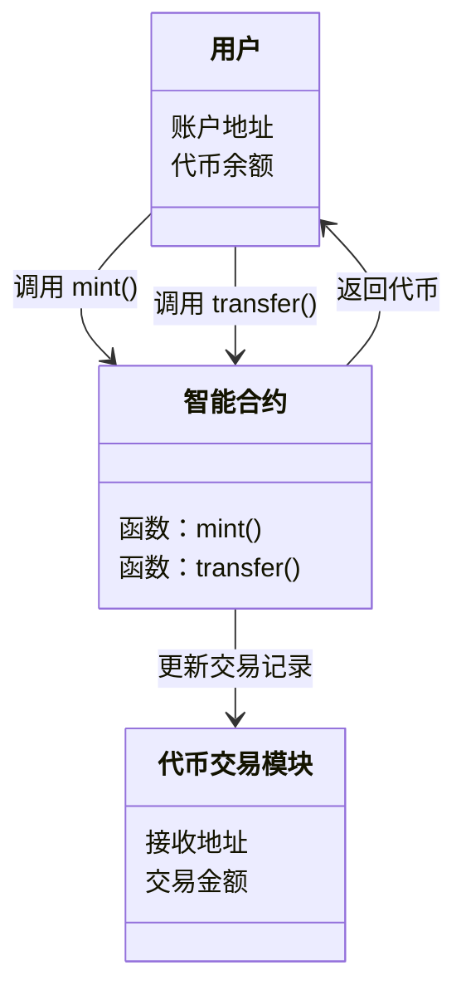
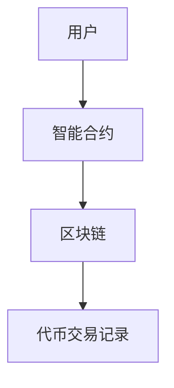
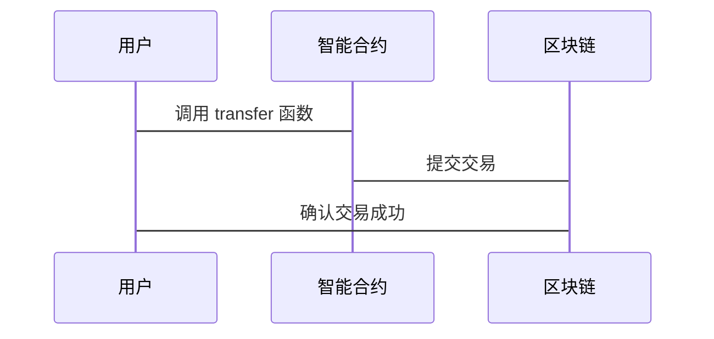

                 


# 区块链在资产 Tokenization 中的应用

## 关键词：区块链，资产 Tokenization，智能合约，分布式账本，通证发行

## 摘要：  
本文详细探讨区块链技术在资产 Tokenization 中的应用，涵盖区块链的基本概念、资产 Tokenization 的核心原理、技术实现、实际案例分析及法律风险管理。通过逐步分析，揭示区块链如何赋能资产数字化，提升资产流动性与透明度，降低交易成本和信任风险，推动金融创新。

---

## 第1章：区块链与资产 Tokenization 的概述

### 1.1 区块链的基本概念

#### 1.1.1 区块链的定义与特点
区块链是一种去中心化的分布式账本技术，通过加密算法和共识机制实现数据的安全存储和不可篡改性。其特点包括：
- **去中心化**：无须依赖中心机构，数据由网络共同维护。
- **不可篡改**：通过加密哈希和链式结构确保数据完整性。
- **透明性**：所有交易记录可追溯，公开或隐私性可调节。
- **智能合约**：自动执行预设规则，降低信任成本。

#### 1.1.2 区块链的核心技术
- **分布式账本**：网络中的每个节点都保存完整的账本副本，通过共识机制同步更新。
- **共识机制**：如比特币的PoW（工作量证明）、以太坊的PoS（权益证明）等，确保数据一致性。
- **智能合约**：运行在区块链上的自动执行代码，用于实现复杂的业务逻辑。

#### 1.1.3 区块链的分类与应用场景
- **公有链**：完全去中心化的区块链，如比特币、以太坊，适用于金融、供应链等领域。
- **联盟链**：部分去中心化，适用于企业间协作，如金融清算、医疗数据共享。
- **私有链**：完全中心化的区块链，适用于企业内部管理。

### 1.2 资产 Tokenization 的概念与特点

#### 1.2.1 资产 Tokenization 的定义
资产 Tokenization 是将现实中的资产（如房地产、股权、艺术品等）转化为数字形式的代币，利用区块链技术实现资产的数字化、分割化和流动性提升。

#### 1.2.2 资产 Tokenization 的核心特征
- **可分割性**：数字代币可分割为任意小单位，提升资产流动性。
- **流动性**：数字代币可在区块链上自由交易，降低资产变现门槛。
- **透明性**：通过区块链记录交易信息，确保资产转移的透明可追溯。

#### 1.2.3 资产 Tokenization 的应用场景
- **金融资产**：股票、债券、基金份额的数字化。
- **房地产**：将房地产分割为代币，便于流通和小额投资。
- **知识产权**：将专利、版权等转化为代币，便于交易和收益分配。

### 1.3 区块链与资产 Tokenization 的结合

#### 1.3.1 区块链在资产 Tokenization 中的作用
- 提供安全的去中心化平台，确保代币发行和交易的透明性和安全性。
- 通过智能合约实现自动化的资产发行和转让，降低操作成本。

#### 1.3.2 资产 Tokenization 的优势
- **去中心化**：减少对传统中介机构的依赖，降低交易成本。
- **高效性**：智能合约自动执行，缩短交易时间。
- **透明性**：区块链记录的交易信息可供审计，提升信任度。

#### 1.3.3 资产 Tokenization 的挑战与未来发展趋势
- **技术挑战**：需要解决跨链 interoperability、交易速度等问题。
- **法律挑战**：需明确代币的法律地位，规范交易行为。
- **未来发展**：Tokenization 将进一步扩展至更多领域，推动全球经济数字化转型。

---

## 第2章：资产 Tokenization 的核心概念与技术

### 2.1 资产 Tokenization 的核心概念

#### 2.1.1 资产 Tokenization 的基本原理
通过智能合约在区块链上定义代币的发行、转让和销毁规则，将现实中的资产转化为数字形式的代币，实现资产的数字化和流通。

#### 2.1.2 资产 Tokenization 的核心要素
- **代币**：数字形式的资产表示，如 ERC-20、ERC-721 等标准。
- **智能合约**：用于定义代币的发行规则和交易逻辑。
- **区块链平台**：提供去中心化的基础设施，如以太坊、波场等。

#### 2.1.3 资产 Tokenization 的分类
- **同质化代币（Homogeneous Token）**：可分割的代币，如 ERC-20 代币。
- **非同质化代币（NFT）**：不可分割的代币，如 ERC-721 代币，常用于艺术品、房地产等领域。

### 2.2 资产 Tokenization 的核心概念与联系

#### 2.2.1 资产 Tokenization 的属性特征对比表
| 属性       | 同质化代币（如 ERC-20）       | 非同质化代币（如 ERC-721） |
|------------|----------------------------|-----------------------------|
| 可分割性   | 可分割为任意小单位           | 不可分割                   |
| 流动性     | 高，可在交易所自由买卖       | 较低，主要用于特定资产      |
| 用途       | 用于支付、投资等             | 用于唯一性证明、所有权证明  |

#### 2.2.2 资产 Tokenization 的 ER 实体关系图
```mermaid
erd
  actor 资产持有者 {
    string 资产权利
  }
  actor 代币持有者 {
    string 代币余额
  }
  entity 代币合约 {
    [资产ID]
    [代币数量]
    [资产信息]
  }
  资产持有者 --> 代币合约: 发行代币
  代币持有者 --> 代币合约: 转让代币
  代币合约 --> 代币持有者: 查询余额
```

---

## 第3章：资产 Tokenization 的算法原理

### 3.1 资产 Tokenization 的算法原理

#### 3.1.1 区块链中的共识机制
- **工作量证明（PoW）**：比特币采用的机制，通过计算哈希函数的难度来确保网络安全。
- **权益证明（PoS）**：以太坊未来计划采用的机制，通过持有代币的数量和时间来决定记账权。

#### 3.1.2 智能合约的执行流程


#### 3.1.3 代币发行的流程


### 3.2 资产 Tokenization 的数学模型

#### 3.2.1 哈希函数
哈希函数用于生成交易的唯一标识，确保数据的完整性和不可篡改性。
$$ H(m) = \text{哈希值} $$

#### 3.2.2 签名算法
签名算法用于验证交易发起者的身份。
$$ \text{Sign}(m, p) = \text{签名} $$

---

## 第4章：资产 Tokenization 的系统分析与架构设计

### 4.1 项目背景与需求分析

#### 4.1.1 项目背景
假设我们正在设计一个基于以太坊的房地产 Tokenization 平台，旨在将房地产分割为数字代币，提升资产的流动性和透明度。

### 4.2 系统功能设计

#### 4.2.1 系统功能模块
- **代币发行模块**：实现代币的铸造和发行。
- **代币交易模块**：支持代币的转让和交易。
- **智能合约管理模块**：部署和管理智能合约。

#### 4.2.2 系统功能的 Mermaid 类图


### 4.3 系统架构设计

#### 4.3.1 系统架构的 Mermaid 架构图


### 4.4 接口设计与交互流程

#### 4.4.1 系统交互的 Mermaid 序列图


---

## 第5章：资产 Tokenization 的项目实战

### 5.1 环境搭建

#### 5.1.1 安装以太坊钱包
- 使用 MetaMask 钱包，安装地址：https://metamask.io/

#### 5.1.2 部署智能合约
在以太坊网络上部署智能合约，实现代币的发行和转让功能。

### 5.2 核心代码实现

#### 5.2.1 智能合约代码（Solidity）
```solidity
// SPDX-License-Identifier: MIT
pragma solidity ^0.8.0;

interface IToken {
    function balanceOf(address account) external view returns (uint256);
    function transfer(address recipient, uint256 amount) external returns (bool);
}

contract RealEstateToken {
    string public name = "RealEstateToken";
    string public symbol = "RET";
    uint256 public decimals = 18;
    uint256 public totalSupply;

    mapping(address => uint256) private _balances;

    function mint(address to, uint256 amount) external {
        _balances[to] += amount;
        totalSupply += amount;
    }

    function transfer(address recipient, uint256 amount) external returns (bool) {
        require(_balances[msg.sender] >= amount, "Insufficient balance");
        _balances[msg.sender] -= amount;
        _balances[recipient] += amount;
        return true;
    }

    function balanceOf(address account) external view returns (uint256) {
        return _balances[account];
    }
}
```

#### 5.2.2 代币发行与交易流程
1. **部署智能合约**：将上述代码部署到以太坊网络。
2. **发行代币**：通过调用 `mint` 函数，向用户地址发放代币。
3. **代币交易**：用户通过 MetaMask 调用 `transfer` 函数，完成代币的转让。

### 5.3 案例分析

#### 5.3.1 实际案例：房地产 Tokenization
假设某房地产项目将价值 1000 万美元的房地产分割为 1000 个代币，每个代币价值 1 万美元。投资者可以购买任意数量的代币，实现对房地产的部分所有权。

#### 5.3.2 案例分析与总结
通过 Tokenization，房地产的投资门槛降低，流动性提高，同时区块链技术确保了交易的透明性和安全性。

---

## 第6章：资产 Tokenization 的法律与风险管理

### 6.1 法律与合规性分析

#### 6.1.1 代币的法律地位
不同国家和地区对代币的法律地位有不同的规定，需遵守当地的金融监管政策。

#### 6.1.2 合规性要求
- **反洗钱（AML）**：需建立完善的 KYC（了解你的客户）机制。
- **税务合规**：需明确代币的税务处理方式。

### 6.2 资产 Tokenization 的风险管理

#### 6.2.1 智能合约风险
智能合约代码错误可能导致资金损失，需进行严格的代码审计。

#### 6.2.2 市场风险
代币价格波动可能导致投资损失，需进行充分的市场风险提示。

#### 6.2.3 操作风险
交易操作失误可能导致代币丢失，需加强用户教育和系统安全性。

---

## 第7章：总结与展望

### 7.1 总结
资产 Tokenization 是区块链技术的重要应用之一，通过将现实中的资产转化为数字代币，提升了资产的流动性、透明性和安全性。

### 7.2 展望
随着技术的进步和法律的完善，资产 Tokenization 将在更多领域得到应用，推动全球经济的数字化转型。

---

## 附录：最佳实践与资源推荐

### A.1 最佳实践 tips
- 在发行代币前，需进行充分的法律合规性评估。
- 智能合约需经过第三方审计，确保代码安全。
- 选择合适的区块链平台，根据需求选择公有链、联盟链或私有链。

### A.2 资源推荐
- **技术文档**：以太坊智能合约开发文档。
- **工具推荐**：MetaMask、Remix IDE。
- **社区与论坛**：以太坊社区、币乎社区。

---

通过本文的详细讲解，读者可以全面了解区块链在资产 Tokenization 中的应用，从基础概念到技术实现，再到实际案例和风险管理，为后续的实践和研究提供坚实的基础。

