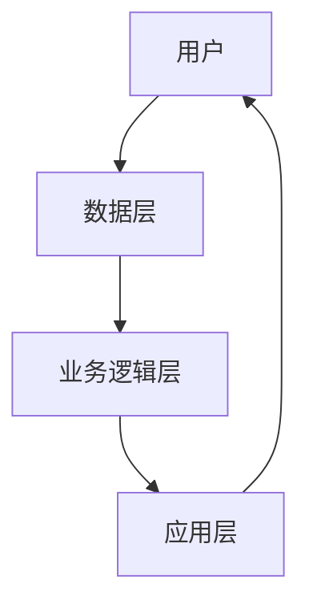

                 


# 区块链驱动的P2P借贷平台设计

> 关键词：区块链，P2P借贷，智能合约，去中心化，借贷平台

> 摘要：本文详细探讨了区块链技术如何驱动P2P借贷平台的设计与实现。从背景介绍、核心概念到算法原理、系统架构设计，再到项目实战和总结，文章全面解析了区块链在P2P借贷中的应用，展示了如何利用区块链技术提升平台的安全性、透明性和效率。文章内容丰富，结构清晰，适合技术人员和对区块链技术感兴趣的读者阅读。

---

# 第一部分: 区块链驱动的P2P借贷平台背景与概念

## 第1章: 区块链与P2P借贷概述

### 1.1 区块链技术基础

#### 1.1.1 区块链的基本概念
区块链是一种分布式账本技术，通过去中心化的方式记录数据，确保数据的安全性和不可篡改性。它由区块、链式结构、共识机制、加密算法和智能合约等核心组件组成。

#### 1.1.2 区块链的核心特点
- **去中心化**：数据不由单一机构控制，而是分布在网络中的多个节点。
- **不可篡改**：区块链上的数据一旦记录，无法被修改或删除。
- **透明性**：所有交易记录公开透明，每个节点都可以查看。
- **安全性**：通过加密算法和共识机制，确保数据的安全性。

#### 1.1.3 区块链的典型应用场景
- **金融领域**：比特币、以太坊等加密货币的交易。
- **供应链管理**：记录产品溯源信息。
- **智能合约**：自动执行合同条款。

### 1.2 P2P借贷的定义与特点

#### 1.2.1 P2P借贷的定义
P2P借贷（点对点借贷）是指个人与个人之间直接进行借贷交易，通过平台撮合交易，绕过传统金融机构的中介角色。

#### 1.2.2 P2P借贷的核心特点
- **去中介化**：直接连接借款人和放款人，降低中间成本。
- **透明性**：平台公开借贷信息，借款人和放款人可以自由选择。
- **高效性**：通过智能合约自动执行借贷流程，减少人工干预。

#### 1.2.3 P2P借贷与传统借贷的区别
- **成本**：P2P借贷通常成本更低，传统借贷涉及中介费用较高。
- **效率**：P2P借贷流程更快，传统借贷流程繁琐。
- **风险控制**：P2P借贷依赖平台和智能合约，传统借贷依赖金融机构的信用评估。

### 1.3 区块链驱动P2P借贷的优势

#### 1.3.1 区块链在P2P借贷中的作用
区块链技术可以为P2P借贷平台提供以下优势：
- **数据不可篡改**：借贷记录存储在区块链上，无法被篡改。
- **透明性**：所有交易公开透明，增强信任。
- **智能合约**：自动执行借贷条款，减少人为干预。

#### 1.3.2 区块链技术如何提升P2P借贷的安全性
- **去中心化存储**：借贷记录分布在网络中多个节点，防止数据丢失或被篡改。
- **加密算法**：保护用户隐私，防止数据泄露。
- **共识机制**：确保数据一致性和安全性。

#### 1.3.3 区块链技术如何降低P2P借贷的成本
- **自动化流程**：智能合约自动执行借贷流程，减少人工干预。
- **信任机制**：区块链的透明性和不可篡改性降低了信任成本。
- **去中介化**：减少中间机构的费用。

---

## 第2章: 区块链驱动P2P借贷的核心概念

### 2.1 区块链驱动P2P借贷的背景介绍

#### 2.1.1 问题背景
传统P2P借贷平台存在以下问题：
- **信任问题**：平台可能利用信息不对称进行欺诈。
- **数据安全**：用户数据容易被黑客攻击。
- **运营成本**：需要大量人工审核和管理。

#### 2.1.2 问题描述
P2P借贷平台需要解决以下问题：
- 如何确保借贷记录的安全性和透明性。
- 如何自动化执行借贷合同。
- 如何降低平台的运营成本。

#### 2.1.3 问题解决
区块链技术可以提供以下解决方案：
- **去中心化存储**：确保借贷记录的安全性和不可篡改性。
- **智能合约**：自动化执行借贷合同。
- **去中介化**：降低平台的运营成本。

#### 2.1.4 边界与外延
区块链驱动的P2P借贷平台的边界包括：
- 用户身份认证
- 借贷信息发布
- 智能合约执行
- 资金转移

平台的外延包括：
- 第三方支付渠道
- 法律合规性
- 用户隐私保护

#### 2.1.5 核心要素组成
区块链驱动的P2P借贷平台的核心要素包括：
- 用户身份认证
- 智能合约
- 借贷信息发布
- 资金转移

### 2.2 核心概念与联系

#### 2.2.1 核心概念原理
- **用户身份认证**：通过区块链地址或第三方身份认证服务进行身份验证。
- **借贷信息发布**：用户在平台上发布借贷需求，其他用户可以根据需求选择借款人。
- **智能合约**：自动执行借贷合同，确保借贷双方按时履行义务。
- **资金转移**：通过区块链网络进行资金的转移，确保资金的安全性。

#### 2.2.2 核心概念属性特征对比表格
以下是核心概念的属性特征对比：

| **概念**      | **属性**               | **特征**                                                                 |
|----------------|-----------------------|--------------------------------------------------------------------------|
| 用户身份认证   | 安全性                 | 高安全性，防止身份伪造                                             |
| 借贷信息发布   | 透明性                 | 所有用户可见，信息透明                                             |
| 智能合约       | 自动化                 | 自动执行借贷条款，无需人工干预                                     |
| 资金转移       | 不可篡改性             | 资金转移记录在区块链上，不可篡改                                   |

#### 2.2.3 ER实体关系图架构的 Mermaid 流程图
以下是P2P借贷平台的ER实体关系图：

```mermaid
erDiagram
    actor 用户
    actor 借款人
    actor 放款人
    actor 智能合约
    用户 --> 智能合约 : 提交借贷请求
    智能合约 --> 放款人 : 发放贷款
    智能合约 --> 借款人 : 收回贷款
```

---

## 第3章: 区块链共识机制与智能合约

### 3.1 共识机制原理

#### 3.1.1 共识机制的定义
共识机制是指在区块链网络中，所有节点就某个数据达成一致的过程。常见的共识机制包括工作量证明（PoW）、权益证明（PoS）、 delegated proof of stake（DPoS）等。

#### 3.1.2 常见共识机制对比
以下是几种常见共识机制的对比：

| **共识机制** | **特点**                                      | **优点**                                      | **缺点**                                      |
|--------------|----------------------------------------------|----------------------------------------------|----------------------------------------------|
| PoW（工作量证明） | 需要大量计算资源，通过计算哈希值找到符合条件的随机数。 | 安全性高，抗女巫攻击能力强。                   | 资源消耗大，效率低。                         |
| PoS（权益证明） | 根据节点持有的代币数量分配记账权。             | 资源消耗低，效率高。                           | 安全性较低，存在“富者愈富”的风险。           |
| DPoS（代理权益证明） | 委托人通过投票选举代表节点进行记账。           | 资源消耗低，效率高，抗女巫攻击能力强。           | 中心化风险较高。                             |

#### 3.1.3 区块链共识机制的选择
选择共识机制需要考虑以下几个方面：
- **安全性**：PoW安全性高，但资源消耗大。
- **效率**：PoS和DPoS效率高，但安全性较低。
- **应用场景**：根据具体的场景需求选择适合的共识机制。

### 3.2 智能合约原理

#### 3.2.1 智能合约的定义
智能合约是一种基于区块链的自动执行合同，通过代码自动执行预设的条件。智能合约运行在区块链的虚拟机上，如以太坊的EVM（以太坊虚拟机）。

#### 3.2.2 智能合约的实现步骤
以下是智能合约的实现步骤：

1. **需求分析**：明确智能合约的功能需求。
2. **合约编写**：使用Solidity等编程语言编写智能合约代码。
3. **编译与部署**：将合约代码编译成字节码，并部署到区块链上。
4. **测试**：在测试环境中进行智能合约的测试，确保功能正常。
5. **上线**：将智能合约部署到主网上，供用户使用。

#### 3.2.3 智能合约的数学模型和公式
以下是智能合约的核心数学模型：

1. **时间戳**：记录合约的执行时间。
2. **条件判断**：根据借贷双方的协议条款进行条件判断。
3. **金额计算**：根据借贷利率和时间计算还款金额。

---

### 3.2.4 智能合约的实现代码

以下是智能合约的Solidity代码示例：

```solidity
// SPDX-License-Identifier: MIT
pragma solidity ^0.8.0;

contract P2PLoan {
    struct Loan {
        address borrower;
        address lender;
        uint256 amount;
        uint256 interestRate;
        uint256 duration;
        uint256 timestamp;
        bool isRepaid;
    }

    mapping(address => Loan) loans;

    function requestLoan(uint256 amount, uint256 interestRate, uint256 duration) external {
        Loan memory loan = Loan({
            borrower: msg.sender,
            lender: address(0),
            amount: amount,
            interestRate: interestRate,
            duration: duration,
            timestamp: block.timestamp,
            isRepaid: false
        });
        loans[msg.sender] = loan;
    }

    function fulfillLoan(address borrower) external payable {
        Loan storage loan = loans[borrower];
        require(!loan.isRepaid, "Loan already repaid");
        require(msg.sender == loan.lender, "Not the lender");

        uint256 totalAmount = loan.amount * (1 + loan.interestRate / 100 * loan.duration / 365);
        payable(borrower).transfer(totalAmount);

        loan.isRepaid = true;
    }
}
```

### 3.3 区块链共识机制与智能合约的结合

区块链共识机制和智能合约的结合可以确保智能合约的执行过程是安全和透明的。通过共识机制，区块链网络中的节点可以达成一致，确保智能合约的执行结果被广泛认可。

---

## 第4章: 区块链驱动P2P借贷的算法原理

### 4.1 区块链驱动P2P借贷的算法原理

#### 4.1.1 区块链驱动P2P借贷的基本算法
以下是区块链驱动P2P借贷的基本算法：

1. **用户身份认证**：通过区块链地址或第三方身份认证服务进行身份验证。
2. **借贷信息发布**：用户在平台上发布借贷需求，其他用户可以根据需求选择借款人。
3. **智能合约执行**：借贷双方达成协议后，智能合约自动执行借贷流程。
4. **资金转移**：通过区块链网络进行资金的转移，确保资金的安全性。

#### 4.1.2 区块链驱动P2P借贷的算法实现
以下是区块链驱动P2P借贷的算法实现步骤：

1. **用户注册**：用户在平台上注册，完成身份认证。
2. **借贷请求**：借款人发布借贷请求，包括金额、利率、期限等信息。
3. **智能合约部署**：借贷双方签订智能合约，确保借贷流程自动执行。
4. **资金转移**：智能合约执行后，资金从放款人转移到借款人账户。
5. **还款**：借款人按照约定时间还款，智能合约自动处理还款流程。

#### 4.1.3 区块链驱动P2P借贷的算法优化
以下是区块链驱动P2P借贷的算法优化建议：

1. **优化智能合约**：通过优化智能合约代码，提高合约的执行效率。
2. **选择合适的共识机制**：根据具体的场景需求，选择适合的共识机制，提高区块链网络的效率。
3. **引入侧链技术**：通过引入侧链技术，提高区块链网络的扩展性。

---

## 第5章: 区块链驱动P2P借贷的系统分析与架构设计

### 5.1 系统功能设计

#### 5.1.1 功能模块划分
区块链驱动的P2P借贷平台的功能模块包括：
- 用户身份认证模块
- 借贷信息发布模块
- 智能合约管理模块
- 资金转移模块
- 数据查询模块

#### 5.1.2 功能模块的详细设计
以下是功能模块的详细设计：

1. **用户身份认证模块**：
   - 用户注册：用户通过区块链地址或第三方身份认证服务完成注册。
   - 用户登录：用户登录平台，完成身份验证。

2. **借贷信息发布模块**：
   - 借款人发布借贷请求：借款人填写借贷需求，包括金额、利率、期限等信息。
   - 放款人选择借款人：放款人根据借贷需求选择借款人。

3. **智能合约管理模块**：
   - 合约部署：借贷双方签订智能合约，确保借贷流程自动执行。
   - 合约执行：智能合约自动执行借贷流程，确保借贷双方按时履行义务。

4. **资金转移模块**：
   - 资金发放：智能合约执行后，资金从放款人转移到借款人账户。
   - 资金回收：借款人按照约定时间还款，资金从借款人账户转移到放款人账户。

5. **数据查询模块**：
   - 借贷记录查询：用户可以查询自己的借贷记录。
   - 资金流水查询：用户可以查询自己的资金流水。

---

### 5.2 系统架构设计

#### 5.2.1 系统架构分层
区块链驱动的P2P借贷平台的系统架构分为以下几层：
- 数据层：存储借贷记录、用户信息等数据。
- 业务逻辑层：实现借贷信息发布、智能合约管理等功能。
- 应用层：用户与平台的交互界面，包括网页端和移动端。

#### 5.2.2 系统架构的 Mermaid 图
以下是系统架构的 Mermaid 图：



---

## 第6章: 区块链驱动P2P借贷的项目实战

### 6.1 环境安装与配置

#### 6.1.1 安装Solidity
1. 下载Solidity编译器：可以从以太坊官网下载Solidity编译器。
2. 安装Node.js：Solidity编译器需要Node.js环境支持。

#### 6.1.2 安装以太坊节点
1. 下载以太坊节点：可以从以太坊官网下载以太坊节点。
2. 配置以太坊节点：根据以太坊节点的配置文档进行配置。

#### 6.1.3 安装以太坊钱包
1. 下载以太坊钱包：可以从以太坊钱包官网下载以太坊钱包。
2. 配置以太坊钱包：根据以太坊钱包的配置文档进行配置。

---

### 6.2 系统核心实现

#### 6.2.1 智能合约实现
以下是智能合约的实现代码：

```solidity
// SPDX-License-Identifier: MIT
pragma solidity ^0.8.0;

contract P2PLoan {
    struct Loan {
        address borrower;
        address lender;
        uint256 amount;
        uint256 interestRate;
        uint256 duration;
        uint256 timestamp;
        bool isRepaid;
    }

    mapping(address => Loan) loans;

    function requestLoan(uint256 amount, uint256 interestRate, uint256 duration) external {
        Loan memory loan = Loan({
            borrower: msg.sender,
            lender: address(0),
            amount: amount,
            interestRate: interestRate,
            duration: duration,
            timestamp: block.timestamp,
            isRepaid: false
        });
        loans[msg.sender] = loan;
    }

    function fulfillLoan(address borrower) external payable {
        Loan storage loan = loans[borrower];
        require(!loan.isRepaid, "Loan already repaid");
        require(msg.sender == loan.lender, "Not the lender");

        uint256 totalAmount = loan.amount * (1 + loan.interestRate / 100 * loan.duration / 365);
        payable(borrower).transfer(totalAmount);

        loan.isRepaid = true;
    }
}
```

---

### 6.3 项目实战小结

通过上述步骤，我们可以看到区块链驱动的P2P借贷平台的实现过程。从智能合约的编写到平台的搭建，整个过程需要我们对区块链技术有深入的理解和掌握。通过实践，我们可以更好地理解区块链技术在P2P借贷中的应用。

---

## 第7章: 总结与展望

### 7.1 总结

区块链技术为P2P借贷平台提供了新的解决方案，通过去中心化、透明性和不可篡改性的特点，提高了P2P借贷的安全性和效率。智能合约的引入，使得借贷流程更加自动化和透明化。

### 7.2 展望

未来，区块链技术将继续在P2P借贷领域发挥重要作用。随着技术的发展，区块链驱动的P2P借贷平台将更加智能化和高效化。同时，区块链技术与其他技术的结合，如人工智能和大数据分析，将进一步提升P2P借贷平台的用户体验和风险管理能力。

### 7.3 最佳实践 tips

1. **安全性**：确保智能合约的安全性，避免漏洞被利用。
2. **合规性**：遵守相关法律法规，确保平台的合法性。
3. **用户体验**：优化平台的用户体验，提高用户的使用满意度。
4. **技术创新**：持续关注区块链技术的发展，引入新技术提升平台的功能和性能。

---

通过本文的详细讲解，我们全面了解了区块链驱动的P2P借贷平台的设计与实现。希望本文能够为技术人员和对区块链技术感兴趣的读者提供有价值的参考。

