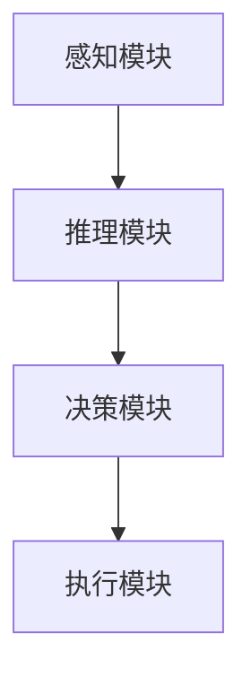

                 


# 可视化调试：深入了解AI Agent的决策过程

> 关键词：可视化调试、AI Agent、决策过程、系统架构、算法原理、项目实战、技术实现

> 摘要：本文将深入探讨AI Agent的决策过程，并通过可视化调试的方法，帮助开发者更好地理解AI Agent的工作原理。文章从AI Agent的基本概念出发，分析其决策过程，并结合实际项目案例，详细介绍可视化调试的技术实现、系统架构设计、算法原理以及项目实战。通过本文的学习，读者将能够掌握AI Agent的决策机制，并能够使用可视化工具来调试和优化AI Agent的性能。

---

## 第一章: AI Agent与可视化调试概述

### 1.1 AI Agent的基本概念

#### 1.1.1 AI Agent的定义与特点
AI Agent（人工智能代理）是指能够感知环境、自主决策并执行任务的智能实体。AI Agent的核心特点包括：
- **自主性**：能够在没有外部干预的情况下自主运行。
- **反应性**：能够根据环境的变化实时调整行为。
- **目标导向性**：以明确的目标为导向，优化决策过程。
- **学习能力**：通过数据和经验不断优化自身的决策能力。

#### 1.1.2 可视化调试的定义与作用
可视化调试是指通过图形化界面和交互式工具，将AI Agent的决策过程以直观的方式呈现出来，帮助开发者理解和优化其行为。可视化调试的作用包括：
- 提供实时反馈，帮助开发者快速定位问题。
- 展示AI Agent的内部状态和决策逻辑，便于分析和改进。
- 提供直观的监控工具，支持动态调整AI Agent的行为参数。

#### 1.1.3 AI Agent的决策过程概述
AI Agent的决策过程通常包括以下几个阶段：
1. **感知阶段**：通过传感器或数据源获取环境信息。
2. **推理阶段**：基于感知到的信息，通过算法进行推理和计算，得出可能的决策方案。
3. **决策阶段**：根据推理结果，选择最优的行动方案。
4. **执行阶段**：将决策结果转化为具体的操作，完成任务。

---

### 1.2 AI Agent的类型与应用

#### 1.2.1 基于规则的AI Agent
- **特点**：基于预定义的规则进行决策，简单且易于实现。
- **应用场景**：适用于规则明确、环境稳定的场景，如简单的游戏AI或自动化控制。

#### 1.2.2 基于模型的AI Agent
- **特点**：基于数学模型进行推理和决策，能够处理复杂问题。
- **应用场景**：适用于需要复杂推理的任务，如自动驾驶和医疗诊断。

#### 1.2.3 基于强化学习的AI Agent
- **特点**：通过与环境的交互不断优化决策策略，具有高度的适应性。
- **应用场景**：适用于需要动态调整策略的场景，如游戏AI和机器人控制。

---

## 第二章: AI Agent的决策过程分析

### 2.1 AI Agent的感知与理解

#### 2.1.1 数据输入与预处理
- **数据输入的来源**：包括传感器数据、数据库查询、用户输入等多种形式。
- **数据预处理**：对输入数据进行清洗、转换和标准化，以便后续处理。

#### 2.1.2 知识表示与状态建模
- **知识表示**：通过符号逻辑、语义网络等方式表示知识。
- **状态建模**：将环境状态表示为数学模型，便于推理和决策。

### 2.2 AI Agent的推理与决策

#### 2.2.1 决策树算法
- **决策树的构建**：基于训练数据构建决策树模型。
- **决策树的推理**：通过遍历决策树节点进行推理，最终得到决策结果。

#### 2.2.2 随机森林算法
- **随机森林的原理**：通过集成多个决策树模型，提高决策的准确性和鲁棒性。
- **随机森林的应用**：适用于复杂场景下的决策问题。

#### 2.2.3 强化学习算法
- **强化学习的原理**：通过与环境的交互，学习最优决策策略。
- **强化学习的应用**：适用于动态变化的环境，如游戏AI和机器人控制。

---

## 第三章: 可视化调试的技术实现

### 3.1 可视化调试的核心技术

#### 3.1.1 可视化工具的选择
- **图形化界面**：使用图表、流程图等方式展示AI Agent的决策过程。
- **日志跟踪**：通过日志记录AI Agent的状态变化和决策结果。
- **模拟器**：通过模拟环境变化，观察AI Agent的实时反应。

#### 3.1.2 数据可视化方法
- **数据流可视化**：展示数据从输入到输出的整个流程。
- **状态变化可视化**：通过图表展示AI Agent状态的变化趋势。
- **决策过程可视化**：用流程图或树状图展示AI Agent的决策逻辑。

#### 3.1.3 交互式调试界面
- **实时监控**：通过图形化界面实时监控AI Agent的运行状态。
- **参数调整**：允许开发者动态调整AI Agent的参数，观察其影响。

---

## 第四章: AI Agent系统与可视化调试工具的整合

### 4.1 系统架构设计

#### 4.1.1 系统功能模块
- **感知模块**：负责数据的采集和预处理。
- **推理模块**：负责数据的分析和推理。
- **决策模块**：负责生成决策结果。
- **执行模块**：负责将决策结果转化为具体操作。

#### 4.1.2 系统架构图


#### 4.1.3 接口设计
- **输入接口**：接收外部数据和指令。
- **输出接口**：输出决策结果和执行命令。

#### 4.1.4 交互设计
- **用户界面**：提供友好的可视化界面，便于开发者操作。
- **日志系统**：记录AI Agent的运行状态和决策日志。

---

## 第五章: 项目实战与最佳实践

### 5.1 项目实战

#### 5.1.1 项目背景
- **项目目标**：开发一个智能客服系统，实现客户问题的自动解答。
- **技术选型**：选择基于规则的AI Agent，结合可视化调试工具进行优化。

#### 5.1.2 环境搭建
- **安装Python**：`python --version`
- **安装依赖库**：`pip install numpy matplotlib`

#### 5.1.3 核心代码实现
```python
import numpy as np
import matplotlib.pyplot as plt

# 数据预处理
data = np.loadtxt('input.csv', delimiter=',')
X = data[:, :-1]
y = data[:, -1]

# 决策树模型训练
from sklearn.tree import DecisionTreeClassifier
model = DecisionTreeClassifier()
model.fit(X, y)

# 可视化决策树
from sklearn.tree import plot_tree
plot_tree(model)
plt.show()
```

#### 5.1.4 实际案例分析
- **案例分析**：通过可视化工具观察AI Agent在处理客户问题时的决策过程，发现并优化决策逻辑。

---

## 第六章: 总结与展望

### 6.1 总结
通过本文的学习，我们深入了解了AI Agent的决策过程，并掌握了可视化调试的技术方法。可视化调试不仅能够帮助开发者更好地理解AI Agent的行为，还能够提高开发效率和系统性能。

### 6.2 展望
未来，随着AI技术的不断发展，可视化调试工具将更加智能化和便捷化。通过结合虚拟现实技术和增强现实技术，可视化调试将提供更加沉浸式的体验，进一步提升开发者的工作效率。

---

通过本文的学习，读者将能够掌握AI Agent的决策机制，并能够使用可视化调试工具来优化其性能。希望本文对您在AI Agent开发和调试方面有所帮助。

