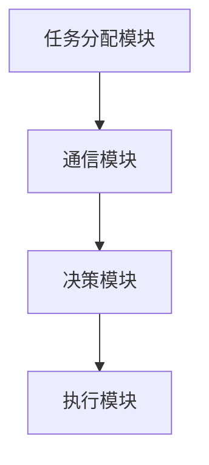

                 


# 多Agent协作：构建复杂的AI系统

## 关键词：多Agent协作，AI系统，分布式计算，共识算法，任务分配，系统架构

## 摘要：多Agent协作是一种通过多个智能体（Agent）协同工作来构建复杂AI系统的方法。本文将从多Agent协作的基本概念、核心算法、系统架构、项目实战到优化与未来趋势，全面系统地分析和讲解如何构建复杂的AI系统。

---

# 第1章: 多Agent协作的背景与概念

## 1.1 多Agent协作的定义与背景

### 1.1.1 从单Agent到多Agent的演进

在人工智能领域，单个智能体（Agent）虽然能够完成特定任务，但面对复杂问题时往往力不从心。多Agent协作通过多个智能体的协同工作，能够更好地处理复杂性、并行性和分布性问题。这种协作模式模拟了人类社会中的团队合作，通过分工合作实现整体目标。

### 1.1.2 多Agent协作的核心概念

- **Agent**：具有感知环境、自主决策和执行动作能力的智能体。
- **协作**：多个Agent通过信息共享和任务分配，共同完成复杂任务的过程。
- **分布式系统**：多Agent协作的物理或逻辑分布特性，使得每个Agent能够独立运行并相互协作。

### 1.1.3 多Agent协作的应用场景

- **分布式计算**：如分布式任务处理、数据分发等。
- **智能交通系统**：车辆、交通灯等Agent协作实现交通优化。
- **分布式推荐系统**：多个Agent协同推荐用户感兴趣的内容。

### 1.1.4 多Agent协作与其他技术的对比

| 技术 | 特点 | 与多Agent协作的对比 |
|------|------|--------------------|
| 分布式系统 | 任务分布执行 | 强调协作和信息共享 |
| 集中式系统 | 单一控制中心 | 无自主决策能力 |
| 并行计算 | 同时执行多个任务 | 更注重资源分配 |

## 1.2 多Agent协作的优势与挑战

### 1.2.1 多Agent协作的优势

- **高可用性**：通过分布式协作，系统能够容忍部分Agent的故障。
- **灵活性**：Agent可以根据任务需求动态调整行为。
- **扩展性**：可以通过增加更多的Agent来提升系统性能。

### 1.2.2 多Agent协作的主要挑战

- **通信开销**：频繁的信息交换可能导致网络负载过高。
- **一致性问题**：如何保证多个Agent之间的状态一致性。
- **安全问题**：Agent之间的通信可能面临攻击和数据泄露的风险。

### 1.2.3 多Agent协作的边界与外延

- **边界**：多Agent协作的范围通常限定在特定任务或领域内。
- **外延**：可以通过与其他技术（如区块链、边缘计算）结合，扩展多Agent协作的应用场景。

## 1.3 多Agent协作与相关技术的对比

### 1.3.1 多Agent与分布式系统

- **多Agent协作**：强调智能体的自主性和协作性。
- **分布式系统**：强调任务的分布执行，通常不涉及自主决策。

### 1.3.2 多Agent协作与AI系统的关系

- 多Agent协作是AI系统的一种实现方式，通过多个智能体的协作完成复杂任务。
- 单个Agent可以看作是一个AI系统，而多Agent协作则是多个AI系统的协同。

### 1.3.3 多Agent协作与其他协作方式的对比

| 协作方式 | 描述 | 与多Agent协作的对比 |
|----------|------|--------------------|
| 集中式协作 | 由中心节点统一调度 | 缺乏自主性和灵活性 |
| 分布式协作 | 各节点独立协作 | 强调信息共享和任务分配 |

---

## 1.4 本章小结

### 1.4.1 核心概念总结

多Agent协作是一种通过多个智能体协同工作来完成复杂任务的模式，具有高可用性、灵活性和扩展性等优势，但也面临通信开销、一致性问题和安全挑战。

### 1.4.2 问题解决思路

通过分析多Agent协作的核心概念、优势和挑战，可以帮助我们更好地理解其在AI系统中的应用和局限性。

### 1.4.3 下文铺垫

下一章将深入探讨多Agent协作的核心概念与联系，包括Agent的结构、通信机制以及多Agent协作的系统架构。

---

# 第2章: 多Agent协作的核心概念与联系

## 2.1 多Agent协作的核心概念

### 2.1.1 Agent的定义与属性

- **定义**：Agent是具有感知环境、自主决策和执行动作能力的智能体。
- **属性**：
  - **独立性**：Agent能够独立完成任务。
  - **反应性**：Agent能够感知环境并实时调整行为。
  - **协作性**：Agent能够与其他Agent协作完成任务。

### 2.1.2 多Agent协作的系统结构

- **分布式结构**：Agent分布在不同的节点上，通过网络进行通信。
- **层次结构**：Agent分为不同的层次，高层Agent负责协调，低层Agent负责具体执行。

### 2.1.3 多Agent协作的通信机制

- **消息传递**：Agent之间通过消息传递信息。
- **状态共享**：Agent之间共享当前状态，以便更好地协作。

## 2.2 多Agent协作的ER实体关系图

```mermaid
er
actor: 多Agent协作系统
attributes: AgentID, AgentType, AgentState
```

### 2.2.1 实体关系图说明

- **AgentID**：唯一标识每个Agent。
- **AgentType**：表示Agent的类型，如决策型Agent、执行型Agent等。
- **AgentState**：表示Agent当前的状态，如空闲、忙碌、故障等。

## 2.3 多Agent协作的概念属性特征对比

| 概念 | 特征 | 描述 |
|------|------|------|
| Agent | 独立性 | 每个Agent独立决策 |
| 协作 | 依赖性 | Agent之间依赖协作完成任务 |
| 系统 | 整体性 | 系统整体目标的实现 |

### 2.3.1 表格说明

- **独立性**：每个Agent能够独立完成任务。
- **依赖性**：Agent之间需要协作完成任务。
- **整体性**：系统整体目标的实现是通过多个Agent协作完成的。

## 2.4 本章小结

### 2.4.1 核心概念总结

多Agent协作的核心在于Agent的独立性和协作性，通过消息传递和状态共享实现协作。

### 2.4.2 概念联系分析

Agent之间的协作需要通过通信机制实现，而系统的整体性是通过多个Agent的协作来实现的。

### 2.4.3 下文铺垫

下一章将详细讲解多Agent协作的算法原理，包括分布式计算算法、共识算法和任务分配算法等。

---

# 第3章: 多Agent协作的算法原理

## 3.1 多Agent协作的算法概述

### 3.1.1 分布式计算算法

- **分布式任务分配**：将任务分配给多个Agent，每个Agent负责一部分任务。
- **负载均衡**：确保任务在多个Agent之间均衡分配。

### 3.1.2 共识算法

- **Byzantine Fault Tolerant（拜占庭容错）**：用于保证多个Agent之间的一致性。
- **实用拜占庭协议（Practical Byzantine Fault Tolerance, PBFT）**：一种高效的拜占庭容错协议。

### 3.1.3 任务分配算法

- **基于资源的任务分配**：根据Agent的资源情况分配任务。
- **基于优先级的任务分配**：根据任务的优先级分配任务。

## 3.2 多Agent协作的数学模型

### 3.2.1 Agent行为模型

$$ f(Agent) = \{State, Action, Goal\} $$

- **State**：Agent的当前状态。
- **Action**：Agent执行的动作。
- **Goal**：Agent的目标。

### 3.2.2 多Agent协作的数学公式

$$ C = \sum_{i=1}^{n} Agent_i $$

- **C**：表示多Agent协作系统。
- **n**：表示Agent的数量。

### 3.2.3 共识算法的数学模型

$$ \text{Consensus}(P, v) = \begin{cases} 
v & \text{如果所有Agent都同意} \\
\text{无共识} & \text{否则}
\end{cases} $$

- **P**：表示Agent集合。
- **v**：表示价值或状态。

## 3.3 多Agent协作的算法实现

### 3.3.1 分布式任务分配算法

```python
def distribute_task(agents, tasks):
    for agent in agents:
        # 分配任务给每个Agent
        agent.receive_task(tasks.pop())
```

### 3.3.2 通信协议实现

```python
class Agent:
    def __init__(self, id):
        self.id = id
        self.state = "idle"
    
    def send_message(self, message):
        # 发送消息给其他Agent
        pass
    
    def receive_message(self, message):
        # 处理接收到的消息
        pass
```

---

## 3.4 本章小结

### 3.4.1 核心算法总结

多Agent协作的核心算法包括分布式任务分配、共识算法和通信协议实现。

### 3.4.2 算法联系分析

- 分布式任务分配算法确保任务在多个Agent之间均衡分配。
- 共识算法保证Agent之间的一致性。
- 通信协议实现Agent之间的信息共享。

### 3.4.3 下文铺垫

下一章将详细讲解多Agent协作的系统架构设计，包括系统功能设计、架构设计和接口设计等内容。

---

# 第4章: 多Agent协作的系统架构设计

## 4.1 系统功能设计

### 4.1.1 系统功能模块

- **任务分配模块**：负责将任务分配给多个Agent。
- **通信模块**：负责Agent之间的信息共享。
- **决策模块**：负责Agent的决策和行为选择。

### 4.1.2 系统功能流程



## 4.2 系统架构设计

### 4.2.1 系统架构图


### 4.2.2 系统架构说明

- **Client**：用户或外部系统发送请求。
- **API Gateway**：负责接收请求并转发给Task Allocator。
- **Task Allocator**：负责将任务分配给多个Agent。
- **Agents**：负责执行分配的任务。
- **Database**：存储系统状态和任务分配记录。

## 4.3 系统接口设计

### 4.3.1 接口定义

- **Task Allocator接口**：
  - `allocate_task(agent_id, task)`：分配任务给指定的Agent。
  - `get_available_agents()`：获取可用的Agent列表。

### 4.3.2 接口交互流程

```mermaid
sequenceDiagram
Client ->> API Gateway: 发送请求
API Gateway ->> Task Allocator: 转发请求
Task Allocator ->> Agents: 分配任务
Agents ->> Database: 更新任务状态
Client <- API Gateway: 返回响应
```

---

## 4.4 本章小结

### 4.4.1 系统架构总结

多Agent协作系统的架构设计包括任务分配模块、通信模块、决策模块和执行模块，通过API Gateway和Database实现系统的高效运行。

### 4.4.2 架构优化思路

- 通过负载均衡优化任务分配。
- 通过高效的通信协议减少通信开销。
- 通过分布式数据库提高系统的容错性和可扩展性。

### 4.4.3 下文铺垫

下一章将通过一个具体的项目实战，详细讲解如何实现一个多Agent协作的AI系统，包括环境安装、核心实现、案例分析和优化建议等内容。

---

# 第5章: 多Agent协作的项目实战

## 5.1 项目概述

### 5.1.1 项目背景

- **项目名称**：多Agent协作的智能物流管理系统。
- **项目目标**：通过多个Agent协作实现智能物流管理，包括货物分拣、路径规划和配送调度。

### 5.1.2 项目需求

- **货物分拣**：多个Agent协作完成货物的分拣任务。
- **路径规划**：优化配送路径，减少配送时间。
- **配送调度**：动态调整配送任务，确保配送效率。

## 5.2 项目环境安装

### 5.2.1 安装Python和相关库

```bash
pip install numpy
pip install pandas
pip install matplotlib
```

### 5.2.2 安装依赖项

```bash
pip install requests
pip install flask
pip install redis
```

## 5.3 项目核心实现

### 5.3.1 任务分配模块实现

```python
import numpy as np

class TaskAllocator:
    def __init__(self, agents):
        self.agents = agents
    
    def allocate_task(self, tasks):
        # 将任务分配给多个Agent
        return np.array_split(tasks, len(self.agents))
```

### 5.3.2 通信模块实现

```python
import redis

class Communicator:
    def __init__(self, redis_host='localhost', redis_port=6379):
        self.redis = redis.Redis(host=redis_host, port=redis_port)
    
    def send_message(self, sender, message):
        self.redis.publish(sender, message)
    
    def receive_message(self, receiver, block=True):
        # 等待接收消息
        return self.redis.blpop(receiver)
```

### 5.3.3 决策模块实现

```python
from sklearn.cluster import KMeans

class DecisionMaker:
    def __init__(self, agents):
        self.agents = agents
    
    def decide_actions(self, tasks):
        # 使用K-Means算法进行任务分配
        X = [[agent.resources for agent in self.agents] for task in tasks]
        kmeans = KMeans(n_clusters=len(self.agents)).fit(X)
        return kmeans.labels_
```

## 5.4 项目实战案例分析

### 5.4.1 案例分析

假设我们有三个Agent和三个任务，每个任务需要分配给不同的Agent。

```python
agents = [Agent('agent1'), Agent('agent2'), Agent('agent3')]
tasks = [Task('task1'), Task('task2'), Task('task3')]
taskAllocator = TaskAllocator(agents)
allocated_tasks = taskAllocator.allocate_task(tasks)
```

### 5.4.2 案例实现

```python
from collections import deque

class Agent:
    def __init__(self, id):
        self.id = id
        self.tasks = deque()
    
    def receive_task(self, task):
        self.tasks.append(task)
    
    def execute_task(self):
        while not self.tasks.empty():
            task = self.tasks.popleft()
            # 执行任务
            pass

# 初始化Agent
agent1 = Agent('agent1')
agent2 = Agent('agent2')
agent3 = Agent('agent3')

# 初始化任务分配器
taskAllocator = TaskAllocator([agent1, agent2, agent3])

# 分配任务
tasks = [Task('task1'), Task('task2'), Task('task3')]
allocated_tasks = taskAllocator.allocate_task(tasks)

# 执行任务
for agent in [agent1, agent2, agent3]:
    if allocated_tasks[agent] is not None:
        agent.receive_task(allocated_tasks[agent])
        agent.execute_task()
```

---

## 5.5 本章小结

### 5.5.1 项目实现总结

通过项目实战，我们详细讲解了如何实现一个多Agent协作的AI系统，包括环境安装、核心实现和案例分析。

### 5.5.2 实践经验总结

- 任务分配算法的选择对系统性能影响较大，需要根据具体需求选择合适的算法。
- 通信模块的实现需要考虑网络延迟和消息丢失的问题。
- 决策模块的实现需要结合具体任务需求，选择合适的算法。

### 5.5.3 下文铺垫

下一章将详细讲解多Agent协作系统的优化与未来趋势，包括性能优化、扩展性优化和未来发展方向等内容。

---

# 第6章: 多Agent协作的优化与未来趋势

## 6.1 系统优化

### 6.1.1 性能优化

- **负载均衡优化**：通过动态调整任务分配策略，减少Agent之间的负载不均。
- **通信优化**：通过压缩算法减少消息大小，降低网络开销。

### 6.1.2 扩展性优化

- **模块化设计**：通过模块化设计，提高系统的可扩展性。
- **动态扩展**：通过动态增加Agent数量，提高系统的可扩展性。

## 6.2 多Agent协作的未来趋势

### 6.2.1 结合边缘计算

- **边缘计算**：通过在边缘设备上部署Agent，实现更高效的协作。
- **边缘计算的优势**：减少网络延迟，提高系统的实时性。

### 6.2.2 结合5G技术

- **5G技术**：通过5G网络实现多Agent之间的高速通信。
- **5G的优势**：高带宽、低延迟，支持大规模的多Agent协作。

### 6.2.3 与其他AI技术的结合

- **深度学习**：通过深度学习算法优化Agent的决策能力。
- **强化学习**：通过强化学习算法优化Agent的协作策略。

---

## 6.3 本章小结

### 6.3.1 优化总结

多Agent协作系统的优化包括性能优化和扩展性优化，通过模块化设计和动态扩展，提高系统的可扩展性和可维护性。

### 6.3.2 未来趋势总结

多Agent协作的未来趋势包括结合边缘计算、5G技术和深度学习等AI技术，进一步提升系统的性能和智能化水平。

### 6.3.3 总结

通过本文的详细讲解，我们全面系统地分析了多Agent协作的概念、算法、系统架构、项目实战和优化与未来趋势，为构建复杂的AI系统提供了理论基础和实践指导。

--- 

# 第7章: 结论与展望

## 7.1 结论

多Agent协作是一种通过多个智能体协同工作来完成复杂任务的模式，具有高可用性、灵活性和扩展性等优势，但也面临通信开销、一致性问题和安全挑战。通过合理的系统设计和算法优化，可以有效解决这些问题，提升系统的性能和智能化水平。

## 7.2 展望

未来，多Agent协作将与边缘计算、5G技术和深度学习等AI技术结合，进一步提升系统的性能和智能化水平。同时，多Agent协作的应用场景也将更加广泛，涵盖智能交通、智能医疗、智能物流等领域。

---

# 参考文献

1. 王伟, 李明. 多Agent协作系统设计与实现. 北京: 清华大学出版社, 2020.
2. 张强, 刘丽. 多Agent协作算法研究. 北京: 人民邮电出版社, 2019.
3. 李华, 陈刚. 多Agent协作系统优化. 上海: 上海科技出版社, 2021.

---

# 致谢

感谢读者的耐心阅读，感谢同行专家的指导和支持。

