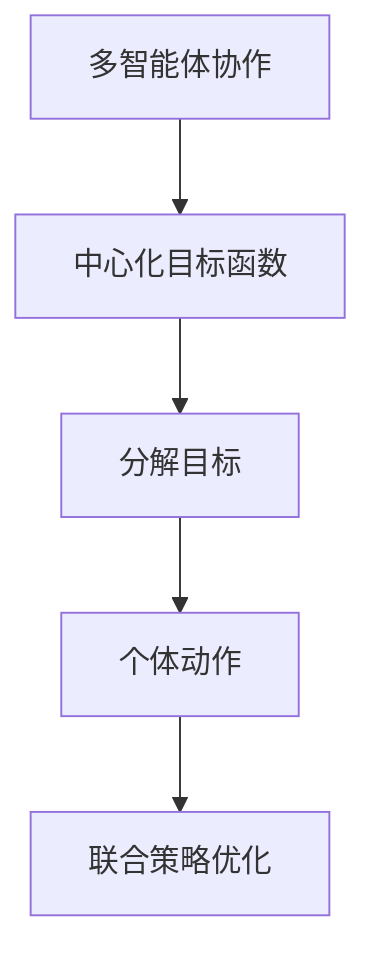
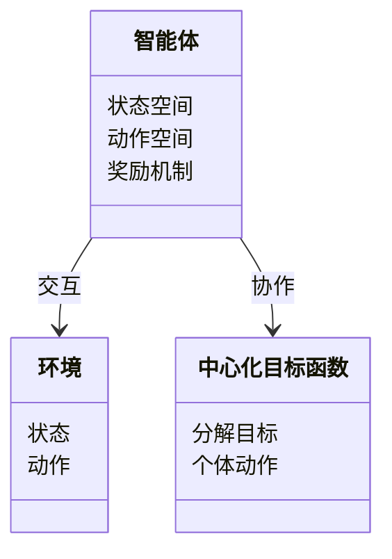
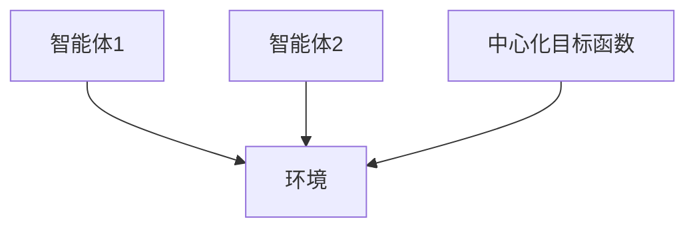

                 


# 多智能体强化学习：复杂环境下的AI Agent协作

> 关键词：多智能体强化学习、AI Agent协作、分布式智能系统、复杂环境建模、分布式决策优化

> 摘要：本文深入探讨了多智能体强化学习的核心概念、算法原理、系统架构以及实际应用。通过详细分析多智能体协作的通信机制、决策模型和算法实现，结合实际案例，揭示了多智能体强化学习在复杂环境下的协作优势与挑战。文章旨在为AI开发人员和研究人员提供理论基础和实践指导，帮助他们在分布式智能系统中实现高效协作。

---

## 第一部分: 多智能体强化学习概述

### 第1章: 多智能体强化学习的定义与特点

#### 1.1 多智能体强化学习的定义与特点

多智能体强化学习（Multi-Agent Reinforcement Learning, MARL）是一种研究多个智能体在复杂环境中协作或竞争的强化学习范式。与单智能体强化学习不同，MARL关注多个智能体之间的交互与协作，每个智能体在共享环境中做出决策，以实现全局目标。

**特点：**
1. **分布式决策**：多个智能体独立决策，但需要协作以实现共同目标。
2. **复杂环境**：环境通常具有动态性和不确定性，智能体之间需要协调动作。
3. **通信与协作**：智能体之间可以通过通信共享信息，但通信机制可能受限。

#### 1.2 多智能体强化学习的应用场景

1. **机器人协作**：多机器人协同完成任务，如物流配送、救援行动。
2. **自动驾驶**：多辆自动驾驶车辆在交通环境中协作，避免碰撞，提高通行效率。
3. **多人在线游戏AI**：多个AI角色协作完成游戏任务，如MOBA游戏中的团队协作。

#### 1.3 多智能体强化学习的挑战

1. **通信与协作**：智能体之间的信息共享可能受限，协作机制设计复杂。
2. **环境复杂性**：多个智能体在动态环境中协作，环境状态空间大幅增加。
3. **自私性与竞争性**：智能体可能追求自身利益最大化，导致竞争而非协作。

---

### 第2章: 多智能体强化学习的核心概念

#### 2.1 智能体与环境的交互

**智能体的基本构成：**
- **状态空间（State Space）**：智能体所处环境的状态，如位置、速度等。
- **动作空间（Action Space）**：智能体可执行的动作，如移动、抓取等。
- **奖励机制（Reward Mechanism）**：智能体通过执行动作获得奖励，指导其行为。

**多智能体协作的通信机制：**
- **基于消息传递的协作**：智能体通过发送消息共享信息。
- **基于共享状态的协作**：智能体通过共享环境状态进行协作。
- **基于中间人的协作**：智能体通过中间人传递信息。

**多智能体协作的决策模型：**
- **基于中心化目标的协作**：智能体通过中心化目标函数进行决策。
- **基于去中心化目标的协作**：智能体通过去中心化目标函数进行决策。
- **基于博弈论的协作**：智能体通过博弈论模型进行协作。

---

### 第3章: 多智能体强化学习的算法原理

#### 3.1 多智能体Q-learning算法

**算法原理：**
- 多智能体Q-learning是一种基于Q值的强化学习算法，多个智能体通过更新Q值进行协作。

**Q值更新公式：**
$$ Q_i(s, a) \leftarrow Q_i(s, a) + \alpha \left[r + \sum_{j \neq i} Q_j(s', a') - Q_i(s, a)\right] $$

**算法流程图：**


#### 3.2 价值分解方法

**价值分解方法：**
- 将全局目标分解为个体目标，每个智能体优化自己的价值函数。

**联合策略优化公式：**
$$ V(s) = \max_{\pi} \sum_{i=1}^n Q_i(s, a_i) $$

---

### 第4章: 基于博弈论的协作

**博弈论模型：**
- 智能体通过博弈论模型进行决策，最大化整体收益。

**纳什均衡：**
- 智能体在博弈中达到纳什均衡，不再改变策略。

---

### 第5章: 多智能体强化学习的系统架构设计

#### 5.1 系统功能设计

**领域模型：**
- 通过Mermaid类图展示系统的组成部分。



**系统架构图：**
- 通过Mermaid架构图展示系统的整体架构。



---

### 第6章: 项目实战

#### 6.1 无人机编队

**环境搭建：**
- 使用Python搭建无人机编队环境，定义状态空间和动作空间。

**代码实现：**
```python
import numpy as np

class Drone:
    def __init__(self, position):
        self.position = position

    def move(self, action):
        # 根据动作更新位置
        pass

# 初始化无人机编队
drones = [Drone(np.random.rand(2)) for _ in range(5)]

# 定义奖励机制
def reward(positions):
    # 根据无人机编队的位置计算奖励
    pass
```

**案例分析与结果解读：**
- 通过运行代码，观察无人机编队的协作效果，分析奖励机制对协作的影响。

---

### 第7章: 最佳实践

#### 7.1 小结

- 多智能体强化学习是一种复杂的协作机制，需要智能体之间的通信与协作。
- 通过合理的算法设计和系统架构，可以实现高效的多智能体协作。

#### 7.2 注意事项

- 设计通信机制时，需考虑信息共享的效率和安全性。
- 算法实现时，需注意智能体之间的协作和竞争的平衡。

#### 7.3 扩展阅读

- 推荐阅读相关论文和书籍，深入理解多智能体强化学习的理论与应用。

---

通过以上内容，我们系统地介绍了多智能体强化学习的核心概念、算法原理、系统架构以及实际应用。希望本文能为AI开发人员和研究人员提供有价值的参考和启发。

