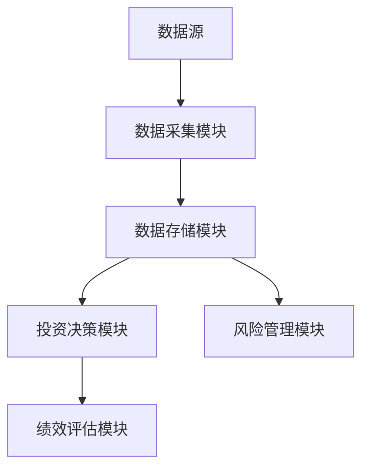
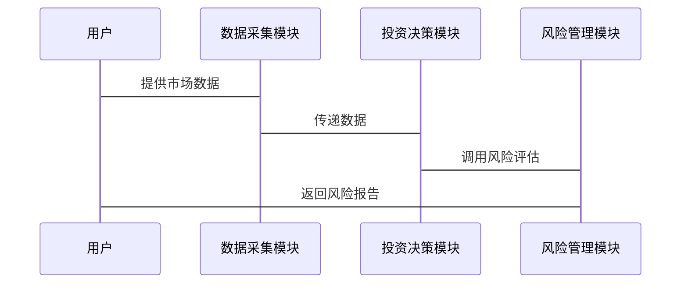

                 


```markdown
# 大学捐赠基金模式：长期机构投资者的标杆

> 关键词：大学捐赠基金、长期投资、机构投资者、资产配置、风险管理

> 摘要：大学捐赠基金作为长期机构投资者的典范，其运作模式和投资策略对机构投资者具有重要借鉴意义。本文将详细分析大学捐赠基金的背景、核心概念、算法原理、系统架构，并结合实际案例进行项目实战，最后总结最佳实践和未来发展趋势。

---

## 第一部分: 大学捐赠基金模式的背景与核心概念

### 第1章: 大学捐赠基金模式的起源与发展

#### 1.1 美国大学捐赠基金的起源
大学捐赠基金起源于美国，最早可以追溯到19世纪末。这些基金由校友、社会名流和企业捐赠构成，主要用于支持大学的运营和发展。

#### 1.2 捐赠基金的定义与基本特征
捐赠基金是通过捐赠形成的资金池，用于投资和管理，以支持大学的长期发展。其核心特征包括多样性、长期性和风险控制。

#### 1.3 美国大学捐赠基金的发展历程
从早期的单一捐赠到现在的多元化投资，美国大学捐赠基金经历了从本地投资到全球化的演变，形成了独特的运作模式。

---

### 第2章: 大学捐赠基金的运作模式

#### 2.1 捐赠基金的运作机制
捐赠基金通过多元化投资策略，实现资金的保值增值。其运作机制包括资金分配、投资决策和风险管理等环节。

#### 2.2 资金来源与分配
捐赠基金的资金来源包括校友捐赠、企业赞助等，分配过程需考虑大学的运营需求和投资目标。

#### 2.3 投资决策流程
投资决策遵循严格的流程，包括资产配置、风险评估和绩效监控，确保资金的稳健增长。

---

## 第二部分: 捐赠基金的核心概念与算法原理

### 第3章: 捐赠基金的核心概念

#### 3.1 资产配置策略
资产配置是捐赠基金投资的核心策略，包括股票、债券和另类资产的配置比例，动态调整以适应市场变化。

#### 3.2 风险管理与绩效评估
捐赠基金通过多元化投资和风险控制，实现稳健的绩效表现。风险调整后的收益是评估绩效的重要指标。

#### 3.3 现代投资组合理论
现代投资组合理论（MPT）是捐赠基金投资的重要理论基础，强调通过多元化投资降低风险，优化收益。

---

### 第4章: 算法原理

#### 4.1 现代投资组合理论的数学模型
现代投资组合理论通过优化投资组合的均值-方差，实现风险与收益的最佳平衡。

$$\text{目标函数：} \quad \min_w \sigma^2 \quad \text{subject to} \quad \mu^T w = \text{目标收益}$$

其中，\( w \) 是投资权重向量，\( \mu \) 是资产收益均值，\( \sigma^2 \) 是投资组合的方差。

#### 4.2 均值-方差优化算法
使用Python的优化库，实现均值-方差模型，选择最优资产配置。

```python
import numpy as np
from scipy.optimize import minimize

def portfolio_optimization(returns):
    n = len(returns.columns)
    mu = returns.mean().values
    sigma = returns.cov().values

    def objective(w):
        return np.dot(w.T, np.dot(sigma, w))

    constraints = [
        ('sum', w, 1),
        ('eq', np.dot(mu, w), 0.1)
    ]

    bounds = [(0, 1) for _ in range(n)]

    result = minimize(objective, np.ones(n)/n, method='SLSQP', bounds=bounds, constraints=constraints)
    return result.x

# 示例数据：returns为资产收益矩阵
```

#### 4.3 风险调整后的收益评估
使用夏普比率评估投资组合的超额收益风险比。

$$\text{夏普比率} = \frac{E[r_p - r_f]}{\sigma_p}$$

其中，\( E[r_p] \) 是投资组合的期望收益，\( r_f \) 是无风险利率，\( \sigma_p \) 是投资组合的波动率。

---

## 第三部分: 捐赠基金的系统架构与项目实战

### 第5章: 系统架构设计

#### 5.1 系统功能设计
捐赠基金管理系统包括数据采集、投资决策、风险管理三大模块。

#### 5.2 系统架构图


#### 5.3 系统接口设计
接口包括数据输入、投资策略调用和风险监控反馈。

#### 5.4 系统交互流程


---

### 第6章: 项目实战

#### 6.1 环境安装
安装Python、Pandas、NumPy等库，配置开发环境。

#### 6.2 核心代码实现
实现捐赠基金的资产配置和风险评估功能。

```python
import pandas as pd
import numpy as np

def main():
    # 示例数据
    returns = pd.DataFrame({
        '股票': [0.1, 0.05, 0.08, 0.02, 0.06],
        '债券': [0.05, 0.04, 0.03, 0.02, 0.01],
        '房地产': [0.08, 0.06, 0.07, 0.05, 0.04]
    })
    
    # 资产配置优化
    weights = portfolio_optimization(returns)
    print("最优资产权重:", weights)
    
    # 风险评估
    expected_return = np.dot(weights, returns.mean())
    volatility = np.sqrt(weights.dot(returns.cov()).dot(weights))
    sharpe_ratio = (expected_return - 0.02) / volatility  # 假设无风险利率为2%
    print("夏普比率:", sharpe_ratio)

if __name__ == "__main__":
    main()
```

#### 6.3 案例分析
通过具体案例，展示捐赠基金的资产配置和绩效评估过程。

---

## 第四部分: 最佳实践与未来展望

### 第7章: 最佳实践

#### 7.1 小结
大学捐赠基金模式通过长期投资、多元化配置和风险管理，成为机构投资者的标杆。

#### 7.2 注意事项
投资者需注意市场波动、政策变化和道德风险，确保投资稳健。

#### 7.3 拓展阅读
建议深入学习现代投资组合理论和风险管理技术，关注人工智能在投资中的应用。

---

### 第8章: 未来发展趋势

#### 8.1 数字化与智能化投资
人工智能和大数据技术将改变捐赠基金的运作方式，提升投资效率和精准度。

#### 8.2 可持续投资与ESG因素
环境、社会和治理（ESG）因素的重要性日益凸显，将成为捐赠基金的重要考量。

#### 8.3 全球化与本地化结合
捐赠基金将在全球化布局的基础上，更加注重本地市场的适应性，实现最优配置。

---

## 结语

大学捐赠基金模式以其长期视角、多元化策略和稳健管理，为机构投资者提供了宝贵的借鉴。随着技术进步和市场变化，捐赠基金将继续演变，成为投资领域的领导者。
```

