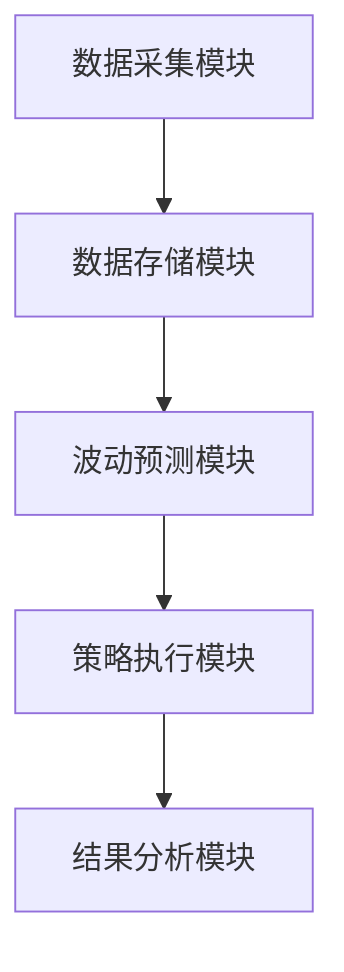

                 


# 如何利用特价股票策略应对市场剧烈波动

## 关键词：特价股票、市场波动、投资策略、算法原理、系统架构设计

## 摘要：本文详细探讨了如何利用特价股票策略应对市场波动，从背景分析、核心策略、算法原理、系统架构设计到项目实战，全面解析了特价股票策略在市场剧烈波动中的应用，帮助投资者在复杂市场环境中制定有效的投资策略。

---

## 第1章：特价股票策略概述

### 1.1 什么是特价股票

#### 1.1.1 特价股票的定义
特价股票是指在特定市场条件下，价格低于正常市场价的股票。这些股票通常由于市场波动、公司业绩不佳或其他外部因素导致价格被低估。

#### 1.1.2 特价股票的特点
- **低估值**：特价股票通常具有较低的市盈率或市净率。
- **高波动性**：价格波动较大，容易受到市场情绪影响。
- **周期性**：特价股票往往出现在市场低迷或特定行业周期性低谷时。

#### 1.1.3 特价股票的分类
- **周期性股票**：如能源、材料等行业的股票。
- **成长型股票**：具有高增长潜力的公司。
- **价值型股票**：被市场低估的传统行业公司。

### 1.2 市场波动与特价股票策略

#### 1.2.1 市场波动的定义
市场波动指股票价格在短时间内频繁波动，通常由市场情绪、经济数据或突发事件引发。

#### 1.2.2 市场波动对股票价格的影响
- **短期影响**：波动导致价格急剧上升或下降。
- **长期影响**：波动平息后，价格回归基本面。

#### 1.2.3 特价股票策略在市场波动中的作用
- **捕捉低估机会**：在市场下跌时，特价股票可能被低估，提供投资机会。
- **分散风险**：通过投资特价股票，降低整体投资组合的风险。

### 1.3 本书的目的与结构

#### 1.3.1 本书的目标
帮助投资者理解特价股票策略，并掌握在市场波动中应用这些策略的方法。

#### 1.3.2 本书的结构
- 第1章：特价股票策略概述。
- 第2章：市场波动的背景分析。
- 第3章：特价股票策略的核心概念。
- 第4章：算法原理与数学模型。
- 第5章：系统架构设计。
- 第6章：项目实战。
- 第7章：总结与展望。

---

## 第2章：市场波动的背景分析

### 2.1 市场波动的原因

#### 2.1.1 宏观经济因素
- **经济周期**：经济衰退或复苏影响市场波动。
- **通货膨胀**：通胀预期导致市场波动。

#### 2.1.2 行业因素
- **行业政策**：政府政策变化影响行业波动。
- **技术进步**：技术创新改变行业格局。

#### 2.1.3 公司内部因素
- **财务状况**：公司财务健康状况影响股价。
- **管理层决策**：管理层变动或决策影响市场信心。

### 2.2 市场波动对投资者的影响

#### 2.2.1 对个人投资者的影响
- **情绪影响**：市场波动可能导致投资者恐慌或贪婪。
- **投资决策**：波动影响投资者的买卖决策。

#### 2.2.2 对机构投资者的影响
- **资金流动**：机构资金的大规模流动加剧波动。
- **风险管理**：机构需制定严格的风控策略。

### 2.3 特价股票策略的背景

#### 2.3.1 特价股票策略的起源
特价股票策略起源于价值投资理念，强调寻找被市场低估的股票。

#### 2.3.2 特价股票策略的发展
随着市场波动加剧，特价股票策略逐渐成为投资者应对市场不确定性的重要工具。

---

## 第3章：特价股票策略的核心概念

### 3.1 特价股票策略的核心概念

#### 3.1.1 价值投资与市场波动
价值投资强调购买被市场低估的股票，市场波动为价值投资者提供了买入机会。

#### 3.1.2 技术分析与市场波动
技术分析通过价格走势预测未来波动，帮助投资者制定买卖策略。

#### 3.1.3 风险管理与特价股票策略
有效的风险管理是应对市场波动的关键，包括止损设置和仓位管理。

### 3.2 特价股票策略的实施步骤

#### 3.2.1 确定投资目标
明确投资目标，如追求稳定收益或高风险高回报。

#### 3.2.2 数据收集与分析
收集历史数据，分析股票价格波动和财务指标。

#### 3.2.3 策略制定与执行
制定买卖策略，并严格执行。

---

## 第4章：算法原理与数学模型

### 4.1 算法原理

#### 4.1.1 时间序列分析
使用ARIMA模型预测股票价格波动。

#### 4.1.2 回归分析
通过回归模型分析股票价格与市场波动的关系。

### 4.2 数学模型

#### 4.2.1 ARIMA模型
$$ARIMA(p, d, q)$$
其中，p为自回归阶数，d为差分阶数，q为移动平均阶数。

#### 4.2.2 回归模型
$$y = \beta_0 + \beta_1x + \epsilon$$
其中，y为因变量，x为自变量，$\epsilon$为误差项。

### 4.3 算法实现

#### 4.3.1 使用Python实现ARIMA模型
```python
from statsmodels.tsa.arima_model import ARIMA
import pandas as pd
import numpy as np

# 假设data是一个包含股票价格的数据框
model = ARIMA(data['price'], order=(5,1,0))
model_fit = model.fit()
```

---

## 第5章：系统架构设计

### 5.1 系统功能设计

#### 5.1.1 数据采集模块
负责采集股票价格数据。

#### 5.1.2 波动预测模块
利用算法预测市场波动。

#### 5.1.3 策略执行模块
根据预测结果执行买卖策略。

### 5.2 系统架构图


### 5.3 系统接口设计

#### 5.3.1 数据接口
API接口用于数据采集和传输。

#### 5.3.2 策略接口
API接口用于接收波动预测结果并执行策略。

---

## 第6章：项目实战

### 6.1 环境安装

#### 6.1.1 安装Python
安装Python 3.8及以上版本。

#### 6.1.2 安装依赖库
```bash
pip install pandas numpy statsmodels matplotlib
```

### 6.2 核心实现

#### 6.2.1 数据收集
使用Yahoo Finance API获取股票数据。

#### 6.2.2 波动预测
使用ARIMA模型预测波动。

#### 6.2.3 策略执行
根据预测结果执行买卖策略。

### 6.3 实际案例分析

#### 6.3.1 案例背景
假设投资于某科技公司股票，市场波动剧烈。

#### 6.3.2 数据分析
分析历史数据，识别特价股票机会。

#### 6.3.3 策略执行
根据模型预测结果，执行买入和卖出操作。

### 6.4 项目小结
通过项目实战，验证特价股票策略在应对市场波动中的有效性。

---

## 第7章：总结与展望

### 7.1 总结
本文详细探讨了如何利用特价股票策略应对市场波动，从理论到实践，全面解析了策略的应用。

### 7.2 未来展望
未来，随着人工智能和大数据技术的发展，特价股票策略将更加智能化和精准化。

### 7.3 注意事项
- **风险提示**：市场波动存在不确定性，投资需谨慎。
- **最佳实践**：结合多种策略，制定合理的投资计划。

---

## 关键词：特价股票、市场波动、投资策略、算法原理、系统架构设计

## 摘要：本文详细探讨了如何利用特价股票策略应对市场波动，从背景分析、核心策略、算法原理、系统架构设计到项目实战，全面解析了特价股票策略在市场剧烈波动中的应用，帮助投资者在复杂市场环境中制定有效的投资策略。

