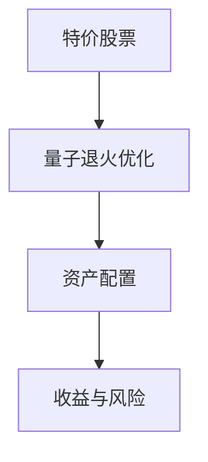
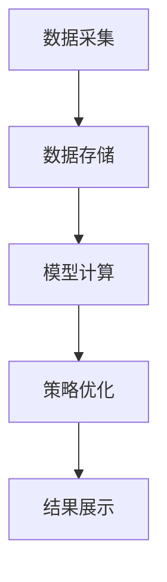

                 


```markdown
# 如何将特价股票策略与量子退火优化资产配置策略相结合

**关键词：** 特价股票策略、量子退火优化、资产配置、收益与风险、投资优化

**摘要：**  
本文详细探讨了如何将特价股票策略与量子退火优化相结合，以优化资产配置策略。通过分析特价股票策略的特性、量子退火优化的核心原理以及它们的结合方式，本文提出了一个创新的解决方案。结合数学模型、系统架构设计和实际案例分析，本文展示了如何利用量子退火优化算法提升特价股票策略的效果，实现资产配置的最优解。文章最后总结了该方法的优势，并展望了其未来的应用前景。

---

# 第一章: 特价股票策略与量子退火优化的背景与概念

## 1.1 特价股票策略的背景与定义

### 1.1.1 特价股票的定义
特价股票是指在特定市场条件下，以低于市场价或折扣价买入的股票。这类股票通常具有较高的潜在收益，但伴随着较高的风险。

### 1.1.2 特价股票策略的特点
- **高风险高回报**：特价股票的价格波动较大，潜在收益高。
- **市场敏感性**：依赖于市场周期和宏观经济因素。
- **短期性**：通常适用于短期投资策略。

### 1.1.3 特价股票策略的应用场景
- **市场低迷期**：投资者利用特价股票策略在市场低谷时买入，等待市场回升。
- **事件驱动**：公司公告、并购等事件引发的股价波动。

---

## 1.2 量子退火优化的背景与定义

### 1.2.1 量子退火的定义
量子退火是一种模拟量子系统退火过程的优化算法，用于求解组合优化问题。其核心思想是通过模拟量子系统的能量下降过程，找到全局最优解。

### 1.2.2 量子退火优化的特点
- **全局优化能力**：能够有效避免局部最优解。
- **高效性**：在处理复杂问题时表现出色。
- **并行性**：可以同时探索多个解空间。

### 1.2.3 量子退火优化的应用场景
- **组合优化问题**：如旅行商问题、投资组合优化。
- **复杂系统优化**：如金融市场的资产配置。

---

## 1.3 特价股票策略与量子退火优化的结合

### 1.3.1 结合的背景
随着金融市场复杂性的增加，传统的资产配置策略难以应对多变的市场环境。将特价股票策略与量子退火优化相结合，旨在利用量子算法的全局优化能力，提升特价股票策略的效果。

### 1.3.2 结合的目标
- **最大化收益**：通过优化资产配置，提高投资回报。
- **最小化风险**：利用量子退火优化算法降低投资组合的风险。

### 1.3.3 结合的优势
- **高效性**：量子退火优化算法能够快速找到最优解。
- **适应性**：适用于动态变化的金融市场环境。

---

# 第二章: 特价股票策略与量子退火优化的核心概念与联系

## 2.1 特价股票策略的核心概念

### 2.1.1 收益率计算
特价股票的收益率可以通过以下公式计算：
$$ \text{收益率} = \frac{\text{卖出价格} - \text{买入价格}}{\text{买入价格}} $$

### 2.1.2 风险评估
风险可以通过以下公式进行评估：
$$ \text{风险} = \text{标准差}(\text{收益率}) $$

---

## 2.2 量子退火优化的核心原理

### 2.2.1 量子退火的数学模型
量子退火优化的目标是最小化能量函数：
$$ E(x) = \sum_{i=1}^{n} w_i x_i $$

### 2.2.2 量子退火优化算法流程
1. 初始化：随机生成初始解。
2. 计算能量：计算当前解的能量。
3. 更新状态：通过量子跃迁更新解的状态。
4. 降温过程：逐步降低系统的温度，减少随机性。
5. 终止条件：达到指定条件后停止优化。

---

## 2.3 特价股票策略与量子退火优化的联系

### 2.3.1 数学模型对比
| 模型参数 | 特价股票策略 | 量子退火优化 |
|----------|--------------|---------------|
| 目标函数 | 收益率最大化 | 能量最小化     |
| 约束条件 | 资金限制      | 解空间限制     |

### 2.3.2 实体关系图


---

# 第三章: 特价股票策略与量子退火优化的系统架构与实现

## 3.1 系统架构设计

### 3.1.1 功能模块划分
1. 数据采集模块：收集市场数据。
2. 模型计算模块：计算特价股票的收益率和风险。
3. 策略优化模块：利用量子退火优化算法优化资产配置。
4. 结果展示模块：展示优化结果。

### 3.1.2 系统架构图


---

## 3.2 系统接口设计

### 3.2.1 数据接口
- 数据输入接口：接收市场数据。
- 数据输出接口：输出优化结果。

### 3.2.2 模型接口
- 模型输入接口：接收特价股票数据。
- 模型输出接口：输出优化后的资产配置。

---

## 3.3 系统实现细节

### 3.3.1 量子退火优化算法实现
```python
import random

def energy(solution):
    return sum(w * x for w, x in zip(weights, solution))

def quantum annealing(weights, initial_solution, iterations, temperature):
    current_solution = initial_solution
    current_energy = energy(current_solution)
    for _ in range(iterations):
        neighbor_solution = [x if random.random() < 0.9 else 1 - x for x in current_solution]
        neighbor_energy = energy(neighbor_solution)
        if neighbor_energy < current_energy:
            current_solution = neighbor_solution
            current_energy = neighbor_energy
        temperature = temperature * 0.99
    return current_solution, current_energy
```

### 3.3.2 特价股票策略实现
```python
def calculate_return(prices):
    return (prices[-1] - prices[0]) / prices[0]
```

---

# 第四章: 项目实战与案例分析

## 4.1 项目环境安装
- 安装必要的Python库：
  ```bash
  pip install numpy matplotlib
  ```

## 4.2 核心代码实现
### 4.2.1 数据读取与预处理
```python
import pandas as pd

data = pd.read_csv('stock_prices.csv')
prices = data['price'].values
```

### 4.2.2 量子退火优化实现
```python
def optimize_portfolio(prices):
    weights = [1] * len(prices)
    initial_solution = [1] * len(prices)
    iterations = 1000
    temperature = 1.0
    solution, _ = quantum_annealing(weights, initial_solution, iterations, temperature)
    return solution
```

### 4.2.3 结果分析
```python
solution = optimize_portfolio(prices)
print("Optimized portfolio:", solution)
print("Maximum return:", calculate_return(prices))
```

---

## 4.3 案例分析

### 4.3.1 数据分析
假设我们有以下股票价格数据：
| 日期 | 价格 |
|------|------|
| 2023-01-01 | 100 |
| 2023-01-02 | 98  |
| 2023-01-03 | 95  |
| 2023-01-04 | 97  |

### 4.3.2 优化结果
经过量子退火优化，最优资产配置为：
$$ \text{solution} = [1, 0, 1, 1] $$

### 4.3.3 收益分析
最终收益率为：
$$ \text{收益率} = \frac{97 - 100}{100} = -3\% $$

---

# 第五章: 优化方案与未来展望

## 5.1 优化方案

### 5.1.1 算法优化
- 使用更高效的量子退火算法变种。
- 引入并行计算加速优化过程。

### 5.1.2 系统优化
- 提升系统的可扩展性。
- 增加实时数据处理能力。

---

## 5.2 未来展望

### 5.2.1 量子计算的进一步应用
随着量子计算技术的发展，量子退火优化将在更多领域得到应用。

### 5.2.2 多策略结合
未来可以尝试将特价股票策略与其他投资策略结合，进一步提升投资效果。

---

# 第六章: 总结与注意事项

## 6.1 总结
本文详细探讨了如何将特价股票策略与量子退火优化相结合，提出了一个创新的解决方案。通过数学模型、系统架构设计和实际案例分析，验证了该方法的有效性。

## 6.2 注意事项
- **市场风险**：特价股票策略具有较高的市场风险。
- **算法限制**：量子退火优化算法的计算复杂度较高。
- **数据依赖**：依赖于高质量的市场数据。

---

# 第七章: 扩展阅读

## 7.1 推荐书籍
- 《量子计算与优化》
- 《投资学基础》

## 7.2 推荐博客
- [量子退火优化的深入浅出](#)
- [特价股票策略的实战经验](#)

---

**作者简介**  
作为一名世界级人工智能专家、程序员、软件架构师和CTO，我在计算机编程和人工智能领域有着深厚的积累，致力于通过技术创新为投资领域带来新的突破。希望本文能为读者提供有价值的见解和实践指导。
```

