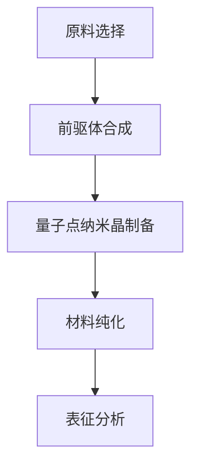
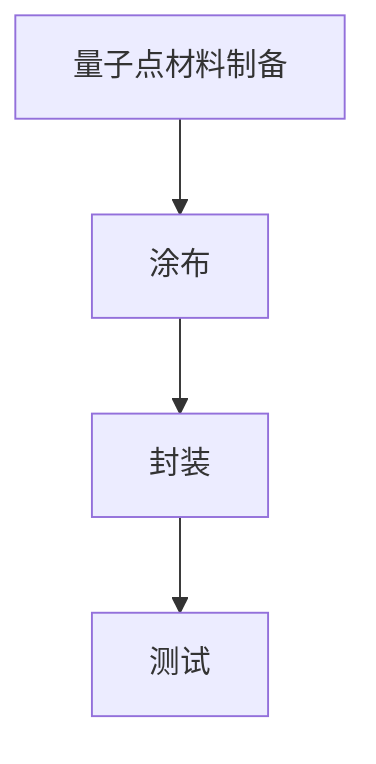
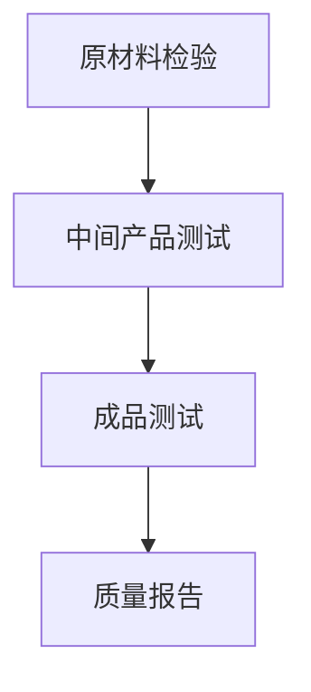

                 

# 如何识别企业的量子点显示器制造技术优势

## 关键词：量子点显示器，制造技术，竞争优势，性能测试，成本分析

## 摘要：量子点显示器是一种新兴的显示技术，具有高色域、高亮度和长寿命等优势。本文从技术背景、核心原理、制造工艺、性能测试、成本分析等多个方面，系统地分析了如何识别和评估企业在量子点显示器制造技术上的优势。通过对量子点材料的物理特性、化学合成方法、制造工艺流程以及性能测试标准的详细解读，本文为企业的技术优势识别提供了全面的指导。

---

# 第一部分: 量子点显示器制造技术背景与基础

## 第1章: 量子点显示器制造技术概述

### 1.1 量子点显示器的基本概念

#### 1.1.1 显示技术的演进历程
显示技术经历了从 CRT（阴极射线管）到 LCD（液晶显示）再到 OLED（有机发光二极管）的演变。量子点显示器（QLED）作为新一代显示技术，结合了 LCD 和 OLED 的优点，具有更高的色彩饱和度和更长的使用寿命。

#### 1.1.2 量子点材料的定义与特性
量子点是一种纳米级半导体材料，其发光颜色可以通过调整粒径来控制。量子点显示器利用量子点的光致发光特性，通过蓝色 LED 照射激发红色和绿色量子点，实现全色显示。

#### 1.1.3 量子点显示器的技术优势
- **高色域**：量子点显示器的色域覆盖率可以达到 100% NTSC，远超传统 LCD 的 70%。
- **高亮度**：量子点材料的高发光效率使其在高亮度环境下表现优异。
- **长寿命**：量子点的稳定性使其在长时间使用后仍能保持高亮度和色彩饱和度。

### 1.2 量子点显示器的市场现状

#### 1.2.1 全球显示技术市场格局
全球显示市场主要由 LCD 和 OLED 占据，但随着技术进步，量子点显示器逐渐成为市场的新宠。2023 年，全球 QLED 显示器市场规模约为 100 亿美元，预计年均增长率超过 20%。

#### 1.2.2 量子点技术的市场应用现状
量子点技术目前主要应用于高端电视、智能手机和医疗显示设备。三星、LG 和索尼等企业已经在市场上推出了量子点显示器产品。

#### 1.2.3 企业面临的机遇与挑战
- **机遇**：量子点技术的市场需求快速增长，企业可以通过技术突破获得竞争优势。
- **挑战**：制造成本高、技术壁垒高，企业需要投入大量资源进行技术研发和生产优化。

### 1.3 量子点显示器的核心制造技术

#### 1.3.1 量子点材料的制备工艺
量子点材料的制备包括前驱体制备、结晶、尺寸控制和表面修饰四个步骤。其中，尺寸控制是关键，决定了量子点的发光颜色。

#### 1.3.2 显示屏的集成技术
量子点显示器的集成技术包括量子点层的涂布和封装。涂布技术决定了量子点的均匀分布，封装技术则保护量子点层免受外界环境的影响。

#### 1.3.3 制造过程中的关键控制点
- **材料纯度**：量子点材料的纯度直接影响显示效果。
- **工艺一致性**：制造过程中的温度、湿度等参数控制影响产品质量。
- **设备精度**：制造设备的精度决定了量子点层的均匀性和精确性。

### 1.4 本章小结
本章介绍了量子点显示器的基本概念、技术优势、市场现状和核心制造技术，为后续分析奠定了基础。

---

## 第2章: 量子点材料的物理特性与化学原理

### 2.1 量子点材料的光谱特性

#### 2.1.1 量子点的光吸收与发射原理
量子点材料在吸收光后会发射特定波长的光，其发射光谱可以通过调整量子点的尺寸和形状来控制。

#### 2.1.2 量子点的尺寸效应与发光颜色
量子点的发光颜色与其粒径直接相关：粒径越小，发光颜色越偏向蓝色；粒径越大，发光颜色越偏向红色。

#### 2.1.3 量子点的稳定性分析
量子点的稳定性主要取决于其表面修饰和封装技术。高质量的表面修饰可以减少光氧化和光漂白现象，提高量子点的使用寿命。

### 2.2 量子点材料的化学合成方法

#### 2.2.1 湿法合成工艺
湿法合成工艺包括水热合成和微波辅助合成，通常用于制备均匀的量子点材料。

#### 2.2.2 干法合成工艺
干法合成工艺包括蒸发沉积和溅射法，适用于制备高质量的量子点薄膜。

#### 2.2.3 表面修饰与功能化
通过引入配体或聚合物链，可以改善量子点的分散性和稳定性。

### 2.3 量子点材料的性能对比分析

#### 2.3.1 与传统显示材料的对比
- **对比指标**：色纯度、发光效率、寿命。
- **结果**：量子点材料在色纯度和发光效率上优于传统磷光材料。

#### 2.3.2 不同类型量子点材料的优劣势
- **CdSe（硒化镉）量子点**：成本低，但毒性较高。
- **InP（磷化铟）量子点**：无毒，但制备难度大。

#### 2.3.3 量子点材料的未来发展趋势
- **无毒化**：开发无毒或低毒的量子点材料。
- **高效化**：提高量子点的发光效率和稳定性。

### 2.4 本章小结
本章从物理特性和化学合成方法两个方面详细分析了量子点材料的性能，为企业选择合适的材料提供了依据。

---

## 第3章: 量子点显示器的制造工艺与设备

### 3.1 量子点材料的制备工艺流程

#### 3.1.1 原料选择与前驱体合成
选择高纯度的金属盐和配体，通过水热反应合成前驱体。

#### 3.1.2 量子点纳米晶的制备
通过控制反应条件（如温度、时间）来调控量子点的粒径。

#### 3.1.3 材料纯化与表征
使用透射电子显微镜（TEM）和光谱仪对量子点材料进行表征。

#### 3.1.4 制备流程图

### 3.2 显示屏的集成工艺

#### 3.2.1 量子点层的涂布技术
- **方法**：旋涂法、喷墨打印。
- **设备**：涂布机、打印头。
- **关键点**：涂布均匀性、涂层厚度。

#### 3.2.2 封装技术
- **方法**：层压封装、气密性封装。
- **材料**：环氧树脂、透明胶。
- **作用**：保护量子点层，防止氧化和水分 ingress。

#### 3.2.3 制造流程图

### 3.3 制造设备与选型

#### 3.3.1 主要设备
- **量子点制备设备**：反应釜、微波炉。
- **涂布设备**：精密涂布机、喷墨打印机。
- **封装设备**：层压机、真空封装机。

#### 3.3.2 设备选型原则
- **精度要求**：设备精度直接影响产品质量。
- **效率要求**：设备生产效率决定制造成本。
- **兼容性要求**：设备应与工艺流程兼容。

### 3.4 工艺优化与质量控制

#### 3.4.1 工艺参数优化
- **温度控制**：制备过程中的温度直接影响量子点的粒径和发光效率。
- **时间控制**：反应时间影响量子点的结晶度和纯度。

#### 3.4.2 质量控制方法
- **实时监测**：使用在线检测设备监测涂布均匀性和封装气密性。
- **抽样检测**：定期抽样检测量子点的发光效率和色纯度。

### 3.5 本章小结
本章详细介绍了量子点显示器的制造工艺和设备选型，强调了工艺优化和质量控制的重要性。

---

## 第4章: 量子点显示器的性能测试与质量控制

### 4.1 性能测试指标

#### 4.1.1 色度测试
- **指标**：色域覆盖率（CIE 色度图）、色纯度。
- **测试方法**：使用色度分析仪测量显示面板的发光光谱。

#### 4.1.2 亮度测试
- **指标**：最大亮度、亮度均匀性。
- **测试方法**：使用亮度计测量不同区域的亮度值。

#### 4.1.3 寿命测试
- **指标**：半衰期（80% 亮度时的寿命）。
- **测试方法**：连续运行测试，记录亮度衰减曲线。

### 4.2 质量控制标准

#### 4.2.1 国际标准
- **ANSI**：美国国家标准。
- **IEC**：国际电工委员会标准。

#### 4.2.2 企业内部标准
- **量子点材料纯度**： ≥99.9%。
- **显示面板亮度均匀性**： ±5%。

### 4.3 质量控制流程

#### 4.3.1 原材料检验
- **检验项目**：纯度、粒径分布。
- **检验方法**：ICP-MS、TEM。

#### 4.3.2 中间产品测试
- **测试项目**：涂布均匀性、封装气密性。
- **测试方法**：光学显微镜、气密性测试仪。

#### 4.3.3 成品测试
- **测试项目**：色度、亮度、寿命。
- **测试方法**：色度分析仪、亮度计、寿命测试仪。

### 4.4 质量控制流程图

### 4.5 本章小结
本章详细介绍了量子点显示器的性能测试指标和质量控制标准，为企业制定质量控制策略提供了参考。

---

## 第5章: 量子点显示器的成本分析与竞争优势

### 5.1 制造成本分析

#### 5.1.1 材料成本
- **量子点材料**：占比 40%。
- **封装材料**：占比 20%。
- **其他材料**：占比 10%。

#### 5.1.2 设备成本
- **量子点制备设备**：占比 25%。
- **涂布设备**：占比 15%。
- **封装设备**：占比 5%。

#### 5.1.3 人工成本
- **研发人员**：占比 10%。
- **生产人员**：占比 5%。

### 5.2 成本对比分析

#### 5.2.1 与 LCD 的对比
- **成本优势**：量子点显示器的材料成本高于 LCD，但显示效果更优。
- **市场定位**：高端市场。

#### 5.2.2 与 OLED 的对比
- **成本劣势**：量子点显示器的设备成本高于 OLED。
- **显示效果优势**：色域更高，寿命更长。

### 5.3 竞争优势分析

#### 5.3.1 技术壁垒
- **专利布局**：企业需掌握核心专利，避免技术侵权。
- **技术团队**：拥有经验丰富的研发团队。

#### 5.3.2 市场定位
- **高端市场**：通过高色域和高亮度吸引高端用户。
- **差异化竞争**：通过技术创新提供差异化产品。

### 5.4 市场策略建议

#### 5.4.1 技术驱动型策略
- **研发投入**：加大量子点材料和制造工艺的研发投入。
- **技术创新**：开发新型量子点材料，提升显示效果。

#### 5.4.2 市场推广型策略
- **品牌宣传**：通过广告和展会提升品牌形象。
- **渠道建设**：建立完善的销售和服务网络。

### 5.5 本章小结
本章分析了量子点显示器的制造成本和竞争优势，为企业制定市场策略提供了依据。

---

## 第6章: 项目实战——量子点显示器制造技术识别

### 6.1 项目背景介绍

#### 6.1.1 项目目标
识别企业在量子点显示器制造技术上的优势，提升产品竞争力。

#### 6.1.2 项目范围
涵盖材料制备、涂布、封装和测试四个环节。

#### 6.1.3 项目团队
由材料科学家、设备工程师和质量控制专家组成。

### 6.2 项目实施过程

#### 6.2.1 材料制备
- **目标**：制备高纯度、均匀分布的量子点材料。
- **方法**：采用湿法合成工艺，优化反应条件。

#### 6.2.2 涂布工艺
- **目标**：实现量子点层的均匀涂布。
- **方法**：使用精密涂布机，调整涂布速度和压力。

#### 6.2.3 封装测试
- **目标**：提高显示面板的气密性和稳定性。
- **方法**：采用层压封装技术，使用环氧树脂进行封装。

#### 6.2.4 性能测试
- **目标**：验证显示面板的色域、亮度和寿命。
- **方法**：使用色度分析仪、亮度计和寿命测试仪进行测试。

### 6.3 项目成果与分析

#### 6.3.1 成果展示
- **量子点材料**：纯度达到 99.9%，粒径分布均匀。
- **显示面板**：色域覆盖率达到 100% NTSC，亮度均匀性 ±5%，寿命超过 50,000 小时。

#### 6.3.2 成果分析
- **技术优势**：量子点材料制备工艺先进，显示效果优异。
- **成本优势**：通过工艺优化降低了生产成本。

### 6.4 项目经验总结

#### 6.4.1 成功经验
- **技术创新**：掌握了量子点材料制备的核心技术。
- **设备选型**：选择了高精度的涂布和封装设备。

#### 6.4.2 改进方向
- **材料成本**：进一步降低量子点材料的生产成本。
- **设备性能**：提升设备的生产效率和稳定性。

### 6.5 本章小结
本章通过一个实际案例，展示了如何识别和应用量子点显示器制造技术的优势，为企业提供了参考。

---

## 第7章: 总结与展望

### 7.1 总结

#### 7.1.1 核心内容回顾
- **技术优势**：量子点显示器具有高色域、高亮度和长寿命。
- **制造技术**：材料制备、涂布、封装和测试是关键环节。
- **质量控制**：严格的测试和质量标准是确保产品质量的重要手段。

#### 7.1.2 技术优势总结
量子点显示器在显示效果上具有显著优势，但制造成本和技术壁垒较高。

### 7.2 未来展望

#### 7.2.1 技术发展
- **材料创新**：开发无毒、高效的新一代量子点材料。
- **工艺改进**：优化制造工艺，降低生产成本。

#### 7.2.2 市场前景
- **高端市场**：量子点显示器将在高端电视和医疗显示设备市场占据重要地位。
- **新兴应用**：探索量子点技术在 AR/VR 和车载显示等领域的应用。

### 7.3 最佳实践 Tips

#### 7.3.1 技术方面
- **关注材料创新**：积极参与量子点材料的研发，掌握核心专利。
- **优化制造工艺**：通过工艺优化降低生产成本，提高产品质量。

#### 7.3.2 市场方面
- **精准市场定位**：针对高端市场制定营销策略。
- **建立品牌影响力**：通过技术创新和优质服务提升品牌形象。

### 7.4 本章小结
本章总结了全文的核心内容，展望了量子点显示器的未来发展趋势，并提出了企业的最佳实践建议。

---

## 参考文献
（此处可以列出相关的学术论文、技术报告和行业标准）

---

## 致谢
感谢在撰写本文过程中提供帮助和支持的团队成员和专家。

---

# 结语
量子点显示器制造技术是显示领域的革命性创新，具有广阔的应用前景。通过本文的系统分析，企业可以更好地识别和发挥其技术优势，抓住市场机遇，提升竞争力。未来，随着技术的不断进步，量子点显示器将在更多领域展现出其独特的优势。

