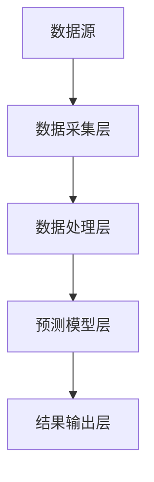
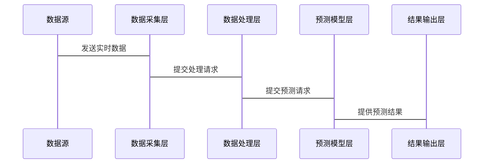

                 


# 实时数据分析与预测

## 关键词：实时数据分析，预测模型，机器学习，流数据处理，系统架构

## 摘要：实时数据分析与预测是当前技术领域的重要研究方向，涉及数据采集、处理、建模和系统设计等多个方面。本文从背景出发，详细探讨了实时数据分析的核心概念、处理技术、预测算法、系统架构，并通过实际案例展示了如何在金融、医疗等领域应用这些技术。文章最后总结了最佳实践和未来发展方向。

---

# 第一部分: 实时数据分析与预测的背景与概述

## 第1章: 实时数据分析与预测的背景

### 1.1 问题背景与重要性

#### 1.1.1 数据实时处理的需求背景
在当今快节奏的商业环境中，实时数据分析的需求日益增长。企业需要快速响应市场变化、优化运营策略，而这些都需要依赖实时数据的处理和预测。例如，金融机构需要实时监控市场动态，及时调整投资策略；医疗行业需要实时监测患者数据，预防疾病爆发。

#### 1.1.2 实时数据分析的核心价值
实时数据分析能够帮助企业在关键时刻做出决策，避免因数据滞后导致的损失。通过实时数据，企业可以快速发现潜在问题，优化资源配置，提升效率。例如，电子商务平台可以通过实时数据分析，动态调整促销策略，提高转化率。

#### 1.1.3 实时预测在决策中的作用
实时预测能够提供前瞻性的见解，帮助企业在未来可能发生的问题上做好准备。例如，预测模型可以预估未来一段时间内的销售趋势，帮助企业提前安排生产和库存管理。

### 1.2 问题描述与目标

#### 1.2.1 实时数据分析的基本问题
实时数据分析的核心问题是如何高效地处理不断流的数据，并快速生成有意义的洞察。这涉及到数据的采集、存储、处理和分析等多个环节。

#### 1.2.2 预测模型的目标与边界
预测模型的目标是基于历史数据，预测未来某一时间点的事件或趋势。其边界包括数据的实时性、模型的准确性和计算的复杂性。

#### 1.2.3 业务场景中的实时数据需求
在实际业务场景中，实时数据需求往往具有多样性。例如，在交通管理中，实时数据分析可以帮助优化交通流量；在社交媒体中，实时数据分析可以识别趋势和热点。

### 1.3 问题解决思路

#### 1.3.1 数据实时处理的技术路径
实时数据处理的技术路径包括数据采集、预处理、存储、分析和可视化。每个环节都需要高效处理，以确保实时性。

#### 1.3.2 预测模型的设计原则
预测模型的设计需要考虑数据特征、模型复杂度和计算效率。选择合适的算法和优化参数是关键。

#### 1.3.3 系统架构的核心要素
系统架构的核心要素包括数据源、数据处理层、预测模型层和结果输出层。各层之间需要高效协作，确保数据流的实时处理。

---

## 第2章: 实时数据分析与预测的核心概念

### 2.1 核心概念与定义

#### 2.1.1 实时数据的定义
实时数据是指在生成后立即被处理和分析的数据。与批量处理不同，实时数据处理需要在数据生成的同时进行。

#### 2.1.2 数据分析的基本概念
数据分析是指通过对数据进行整理、计算和解释，提取有用信息的过程。实时数据分析强调快速性和及时性。

#### 2.1.3 数据预测的数学模型
数据预测是基于历史数据建立数学模型，预测未来趋势的过程。常用的模型包括线性回归、随机森林等。

### 2.2 核心概念的联系与对比

#### 2.2.1 数据采集、处理与预测的关系
数据采集是实时数据分析的起点，处理是关键，预测是最终目标。三者相辅相成，缺一不可。

#### 2.2.2 不同数据处理技术的对比
| 技术 | 特点 | 优缺点 |
|------|------|--------|
| 批处理 | 数据量大，处理时间长 | 成本低，适合离线分析 |
| 流处理 | 实时性强，处理速度快 | 成本高，技术复杂 |

#### 2.2.3 预测模型的分类与特点
| 分类 | 特点 | 适用场景 |
|------|------|----------|
| 监督学习 | 基于标签数据 | 分类、回归 |
| 无监督学习 | 基于特征相似性 | 聚类、降维 |

### 2.3 实体关系与架构图



---

# 第二部分: 实时数据分析的基础技术

## 第3章: 数据采集与预处理

### 3.1 数据采集技术

#### 3.1.1 数据采集的常见方法
数据采集可以通过API接口、数据库查询、网络抓取等方式进行。每种方法都有其优缺点，需根据具体场景选择。

#### 3.1.2 实时数据采集的挑战
实时数据采集需要考虑数据的实时性、可靠性和稳定性。数据源的不稳定性和网络延迟是常见的挑战。

#### 3.1.3 常用工具与框架
常用的工具包括Flume、Kafka、Storm等。这些工具提供了高效的数据采集和处理能力。

### 3.2 数据预处理与清洗

#### 3.2.1 数据清洗的基本步骤
数据清洗包括去除重复数据、处理缺失值、标准化数据等步骤。这些步骤是确保数据质量的关键。

#### 3.2.2 数据标准化与归一化
数据标准化（z-score）和归一化（min-max）是常用的预处理方法。选择哪种方法取决于具体场景和数据分布。

#### 3.2.3 异常数据的处理方法
异常数据可能是由于传感器故障或网络错误引起的。常用处理方法包括移除异常值、数据平滑等。

### 3.3 数据存储与管理

#### 3.3.1 实时数据存储的选择
实时数据存储可以选择内存数据库（如Redis）或实时数据库（如InfluxDB）。选择取决于数据的实时性和访问频率。

#### 3.3.2 数据库设计原则
数据库设计需遵循规范化原则，避免数据冗余。索引设计是优化查询性能的关键。

#### 3.3.3 数据索引与查询优化
使用适当的索引可以显著提高查询效率。常用索引类型包括B树索引、哈希索引等。

---

## 第4章: 流数据处理技术

### 4.1 流数据处理框架

#### 4.1.1 Apache Kafka
Kafka是一种高吞吐量的分布式流处理平台。它支持实时数据发布和订阅，广泛应用于实时数据分析。

#### 4.1.2 Apache Flink
Flink是基于流数据模型的分布式流处理框架。它支持事件时间处理和窗口操作，适合实时数据分析。

#### 4.1.3 Apache Spark Streaming
Spark Streaming是基于Spark核心的流数据处理框架。它支持微批处理，适合实时数据分析和机器学习。

### 4.2 流数据处理的算法

#### 4.2.1 基于滑动窗口的处理
滑动窗口是一种常用的数据处理技术。通过设置合适的时间窗口，可以实时计算窗口内的统计信息。

#### 4.2.2 基于流数据的机器学习
实时机器学习需要在数据流上动态更新模型。这需要算法支持在线学习和增量训练。

### 4.3 流数据处理的优化

#### 4.3.1 并行处理与资源分配
通过并行处理可以提高数据处理效率。资源分配需根据数据量和计算任务进行动态调整。

#### 4.3.2 数据压缩与序列化
数据压缩可以减少存储空间和传输带宽。序列化是将数据结构化为二进制流的关键步骤。

---

# 第三部分: 机器学习与预测模型

## 第5章: 机器学习算法

### 5.1 监督学习算法

#### 5.1.1 线性回归
线性回归用于预测连续型变量。其数学模型为：
$$ y = \beta_0 + \beta_1 x_1 + \beta_2 x_2 + ... + \beta_n x_n $$

#### 5.1.2 支持向量机
支持向量机用于分类和回归问题。其核心思想是通过找到超平面将数据分为两类。

#### 5.1.3 随机森林
随机森林是一种基于决策树的集成算法。它通过随机采样和特征选择提高模型的泛化能力。

### 5.2 无监督学习算法

#### 5.2.1 K均值聚类
K均值聚类用于将数据划分为K个簇。其目标是最小化簇内平方误差之和。

#### 5.2.2 主成分分析
主成分分析用于降维，提取数据的主要特征。其数学模型为：
$$ Y = X \cdot P $$

### 5.3 时间序列分析

#### 5.3.1 ARIMA模型
ARIMA模型用于时间序列预测。其核心是通过自回归和移动平均来建模时间序列。

#### 5.3.2 LSTM网络
LSTM是一种深度学习模型，特别适合处理长序列数据。其结构包括输入门、遗忘门和输出门。

### 5.4 算法实现与优化

#### 5.4.1 算法实现步骤
1. 数据预处理：清洗、归一化
2. 模型训练：选择算法，调整参数
3. 模型评估：计算准确率、召回率等指标
4. 模型部署：集成到系统中，实时预测

#### 5.4.2 算法优化技巧
- 参数调优：使用网格搜索或随机搜索
- 特征选择：使用特征重要性评估
- 模型集成：使用投票法或加权法

---

## 第6章: 预测模型的数学模型

### 6.1 监督学习的数学模型

#### 6.1.1 线性回归的数学推导
$$ \hat{y} = \theta^T x + \theta_0 $$
其中，θ是模型参数，x是输入特征，θ_0是截距项。

#### 6.1.2 逻辑回归的数学推导
$$ P(y=1|x) = \frac{1}{1 + e^{-\theta^T x}} $$

### 6.2 无监督学习的数学模型

#### 6.2.1 K均值聚类的数学推导
目标函数：
$$ \sum_{i=1}^k \sum_{j=1}^n ||x_j - c_i||^2 $$
其中，c_i是第i个簇的中心，x_j是数据点。

#### 6.2.2 主成分分析的数学推导
协方差矩阵：
$$ \Sigma = \frac{1}{n-1} \sum_{i=1}^n (x_i - \bar{x})(x_i - \bar{x})^T $$

---

# 第四部分: 实时数据预测的系统架构

## 第7章: 系统设计

### 7.1 问题场景介绍

#### 7.1.1 项目背景
实时数据分析与预测系统用于实时监控和预测业务指标，如销售、流量等。

#### 7.1.2 项目目标
建立一个高效的实时数据分析与预测系统，能够快速响应数据变化，提供准确的预测结果。

### 7.2 系统功能设计

#### 7.2.1 数据采集模块
负责采集实时数据，包括数据清洗和预处理。

#### 7.2.2 数据处理模块
负责将数据转化为可分析的形式，如时间序列数据。

#### 7.2.3 预测模块
基于处理后的数据，运行预测模型，生成预测结果。

### 7.3 系统架构设计

#### 7.3.1 分层架构
系统分为数据采集层、数据处理层、预测模型层和结果输出层。

#### 7.3.2 微服务架构
采用微服务架构，各服务独立运行，便于扩展和维护。

### 7.4 系统接口设计

#### 7.4.1 数据采集接口
定义API接口，接收实时数据。

#### 7.4.2 预测结果接口
提供预测结果的API，供前端或下游系统调用。

### 7.5 系统交互流程



---

## 第8章: 系统架构图


---

# 第五部分: 项目实战

## 第9章: 实时数据分析与预测的实现

### 9.1 环境搭建

#### 9.1.1 安装Python
安装Python 3.8及以上版本，确保环境支持数据处理和机器学习库。

#### 9.1.2 安装依赖库
安装numpy、pandas、scikit-learn、kafka-python等库。

### 9.2 核心实现

#### 9.2.1 数据采集模块
使用Kafka接收实时数据，代码如下：

```python
from kafka import KafkaConsumer

consumer = KafkaConsumer('realtime-topic', bootstrap_servers='localhost:9092')
for message in consumer:
    data = message.value
    # 处理数据
```

#### 9.2.2 数据处理模块
对数据进行清洗和预处理，代码如下：

```python
import pandas as pd

data = pd.DataFrame(数据)
data_cleaned = data.dropna()
```

#### 9.2.3 预测模块
使用训练好的模型进行预测，代码如下：

```python
from sklearn.linear_model import LinearRegression

model = LinearRegression()
predictions = model.predict(X_test)
```

### 9.3 代码应用解读与分析

#### 9.3.1 数据采集代码解读
KafkaConsumer用于订阅实时数据主题，接收数据后进行处理。

#### 9.3.2 数据处理代码解读
使用pandas进行数据清洗，去除缺失值，确保数据质量。

#### 9.3.3 预测代码解读
使用线性回归模型进行预测，生成预测结果。

### 9.4 实际案例分析

#### 9.4.1 案例背景
以股票价格预测为例，实时监控股票市场数据，预测未来价格走势。

#### 9.4.2 数据分析与结果解读
分析预测结果，评估模型准确性，优化模型参数。

### 9.5 项目小结

#### 9.5.1 项目总结
通过项目实战，掌握了实时数据分析与预测的实现步骤和关键点。

#### 9.5.2 经验与教训
在项目中，数据预处理和模型调优是关键，需要仔细分析数据特征，选择合适的算法。

---

# 第六部分: 总结与展望

## 第10章: 最佳实践与小结

### 10.1 最佳实践

#### 10.1.1 数据预处理的重要性
数据预处理是实时数据分析的基础，直接影响模型的准确性。

#### 10.1.2 模型更新的策略
实时数据预测需要动态更新模型，可以选择在线学习或批量更新。

#### 10.1.3 系统架构的设计原则
系统架构需考虑可扩展性、可维护性和高性能，采用分层架构和微服务架构。

### 10.2 小结

#### 10.2.1 核心要点回顾
实时数据分析与预测涉及数据采集、处理、建模和系统设计等多个方面。

#### 10.2.2 未来展望
随着人工智能技术的发展，实时数据分析与预测将更加智能化和自动化。

---

## 第11章: 注意事项与拓展阅读

### 11.1 注意事项

#### 11.1.1 数据安全与隐私保护
实时数据分析需注意数据安全，遵守相关法律法规。

#### 11.1.2 模型的可解释性
实时预测模型的可解释性是实际应用中的重要考量因素。

### 11.2 拓展阅读

#### 11.2.1 实时数据分析与预测的前沿技术
深度学习在实时数据分析中的应用，如基于Transformer的时序预测模型。

#### 11.2.2 相关技术与工具
探索其他实时数据分析工具和框架，如Apache Pulsar、TStream等。

---

# 结语

实时数据分析与预测是一项复杂但极具价值的技术。通过本文的探讨，读者可以全面了解其实现过程和关键点。希望本文能为相关领域的从业者提供有价值的参考和指导。

