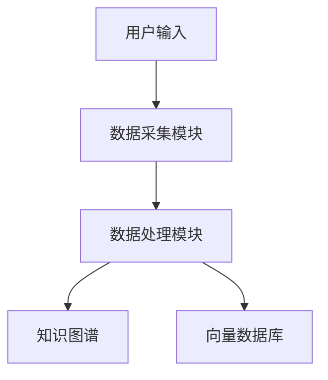
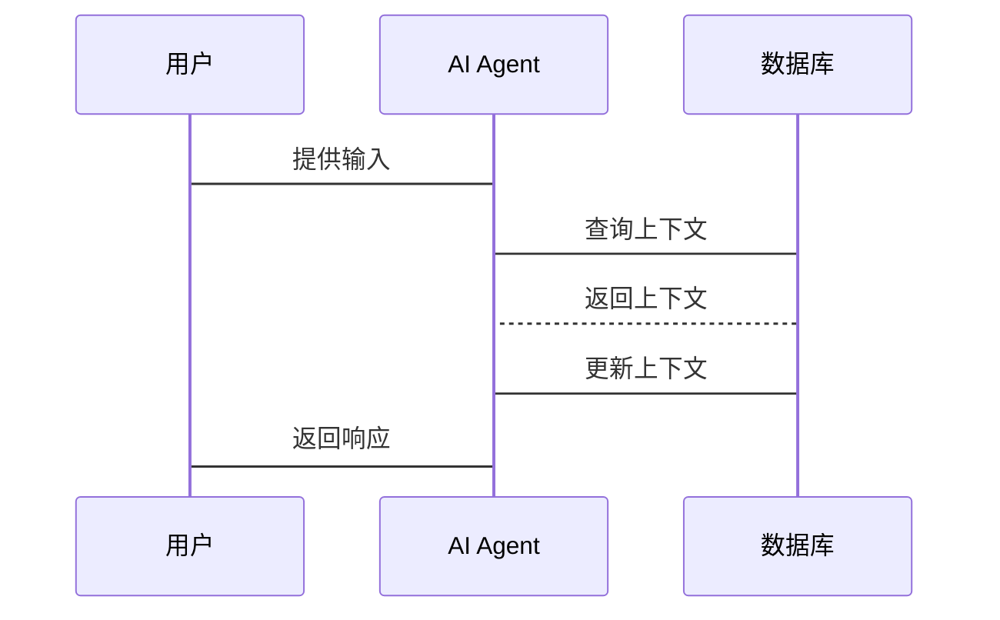

                 


# 实现AI Agent的上下文管理：保持对话连贯性

---

## 关键词
- AI Agent
- 上下文管理
- 对话连贯性
- 知识图谱
- 神经网络
- 规则引擎

---

## 摘要
在人机交互日益频繁的今天，AI Agent需要通过高效的上下文管理来保持对话的连贯性。本文从基础概念到系统架构，详细分析了上下文管理的核心原理与实现方法，结合算法与实际案例，为开发者提供系统化的解决方案。

---

# 第一部分: AI Agent上下文管理背景与概念

## 第1章: 上下文管理的基本概念

### 1.1 什么是上下文管理
#### 1.1.1 上下文的定义与特征
上下文是对话中涉及的所有信息，包括用户输入、系统反馈、历史记录等。其特征包括动态性、相关性和层次性。

#### 1.1.2 上下文管理的核心目标
通过存储、更新和同步上下文信息，确保AI Agent在对话中的连贯性和准确性。

#### 1.1.3 上下文管理的边界与外延
上下文管理的边界包括数据采集、处理和存储，外延涉及知识图谱、神经网络等技术。

### 1.2 AI Agent的基本原理
#### 1.2.1 AI Agent的定义与分类
AI Agent是一种智能体，通过感知环境并采取行动来实现目标。主要分类包括基于规则、统计和神经网络的Agent。

#### 1.2.2 AI Agent的典型应用场景
包括智能助手、客服机器人和自动驾驶等领域。

#### 1.2.3 AI Agent与上下文管理的关系
上下文管理是AI Agent实现智能交互的核心机制。

---

## 第2章: 上下文管理在AI Agent中的作用

### 2.1 上下文管理的重要性
#### 2.1.1 保持对话连贯性的必要性
上下文管理确保对话不中断，提升用户体验。

#### 2.1.2 上下文管理对用户体验的影响
直接影响对话的自然流畅性。

#### 2.1.3 上下文管理对系统性能的优化作用
通过优化数据处理，提升系统效率。

### 2.2 上下文管理的挑战
#### 2.2.1 上下文信息的复杂性
涉及多模态数据，处理难度大。

#### 2.2.2 上下文信息的动态变化
需要实时更新和同步。

#### 2.2.3 多模态数据的处理难度
涉及文本、语音等多种数据类型。

---

# 第二部分: 上下文管理的核心概念与原理

## 第3章: 上下文管理的核心概念

### 3.1 上下文信息的存储与表示
#### 3.1.1 数据结构的选择
使用图结构或向量表示，便于高效检索和更新。

#### 3.1.2 知识图谱的构建
构建知识图谱，帮助AI Agent理解上下文关系。

#### 3.1.3 向量数据库的应用
利用向量数据库进行高效相似性检索。

### 3.2 上下文更新与同步机制
#### 3.2.1 实时更新的策略
采用事件驱动的方式，及时更新上下文信息。

#### 3.2.2 同步过程中的冲突处理
通过冲突检测和修复算法，解决同步中的矛盾。

#### 3.2.3 历史记录的管理
存储对话历史，便于回溯和恢复。

---

## 第4章: 上下文管理的算法原理

### 4.1 基于规则的上下文管理
#### 4.1.1 规则定义与实现
通过预定义规则，实现简单的上下文管理。

#### 4.1.2 规则的动态调整
根据反馈实时调整规则，提升适应性。

#### 4.1.3 规则的可扩展性分析
通过模块化设计，增强规则系统的扩展性。

### 4.2 基于统计的上下文管理
#### 4.2.1 统计模型的基本原理
利用概率统计方法，预测上下文信息。

#### 4.2.2 统计模型的训练与优化
通过大量数据训练，优化模型性能。

#### 4.2.3 统计模型的适用场景
适用于数据量大、模式复杂的场景。

### 4.3 基于神经网络的上下文管理
#### 4.3.1 神经网络模型的结构
使用Transformer架构，处理长上下文依赖。

#### 4.3.2 模型的训练与调优
通过迁移学习和微调，提升模型效果。

#### 4.3.3 模型的实时推理
利用在线推理技术，实现动态上下文管理。

---

# 第三部分: 上下文管理的系统架构与设计

## 第5章: 系统架构设计

### 5.1 系统功能模块划分
#### 5.1.1 数据采集模块
负责采集用户输入和系统反馈。

#### 5.1.2 数据处理模块
对数据进行清洗、解析和转换。

#### 5.1.3 数据存储模块
使用数据库或知识图谱存储数据。

### 5.2 系统架构图


### 5.3 系统接口设计
#### 5.3.1 数据接口
定义API接口，供其他模块调用。

#### 5.3.2 模型接口
提供模型调用接口，实现动态管理。

### 5.4 系统交互流程


---

## 第6章: 项目实战

### 6.1 环境安装
```bash
pip install transformers mermaid4j spacy
```

### 6.2 核心实现代码
```python
class ContextManager:
    def __init__(self):
        self.context = {}

    def update_context(self, key, value):
        self.context[key] = value

    def get_context(self, key):
        return self.context.get(key, None)
```

### 6.3 代码解读与分析
- `ContextManager`类管理上下文数据，支持更新和查询操作。
- 使用`transformers`库进行模型训练，使用`spacy`库构建知识图谱。

### 6.4 实际案例分析
案例：智能客服对话系统，利用上下文管理实现多轮对话。

### 6.5 项目小结
通过实战，验证了上下文管理在实际项目中的应用效果。

---

## 第7章: 最佳实践与总结

### 7.1 最佳实践 tips
- 定期优化规则和模型，提升系统性能。
- 采用模块化设计，增强系统的可扩展性。

### 7.2 小结
上下文管理是实现AI Agent对话连贯性的关键，通过本文的系统化方法，开发者可以有效提升对话系统的性能。

### 7.3 注意事项
- 确保数据安全，避免隐私泄露。
- 定期维护知识图谱，保持数据准确性。

### 7.4 拓展阅读
建议深入学习知识图谱和神经网络技术，进一步提升上下文管理的效果。

--- 

# 结语

通过本文的系统化讲解，读者可以全面掌握AI Agent上下文管理的实现方法，并在实际项目中灵活运用。希望本文能为开发者提供有价值的参考，推动AI技术的进一步发展。

