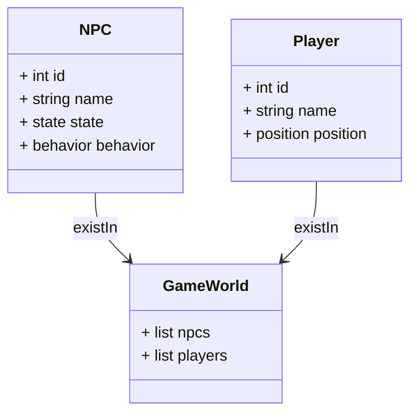
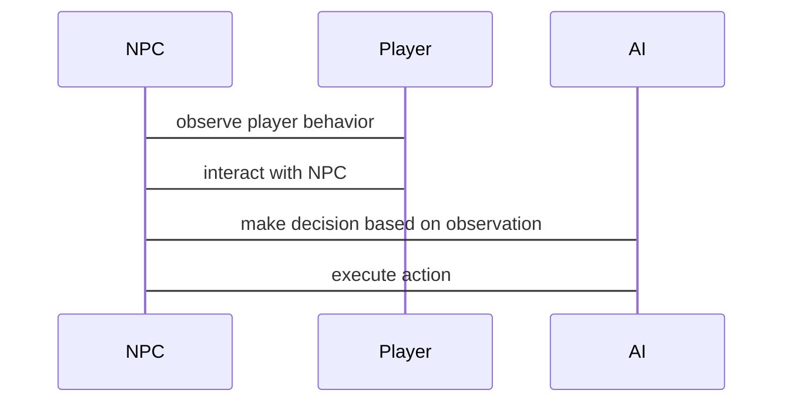

                 


# 实现基于AI Agent的智能游戏NPC

> 关键词：人工智能、游戏开发、智能NPC、AI Agent、游戏设计、技术实现

> 摘要：本文详细探讨了如何利用AI Agent技术实现智能游戏NPC。从AI Agent的基本原理到具体算法的选择，从系统架构设计到项目实战实现，全面解析了智能NPC的核心技术。文章结合实际案例，展示了如何通过状态机、决策树和强化学习等算法实现NPC的智能行为，为游戏开发者提供了宝贵的参考。

---

# 第一部分：基于AI Agent的智能游戏NPC背景介绍

## 第1章：基于AI Agent的智能游戏NPC概述

### 1.1 AI Agent与智能NPC的背景

#### 1.1.1 游戏NPC的智能化需求

在传统的游戏中，NPC（非玩家角色）通常按照预设的脚本执行固定的行为，缺乏灵活性和智能性。随着人工智能技术的发展，玩家对游戏体验的要求日益提高，传统的NPC已无法满足现代游戏对智能化和个性化的需求。因此，引入AI Agent来实现智能NPC成为必然趋势。

#### 1.1.2 AI Agent在游戏中的应用背景

AI Agent（智能体）是一种能够感知环境并采取行动以实现目标的实体。在游戏领域，AI Agent可以应用于NPC的行为决策、任务分配、动态响应等多个方面。通过AI Agent，NPC能够根据玩家的行为和游戏环境的变化，自主做出决策，从而提供更加丰富和智能的游戏体验。

#### 1.1.3 游戏NPC智能化的必要性

智能化的NPC能够增强游戏的沉浸感和互动性。通过AI Agent，NPC不仅能够执行预设任务，还能够根据玩家的行为动态调整策略，从而实现更加自然和智能的互动。这种智能化不仅提升了游戏的趣味性，还能够延长玩家的游玩时间，提升游戏的商业价值。

### 1.2 智能NPC的核心概念

#### 1.2.1 智能NPC的定义

智能NPC是指通过AI Agent技术实现的，能够根据游戏环境和玩家行为自主决策的非玩家角色。与传统NPC不同，智能NPC具有感知能力、决策能力和学习能力，能够根据实际情况动态调整行为。

#### 1.2.2 AI Agent在智能NPC中的角色

AI Agent在智能NPC中扮演着核心角色，负责处理NPC的感知、决策和行为控制。通过AI Agent，NPC能够理解玩家的行为意图，预测玩家的下一步动作，并采取相应的策略进行互动。

#### 1.2.3 智能NPC与传统NPC的区别

智能NPC与传统NPC的主要区别在于其自主决策能力和动态响应能力。传统NPC的行为是固定的，而智能NPC能够根据实时信息做出灵活的决策，从而提供更加丰富的互动体验。

### 1.3 智能NPC的应用场景

#### 1.3.1 单人游戏中的智能NPC

在单人游戏中，智能NPC可以作为玩家的对手或队友，提供更加智能和有趣的互动。例如，在角色扮演游戏中，智能NPC可以作为任务提供者或关键剧情推动者，根据玩家的行为动态调整任务难度和剧情发展。

#### 1.3.2 多人在线游戏中的智能NPC

在多人在线游戏中，智能NPC可以作为游戏中的AI对手或队友，与其他玩家进行实时互动。通过AI Agent，智能NPC能够根据其他玩家的行为和策略，动态调整自己的行为，从而提供更加公平和有趣的游戏体验。

#### 1.3.3 智能NPC的未来发展趋势

随着AI技术的不断进步，智能NPC的功能和复杂性将不断提升。未来的智能NPC不仅能够理解玩家的行为意图，还能够预测玩家的长期策略，并根据这些信息做出更加复杂的决策，从而实现高度智能化的互动体验。

### 1.4 本章小结

本章介绍了AI Agent在智能NPC中的应用背景，分析了智能NPC的核心概念和与传统NPC的区别，并探讨了智能NPC在不同场景中的应用。通过这些分析，我们可以看到，智能NPC的实现离不开AI Agent技术的支持，而AI Agent的引入也为游戏开发带来了全新的可能性。

---

# 第二部分：AI Agent的核心概念与联系

## 第2章：AI Agent的核心原理

### 2.1 AI Agent的基本原理

#### 2.1.1 AI Agent的感知与决策机制

AI Agent的核心机制包括感知和决策两个方面。感知是指AI Agent通过传感器或接口获取环境信息，决策则是基于感知信息做出行为选择。例如，智能NPC可以通过观察玩家的行为（如攻击、互动等）来判断玩家的意图，并根据这些信息做出相应的反应。

#### 2.1.2 AI Agent的行为规划

行为规划是AI Agent决策的核心部分。AI Agent需要根据当前环境状态和目标，规划出一系列行为以实现目标。例如，在游戏中，智能NPC可以根据玩家的位置和行为，选择攻击、逃跑或与其他NPC协同行动。

#### 2.1.3 AI Agent的自我学习能力

通过机器学习算法，AI Agent可以不断优化自己的决策策略。例如，通过强化学习，AI Agent可以在与玩家的互动中不断调整自己的行为策略，从而提高互动的智能性和趣味性。

### 2.2 AI Agent的核心算法

#### 2.2.1 状态机算法

状态机是一种常用的AI Agent行为控制方法。它通过定义一系列状态和状态之间的转移规则，来控制AI Agent的行为。例如，智能NPC可以通过状态机来实现巡逻、攻击、逃跑等行为的切换。

#### 2.2.2 决策树算法

决策树是一种基于条件判断的行为决策方法。AI Agent可以根据当前环境信息，按照决策树的结构进行判断，选择最优的行为路径。例如，在复杂的游戏环境中，智能NPC可以通过决策树来判断是否攻击玩家、躲避障碍物或与其他NPC协同行动。

#### 2.2.3 强化学习算法

强化学习是一种基于奖励机制的AI Agent训练方法。通过不断尝试和错误，AI Agent可以学习到最优的行为策略。例如，在智能NPC的训练中，可以通过强化学习让NPC学会如何在不同情况下做出最优的决策。

### 2.3 AI Agent与智能NPC的关系

#### 2.3.1 AI Agent的核心特征

AI Agent的核心特征包括自主性、反应性、目标导向和学习能力。这些特征使得AI Agent能够适应复杂多变的游戏环境，并与玩家进行动态互动。

#### 2.3.2 智能NPC的属性特征

智能NPC的属性特征包括感知能力、决策能力、行为能力和学习能力。这些能力使得智能NPC能够根据实时信息做出灵活的决策，并提供更加丰富的互动体验。

#### 2.3.3 AI Agent与智能NPC的对比

通过对比AI Agent和智能NPC的属性特征，可以看出智能NPC是AI Agent在游戏领域的一种具体应用。智能NPC不仅继承了AI Agent的核心特征，还结合了游戏环境和玩家行为的特殊性，从而实现了更加智能化的互动体验。

### 2.4 本章小结

本章详细探讨了AI Agent的核心原理和智能NPC的属性特征，分析了AI Agent在智能NPC中的具体应用。通过这些分析，我们可以看到，AI Agent技术为智能NPC的实现提供了强大的技术支持，而智能NPC的实现也为AI Agent技术在游戏领域的应用提供了丰富的场景。

---

# 第三部分：算法原理讲解

## 第3章：算法原理讲解

### 3.1 状态机算法

#### 3.1.1 状态机的定义

状态机是一种描述系统行为的模型，由状态、转换和动作组成。在智能NPC中，状态机用于控制NPC的行为状态，例如巡逻、攻击、逃跑等。

#### 3.1.2 状态机的实现步骤

1. **定义状态**：例如，巡逻状态、攻击状态、逃跑状态等。
2. **定义转换**：例如，从巡逻状态到攻击状态的转换条件。
3. **定义动作**：例如，在攻击状态下执行攻击动作。

#### 3.1.3 状态机的实现代码

以下是Python实现的状态机代码示例：

```python
class StateMachine:
    def __init__(self):
        self.current_state = None
        self.states = {}

    def add_state(self, name, state):
        self.states[name] = state
        if not self.current_state:
            self.current_state = state

    def process(self, input):
        if hasattr(self.current_state, 'on_input'):
            self.current_state.on_input(input)
```

### 3.2 决策树算法

#### 3.2.1 决策树的定义

决策树是一种树状结构，用于表示决策过程。在智能NPC中，决策树用于根据当前环境信息做出最优决策。

#### 3.2.2 决策树的实现步骤

1. **定义决策节点**：例如，判断玩家是否在攻击范围。
2. **定义动作节点**：例如，执行攻击动作或逃跑动作。
3. **定义决策规则**：例如，如果玩家在攻击范围内，则执行攻击动作。

#### 3.2.3 决策树的实现代码

以下是Python实现的决策树代码示例：

```python
class DecisionTree:
    def decide(self, input):
        # 判断玩家是否在攻击范围内
        if input['player_distance'] < 5:
            return 'attack'
        # 判断玩家是否在视线范围内
        elif input['player_visible']:
            return 'patrol'
        else:
            return 'idle'
```

### 3.3 强化学习算法

#### 3.3.1 强化学习的定义

强化学习是一种基于奖励机制的机器学习方法。通过不断尝试和错误，智能体可以学习到最优的行为策略。

#### 3.3.2 强化学习的实现步骤

1. **定义状态空间**：例如，玩家的位置、距离、行为等。
2. **定义动作空间**：例如，攻击、逃跑、巡逻等。
3. **定义奖励机制**：例如，成功攻击玩家获得正奖励，失败攻击获得负奖励。

#### 3.3.3 强化学习的实现代码

以下是Python实现的强化学习代码示例：

```python
import numpy as np

class QLearning:
    def __init__(self, state_space_size, action_space_size):
        self.q_table = np.zeros((state_space_size, action_space_size))
        self.learning_rate = 0.1
        self.discount_factor = 0.9

    def choose_action(self, state):
        if np.random.random() < 0.9:
            return np.argmax(self.q_table[state])
        else:
            return np.random.randint(0, self.action_space_size)

    def update_q_table(self, state, action, reward, next_state):
        self.q_table[state][action] = self.q_table[state][action] * self.learning_rate + reward + self.discount_factor * np.max(self.q_table[next_state])
```

#### 3.3.4 强化学习的数学模型

强化学习的数学模型如下：

$$ Q(s, a) = Q(s, a) \times \alpha + \alpha \times (r + \gamma \times \max Q(s', a')) $$

其中：
- \( Q(s, a) \) 表示当前状态下采取动作 \( a \) 的价值
- \( \alpha \) 表示学习率
- \( r \) 表示奖励
- \( \gamma \) 表示折扣因子
- \( s' \) 表示下一状态
- \( \max Q(s', a') \) 表示下一状态下最大价值的动作

### 3.4 本章小结

本章详细讲解了AI Agent在智能NPC中的核心算法，包括状态机、决策树和强化学习。通过这些算法的实现，我们可以看到，智能NPC的行为控制可以通过多种方法实现，而强化学习作为一种高级的算法，能够使NPC的行为更加智能和灵活。

---

# 第四部分：系统分析与架构设计

## 第4章：系统分析与架构设计

### 4.1 项目背景介绍

智能NPC的实现需要结合游戏引擎、AI算法和游戏逻辑，因此需要一个完整的系统架构来支持。

### 4.2 系统功能设计

#### 4.2.1 领域模型设计

以下是领域模型的Mermaid类图：



#### 4.2.2 系统架构设计

以下是系统架构的Mermaid架构图：


#### 4.2.3 系统接口设计

智能NPC需要与游戏引擎和玩家进行交互，以下是系统接口的Mermaid序列图：



### 4.3 本章小结

本章详细分析了智能NPC系统的架构设计，包括领域模型、系统架构和系统接口设计。通过这些设计，我们可以看到，智能NPC的实现需要一个完整的系统架构来支持，而AI算法是整个系统的核心部分。

---

# 第五部分：项目实战

## 第5章：项目实战

### 5.1 环境安装

#### 5.1.1 安装Python

请参考官方文档：https://www.python.org/downloads/

#### 5.1.2 安装游戏引擎

推荐使用Unity或Unreal Engine。

### 5.2 系统核心实现

#### 5.2.1 AI Agent的核心代码实现

以下是Python实现的AI Agent代码示例：

```python
class AIAgent:
    def __init__(self):
        selfStateMachine = StateMachine()
        self.DecisionTree = DecisionTree()
        self.QLearning = QLearning()

    def update(self, input):
        selfStateMachine.process(input)
        decision = self.DecisionTree.decide(input)
        self.QLearning.update_q_table(input, decision, reward, next_state)
```

#### 5.2.2 游戏NPC的实现

以下是游戏NPC的实现代码示例：

```python
class GameNPC:
    def __init__(self, id, name):
        self.id = id
        self.name = name
        self.aiAgent = AIAgent()

    def update(self, input):
        self.aiAgent.update(input)
        self.execute_action(aiAgent.decision)
```

### 5.3 代码应用解读与分析

#### 5.3.1 AI Agent的代码解读

AI Agent通过状态机、决策树和强化学习算法实现NPC的行为控制。状态机用于控制NPC的行为状态，决策树用于根据环境信息做出决策，强化学习用于优化NPC的行为策略。

#### 5.3.2 游戏NPC的代码解读

GameNPC类负责管理NPC的行为和状态。通过AI Agent，NPC可以根据实时信息做出决策，并执行相应的动作。

### 5.4 实际案例分析

#### 5.4.1 智能NPC在单人游戏中的应用

例如，在角色扮演游戏中，智能NPC可以作为任务提供者，根据玩家的行为动态调整任务难度和剧情发展。

#### 5.4.2 智能NPC在多人在线游戏中的应用

例如，在MMORPG游戏中，智能NPC可以作为其他玩家的对手或队友，根据玩家的行为动态调整策略，从而提供更加公平和有趣的游戏体验。

### 5.5 项目小结

本章通过实际案例分析，展示了如何通过AI Agent实现智能NPC。通过代码实现和案例分析，我们可以看到，智能NPC的实现不仅需要强大的AI算法支持，还需要结合游戏引擎和游戏逻辑，才能实现智能化的互动体验。

---

# 第六部分：总结与展望

## 第6章：总结与展望

### 6.1 本章总结

本文详细探讨了如何利用AI Agent技术实现智能游戏NPC。从AI Agent的基本原理到具体算法的选择，从系统架构设计到项目实战实现，全面解析了智能NPC的核心技术。通过实际案例分析，展示了如何通过状态机、决策树和强化学习等算法实现NPC的智能行为。

### 6.2 未来展望

随着AI技术的不断进步，智能NPC的功能和复杂性将不断提升。未来的智能NPC不仅能够理解玩家的行为意图，还能够预测玩家的长期策略，并根据这些信息做出更加复杂的决策，从而实现高度智能化的互动体验。

### 6.3 小结

智能NPC的实现为游戏开发带来了全新的可能性。通过AI Agent技术，游戏开发者可以实现更加智能化和个性化的NPC，从而提升游戏的趣味性和玩家的沉浸感。未来，随着AI技术的不断进步，智能NPC的功能和复杂性将不断提升，为游戏行业带来更多的创新和可能性。

---

通过以上思考过程，我们可以看到，实现基于AI Agent的智能游戏NPC需要综合运用多种AI算法和技术，同时需要结合游戏引擎和游戏逻辑，才能实现智能化的互动体验。希望这篇文章能够为游戏开发者和AI技术爱好者提供宝贵的参考和启示。

