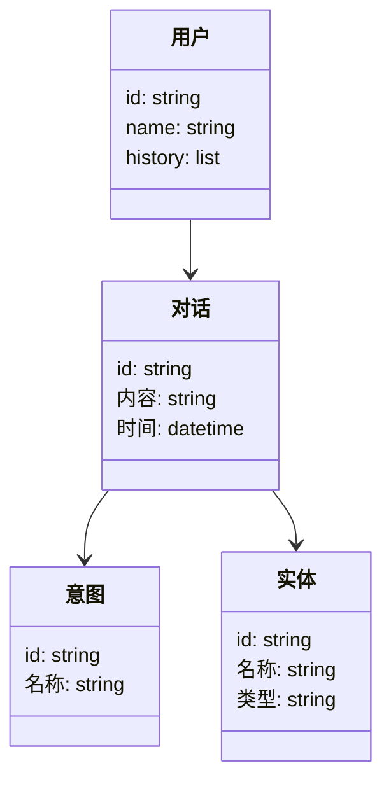
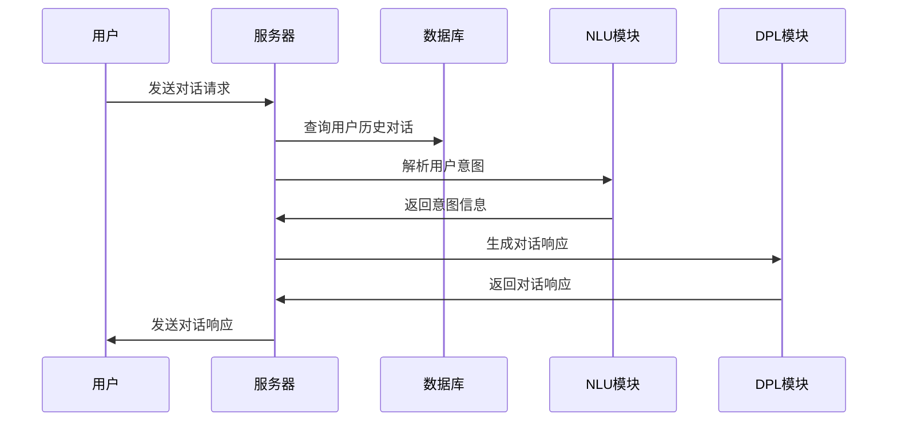

                 


# 对话式AI Agent：提升用户交互体验

> 关键词：对话式AI Agent, 自然语言处理, 机器学习, 对话管理, 智能交互

> 摘要：对话式AI Agent是一种基于自然语言处理和机器学习技术的智能交互系统，通过模拟人类对话方式与用户进行交互，为用户提供高效、智能的服务。本文将从对话式AI Agent的核心概念、技术原理、算法实现、系统设计、项目实战、最佳实践等方面进行详细探讨，帮助读者全面理解并掌握对话式AI Agent的设计与实现方法。

---

# 第1章: 对话式AI Agent概述

## 1.1 对话式AI Agent的定义与背景

### 1.1.1 对话式AI Agent的定义
对话式AI Agent（Dialogue AI Agent）是一种基于自然语言处理（NLP）和机器学习技术的智能交互系统。它能够通过文本或语音与用户进行对话，理解用户的意图，并提供相应的反馈或服务。

### 1.1.2 对话式AI Agent的发展背景
随着人工智能技术的快速发展，对话式AI Agent在各个领域的应用越来越广泛。从智能客服到智能助手，对话式AI Agent通过自然语言处理技术，为用户提供更智能、更高效的交互体验。

### 1.1.3 对话式AI Agent的核心目标
对话式AI Agent的核心目标是通过模拟人类对话方式，为用户提供个性化的服务，提升用户体验，降低人工成本，同时提高交互效率。

---

## 1.2 对话式AI Agent的技术基础

### 1.2.1 自然语言处理（NLP）简介
自然语言处理（NLP）是对话式AI Agent的核心技术之一，主要包括文本分割、词性标注、句法分析、语义理解等技术。

### 1.2.2 机器学习与深度学习基础
机器学习和深度学习是对话式AI Agent的另一大核心技术，主要用于模型训练、意图识别、对话生成等任务。

### 1.2.3 对话式AI Agent的技术架构
对话式AI Agent的技术架构主要包括输入处理、意图识别、对话管理、响应生成和输出展示五个部分。

---

## 1.3 对话式AI Agent的应用场景

### 1.3.1 智能客服
对话式AI Agent可以替代传统的人工客服，为用户提供24小时在线的智能服务。

### 1.3.2 智能助手
对话式AI Agent可以作为用户的智能助手，帮助用户完成日程管理、信息查询等任务。

### 1.3.3 游戏与教育中的应用
在游戏和教育领域，对话式AI Agent可以作为虚拟角色，与玩家或学生进行互动，提升用户体验。

---

# 第2章: 对话式AI Agent的核心概念与原理

## 2.1 对话式AI Agent的核心概念

### 2.1.1 对话流程
对话流程包括用户输入、系统解析、系统生成响应和用户反馈四个阶段。

### 2.1.2 用户意图识别
用户意图识别是对话式AI Agent的核心任务之一，主要包括意图分类和实体识别。

### 2.1.3 对话上下文管理
对话上下文管理是对话式AI Agent的重要功能，用于跟踪对话历史、用户状态和系统状态。

---

## 2.2 对话式AI Agent的关键技术

### 2.2.1 自然语言理解（NLU）
自然语言理解（NLU）是对话式AI Agent的核心技术，主要用于理解用户的输入内容。

### 2.2.2 对话状态跟踪（DST）
对话状态跟踪（DST）用于维护对话的上下文信息，确保对话的连贯性。

### 2.2.3 对话策略生成（DPL）
对话策略生成（DPL）是对话式AI Agent的决策模块，用于生成合适的对话响应。

### 2.2.4 自然语言生成（NLG）
自然语言生成（NLG）是对话式AI Agent的输出模块，用于将系统生成的响应转换为自然语言表达。

---

## 2.3 对话式AI Agent的核心原理

### 2.3.1 基于规则的对话管理
基于规则的对话管理是一种简单的对话管理方法，通过预定义的规则来生成对话响应。

### 2.3.2 基于机器学习的对话管理
基于机器学习的对话管理是一种更复杂的对话管理方法，通过训练模型来生成对话响应。

### 2.3.3 基于强化学习的对话优化
基于强化学习的对话优化是一种高级的对话管理方法，通过不断优化对话策略来提高对话质量。

---

# 第3章: 对话式AI Agent的算法原理

## 3.1 对话式AI Agent的算法框架

### 3.1.1 基于Seq2Seq模型的对话生成
Seq2Seq模型是一种经典的对话生成模型，通过编码器和解码器的结构来生成对话响应。

### 3.1.2 基于Transformer的对话生成
基于Transformer的对话生成是一种更先进的对话生成方法，通过自注意力机制来提高对话生成的质量。

### 3.1.3 基于强化学习的对话优化
基于强化学习的对话优化是一种通过强化学习算法来优化对话策略的方法。

---

## 3.2 对话式AI Agent的算法实现

### 3.2.1 Seq2Seq模型的工作流程
Seq2Seq模型的工作流程包括编码阶段和解码阶段，通过这两个阶段来生成对话响应。

### 3.2.2 Transformer模型的结构
Transformer模型由编码器和解码器组成，编码器用于处理输入序列，解码器用于生成输出序列。

### 3.2.3 强化学习算法的应用
强化学习算法通过奖励机制来优化对话策略，确保对话的连贯性和合理性。

---

## 3.3 对话式AI Agent的数学模型

### 3.3.1 Seq2Seq模型的数学公式
Seq2Seq模型的编码器和解码器都可以表示为循环神经网络（RNN）或变种。

### 3.3.2 Transformer模型的数学公式
Transformer模型的核心是自注意力机制，通过点积和缩放来计算注意力权重。

### 3.3.3 强化学习算法的数学公式
强化学习算法通过奖励函数来优化策略，常用的算法包括Q-learning和Policy Gradient。

---

# 第4章: 对话式AI Agent的系统分析与架构设计

## 4.1 问题场景介绍

### 4.1.1 系统目标
对话式AI Agent的目标是通过自然语言处理技术，为用户提供高效的智能服务。

### 4.1.2 项目背景
本项目旨在设计和实现一个基于自然语言处理技术的对话式AI Agent。

---

## 4.2 系统功能设计

### 4.2.1 领域模型设计
领域模型设计包括用户、对话、意图和实体四个核心概念。

### 4.2.2 领域模型类图


---

## 4.3 系统架构设计

### 4.3.1 系统架构图


---

## 4.4 系统接口设计

### 4.4.1 对话接口设计


---

# 第5章: 对话式AI Agent的项目实战

## 5.1 环境搭建

### 5.1.1 安装Python
```bash
python --version
pip install --upgrade pip
```

### 5.1.2 安装依赖库
```bash
pip install numpy
pip install tensorflow
pip install transformers
```

---

## 5.2 核心功能实现

### 5.2.1 意图识别
```python
from transformers import pipeline

nlp = pipeline("text-classification", model="snunlp/kobertweet-base-128")
intent_classifier = nlp
```

### 5.2.2 对话生成
```python
from transformers import AutoModelForSeq2Seq, AutoTokenizer

model = AutoModelForSeq2Seq.from_pretrained("t5-base")
tokenizer = AutoTokenizer.from_pretrained("t5-base")
```

---

## 5.3 案例分析与实现

### 5.3.1 案例分析
假设用户输入“我需要预订一张去北京的机票”，系统需要识别用户的意图并生成响应。

### 5.3.2 代码实现
```python
def generate_response(input_text):
    inputs = tokenizer(input_text, return_tensors="pt")
    outputs = model.generate(inputs.input_ids, max_length=50)
    response = tokenizer.decode(outputs[0], skip_special_tokens=True)
    return response
```

---

## 5.4 项目总结

### 5.4.1 成功的关键点
对话式AI Agent的成功关键点包括模型选择、数据质量、对话管理策略和用户体验优化。

### 5.4.2 可能的改进方向
对话式AI Agent的改进方向包括模型优化、意图识别精度提升、对话上下文管理优化和用户反馈机制完善。

---

# 第6章: 对话式AI Agent的最佳实践

## 6.1 最佳实践

### 6.1.1 设计原则
- 简单明了：对话式AI Agent的设计应简单明了，避免复杂性。
- 用户友好：对话式AI Agent应提供友好的用户界面和交互体验。
- 可扩展性：对话式AI Agent应具备良好的可扩展性，支持多种应用场景。

### 6.1.2 常见问题及解决方案
- 问题：意图识别错误
  - 解决方案：优化模型或增加训练数据
- 问题：对话不连贯
  - 解决方案：优化对话管理策略
- 问题：响应延迟
  - 解决方案：优化系统架构和后端性能

---

## 6.2 性能优化技巧

### 6.2.1 模型优化
- 使用更高效的模型结构
- 优化模型参数
- 使用分布式训练

### 6.2.2 系统优化
- 优化数据库查询
- 使用缓存技术
- 优化API调用

---

## 6.3 安全性与伦理问题

### 6.3.1 数据隐私
对话式AI Agent需要处理用户的敏感信息，必须严格遵守数据隐私保护法规。

### 6.3.2 伦理问题
对话式AI Agent的使用必须遵守伦理规范，避免滥用技术。

---

## 6.4 拓展阅读

### 6.4.1 推荐书籍
- 《深度学习》
- 《自然语言处理入门》
- 《对话式AI Agent实战》

### 6.4.2 推荐博客与资源
- 官方文档：Hugging Face
- 技术博客：Towards Data Science
- 开源项目：GitHub

---

# 第7章: 总结与展望

## 7.1 总结
对话式AI Agent是一种基于自然语言处理和机器学习技术的智能交互系统，通过模拟人类对话方式为用户提供高效的服务。

## 7.2 展望
随着人工智能技术的不断进步，对话式AI Agent将更加智能化、个性化，应用场景也将更加广泛。

---

# 结语

对话式AI Agent的开发与应用是一项复杂而充满挑战的任务，但随着技术的不断进步，它将为人类带来更智能、更高效的交互体验。希望本文能够为读者提供有价值的参考和启发，帮助大家更好地理解和掌握对话式AI Agent的设计与实现方法。

