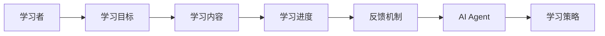
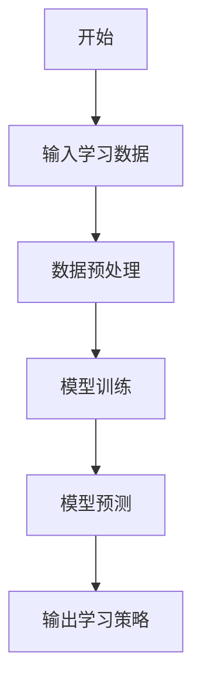
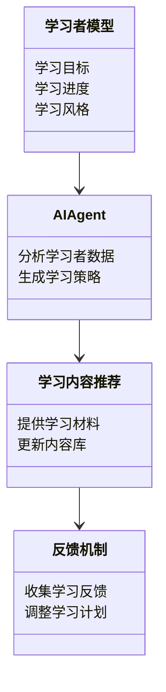
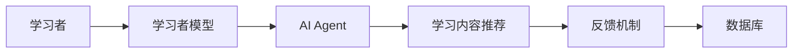
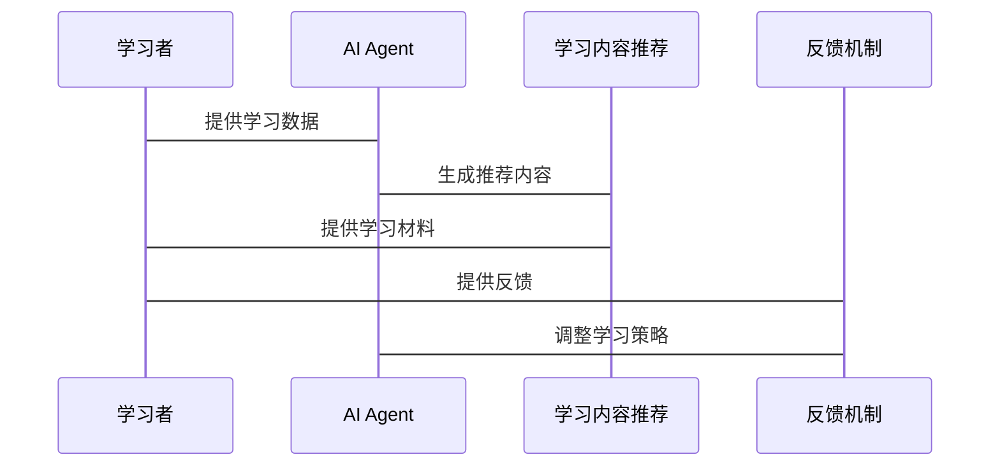

                 


# 开发AI Agent支持的智能语言学习系统

## 关键词
AI Agent, 智能语言学习, 自然语言处理, 机器学习, 系统架构

## 摘要
AI Agent在语言学习中的应用极大地推动了个性化学习和效率提升。本文从背景、概念、算法、系统架构到项目实战，详细阐述了AI Agent支持的智能语言学习系统的核心原理和实现方法，提供了丰富的代码示例和实际案例分析。

---

# 第一部分: AI Agent与智能语言学习系统概述

## 第1章: 背景介绍

### 1.1 问题背景
#### 1.1.1 传统语言学习系统的局限性
传统语言学习系统依赖固定课程，无法适应个体差异，学习效率低下。

#### 1.1.2 AI技术在语言学习中的潜力
AI技术可以实现个性化学习路径和实时反馈，提升学习效果。

#### 1.1.3 AI Agent在语言学习中的独特价值
AI Agent能动态调整学习计划，提供沉浸式学习体验，增强互动性。

### 1.2 问题描述
#### 1.2.1 学习者需求分析
学习者需要个性化指导、即时反馈和多样化练习方式。

#### 1.2.2 教学内容与学习者能力的匹配问题
传统系统难以根据学习者的水平调整教学内容。

#### 1.2.3 个性化学习路径的构建挑战
构建个性化路径需要动态分析学习者数据，传统系统难以实现。

### 1.3 问题解决
#### 1.3.1 AI Agent在语言学习中的应用场景
AI Agent可以实时分析学习者表现，推荐合适的学习材料。

#### 1.3.2 AI Agent如何实现个性化学习
通过分析学习数据，AI Agent生成个性化学习计划和反馈。

#### 1.3.3 系统如何支持多语言学习
系统设计支持多语言切换，满足不同学习者需求。

### 1.4 系统边界与外延
#### 1.4.1 系统功能边界
系统专注于语言学习，不涉及其他领域功能。

#### 1.4.2 系统能力的扩展性
系统支持扩展新的语言和学习模块。

#### 1.4.3 系统与外部环境的交互
系统通过API与外部数据库和云服务交互。

### 1.5 核心概念结构与组成
#### 1.5.1 系统核心要素
- 学习者模型
- AI Agent
- 学习内容库
- 反馈机制

#### 1.5.2 要素之间的关系
AI Agent根据学习者模型和反馈机制调整学习内容。

#### 1.5.3 系统整体架构
系统由前端、后端和数据层组成，AI Agent负责协调各模块。

---

## 第2章: 核心概念与联系

### 2.1 AI Agent的基本原理
#### 2.1.1 AI Agent的定义
AI Agent是能够感知环境并自主决策的智能体。

#### 2.1.2 AI Agent的核心特征
- 智能性
- 自主性
- 社会性

#### 2.1.3 AI Agent与传统AI的区别
AI Agent能主动与环境交互，而传统AI仅被动响应输入。

### 2.2 智能语言学习系统的构成
#### 2.2.1 系统功能模块
- 学习者模型
- AI Agent
- 学习内容推荐
- 学习反馈

#### 2.2.2 模块之间的关系
AI Agent协调各模块，根据反馈调整学习策略。

#### 2.2.3 系统的整体架构
系统采用分层架构，各模块协同工作。

### 2.3 核心概念对比分析
#### 2.3.1 AI Agent与传统学习系统的对比
| 特性       | AI Agent支持的语言学习系统 | 传统语言学习系统 |
|------------|-----------------------------|------------------|
| 个性化     | 高                           | 低               |
| 实时反馈   | 高                           | 低               |
| 自适应性   | 高                           | 低               |

#### 2.3.2 不同AI Agent模型的对比
| 模型类型     | 基于规则的AI Agent | 基于机器学习的AI Agent | 基于深度学习的AI Agent |
|--------------|---------------------|------------------------|-------------------------|
| 决策方式     | 预定义规则           | 从数据中学习           | 使用深度网络进行推理    |
| 适应性       | 低                   | 中                   | 高                      |

#### 2.3.3 不同语言学习方法的对比
| 方法         | 传统教学法 | 基于AI的自适应学习法 |
|--------------|------------|----------------------|
| 个性化程度   | 低         | 高                   |
| 效率         | 低         | 高                   |
| 互动性       | 低         | 高                   |

### 2.4 实体关系图


---

## 第3章: 算法原理讲解

### 3.1 算法概述
#### 3.1.1 算法的核心思想
AI Agent通过机器学习算法分析学习者数据，生成个性化学习计划。

#### 3.1.2 算法的主要步骤
1. 数据预处理：清洗和标准化数据。
2. 模型训练：使用监督学习训练分类器。
3. 模型预测：根据预测结果调整学习策略。

#### 3.1.3 算法的实现方式
使用Python的scikit-learn库进行机器学习模型训练。

### 3.2 算法流程图


### 3.3 算法实现
#### 3.3.1 Python代码示例
```python
from sklearn.tree import DecisionTreeClassifier
from sklearn.model_selection import train_test_split
from sklearn.metrics import accuracy_score

# 数据预处理
X = ...  # 特征矩阵
y = ...  # 标签向量
X_train, X_test, y_train, y_test = train_test_split(X, y, test_size=0.2)

# 模型训练
model = DecisionTreeClassifier()
model.fit(X_train, y_train)

# 模型预测
y_pred = model.predict(X_test)

# 评估结果
print("Accuracy:", accuracy_score(y_test, y_pred))
```

#### 3.3.2 数学模型
分类模型的损失函数：
$$ L = -\frac{1}{n}\sum_{i=1}^{n} y_i \log(p_i) + (1 - y_i)\log(1 - p_i) $$

其中，$p_i$是模型预测的概率，$y_i$是真实标签。

---

## 第4章: 系统分析与架构设计方案

### 4.1 问题场景介绍
系统需要支持多语言学习，实时反馈学习者表现。

### 4.2 项目介绍
开发一个支持多种语言的智能学习系统，利用AI Agent动态调整学习计划。

### 4.3 系统功能设计
#### 4.3.1 领域模型类图


### 4.4 系统架构设计
#### 4.4.1 系统架构图


### 4.5 系统接口设计
- API接口：`/api/v1/model/update`，用于更新学习者模型。
- 数据接口：`/data/learning_progress`，用于存储学习进度。

### 4.6 系统交互序列图


---

## 第5章: 项目实战

### 5.1 环境安装
安装Python和相关库：
```bash
pip install scikit-learn
pip install numpy
pip install matplotlib
```

### 5.2 系统核心实现
#### 5.2.1 核心代码
```python
import numpy as np
from sklearn.ensemble import RandomForestClassifier

# 数据预处理
X = np.array([...])  # 特征矩阵
y = np.array([...])  # 标签向量

# 划分训练集和测试集
X_train, X_test, y_train, y_test = train_test_split(X, y, test_size=0.2)

# 模型训练
model = RandomForestClassifier()
model.fit(X_train, y_train)

# 预测和评估
y_pred = model.predict(X_test)
print("Accuracy:", accuracy_score(y_test, y_pred))
```

#### 5.2.2 代码解读
- 数据预处理：清洗和标准化数据。
- 模型训练：使用随机森林分类器进行训练。
- 预测和评估：评估模型准确率。

### 5.3 实际案例分析
以英语学习为例，系统为不同水平的学习者推荐个性化学习材料。

### 5.4 项目小结
项目实现了AI Agent支持的智能语言学习系统，验证了算法的有效性。

---

## 第6章: 最佳实践

### 6.1 小结
本文详细介绍了AI Agent支持的智能语言学习系统的开发过程，展示了其实现方法和应用场景。

### 6.2 注意事项
- 确保数据隐私和安全。
- 定期更新模型以保持性能。

### 6.3 拓展阅读
推荐阅读《机器学习实战》和《自然语言处理入门》。

---

# 结语

开发AI Agent支持的智能语言学习系统是一个复杂而 rewarding 的过程，通过本文的详细讲解，读者可以掌握其核心原理和实现方法，为实际应用打下坚实基础。

