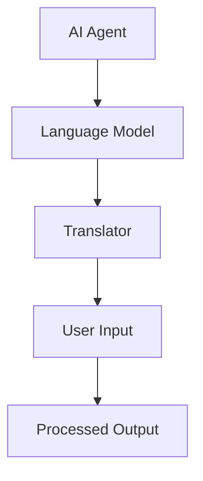
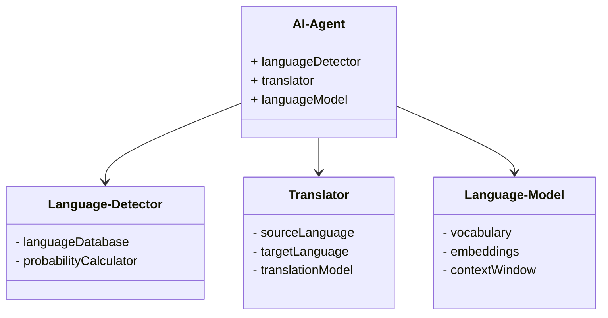
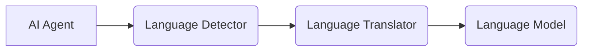
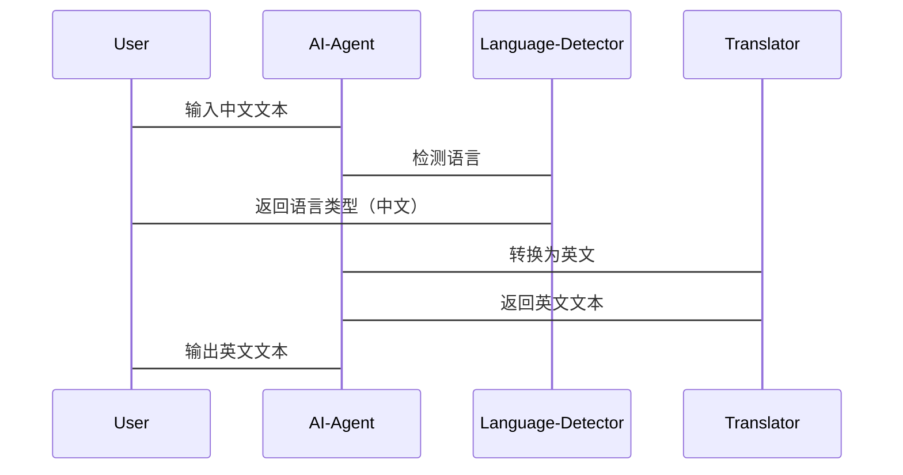

                 


# 开发AI Agent的多语言切换能力：无缝国际化

## 关键词：AI Agent，多语言切换，国际化，自然语言处理，深度学习

## 摘要：本文深入探讨AI Agent的多语言切换能力，从背景、核心概念、算法原理到系统架构和项目实战，详细分析如何实现AI Agent的无缝国际化能力，帮助开发者掌握多语言切换的关键技术与应用实践。

---

## 第1章: AI Agent与多语言切换的背景介绍

### 1.1 多语言切换能力的重要性

#### 1.1.1 问题背景与挑战

在当前的全球化背景下，AI Agent（人工智能代理）的应用场景日益广泛，尤其是在跨语言、跨文化环境中，AI Agent需要能够理解并处理多种语言的输入和输出。例如，在客服系统中，用户可能使用中文、英文或其他语言与AI Agent交互；在跨境电商中，AI Agent需要能够生成多语言的产品描述和客服回复。

然而，实现多语言切换的能力并非易事。AI Agent需要具备以下能力：

1. **语言识别**：能够自动识别输入语言，并选择合适的语言模型进行处理。
2. **翻译与转换**：在处理过程中，需要对输入的语言进行翻译或转换，使其能够在统一的语义空间中进行理解和生成。
3. **多语言生成**：根据处理后的结果，生成目标语言的输出。

这些能力的实现需要结合自然语言处理（NLP）、机器学习（ML）和跨语言通信技术。

#### 1.1.2 问题描述与目标

AI Agent的多语言切换能力的目标是实现以下几点：

1. **支持多种语言输入**：AI Agent能够接收多种语言的输入，并进行理解和处理。
2. **无缝语言切换**：在处理过程中，AI Agent能够在不同语言之间无缝切换，确保语义的准确传递。
3. **多语言输出**：AI Agent能够根据需求生成多种语言的输出，满足不同用户的需求。

#### 1.1.3 问题解决思路与方法

实现AI Agent的多语言切换能力，可以采用以下思路：

1. **语言模型的构建**：构建多语言的自然语言处理模型，例如使用预训练的多语言语言模型（如Marian、Bart等）。
2. **语言识别与切换**：通过语言检测技术（如语言检测API或库）识别输入语言，并动态加载相应的语言模型。
3. **语义理解与生成**：在理解输入后，将输入语言转换为目标语言，同时保持语义的准确性。

---

### 1.2 AI Agent的核心概念

#### 1.2.1 AI Agent的定义与类型

AI Agent是一种能够感知环境并自主决策的智能实体，它可以分为以下几类：

1. **简单反射型AI Agent**：基于规则进行简单决策，例如基于关键词触发的回复。
2. **基于模型的AI Agent**：基于内部构建的模型进行复杂决策，例如基于强化学习的策略。
3. **人机协作型AI Agent**：与人类协作完成任务，例如客服系统中的智能助手。

#### 1.2.2 多语言切换能力的重要性

多语言切换能力是AI Agent在实际应用中实现广泛覆盖和高效交互的关键。尤其是在全球化市场中，支持多语言切换的AI Agent能够显著提升用户体验和市场竞争力。

#### 1.2.3 多语言切换能力的边界与外延

多语言切换能力的边界包括：

1. **支持的语言范围**：AI Agent支持的语言种类和范围。
2. **语言切换的延迟**：语言切换过程中可能引入的延迟。
3. **语义准确性**：多语言切换过程中语义的准确性和一致性。

其外延则包括跨语言文本生成、语言风格迁移等高级功能。

---

## 第2章: 多语言切换能力的核心概念与联系

### 2.1 核心概念原理

#### 2.1.1 多语言切换的核心算法原理

多语言切换的核心算法包括以下步骤：

1. **语言识别**：通过语言检测技术确定输入语言。
2. **翻译与转换**：将输入语言转换为目标语言，例如从中文转换为英文。
3. **语义理解与生成**：基于目标语言进行语义理解和生成。

#### 2.1.2 多语言切换的关键技术特点

- **语言模型的通用性**：多语言模型需要能够处理多种语言，而不仅仅是单一语言。
- **语言切换的实时性**：在动态切换语言时，需要保持较低的延迟。
- **语义一致性**：在语言切换过程中，语义的准确传递是关键。

#### 2.1.3 多语言切换的实现方式对比

| 实现方式         | 优点                     | 缺点                     |
|------------------|--------------------------|--------------------------|
| 基于规则         | 实现简单，易于控制       | 灵活性差，难以处理复杂语义 |
| 统计模型         | 可以处理复杂语义         | 对数据量要求较高         |
| 深度学习模型     | 表现能力强，语义准确      | 训练成本高，计算资源消耗大 |

---

### 2.2 ER实体关系图架构



图中，AI Agent通过语言模型与翻译器进行交互，最终实现多语言切换。

---

## 第3章: 多语言切换能力的算法原理讲解

### 3.1 算法原理概述

#### 3.1.1 多语言切换的核心算法

多语言切换的核心算法包括语言检测和语言翻译两部分。语言检测可以通过基于统计的模型（如语言模型的概率计算）或深度学习模型（如XLM-R）实现。

#### 3.1.2 算法实现流程

1. **输入接收**：接收用户的输入文本。
2. **语言检测**：通过语言检测模型确定输入语言。
3. **翻译与转换**：将输入语言翻译为目标语言。
4. **语义理解与生成**：基于目标语言进行语义理解和生成输出。

#### 3.1.3 算法优缺点对比

| 算法类型       | 优点                     | 缺点                     |
|----------------|--------------------------|--------------------------|
| 基于规则的翻译 | 实现简单，速度快         | 翻译质量有限             |
| 统计模型翻译   | 翻译质量较高             | 对数据依赖性强           |
| 深度学习翻译   | 翻译质量高，语义准确      | 训练成本高，计算复杂      |

---

### 3.2 算法原理的数学模型与公式

#### 3.2.1 翻译模型的数学公式

在多语言翻译中，翻译模型通常基于概率转换：

$$ P(y|x) = \prod_{i=1}^{n} P(y_i | y_{i-1}, x) $$

其中，$x$ 是输入文本，$y$ 是目标文本，$P(y_i | y_{i-1}, x)$ 是条件概率。

---

## 第4章: 多语言切换能力的系统架构设计

### 4.1 问题场景介绍

AI Agent的多语言切换能力需要在实际场景中实现，例如：

1. **跨语言客服系统**：用户可以通过多种语言与AI Agent交互。
2. **多语言内容生成**：AI Agent可以根据用户需求生成多种语言的内容。

### 4.2 系统功能设计

#### 4.2.1 领域模型设计



#### 4.2.2 系统架构设计



#### 4.2.3 系统接口设计

1. **语言检测接口**：`detectLanguage(inputText: str) -> str`
2. **翻译接口**：`translate(sourceText: str, sourceLang: str, targetLang: str) -> str`

#### 4.2.4 系统交互设计



---

## 第5章: 多语言切换能力的项目实战

### 5.1 环境安装与配置

#### 5.1.1 安装依赖

```bash
pip install transformers
pip install langdetect
```

#### 5.1.2 配置环境

```python
from transformers import AutoTokenizer, AutoModelForSeq2Seq
from langdetect import detect
```

### 5.2 系统核心实现源代码

#### 5.2.1 语言检测实现

```python
def detect_language(text):
    try:
        return detect(text)
    except:
        return 'zh'
```

#### 5.2.2 翻译实现

```python
def translate(source_text, source_lang, target_lang):
    model_name = f'Helsinki-NLP/{source_lang}_to_{target_lang}'
    tokenizer = AutoTokenizer.from_pretrained(model_name)
    model = AutoModelForSeq2Seq.from_pretrained(model_name)
    inputs = tokenizer(source_text, return_tensors='np')
    outputs = model.generate(inputs['input_ids'], max_length=100)
    return tokenizer.decode(outputs[0], skip_special_tokens=True)
```

#### 5.2.3 AI Agent实现

```python
class AIAgent:
    def __init__(self):
        self.translator = None
        self.language_detector = None

    def process_input(self, input_text):
        detected_lang = self.language_detector.detect_language(input_text)
        translated_text = self.translator.translate(input_text, detected_lang, 'en')
        return translated_text
```

### 5.3 代码应用解读与分析

1. **语言检测**：使用`langdetect`库进行语言检测，如果检测失败，默认返回中文。
2. **翻译实现**：使用预训练的多语言翻译模型进行翻译，支持多种语言对。
3. **AI Agent**：通过组合语言检测和翻译模块，实现多语言切换能力。

### 5.4 案例分析

假设用户输入中文：“你好，我需要帮助。”，AI Agent的处理流程如下：

1. **语言检测**：检测到语言为中文。
2. **翻译**：将输入翻译为英文：“Hello, I need help.”
3. **输出**：返回英文结果。

---

## 第6章: 最佳实践与未来展望

### 6.1 最佳实践

1. **选择合适的多语言模型**：根据需求选择预训练的多语言模型，例如XLM-R、Marian等。
2. **优化语言切换性能**：通过缓存、优化算法等方式降低语言切换的延迟。
3. **处理语言边界情况**：例如，混合语言文本、语言识别错误等情况。

### 6.2 小结

多语言切换能力是AI Agent实现国际化的重要组成部分，通过结合自然语言处理和深度学习技术，可以实现高效、准确的多语言切换。

### 6.3 注意事项

1. **数据质量**：多语言模型的性能依赖于高质量的训练数据。
2. **模型选择**：选择适合具体应用场景的模型。
3. **性能优化**：优化语言切换的性能，提升用户体验。

### 6.4 拓展阅读

1. **预训练多语言模型**：深入学习XLM-R、Marian等模型的原理和应用。
2. **跨语言NLP任务**：研究跨语言文本分类、命名实体识别等任务。
3. **语言切换的实时性优化**：探索如何在实时应用中优化语言切换的性能。

---

## 结语

开发AI Agent的多语言切换能力是一个复杂而有趣的技术挑战。通过结合自然语言处理、深度学习和系统架构设计，可以实现高效、准确的多语言切换能力，为全球化应用提供强有力的技术支持。希望本文能够为开发者提供有价值的指导和启发。

