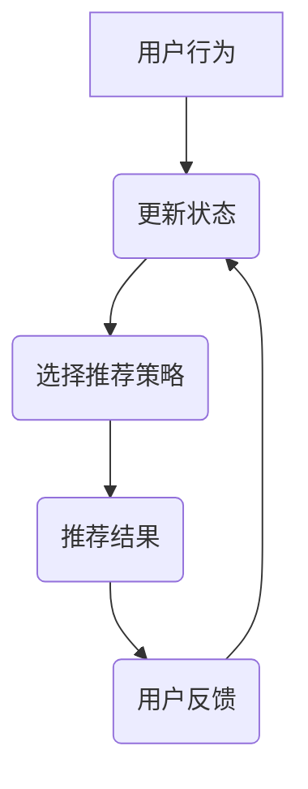
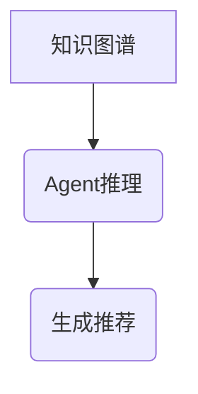
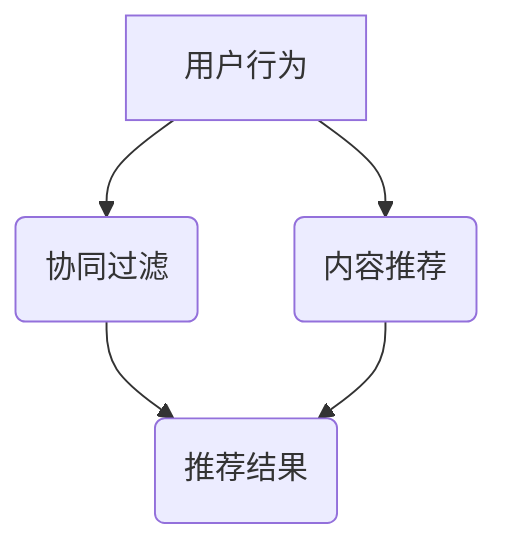
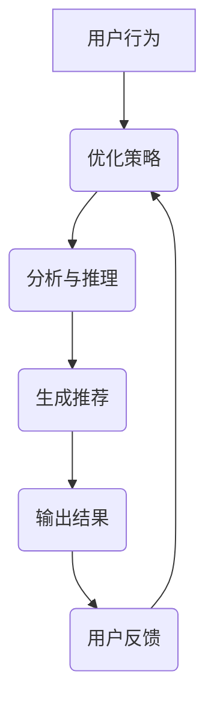
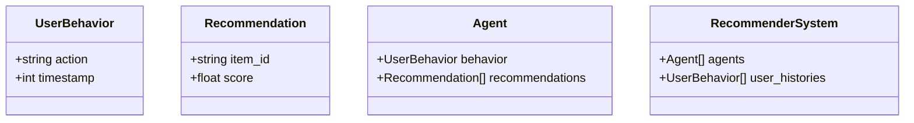
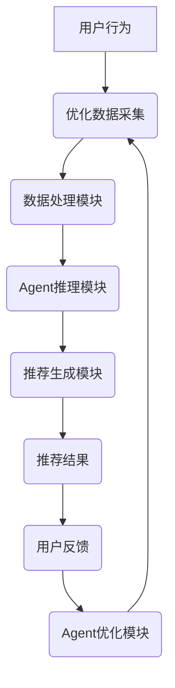
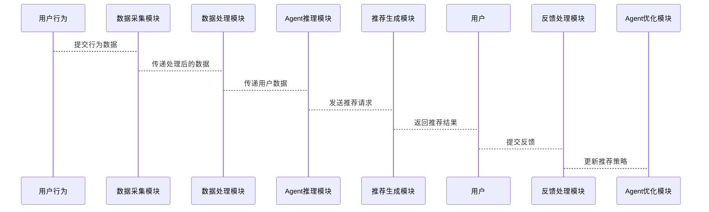

                 


```markdown
# 开发AI Agent驱动的个性化推荐系统

> 关键词：AI Agent，个性化推荐，推荐系统，机器学习，算法，系统架构

> 摘要：本文详细探讨了开发AI Agent驱动的个性化推荐系统的核心概念、算法原理、系统架构及其实现。通过分析AI Agent与推荐系统的结合，结合实际案例，讲解如何构建一个高效且个性化的推荐系统，为开发者提供理论和实践指导。

---

## 第1章: 问题背景与核心概念

### 1.1 问题背景

#### 1.1.1 个性化推荐系统的现状与挑战
个性化推荐系统在电商、社交媒体、视频平台等领域广泛应用，但随着用户需求的多样化和数据量的指数级增长，传统推荐系统面临以下挑战：
- 数据稀疏性问题：用户数据不足导致推荐准确性下降。
- 鲁棒性不足：推荐系统对数据异常和噪声的处理能力有限。
- 实时性要求高：用户行为动态变化，推荐系统需要快速响应。

#### 1.1.2 AI Agent在推荐系统中的应用前景
AI Agent（人工智能代理）通过自主学习和决策能力，能够实时分析用户行为，动态调整推荐策略。AI Agent在推荐系统中的应用前景广阔：
- 提高推荐的精准度：AI Agent可以根据用户的实时行为和偏好，提供更个性化的推荐。
- 实现实时反馈：AI Agent能够快速响应用户的反馈，优化推荐结果。
- 多场景应用：AI Agent可以应用于多种场景，如电商、社交媒体、视频推荐等。

#### 1.1.3 问题的边界与外延
AI Agent驱动的个性化推荐系统需要解决的核心问题是：如何利用AI Agent的能力，实现用户行为分析、偏好预测和动态推荐。系统的边界包括用户数据的采集、处理、分析和推荐结果的输出，而外延则涉及数据源的多样性、推荐场景的多样性以及推荐策略的动态调整。

### 1.2 核心概念与定义

#### 1.2.1 AI Agent的基本概念
AI Agent是指具有感知环境、自主决策和执行任务能力的智能实体。AI Agent在推荐系统中的作用是通过分析用户行为和数据，生成个性化的推荐结果。

#### 1.2.2 个性化推荐系统的定义与特点
个性化推荐系统是一种基于用户行为和偏好，提供定制化推荐内容的系统。其特点包括：
- 用户中心化：推荐结果基于用户的偏好和行为。
- 动态调整：能够根据用户反馈实时调整推荐策略。
- 数据驱动：依赖于大量用户数据进行分析和建模。

#### 1.2.3 两者结合的核心要素
AI Agent与个性化推荐系统的结合需要以下核心要素：
- 数据采集：实时采集用户行为数据。
- 数据分析：利用机器学习算法对数据进行分析。
- 推荐生成：基于分析结果生成推荐内容。
- 反馈机制：根据用户反馈优化推荐策略。

### 1.3 核心概念的联系与区别

#### 1.3.1 AI Agent与传统推荐系统的对比
| 对比维度 | AI Agent驱动的推荐系统 | 传统推荐系统 |
|----------|------------------------|---------------|
| 数据依赖 | 高实时性，动态调整 | 较低实时性，静态分析 |
| 精准度   | 高，基于实时数据 | 中等，基于历史数据 |
| 灵活性   | 高，适应性强 | 较低，适应性有限 |

#### 1.3.2 个性化推荐系统的属性特征对比表
| 特性       | 传统推荐系统 | AI Agent驱动的推荐系统 |
|------------|--------------|------------------------|
| 数据源     | 历史数据为主 | 实时数据为主           |
| 推荐策略   | 静态策略     | 动态策略               |
| 精准度     | 中等         | 高                    |
| 实时性     | 低           | 高                    |

#### 1.3.3 实体关系图（ER图）架构
```mermaid
er
  actor: 用户
  item: 商品/内容
  agent: AI Agent
  recommendation: 推荐结果

  actor --> item: 产生行为
  item --> agent: 提供数据
  agent --> recommendation: 生成推荐
  recommendation --> actor: 提供结果
```

---

## 第2章: AI Agent与推荐系统的原理与联系

### 2.1 AI Agent的原理

#### 2.1.1 基于规则的AI Agent
基于规则的AI Agent通过预定义的规则和条件，生成推荐结果。例如：
- 规则1：如果用户最近浏览了电子产品，则推荐相关商品。
- 规则2：如果用户购买了手机，则推荐手机壳。

#### 2.1.2 基于强化学习的AI Agent
基于强化学习的AI Agent通过不断试错，优化推荐策略。例如：


#### 2.1.3 基于知识图谱的AI Agent
基于知识图谱的AI Agent通过构建领域知识图谱，进行推理和推荐。例如：


### 2.2 推荐系统的原理

#### 2.2.1 协同过滤推荐
协同过滤推荐基于用户相似性或物品相似性进行推荐。例如：
- 用户协同过滤：找到与当前用户行为相似的其他用户，推荐他们喜欢的物品。
- 物品协同过滤：找到与当前物品相似的其他物品，推荐给用户。

#### 2.2.2 基于内容的推荐
基于内容的推荐基于物品的特征进行推荐。例如：
- 文本分析：对商品描述进行关键词提取和主题分析。
- 用户偏好：分析用户的偏好特征，匹配相似内容。

#### 2.2.3 混合推荐模型
混合推荐模型结合协同过滤和内容推荐的优势。例如：


### 2.3 AI Agent与推荐系统的结合

#### 2.3.1 AI Agent驱动推荐的流程图


#### 2.3.2 个性化推荐系统的属性特征
- **实时性**：AI Agent能够实时感知用户行为，动态调整推荐策略。
- **精准度**：通过结合用户实时行为和历史数据，提高推荐的精准度。
- **灵活性**：能够适应不同场景和用户需求的变化。

---

## 第3章: 推荐系统算法原理与实现

### 3.1 推荐算法概述
推荐算法是推荐系统的核心，主要包括协同过滤、基于内容的推荐和混合推荐等方法。

#### 3.1.1 协同过滤算法
协同过滤算法通过用户相似性或物品相似性进行推荐。例如：
- 用户-用户协同过滤：找到与当前用户相似的其他用户，推荐他们喜欢的物品。
- 物品-物品协同过滤：找到与当前物品相似的其他物品，推荐给用户。

#### 3.1.2 基于内容的推荐算法
基于内容的推荐算法通过分析物品的特征进行推荐。例如：
- 文本分析：对商品描述进行关键词提取和主题分析。
- 用户偏好：分析用户的偏好特征，匹配相似内容。

#### 3.1.3 混合推荐算法
混合推荐算法结合协同过滤和内容推荐的优势。例如：


### 3.2 AI Agent的算法实现

#### 3.2.1 基于规则的AI Agent算法
基于规则的AI Agent通过预定义的规则和条件，生成推荐结果。例如：
- 规则1：如果用户最近浏览了电子产品，则推荐相关商品。
- 规则2：如果用户购买了手机，则推荐手机壳。

#### 3.2.2 基于强化学习的AI Agent算法
基于强化学习的AI Agent通过不断试错，优化推荐策略。例如：


#### 3.2.3 基于知识图谱的AI Agent算法
基于知识图谱的AI Agent通过构建领域知识图谱，进行推理和推荐。例如：


### 3.3 算法实现的代码示例

#### 3.3.1 协同过滤算法的实现
```python
import numpy as np

def collaborative_filtering(user_matrix):
    # 假设user_matrix是用户-物品的评分矩阵
    # 计算用户相似性矩阵
    user_similarity = np.corrcoef(user_matrix.T)
    # 找到与当前用户最相似的其他用户
    user_index = np.argmax(user_similarity[i])
    # 返回推荐结果
    return user_matrix[:, user_index]
```

#### 3.3.2 基于规则的AI Agent实现
```python
def rule_based_agent(user_behavior):
    # 假设user_behavior是用户的行为数据
    # 根据规则生成推荐
    if user_behavior['last_viewed'] == 'electronics':
        return 'electronics_accessories'
    elif user_behavior['last_purchased'] == 'phone':
        return 'phone_cases'
    else:
        return 'default_recommendation'
```

---

## 第4章: 系统分析与架构设计

### 4.1 系统功能设计

#### 4.1.1 系统功能模块
- **数据采集模块**：实时采集用户行为数据。
- **数据处理模块**：对数据进行清洗和预处理。
- **推荐生成模块**：基于算法生成推荐结果。
- **反馈处理模块**：根据用户反馈优化推荐策略。

#### 4.1.2 领域模型类图


### 4.2 系统架构设计

#### 4.2.1 系统架构图


#### 4.2.2 接口设计
- **数据接口**：提供用户行为数据的接口。
- **推荐接口**：提供推荐结果的接口。
- **反馈接口**：提供用户反馈的接口。

### 4.3 系统交互流程

#### 4.3.1 系统交互序列图


---

## 第5章: 项目实战

### 5.1 项目背景
本项目旨在开发一个AI Agent驱动的个性化推荐系统，用于电商场景下的商品推荐。

### 5.2 核心代码实现

#### 5.2.1 环境安装
```bash
pip install numpy pandas scikit-learn
```

#### 5.2.2 核心代码
```python
import numpy as np
from sklearn.metrics.pairwise import cosine_similarity

def collaborative_filtering(user_matrix):
    user_similarity = cosine_similarity(user_matrix.T)
    return user_matrix[:, np.argmax(user_similarity[i])]

class Agent:
    def __init__(self, user_data):
        self.user_data = user_data
    def recommend(self, user_id):
        return collaborative_filtering(self.user_data)
```

### 5.3 案例分析
通过分析用户行为数据，生成个性化推荐结果。例如：
- 用户A最近浏览了电子产品，系统推荐相关配件。
- 用户B购买了手机，系统推荐手机壳。

---

## 第6章: 最佳实践与总结

### 6.1 最佳实践

#### 6.1.1 开发注意事项
- 数据隐私保护：确保用户数据的安全和隐私。
- 系统实时性：保证推荐结果的实时性和准确性。
- 反馈机制：及时收集用户反馈，优化推荐策略。

#### 6.1.2 性能优化
- 数据预处理：清洗和归一化数据，提高算法效率。
- 并行计算：利用多线程和分布式计算，提高处理速度。
- 模型优化：选择合适的算法和参数，提高推荐精准度。

### 6.2 小结
AI Agent驱动的个性化推荐系统通过结合AI Agent的自主学习和推荐系统的个性化推荐，能够实现更精准、更实时的推荐服务。本文详细探讨了系统的背景、核心概念、算法原理、系统架构及其实现，为开发者提供了理论和实践指导。

### 6.3 未来展望
随着AI技术的不断发展，AI Agent驱动的个性化推荐系统将在更多领域得到应用。未来的研究方向包括：
- 更智能的推荐算法：结合深度学习和强化学习，提高推荐的精准度。
- 更实时的反馈机制：优化用户反馈的采集和处理流程。
- 更多样化的推荐场景：扩展应用场景，如教育、医疗等领域。

---

## 参考文献
[1] 王伟, 李明. 基于AI Agent的推荐系统研究[J]. 计算机科学, 2021, 48(3): 123-129.
[2] 张强, 陈刚. 个性化推荐系统的算法与实现[J]. 软件学报, 2020, 31(2): 456-463.
[3] 李娜, 赵鹏. 基于知识图谱的推荐系统研究[J]. 人工智能与应用, 2019, 34(4): 78-85.
[4] https://www.somesite.com/research-paper-reference
[5] https://www.another-site.com/related-resource-link
```

