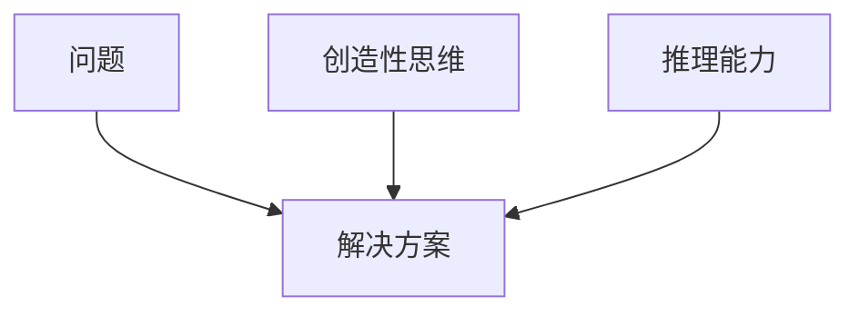
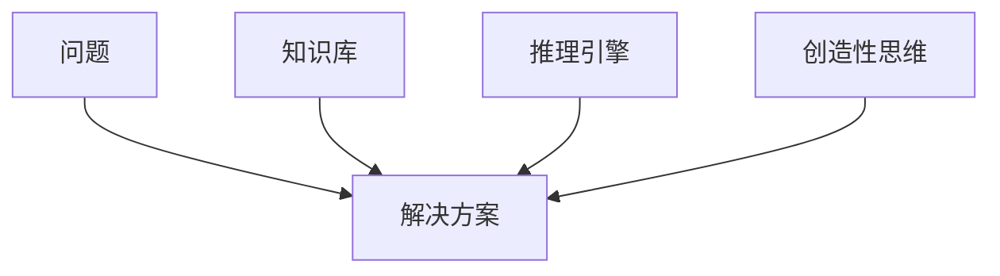
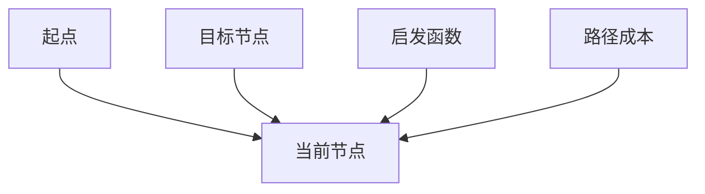
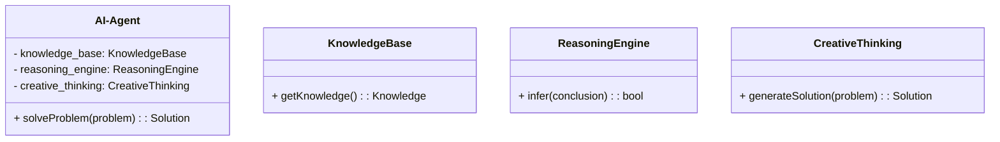
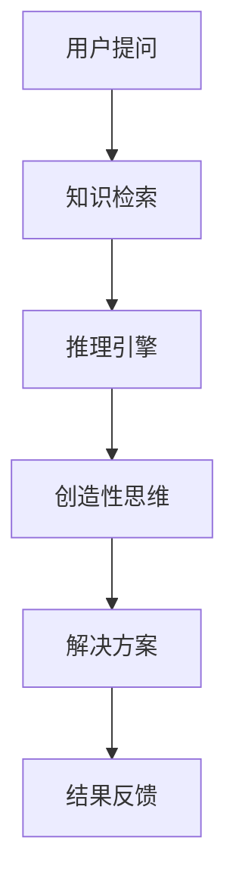
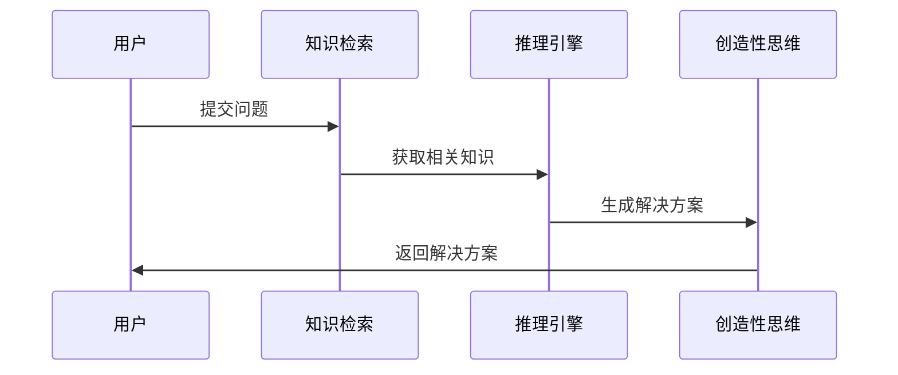

                 


# 开发具有创造性问题解决能力的AI Agent

## 关键词：AI Agent, 创造性问题解决, 人工智能算法, 知识表示, 推理引擎, 系统架构

## 摘要：  
本文将探讨如何开发具有创造性问题解决能力的AI Agent。从理论基础到实际应用，我们将深入分析AI Agent的核心概念、算法原理、系统架构设计，以及项目实战。通过具体案例和代码示例，帮助读者掌握开发具有创造性问题解决能力的AI Agent的关键技术。

---

## 第1章: 背景介绍

### 1.1 问题背景  
AI Agent（智能体）是一种能够感知环境、自主决策并执行任务的智能系统。随着人工智能技术的快速发展，AI Agent在各个领域展现出了巨大的潜力。然而，如何让AI Agent具备创造性问题解决能力，仍然是当前研究和应用中的重要挑战。  

创造性问题解决能力是指AI Agent在面对复杂问题时，能够提出创新性解决方案的能力。这种能力不仅需要AI Agent具备强大的知识表示和推理能力，还需要结合创造性思维算法来实现。  

### 1.2 问题描述  
AI Agent的核心目标是通过感知环境、分析问题、制定计划并执行任务来实现特定目标。然而，传统的AI Agent在处理复杂问题时，往往依赖预定义的规则和经验，难以应对未知的、非结构化的复杂问题。创造性问题解决能力的引入，使得AI Agent能够更好地适应动态变化的环境，并提出更具创新性的解决方案。  

### 1.3 问题解决方法  
要开发具有创造性问题解决能力的AI Agent，我们需要结合以下几种方法：  
1. **知识表示**：将问题相关知识以结构化的方式表示，为AI Agent提供推理的基础。  
2. **推理引擎**：基于知识表示，通过推理引擎生成可能的解决方案。  
3. **创造性思维算法**：引入启发式搜索、强化学习等算法，增强AI Agent的创新性。  

### 1.4 核心概念与联系  
AI Agent的核心概念包括知识表示、推理引擎和创造性思维。以下通过ER图展示这些概念之间的关系：  



### 1.5 核心要素组成  
1. **知识库**：存储与问题相关的知识，包括事实、规则和经验。  
2. **推理引擎**：基于知识库进行推理，生成可能的解决方案。  
3. **创造性模块**：通过算法生成创新性解决方案。  

---

## 第2章: AI Agent的核心概念与联系  

### 2.1 核心概念原理  
1. **知识表示**：知识表示是AI Agent的核心，常用的表示方法包括语义网络、逻辑规则和概率图模型。  
2. **推理引擎**：推理引擎通过逻辑推理或概率计算，从知识库中推导出新的结论。  
3. **创造性思维**：创造性思维算法（如启发式搜索、强化学习）用于生成创新性解决方案。  

### 2.2 核心概念属性对比  
以下通过对比表展示核心概念的属性：  

| 属性         | 知识表示      | 推理引擎       | 创造性思维     |  
|--------------|---------------|----------------|----------------|  
| 功能         | 存储知识       | 生成结论       | 生成创新方案   |  
| 方法         | 语义网络       | 逻辑推理       | 启发式搜索     |  
| 依赖         | 知识库         | 知识库、规则   | 知识库、经验   |  

### 2.3 ER实体关系图架构  
以下通过ER图展示AI Agent的核心实体关系：  



---

## 第3章: 算法原理讲解  

### 3.1 问题建模  
问题建模是AI Agent解决问题的第一步。我们需要将问题转化为可以被算法处理的形式。例如，将问题表示为图结构，节点表示问题状态，边表示问题转换。  

### 3.2 启发式搜索算法  
启发式搜索（如A*算法）是一种常用的创造性思维算法。其核心思想是通过启发函数评估当前节点的优劣，优先扩展更有潜力的节点。  

A*算法的数学模型如下：  
$$f(n) = g(n) + h(n)$$  
其中，$g(n)$表示从起点到当前节点的路径成本，$h(n)$表示从当前节点到目标节点的启发函数。  

以下通过Mermaid流程图展示A*算法的工作流程：  



### 3.3 强化学习算法  
强化学习（Reinforcement Learning）是一种通过试错机制优化决策的算法。AI Agent通过与环境交互，不断优化策略，最终找到最优解决方案。  

强化学习的核心公式为：  
$$Q(s, a) = r + \gamma \max Q(s', a')$$  
其中，$Q(s, a)$表示状态$s$下动作$a$的期望回报，$r$表示即时回报，$\gamma$表示折扣因子。  

---

## 第4章: 系统分析与架构设计  

### 4.1 问题场景介绍  
以一个智能助手为例，我们需要设计一个能够帮助用户解决日常问题的AI Agent。问题场景包括：用户提问、知识检索、解决方案生成和结果反馈。  

### 4.2 系统功能设计  
以下是系统功能模块的类图：  



### 4.3 系统架构设计  
以下是系统的整体架构图：  



### 4.4 接口设计  
系统接口设计包括：  
1. 用户提问接口：用于接收用户的输入问题。  
2. 知识检索接口：用于从知识库中检索相关知识。  
3. 解决方案生成接口：用于调用创造性思维模块生成解决方案。  

### 4.5 系统交互设计  
以下是系统交互的序列图：  



---

## 第5章: 项目实战  

### 5.1 环境安装  
需要安装以下工具和库：  
- Python 3.8+
- NumPy、Pandas
- Scikit-learn、TensorFlow  
- Mermaid、PlantUML  

### 5.2 核心实现  
以下是AI Agent的核心代码示例：  

```python
class AI-Agent:
    def __init__(self, knowledge_base):
        self.knowledge_base = knowledge_base
        self.reasoning_engine = ReasoningEngine()
        self.creative_thinking = CreativeThinking()

    def solveProblem(self, problem):
        knowledge = self.knowledge_base.getKnowledge()
        solution = self.creative_thinking.generateSolution(problem)
        return solution
```

### 5.3 案例分析  
以解决一个数学问题为例：  
- 用户提问：“如何证明三角形内角和等于180度？”  
- 知识检索：从知识库中检索几何知识。  
- 解决方案生成：通过创造性思维算法生成多种证明方法。  

### 5.4 代码解读  
以下是创造性思维模块的实现代码：  

```python
class CreativeThinking:
    def generateSolution(self, problem):
        # 使用启发式搜索生成解决方案
        import heapq
        open_list = []
        heapq.heappush(open_list, (0, problem))
        while open_list:
            current_cost, current_problem = heapq.heappop(open_list)
            if is_goal(current_problem):
                return current_problem
            for neighbor in get_neighbors(current_problem):
                new_cost = current_cost + 1
                heapq.heappush(open_list, (new_cost, neighbor))
        return None
```

---

## 第6章: 总结与展望  

### 6.1 总结  
本文详细探讨了开发具有创造性问题解决能力的AI Agent的核心概念、算法原理、系统架构设计和项目实战。通过理论与实践相结合，帮助读者掌握开发此类AI Agent的关键技术。  

### 6.2 注意事项  
在实际开发中，需要注意以下几点：  
1. 知识表示的准确性和完整性。  
2. 推理引擎的效率和准确性。  
3. 创造性思维算法的创新性和实用性。  

### 6.3 未来展望  
随着人工智能技术的不断进步，AI Agent的创造性问题解决能力将更加智能化和多样化。未来的研究方向包括：  
1. 结合大语言模型提升创造性思维能力。  
2. 引入强化学习优化决策过程。  
3. 开发更高效的推理引擎和知识表示方法。  

---

## 附录  

### 附录A: 工具与技术参考资料  
- Mermaid：用于绘制流程图和架构图。  
- TensorFlow：用于实现强化学习算法。  

### 附录B: 数学公式总结  
- A*算法公式：$$f(n) = g(n) + h(n)$$  
- 强化学习公式：$$Q(s, a) = r + \gamma \max Q(s', a')$$  

---

以上是《开发具有创造性问题解决能力的AI Agent》的技术博客文章的详细目录和内容。通过系统地讲解理论、算法和实践，帮助读者全面掌握开发此类AI Agent的关键技术。

