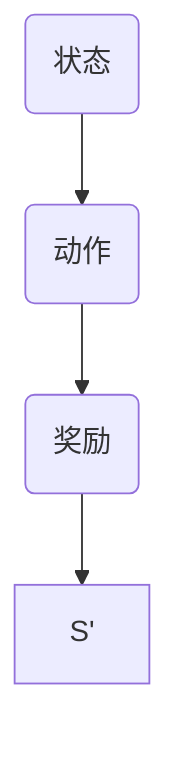
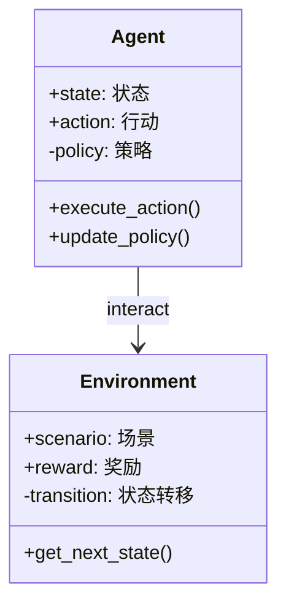

                 


---

# 开发具有复杂场景理解能力的AI Agent

> **关键词**：AI Agent、复杂场景理解、强化学习、多模态数据处理、系统架构设计  
> **摘要**：本文详细探讨了开发具有复杂场景理解能力的AI Agent的关键技术与实现方法。从AI Agent的核心概念到算法原理，再到系统架构设计和项目实战，本文为读者提供了全面的指导。通过结合理论与实践，本文旨在帮助读者理解如何构建能够在复杂场景中有效工作的AI Agent。

---

# 第一部分：AI Agent背景介绍

## 第1章：问题背景与核心概念

### 1.1 问题背景

随着人工智能技术的快速发展，AI Agent（智能体）在各个领域的应用日益广泛。然而，现有的AI技术在处理复杂场景时仍存在诸多挑战。复杂场景通常涉及多模态数据、动态环境和不确定性，传统的单一任务处理方法难以应对这些复杂性。因此，开发能够理解并适应复杂场景的AI Agent成为当前研究和应用的重点。

### 1.2 问题描述

复杂场景理解的定义可以概括为：在动态、多变且高度不确定的环境中，AI Agent需要通过感知、推理和决策，准确理解场景中的关键要素及其关系，并采取相应的行动以实现目标。AI Agent在复杂场景中的主要挑战包括：

1. **多模态数据的整合与理解**：场景中的信息可能来自视觉、听觉、文本等多种模态，如何有效整合这些数据并提取有用的信息是一个关键问题。
2. **动态环境的适应性**：场景中的要素可能会随着时间发生变化，AI Agent需要具备实时感知和快速响应的能力。
3. **不确定性处理**：复杂场景中存在许多不确定性因素，AI Agent需要在有限信息下做出合理决策。

### 1.3 核心概念与联系

AI Agent的核心要素包括感知模块、决策模块和执行模块。感知模块负责从环境中获取信息并进行初步处理；决策模块基于感知结果制定行动策略；执行模块负责将决策结果转化为实际行动。这三者之间的协同工作是AI Agent实现复杂场景理解的关键。

以下是一个简单的ER实体关系图，展示了AI Agent在复杂场景中的核心要素及其关系：

```mermaid
er
    actor: 用户
    agent: AI Agent
    scenario: 场景
    action: 行为
    relation: 关系
    actor -[1..n]-> scenario
    scenario -[1..n]-> action
    action -[1..n]-> relation
```

---

## 第2章：AI Agent的核心原理

AI Agent的核心原理主要体现在其感知、决策和执行模块的设计与实现上。

### 2.1 感知模块

感知模块负责从环境中获取信息并进行初步处理。常见的感知方式包括视觉感知、听觉感知和文本解析。多模态数据的整合与理解是感知模块的关键任务。

例如，在一个智能客服场景中，AI Agent需要同时处理用户的语音输入和屏幕上的文本信息。感知模块需要将这些数据进行整合，并提取出用户的需求和意图。

### 2.2 决策模块

决策模块基于感知结果制定行动策略。强化学习（Reinforcement Learning）是一种常用的方法，通过定义状态、动作和奖励，AI Agent可以在动态环境中逐步优化其决策策略。

### 2.3 执行模块

执行模块负责将决策结果转化为实际行动。这包括物理设备的控制（如机器人）或虚拟环境中的操作（如自动回复）。执行模块还需要具备反馈机制，以便根据执行结果调整后续的决策。

---

## 第3章：AI Agent的算法原理与数学模型

### 3.1 强化学习算法原理

强化学习是一种通过试错机制优化决策策略的方法。其核心概念包括：

- **状态（State）**：环境在某一时刻的描述。
- **动作（Action）**：AI Agent在某一状态下采取的行动。
- **奖励（Reward）**：AI Agent采取某一动作后获得的反馈，用于指导后续决策。

以下是一个强化学习算法的流程图：



数学模型方面，强化学习的目标是通过不断优化策略π(a|s)（即在状态s下采取动作a的概率）来最大化累积奖励。常见的强化学习算法包括Q-learning和Deep Q-Network（DQN）。

例如，Q-learning的目标函数可以表示为：

$$ Q(s, a) = r + \gamma \max_{a'} Q(s', a') $$

其中，γ是折扣因子，r是即时奖励。

---

### 3.2 多模态数据处理算法

复杂场景理解通常涉及多模态数据的处理。例如，在自动驾驶场景中，AI Agent需要同时处理来自摄像头、雷达和激光雷达的多源数据。

一种常用的多模态数据融合方法是基于注意力机制的多模态编码器-解码器模型。其数学表达式如下：

$$ f(x) = \text{softmax}(\frac{x_i}{\sum_j x_j}) $$

其中，x_i和x_j分别表示不同模态的数据。

---

## 第4章：系统分析与架构设计

### 4.1 系统功能设计

AI Agent的系统功能设计需要考虑以下几个方面：

1. **感知模块**：数据采集与预处理。
2. **决策模块**：状态识别与策略优化。
3. **执行模块**：行动执行与反馈收集。

以下是一个简单的系统功能模块类图：



---

## 第5章：项目实战

### 5.1 环境安装与配置

开发AI Agent需要安装以下环境：

1. Python 3.8+
2. PyTorch 1.9+
3. OpenAI Gym
4. matplotlib

### 5.2 核心代码实现

以下是一个简单的强化学习算法实现代码：

```python
import torch
import torch.nn as nn
import torch.optim as optim
import gym

# 定义策略网络
class PolicyNetwork(nn.Module):
    def __init__(self, input_dim, output_dim):
        super(PolicyNetwork, self).__init__()
        self.fc1 = nn.Linear(input_dim, 128)
        self.fc2 = nn.Linear(128, output_dim)
    
    def forward(self, x):
        x = torch.relu(self.fc1(x))
        x = torch.sigmoid(self.fc2(x))
        return x

# 初始化环境和网络
env = gym.make('CartPole-v0')
input_dim = env.observation_space.shape[0]
output_dim = env.action_space.n
policy_net = PolicyNetwork(input_dim, output_dim)
optimizer = optim.Adam(policy_net.parameters(), lr=0.001)

# 训练过程
for episode in range(1000):
    state = env.reset()
    reward_sum = 0
    while True:
        # 状态输入
        state_tensor = torch.FloatTensor(state)
        # 策略输出
        action_probs = policy_net(state_tensor)
        # 采样动作
        action = torch.multinomial(action_probs, 1).item()
        # 执行动作并获取奖励
        next_state, reward, done, _ = env.step(action)
        reward_sum += reward
        # 反向传播与优化
        policy_net.zero_grad()
        loss = -torch.log(action_probs[0][action]) * reward
        loss.backward()
        optimizer.step()
        state = next_state
        if done:
            break
    print(f"Episode {episode}: Total Reward = {reward_sum}")
```

---

## 第6章：最佳实践与注意事项

### 6.1 开发建议

1. **数据质量**：确保训练数据的多样性和代表性。
2. **模型可解释性**：在复杂场景中，模型的可解释性非常重要。
3. **实时性优化**：优化算法的运行效率，确保在实时场景中的应用。

### 6.2 小结

通过本文的介绍，读者可以了解到开发具有复杂场景理解能力的AI Agent的关键技术与实现方法。从理论到实践，本文为读者提供了全面的指导。

### 6.3 注意事项

1. 在实际应用中，需要根据具体场景调整算法参数。
2. 处理多模态数据时，要注意数据的融合方式和模型的可扩展性。
3. 系统架构设计需要考虑系统的可维护性和可扩展性。

### 6.4 拓展阅读

1. 《Deep Reinforcement Learning: An Overview》
2. 《Multi-modal Data Fusion for AI Systems》

---

**文章总结**：开发具有复杂场景理解能力的AI Agent是一项复杂的系统工程。通过结合强化学习、多模态数据处理和系统架构设计，我们可以构建出能够在复杂场景中有效工作的AI Agent。希望本文的内容能够为读者提供有价值的参考和启发。

