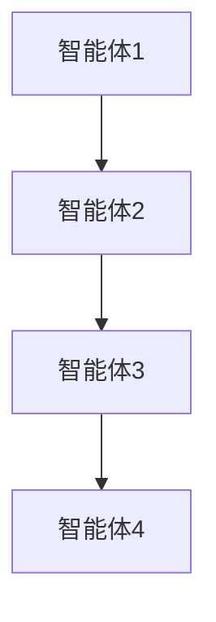
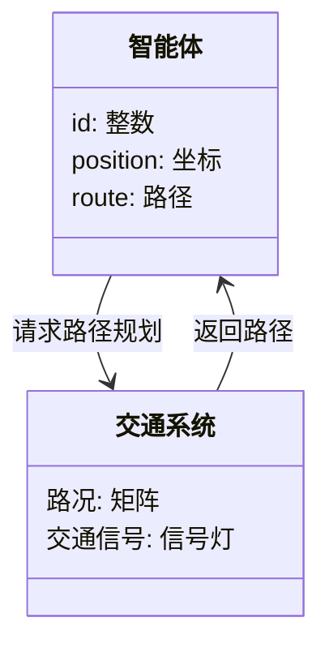
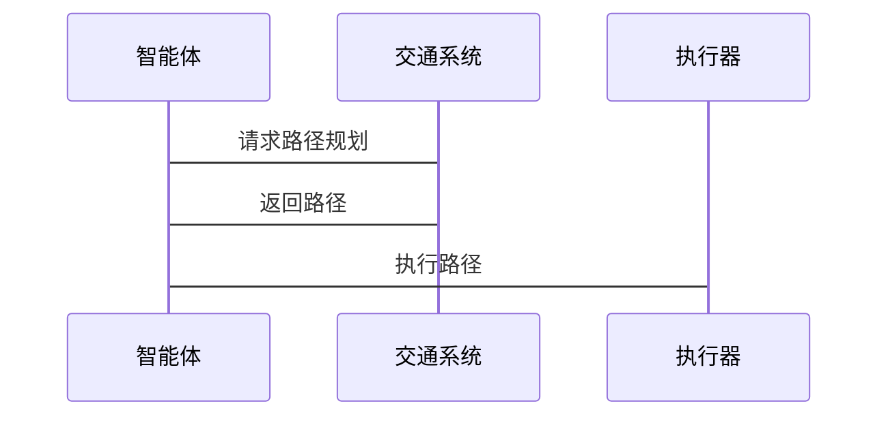

                 


# 开发具有多Agent协同规划能力的系统

> 关键词：多Agent系统、协同规划、分布式计算、系统架构、人工智能、智能体协作

> 摘要：本文系统地探讨了开发具有多Agent协同规划能力的系统的各个方面，从基本概念到算法原理，再到系统架构设计和项目实战。文章详细介绍了多Agent系统的背景、核心概念、协同规划的数学模型、算法实现、系统架构设计，以及实际项目中的应用案例。通过本文的学习，读者将能够理解多Agent协同规划的核心原理，并掌握如何将其应用于实际系统开发中。

---

## 第1章: 多Agent协同规划系统背景

### 1.1 多Agent系统的基本概念

#### 1.1.1 什么是多Agent系统
多Agent系统（Multi-Agent System, MAS）是由多个智能体（Agent）组成的分布式系统。每个智能体都是一个能够感知环境、自主决策并执行任务的实体。智能体之间通过通信和协作完成复杂的任务。

#### 1.1.2 多Agent系统的特征
多Agent系统具有以下特征：
- **自主性**：每个智能体能够自主决策。
- **反应性**：智能体能够根据环境的变化调整行为。
- **协作性**：智能体之间通过协作完成共同目标。
- **分布性**：智能体分布在网络的不同节点上，不存在集中控制。

#### 1.1.3 多Agent系统的应用场景
多Agent系统广泛应用于以下领域：
- 分布式计算
- 智能交通管理
- 机器人协作
- 大规模分布式系统

### 1.2 协同规划的定义与特点

#### 1.2.1 协同规划的定义
协同规划是指多个智能体共同制定一个行动计划，以实现共同目标的过程。

#### 1.2.2 协同规划的核心要素
- **目标一致性**：所有智能体必须有一个共同的目标。
- **信息共享**：智能体之间需要共享信息以制定协同计划。
- **动态调整**：计划需要根据环境的变化进行动态调整。

#### 1.2.3 协同规划与传统规划的区别
传统规划通常是在单个智能体或集中式系统中进行，而协同规划是在分布式多Agent系统中进行，强调智能体之间的协作。

### 1.3 多Agent协同规划的背景与意义

#### 1.3.1 当前技术背景
随着分布式系统和人工智能技术的发展，多Agent系统在各个领域的应用越来越广泛。协同规划作为多Agent系统的核心技术之一，成为研究的热点。

#### 1.3.2 协同规划在实际应用中的重要性
在实际应用中，协同规划能够提高系统的灵活性和适应性。例如，在智能交通系统中，多个智能体需要协同规划路径以避免拥堵。

#### 1.3.3 多Agent协同规划的未来发展趋势
未来，随着人工智能和分布式技术的进一步发展，协同规划将在更复杂的场景中得到应用，例如大规模分布式系统和边缘计算。

### 1.4 本章小结
本章介绍了多Agent系统的基本概念和协同规划的定义与特点。通过分析当前技术背景和未来发展趋势，强调了协同规划在多Agent系统中的重要性。

---

## 第2章: 多Agent协同规划的核心概念与联系

### 2.1 多Agent系统的核心原理

#### 2.1.1 Agent的基本结构
Agent由以下部分组成：
- **感知器**：感知环境信息。
- **推理器**：根据感知信息进行推理。
- **行动器**：根据推理结果执行动作。

#### 2.1.2 多Agent系统中的通信机制
智能体之间通过通信机制共享信息。常用的通信机制包括发布-订阅模型和点对点通信。

#### 2.1.3 多Agent系统中的协作机制
协作机制包括任务分配、协调同步和冲突解决等。

### 2.2 协同规划的数学模型与公式

#### 2.2.1 协同规划的基本数学模型
协同规划的目标是找到一组动作序列，使得所有智能体的行动协调一致。数学模型可以表示为：
$$
\text{最大化 } J = \sum_{i=1}^{n} \text{ reward}_i(a_i)
$$
其中，$a_i$ 是智能体 $i$ 的动作，$\text{reward}_i$ 是智能体 $i$ 的奖励函数。

#### 2.2.2 协同规划的约束条件
协同规划需要满足以下约束条件：
$$
\sum_{i=1}^{n} a_i = 1
$$
每个智能体只能执行一个动作。

#### 2.2.3 协同规划的目标函数
目标函数可以表示为：
$$
\text{最大化 } \sum_{i=1}^{n} \text{ reward}_i(a_i)
$$

### 2.3 多Agent协同规划的ER实体关系图

```mermaid
er
    actor: 用户
    agent: 智能体
    plan: 规划
    communication: 通信
    relation: 关联
    actor -[发起规划请求]-> agent
    agent -[接收请求]-> plan
    plan -[通过通信]-> agent
    agent -[执行规划]-> action
```

### 2.4 本章小结
本章详细介绍了多Agent系统的核心原理和协同规划的数学模型。通过ER实体关系图，展示了多Agent协同规划的系统架构。

---

## 第3章: 多Agent协同规划的算法原理

### 3.1 分布式规划算法

#### 3.1.1 分布式规划的基本原理
分布式规划算法是一种基于分布式计算的规划方法。每个智能体独立地进行规划，然后通过通信机制协调行动。

#### 3.1.2 分布式规划的实现步骤
1. 每个智能体根据自身信息生成初步计划。
2. 智能体之间通过通信机制交换信息。
3. 根据交换的信息调整各自的计划。

#### 3.1.3 分布式规划的优缺点
- **优点**：灵活性高，适应性强。
- **缺点**：计算复杂度高，容易出现冲突。

### 3.2 协同规划算法

#### 3.2.1 协同规划的基本原理
协同规划算法是一种基于协作的规划方法。智能体之间通过协作生成一个全局计划。

#### 3.2.2 协同规划的实现步骤
1. 初始化：所有智能体共享初始信息。
2. 协商：智能体之间通过协商生成一个共同的计划。
3. 执行：根据协商后的计划执行任务。

#### 3.2.3 协同规划的优缺点
- **优点**：全局最优，协调性强。
- **缺点**：通信开销大，实现复杂。

### 3.3 协同规划的数学模型



### 3.4 本章小结
本章介绍了分布式规划和协同规划的算法原理。通过数学模型和流程图，展示了算法的实现步骤。

---

## 第4章: 多Agent协同规划的系统分析与架构设计

### 4.1 系统分析

#### 4.1.1 问题场景介绍
在智能交通系统中，多个智能体需要协同规划路径以避免拥堵。

#### 4.1.2 系统功能设计
系统需要实现以下功能：
- 路径规划
- 交通流量监控
- 协调控制

#### 4.1.3 领域模型的Mermaid类图



### 4.2 系统架构设计

#### 4.2.1 系统架构的Mermaid架构图


#### 4.2.2 系统接口设计
系统接口包括：
- 智能体接口
- 交通系统接口
- 用户接口

#### 4.2.3 系统交互的Mermaid序列图



### 4.3 本章小结
本章通过系统分析和架构设计，展示了多Agent协同规划系统的整体架构。通过Mermaid图，详细描述了系统的功能模块和交互流程。

---

## 第5章: 多Agent协同规划的项目实战

### 5.1 环境安装

#### 5.1.1 开发工具
- Python
- PyCharm
- Mermaid

#### 5.1.2 系统依赖
安装以下依赖：
```bash
pip install mermaid
```

### 5.2 核心代码实现

#### 5.2.1 多Agent协同规划算法实现

```python
class Agent:
    def __init__(self, id):
        self.id = id
        self.position = (0, 0)
    
    def plan(self, target):
        # 简单的路径规划算法
        pass

class TrafficSystem:
    def __init__(self):
        self.system_status = "normal"
    
    def get_status(self):
        return self.system_status

# 使用示例
agent = Agent(1)
traffic = TrafficSystem()
agent.plan((1, 1))
```

#### 5.2.2 通信模块实现

```python
class Communicator:
    def __init__(self):
        self.messages = []
    
    def send(self, sender, message):
        self.messages.append((sender, message))
    
    def receive(self, receiver):
        messages = [msg for msg in self.messages if msg[0] == receiver]
        return messages

comm = Communicator()
comm.send("Agent1", "请求路径规划")
comm.receive("Agent2")
```

### 5.3 案例分析

#### 5.3.1 应用场景
在智能交通系统中，多个智能体需要协同规划路径。

#### 5.3.2 实际案例分析
通过代码实现路径规划和通信模块，展示多Agent协同规划的实际应用。

### 5.4 项目总结
本章通过实际项目，展示了多Agent协同规划系统的开发过程。从环境安装到核心代码实现，再到案例分析，详细描述了开发的每一步。

---

## 第6章: 最佳实践与总结

### 6.1 最佳实践

#### 6.1.1 开发过程中的注意事项
- 确保智能体之间的通信可靠。
- 定期进行系统测试和优化。

#### 6.1.2 提高系统性能的技巧
- 使用高效的通信协议。
- 优化算法复杂度。

### 6.2 小结
通过本文的学习，读者可以掌握多Agent协同规划的核心原理和开发方法。从系统背景到项目实战，全面了解了多Agent协同规划的开发过程。

### 6.3 未来展望
随着人工智能和分布式技术的发展，多Agent协同规划将在更复杂的场景中得到应用，例如大规模分布式系统和边缘计算。

---

## 参考文献

1. 《Multi-Agent Systems》
2. 《Distributed Computing》
3. 《Artificial Intelligence》

---

通过本文的学习，读者将能够理解多Agent协同规划的核心原理，并掌握如何将其应用于实际系统开发中。

