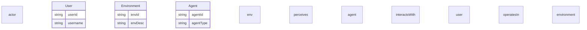
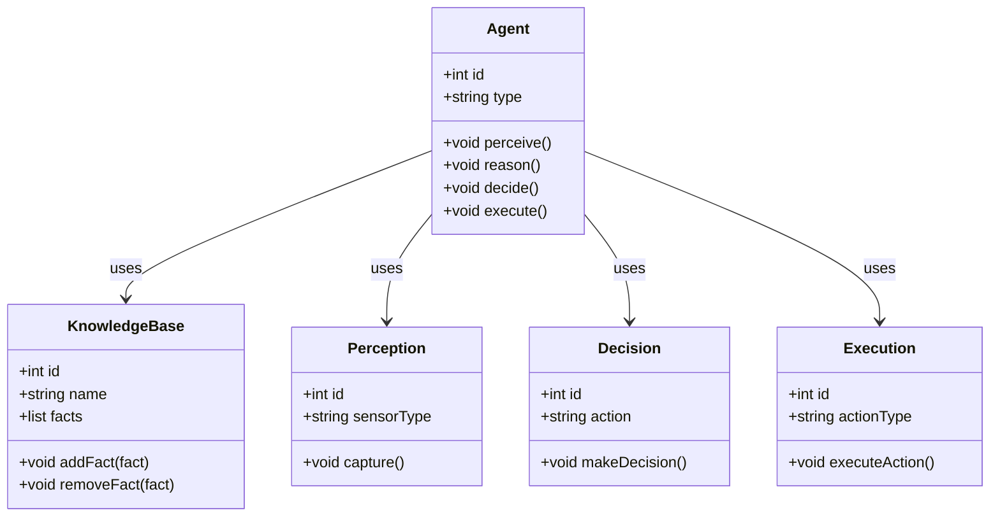
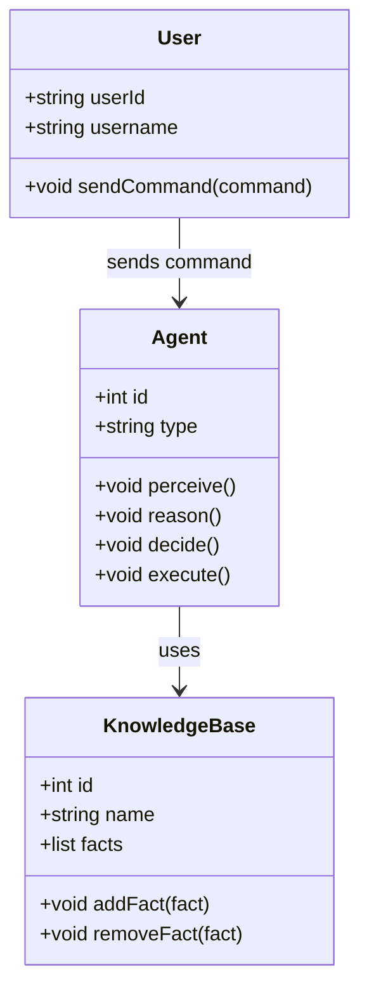

                 


# 开发具有视觉常识推理能力的AI Agent

## 关键词：AI Agent, 视觉常识推理, 知识图谱, 神经符号推理, 深度学习

## 摘要：  
本文探讨了开发具有视觉常识推理能力的AI Agent的关键技术与方法。首先，介绍了AI Agent的基本概念和视觉常识推理的核心概念，分析了其在人工智能领域的重要性和应用前景。接着，详细讲解了视觉常识推理的算法原理，包括基于知识图谱和神经符号的推理方法。随后，分析了系统的架构设计，结合实际案例展示了如何构建一个具备视觉常识推理能力的AI Agent。最后，总结了开发过程中的注意事项，并展望了未来的发展方向。

---

# 第1章: AI Agent与视觉常识推理概述

## 1.1 AI Agent的基本概念

### 1.1.1 AI Agent的定义  
AI Agent（人工智能代理）是指能够感知环境、自主决策并执行任务的智能体。它可以是一个软件程序、机器人或其他智能系统，具备学习、推理、规划和执行能力。

### 1.1.2 AI Agent的类型  
AI Agent可以根据智能水平分为以下几类：  
1. **反应式AI Agent**：基于当前感知做出实时反应，适用于简单任务。  
2. **认知式AI Agent**：具备复杂推理和规划能力，适用于复杂任务。  
3. **学习型AI Agent**：能够通过数据和经验不断优化自身性能。  

### 1.1.3 AI Agent的核心能力  
AI Agent的核心能力包括：  
1. **感知能力**：通过传感器或数据输入感知环境。  
2. **推理能力**：基于感知信息进行逻辑推理。  
3. **决策能力**：根据推理结果做出最优决策。  
4. **执行能力**：通过执行机构完成任务。  

---

## 1.2 视觉常识推理的定义与特点

### 1.2.1 视觉常识推理的定义  
视觉常识推理是指AI Agent在处理视觉信息时，结合常识知识进行推理的能力。它不仅能够识别图像中的物体，还能理解物体之间的关系和场景的上下文信息。

### 1.2.2 视觉常识推理的核心特点  
1. **跨模态性**：结合视觉信息和常识知识，实现多模态推理。  
2. **场景理解**：能够理解复杂场景中的物体关系和语义信息。  
3. **动态推理**：能够根据实时感知信息动态更新推理结果。  

### 1.2.3 视觉常识推理与传统视觉识别的区别  
传统视觉识别主要关注物体的检测和分类，而视觉常识推理更注重物体之间的关系和场景的理解，具有更强的语义理解和推理能力。

---

## 1.3 AI Agent在视觉常识推理中的应用

### 1.3.1 视觉常识推理的应用场景  
1. **智能助手**：帮助用户处理日常任务，如识别物体、推理场景信息。  
2. **机器人控制**：在工业或家庭环境中，机器人需要理解环境并执行复杂任务。  
3. **自动驾驶**：自动驾驶汽车需要理解道路环境和交通规则。  

### 1.3.2 AI Agent在视觉常识推理中的优势  
1. **语义理解**：能够理解视觉信息中的语义关系。  
2. **动态适应**：能够根据环境变化动态调整推理策略。  
3. **复杂任务处理**：能够处理需要多模态推理的复杂任务。  

### 1.3.3 当前技术的挑战与未来发展方向  
当前技术的主要挑战包括：  
1. **常识知识的表示与推理**：如何有效地表示和推理常识知识。  
2. **跨模态整合**：如何将视觉信息与常识知识有效地整合。  
3. **实时性与效率**：如何在实时应用中保证推理的效率。  

未来发展方向包括：  
1. **更高效的推理算法**：开发更高效的推理算法，提升推理速度和准确率。  
2. **多模态整合技术**：进一步研究视觉、语言和其他模态的整合技术。  
3. **大规模常识知识库**：构建更大规模的常识知识库，提升推理能力。  

---

## 1.4 本章小结  
本章介绍了AI Agent的基本概念和视觉常识推理的核心概念，分析了视觉常识推理的应用场景、优势以及当前技术的挑战与未来发展方向。接下来的章节将深入探讨视觉常识推理的算法原理和系统架构设计。

---

# 第2章: 视觉常识推理的核心概念

## 2.1 视觉感知与常识推理的关系

### 2.1.1 视觉感知的定义与实现  
视觉感知是指AI Agent通过视觉传感器（如摄像头）感知环境的能力，主要任务包括目标检测、图像分割和场景理解。

### 2.1.2 常识推理的定义与实现  
常识推理是指基于常识知识进行推理的能力，例如知道“鸟会飞”或“水在沸点会蒸发”。常识推理的核心是构建和使用常识知识库。

### 2.1.3 两者的结合与应用  
视觉感知提供了场景中的物体信息，而常识推理提供了物体之间的关系和语义信息。两者结合可以实现更高级的视觉理解任务。

---

## 2.2 视觉常识推理的数学模型

### 2.2.1 基于知识图谱的推理模型  
知识图谱是一种图结构，节点表示实体，边表示实体之间的关系。基于知识图谱的推理模型通过查询图中的路径来推理新的事实。

### 2.2.2 基于神经符号的推理模型  
神经符号模型结合了神经网络和符号推理，能够处理复杂的视觉信息和常识推理任务。

### 2.2.3 模型的优缺点对比  
| 模型类型 | 优点 | 缺点 |  
|----------|------|------|  
| 知识图谱 | 结构清晰，推理可解释 | 数据稀疏性问题，推理速度较慢 |  
| 神经符号 | 强大的表示能力，推理速度快 | 需要大量数据训练，可解释性较差 |  

---

## 2.3 常识推理的实现方法

### 2.3.1 基于规则的推理方法  
基于规则的推理方法通过预定义的规则进行推理，例如“如果A在B的上面，那么A在B的正上方”。这种方法适用于简单推理任务，但难以处理复杂场景。

### 2.3.2 基于统计的推理方法  
基于统计的推理方法通过概率模型进行推理，例如贝叶斯网络。这种方法能够处理不确定性，但需要大量数据支持。

### 2.3.3 基于深度学习的推理方法  
基于深度学习的推理方法通过神经网络进行推理，例如注意力机制和图神经网络。这种方法能够处理复杂任务，但需要大量数据和计算资源。

---

## 2.4 本章小结  
本章详细介绍了视觉感知与常识推理的关系，分析了视觉常识推理的数学模型和实现方法。接下来的章节将探讨视觉常识推理的算法原理和系统架构设计。

---

# 第3章: 视觉常识推理的算法原理

## 3.1 基于知识图谱的推理算法

### 3.1.1 知识图谱的构建与表示  
知识图谱的构建包括数据采集、实体识别、关系抽取和图结构表示。常用的表示方法包括RDF（资源描述框架）和R-Wiki。

### 3.1.2 基于知识图谱的推理流程  
1. **知识表示**：将常识知识表示为图结构。  
2. **查询与推理**：通过图遍历或基于规则的推理算法，从图中推导出新的事实。  
3. **结果验证**：验证推理结果的准确性和合理性。  

### 3.1.3 典型算法实现与代码示例  
以下是一个基于知识图谱的推理算法的Python代码示例：  

```python
from kgpedia import KGpedia

kg = KGpedia()  # 初始化知识图谱
result = kg.query("鸟会飞")  # 查询鸟会飞
print(result)  # 输出推理结果
```

---

## 3.2 基于神经符号的推理算法

### 3.2.1 神经符号推理的定义与特点  
神经符号推理结合了神经网络的表示能力和符号推理的逻辑能力，适用于复杂的视觉和常识推理任务。

### 3.2.2 神经符号推理的实现框架  
神经符号推理的实现框架包括编码器-解码器结构、注意力机制和符号推理模块。

### 3.2.3 典型算法实现与代码示例  
以下是一个基于神经符号推理的算法的Python代码示例：  

```python
import tensorflow as tf
from model import NeuralSymbolicModel

model = NeuralSymbolicModel()  # 初始化模型
model.compile(optimizer='adam', loss='binary_crossentropy')  # 编译模型
model.fit(X_train, y_train, epochs=10)  # 训练模型
```

---

## 3.3 算法的数学模型与公式

### 3.3.1 知识图谱的数学模型  
知识图谱可以用图论中的图表示，其中节点表示实体，边表示关系。图的表示可以使用邻接矩阵或边列表。

### 3.3.2 神经符号推理的数学模型  
神经符号推理的数学模型通常基于深度学习框架，例如循环神经网络（RNN）或变换器（Transformer）。

---

## 3.4 本章小结  
本章详细探讨了基于知识图谱和神经符号的推理算法，分析了它们的实现框架和数学模型。接下来的章节将探讨系统的架构设计和项目实战。

---

# 第4章: 系统架构设计

## 4.1 系统整体架构

### 4.1.1 系统功能模块划分  
AI Agent的系统架构通常包括感知模块、推理模块、决策模块和执行模块。

### 4.1.2 系统功能流程  
1. **感知**：通过视觉传感器获取环境信息。  
2. **推理**：基于感知信息进行常识推理。  
3. **决策**：根据推理结果做出决策。  
4. **执行**：通过执行机构完成任务。  

### 4.1.3 系统交互流程  
1. **输入感知信息**：例如，摄像头获取图像信息。  
2. **推理模块处理**：结合常识知识进行推理。  
3. **决策模块做出决策**：根据推理结果做出决策。  
4. **执行模块执行任务**：通过执行机构完成任务。  

---

## 4.2 系统功能设计

### 4.2.1 系统功能需求分析  
系统功能需求包括：  
1. **视觉感知**：支持多种视觉传感器输入。  
2. **常识推理**：支持基于知识图谱和神经符号的推理算法。  
3. **决策与规划**：能够根据推理结果做出决策并规划执行步骤。  
4. **人机交互**：支持与用户进行自然语言交互。  

### 4.2.2 系统功能设计的ER实体关系图  
以下是一个简单的ER实体关系图（使用Mermaid）：



---

## 4.3 系统架构设计

### 4.3.1 系统架构的实现框架  
AI Agent的系统架构通常采用分层架构，包括感知层、推理层、决策层和执行层。

### 4.3.2 系统架构的类图  
以下是一个系统的类图（使用Mermaid）：



---

## 4.4 本章小结  
本章详细探讨了AI Agent的系统架构设计，包括功能模块划分、系统交互流程和系统架构类图。接下来的章节将通过项目实战进一步展示如何开发具备视觉常识推理能力的AI Agent。

---

# 第5章: 项目实战——开发具备视觉常识推理能力的智能助手

## 5.1 项目背景与需求分析

### 5.1.1 项目背景  
智能助手是一种常见的AI Agent应用，能够通过视觉感知和常识推理帮助用户完成日常任务。

### 5.1.2 项目需求  
1. **视觉感知**：能够识别图像中的物体。  
2. **常识推理**：能够理解物体之间的关系和场景的上下文。  
3. **人机交互**：支持用户通过自然语言与智能助手交互。  

---

## 5.2 系统设计

### 5.2.1 系统功能设计  
智能助手的功能包括：  
1. **视觉识别**：识别图像中的物体。  
2. **常识推理**：推理物体之间的关系。  
3. **自然语言交互**：支持用户通过语言指令与智能助手交互。  

### 5.2.2 系统设计的领域模型  
以下是一个领域的类图（使用Mermaid）：



---

## 5.3 系统实现

### 5.3.1 环境安装  
需要安装的环境包括Python、TensorFlow、OpenCV等。

### 5.3.2 核心实现代码  
以下是智能助手的核心实现代码：

```python
import cv2
from model import AgentModel

class SmartAssistant:
    def __init__(self):
        self.agent = AgentModel()
        self.camera = cv2.VideoCapture(0)

    def perceive(self):
        # 获取摄像头图像
        ret, frame = self.camera.read()
        if not ret:
            return None
        return frame

    def reason(self, image):
        # 调用Agent模型进行推理
        result = self.agent.reason(image)
        return result

    def decide(self, result):
        # 根据推理结果做出决策
        decision = self.agent.decide(result)
        return decision

    def execute(self, decision):
        # 执行决策
        self.agent.execute(decision)

    def run(self):
        while True:
            image = self.perceive()
            result = self.reason(image)
            decision = self.decide(result)
            self.execute(decision)
```

---

## 5.4 项目测试与验证

### 5.4.1 测试用例设计  
设计测试用例，包括正常情况和异常情况。

### 5.4.2 测试结果分析  
分析测试结果，找出系统中的问题并进行优化。

---

## 5.5 本章小结  
本章通过一个具体的智能助手项目，展示了如何开发具备视觉常识推理能力的AI Agent。接下来的章节将总结开发过程中的注意事项和未来的发展方向。

---

# 第6章: 总结与展望

## 6.1 本章总结  
本文详细探讨了开发具有视觉常识推理能力的AI Agent的关键技术与方法，包括核心概念、算法原理、系统架构设计和项目实战。

## 6.2 开发过程中的注意事项  
1. **数据质量**：确保常识知识库的质量和准确性。  
2. **模型优化**：优化推理算法的效率和准确率。  
3. **系统集成**：确保各模块之间的协同工作。  

## 6.3 未来的发展方向  
1. **更高效的推理算法**：开发更高效的推理算法，提升推理速度和准确率。  
2. **多模态整合技术**：进一步研究视觉、语言和其他模态的整合技术。  
3. **大规模常识知识库**：构建更大规模的常识知识库，提升推理能力。  

## 6.4 最佳实践 tips  
1. **数据预处理**：在开发过程中，数据预处理是非常重要的一步，确保数据的准确性和完整性。  
2. **模型调优**：通过交叉验证和网格搜索等方法，优化模型的性能。  
3. **系统测试**：在开发过程中，进行全面的系统测试，确保各模块的协同工作。  

---

## 6.5 结语  
开发具有视觉常识推理能力的AI Agent是一个复杂而具有挑战性的任务，但随着技术的进步，未来将有更广泛的应用场景。希望本文能够为读者提供有价值的参考和启发。

---

# 结束语  
感谢您的阅读！希望本文能够帮助您更好地理解开发具有视觉常识推理能力的AI Agent的核心技术和方法。如果您有任何问题或建议，请随时与我联系。

--- 

通过以上结构化的内容，您可以逐步深入了解开发具有视觉常识推理能力的AI Agent的各个方面。

