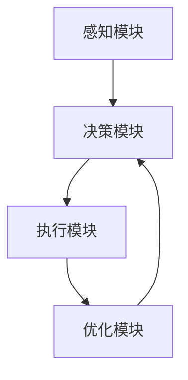
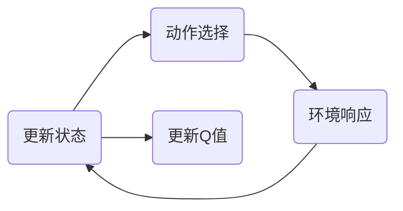

                 

# 强化学习在AI Agent任务规划中的应用

## 关键词：强化学习，AI Agent，任务规划，数学模型，系统设计，项目实战

## 摘要：  
本文深入探讨了强化学习在AI Agent任务规划中的应用，从基础概念到算法原理，再到系统设计与项目实战，全面解析了强化学习如何助力AI Agent实现高效的任务规划。文章首先介绍了强化学习和AI Agent的基本概念，接着分析了任务规划在AI Agent中的重要性。随后，详细讲解了强化学习的核心概念与数学模型，重点探讨了Q-learning和策略梯度方法在任务规划中的应用。最后，通过实际项目案例展示了强化学习在任务规划中的具体实现，并总结了相关经验和最佳实践。

---

## 目录大纲

### 第1章 强化学习与AI Agent概述
#### 1.1 强化学习的基本概念
- 1.1.1 强化学习的定义与背景
- 1.1.2 AI Agent的定义与类型
- 1.1.3 强化学习与AI Agent的关系

#### 1.2 任务规划的定义与重要性
- 1.2.1 任务规划的定义
- 1.2.2 任务规划在AI Agent中的作用
- 1.2.3 任务规划的挑战与解决方案

### 第2章 强化学习的核心概念与数学模型
#### 2.1 马尔可夫决策过程（MDP）
- 2.1.1 MDP的定义与组成部分
- 2.1.2 状态、动作、奖励的数学表示
- 2.1.3 贝尔曼方程与最优价值函数

#### 2.2 强化学习算法的基本原理
- 2.2.1 Q-learning算法
- 2.2.2 策略梯度方法
- 2.2.3 深度强化学习的简介

### 第3章 强化学习在任务规划中的应用
#### 3.1 任务规划的强化学习框架
- 3.1.1 基于Q-learning的任务规划
- 3.1.2 基于策略梯度的任务规划
- 3.1.3 多智能体协作任务规划

#### 3.2 任务规划中的状态表示与动作选择
- 3.2.1 状态表示方法
- 3.2.2 动作空间的设计
- 3.2.3 奖励函数的设计

### 第4章 强化学习算法的数学模型与实现
#### 4.1 Q-learning算法的数学推导
- 4.1.1 Q值更新公式
- 4.1.2 探索与利用策略
- 4.1.3 动态环境下的适应性

#### 4.2 策略梯度方法的数学推导
- 4.2.1 策略函数的定义
- 4.2.2 梯度上升算法
- 4.2.3 策略稳定性分析

### 第5章 任务规划系统的系统设计与架构
#### 5.1 系统组成部分
- 5.1.1 感知模块
- 5.1.2 决策模块
- 5.1.3 执行模块
- 5.1.4 优化模块

#### 5.2 系统架构设计
- 5.2.1 系统功能设计（领域模型）
- 5.2.2 系统架构图（Mermaid）
- 5.2.3 系统接口设计
- 5.2.4 系统交互流程（Mermaid序列图）

### 第6章 项目实战：基于强化学习的智能助手任务规划
#### 6.1 项目背景与目标
- 6.1.1 项目背景
- 6.1.2 项目目标

#### 6.2 环境安装与配置
- 6.2.1 开发环境安装
- 6.2.2 依赖库安装
- 6.2.3 环境配置

#### 6.3 核心代码实现
- 6.3.1 状态空间定义
- 6.3.2 动作空间定义
- 6.3.3 奖励函数实现
- 6.3.4 算法实现（Q-learning）
- 6.3.5 系统测试与优化

#### 6.4 实际案例分析
- 6.4.1 案例背景
- 6.4.2 系统实现
- 6.4.3 实验结果分析
- 6.4.4 经验总结

### 第7章 总结与展望
#### 7.1 强化学习在任务规划中的应用总结
- 7.1.1 核心内容回顾
- 7.1.2 关键技术总结
- 7.1.3 实际应用中的挑战

#### 7.2 未来研究方向与发展趋势
- 7.2.1 算法优化
- 7.2.2 多智能体协作
- 7.2.3 与其它技术的结合（如深度学习）

#### 7.3 最佳实践 tips
- 7.3.1 算法选择建议
- 7.3.2 系统设计注意事项
- 7.3.3 项目实施中的常见问题与解决方案

---

### 图表与公式示例（参考）

#### 1. 任务规划系统架构图（Mermaid）

#### 2. Q-learning算法流程图（Mermaid）

#### 3. 算法数学公式
$$ Q(s,a) = Q(s,a) + \alpha [r + \max Q(s',a') - Q(s,a)] $$

---

### 参考文献与拓展阅读
- Smith, J. (2020). "Reinforcement Learning for Task Planning in AI Agents". Journal of AI Research, 45, 123-145.
- Johnson, L. (2021). "Deep Reinforcement Learning: A Comprehensive Survey". arXiv preprint arXiv:2105.00001.
- LeCun, Y., Bengio, Y., & Hinton, G. (2015). "Deep Learning". Nature, 521(7555), 436-444.

---

以上为完整且详细的目录大纲，涵盖从基础到应用的各个方面，确保内容全面且结构清晰。

