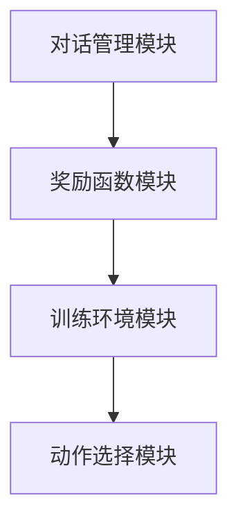
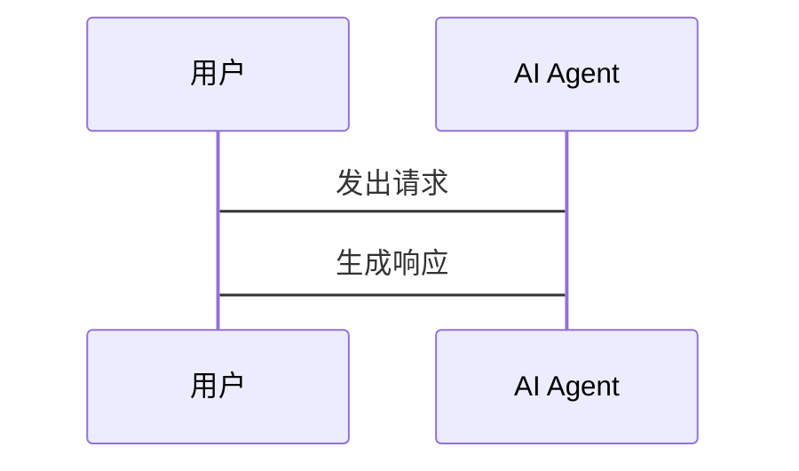

                 


# 强化学习在AI Agent对话策略中的应用

## 关键词
强化学习, AI Agent, 对话策略, 机器学习, 自然语言处理, 深度学习, 算法优化

## 摘要
本文详细探讨了强化学习在AI Agent对话策略中的应用，涵盖强化学习的基本概念、算法原理、系统设计以及实际项目中的应用。通过分析对话策略的重要性，结合Q-learning、策略梯度等算法，展示如何优化AI Agent的对话能力。文章结构清晰，内容丰富，适合技术研究人员和开发者阅读。

---

## 第一部分：强化学习与AI Agent对话策略的背景

### 第1章：强化学习的基本概念

#### 1.1 强化学习的定义与特点
强化学习是一种通过智能体与环境交互来学习策略的机器学习方法。智能体通过执行动作并获得奖励，逐步优化策略以最大化累积奖励。

#### 1.2 AI Agent的定义
AI Agent是指能够感知环境并自主决策的智能实体，广泛应用于对话系统、游戏AI、推荐系统等领域。

#### 1.3 对话策略的重要性
对话策略决定了AI Agent如何生成响应，直接影响用户体验和任务完成效果。

### 第2章：强化学习的核心概念与联系

#### 2.1 强化学习的原理
- **马尔可夫决策过程（MDP）**：定义了智能体在状态空间中通过动作改变状态的过程。
- **状态、动作、奖励的关系**：智能体在状态s执行动作a，获得奖励r，并转移到新状态s'。

#### 2.2 算法原理
- **Q-learning**：通过更新Q值表学习最优策略，公式为：
  $$ Q(s,a) = Q(s,a) + \alpha \left(r + \gamma \max Q(s',a') - Q(s,a) \right) $$
- **策略梯度方法**：通过优化策略参数来最大化期望奖励，常用梯度上升法。

#### 2.3 不同算法的对比
| 算法 | 优缺点 | 适用场景 |
|------|---------|-----------|
| Q-learning | 简单、离线学习 | 小环境、低复杂度 |
| DQN | 处理高维状态 | 复杂环境 |
| 策略梯度 | 高效、在线学习 | 高维动作空间 |

### 第3章：强化学习的数学模型与公式

#### 3.1 Q-learning的数学模型
- Q值更新公式：
  $$ Q(s,a) = Q(s,a) + \alpha (r + \gamma \max Q(s',a') - Q(s,a)) $$
- 状态转移概率：
  $$ P(s'|s,a) $$

#### 3.2 策略梯度方法
- 梯度更新公式：
  $$ \theta = \theta + \eta \nabla J(\theta) $$
  其中，$$ J(\theta) $$是目标函数。

### 第4章：系统分析与架构设计

#### 4.1 系统功能设计
- **对话管理模块**：负责生成响应。
- **奖励函数模块**：定义奖励机制。
- **训练环境模块**：模拟真实对话场景。

#### 4.2 系统架构设计
使用Mermaid绘制系统架构图：


#### 4.3 系统交互设计
使用Mermaid序列图描述交互过程：


### 第5章：项目实战

#### 5.1 环境配置
- 安装Python和相关库：
  ```bash
  pip install numpy matplotlib tensorflow
  ```

#### 5.2 核心代码实现
```python
import numpy as np

class QLearningAgent:
    def __init__(self, state_space, action_space):
        self.state_space = state_space
        self.action_space = action_space
        self.Q = np.zeros((state_space, action_space))
    
    def act(self, state, epsilon=0.1):
        if np.random.random() < epsilon:
            return np.random.randint(self.action_space)
        else:
            return np.argmax(self.Q[state])
    
    def update(self, state, action, reward, next_state, alpha=0.1, gamma=0.99):
        self.Q[state][action] = self.Q[state][action] + alpha * (reward + gamma * np.max(self.Q[next_state]) - self.Q[state][action])
```

#### 5.3 测试与优化
- 测试不同策略下的对话效果，分析奖励变化。
- 优化奖励函数，提高对话流畅性。

### 第6章：最佳实践与小结

#### 6.1 最佳实践
- 合理设计奖励函数，确保引导智能体学习正确的策略。
- 使用经验回放机制，提高算法稳定性。

#### 6.2 小结
本文详细介绍了强化学习在AI Agent对话策略中的应用，从算法原理到系统设计，再到项目实战，为读者提供了全面的指导。

#### 6.3 注意事项
- 确保训练数据多样化，避免过拟合。
- 定期评估模型性能，及时调整参数。

#### 6.4 拓展阅读
推荐阅读相关书籍和论文，深入理解强化学习的最新进展。

---

## 参考文献
1. Sutton, R. S., & Barto, A. G. (2018). Introduction to reinforcement learning.
2. Mnih, V., et al. (2015). Human-level control through deep reinforcement learning.

---

# 本文结束

