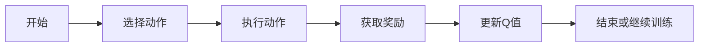
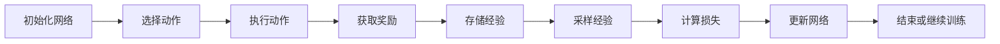
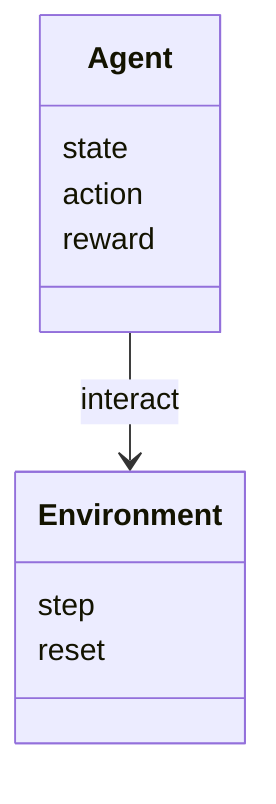
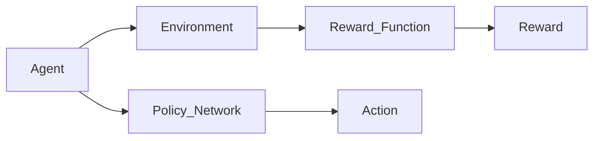
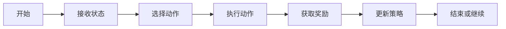

                 


# 强化学习在AI Agent开发中的应用

> 关键词：强化学习, AI Agent, 深度强化学习, 游戏AI, 机器人控制, 多智能体协作

> 摘要：强化学习是一种通过试错机制来优化智能体决策能力的机器学习方法，广泛应用于AI Agent的开发中。本文从强化学习的基本概念、核心原理、算法实现、系统架构设计到项目实战，全面深入地探讨了强化学习在AI Agent开发中的应用。通过详细分析DQN、PPO等经典算法，结合实际项目案例，为读者提供了一套完整的AI Agent开发方法论。本文还总结了强化学习在AI Agent开发中的优势与挑战，并展望了未来的发展方向。

---

# 第一部分: 强化学习与AI Agent开发基础

---

## 第1章: 强化学习与AI Agent概述

### 1.1 强化学习的基本概念

#### 1.1.1 什么是强化学习
强化学习（Reinforcement Learning, RL）是一种机器学习范式，通过智能体与环境的交互，学习最优策略以最大化累积奖励。与监督学习和无监督学习不同，强化学习强调通过试错机制不断优化决策。

- **核心要素**：
  - **状态（State）**：环境的当前情况。
  - **动作（Action）**：智能体的决策。
  - **奖励（Reward）**：环境对智能体行为的反馈。
  - **策略（Policy）**：智能体选择动作的规则。
  - **值函数（Value Function）**：衡量状态或动作价值的函数。

#### 1.1.2 强化学习的核心要素
- **探索与利用**：智能体需要在探索新策略和利用已知策略之间找到平衡。
- **马尔可夫假设**：智能体只能根据当前状态做出决策，而无需考虑历史信息。

#### 1.1.3 AI Agent的定义与特点
- **AI Agent**：能够感知环境并自主决策的智能体。
- **特点**：
  - **自主性**：无需外部干预。
  - **反应性**：能够实时感知并做出决策。
  - **目标导向**：通过最大化奖励来实现目标。

### 1.2 强化学习的应用场景

#### 1.2.1 游戏AI
- **典型应用**：游戏AI通过强化学习掌握游戏策略，如AlphaGo、OpenAI的Dota 2 AI。
- **优势**：快速学习复杂策略，适应动态环境。

#### 1.2.2 机器人控制
- **典型应用**：工业机器人、服务机器人通过强化学习优化动作控制。
- **优势**：提高操作精度和效率。

#### 1.2.3 自动驾驶
- **典型应用**：自动驾驶汽车通过强化学习优化路径规划和决策。
- **优势**：提升复杂环境下的决策能力。

### 1.3 强化学习与传统机器学习的对比

#### 1.3.1 监督学习、无监督学习与强化学习的区别
- **监督学习**：基于标记数据进行预测。
- **无监督学习**：发现数据中的模式。
- **强化学习**：通过试错优化决策。

#### 1.3.2 强化学习的独特优势
- **目标导向**：直接优化目标函数。
- **动态环境**：适应复杂变化的环境。

---

## 第2章: 强化学习的核心原理

### 2.1 马尔可夫决策过程（MDP）

#### 2.1.1 状态、动作、奖励的定义
- **状态（State）**：智能体所处的环境情况。
- **动作（Action）**：智能体的选择。
- **奖励（Reward）**：对动作的反馈。

#### 2.1.2 策略与价值函数
- **策略（Policy）**：$\pi(a|s)$，表示在状态$s$下选择动作$a$的概率。
- **值函数（Value Function）**：$V(s)$，表示从状态$s$开始的期望累积奖励。

#### 2.1.3 动态规划与策略评估
- **动态规划**：通过迭代更新值函数来逼近最优策略。
- **策略评估**：评估当前策略的值函数。

### 2.2 Q-learning算法

#### 2.2.1 Q-learning的基本原理
- **Q值更新公式**：$$ Q(s, a) \leftarrow Q(s, a) + \alpha [r + \gamma \max Q(s', a') - Q(s, a)] $$
- **探索与利用**：平衡探索新动作和利用已知好动作。

#### 2.2.2 Q值更新流程图


### 2.3 深度强化学习简介

#### 2.3.1 DQN算法的基本思想
- **DQN**：使用深度神经网络近似Q值函数。
- **经验回放**：存储历史经验以减少相关性。

#### 2.3.2 神经网络在强化学习中的应用
- **输入层**：状态空间。
- **输出层**：动作空间。
- **隐藏层**：提取特征。

#### 2.3.3 深度强化学习的优势
- **处理高维状态空间**：如图像识别。
- **复杂环境适应**：如自动驾驶。

---

## 第3章: AI Agent的设计与实现

### 3.1 AI Agent的核心要素

#### 3.1.1 状态空间的设计
- **离散状态**：如格斗游戏中的血量、位置。
- **连续状态**：如机器人传感器数据。

#### 3.1.2 动作空间的定义
- **离散动作**：如游戏中的按键组合。
- **连续动作**：如自动驾驶的油门和方向盘控制。

#### 3.1.3 奖励函数的设计
- **sparse reward**：仅提供成功或失败的反馈。
- **dense reward**：提供中间反馈，加快收敛。

### 3.2 多智能体协作的挑战

#### 3.2.1 多智能体系统的基本概念
- **协作**：多个智能体共同完成任务。
- **竞争**：智能体之间存在利益冲突。

#### 3.2.2 协作与竞争的关系
- **协同优化**：多个智能体协作以实现全局最优。
- **纳什均衡**：竞争中各智能体策略的稳定状态。

#### 3.2.3 多智能体强化学习的难点
- **通信与协调**：智能体之间如何协作。
- **策略同步**：统一各智能体的决策。

### 3.3 基于强化学习的AI Agent实现

#### 3.3.1 环境的构建
- **模拟环境**：如游戏、机器人实验室。
- **任务定义**：明确目标和奖励函数。

#### 3.3.2 策略网络的设计
- **网络结构**：如CNN、RNN。
- **输入输出**：输入状态，输出动作概率。

#### 3.3.3 训练过程的实现
- **数据收集**：通过智能体与环境交互收集数据。
- **模型训练**：使用收集的数据更新网络参数。

---

# 第二部分: 强化学习算法的实现

---

## 第4章: 强化学习算法的实现

### 4.1 DQN算法的实现

#### 4.1.1 算法流程图


#### 4.1.2 神经网络的搭建
- **输入层**：状态向量。
- **隐藏层**：提取特征。
- **输出层**：动作值。

#### 4.1.3 训练过程的代码实现
```python
import numpy as np
import tensorflow as tf

class DQN:
    def __init__(self, state_space, action_space):
        self.state_space = state_space
        self.action_space = action_space
        self.model = self.build_model()
    
    def build_model(self):
        model = tf.keras.Sequential([
            tf.keras.layers.Dense(32, activation='relu', input_shape=(self.state_space,)),
            tf.keras.layers.Dense(32, activation='relu'),
            tf.keras.layers.Dense(self.action_space, activation='linear')
        ])
        return model
```

### 4.2 PPO算法的实现

#### 4.2.1 PPO算法的基本原理
- **策略梯度**：优化策略的对数概率。
- **优势估计**：平衡探索与利用。

#### 4.2.2 策略梯度的优化方法
- **损失函数**：$$ L = -\frac{1}{N}\sum_{t} [\log \pi(a_t|s_t) \cdot A(s_t, a_t)] $$

#### 4.2.3 算法的优缺点
- **优点**：适合处理高维动作空间。
- **缺点**：收敛速度较慢。

### 4.3 算法调优与优化

#### 4.3.1 参数调整的技巧
- **学习率**：如Adam优化器。
- **批量大小**：调整训练效率。

#### 4.3.2 加速训练的方法
- **经验回放**：减少相关性。
- **并行计算**：利用多GPU加速。

#### 4.3.3 模型的评估与测试
- **测试集**：验证模型性能。
- **评估指标**：如平均奖励、成功率。

---

# 第三部分: 系统架构设计

---

## 第5章: 系统架构设计

### 5.1 系统需求分析

#### 5.1.1 问题场景
- **游戏AI**：如《星际争霸》中的单位控制。
- **机器人控制**：如仓储物流中的路径规划。

### 5.2 系统功能设计

#### 5.2.1 领域模型


### 5.3 系统架构设计

#### 5.3.1 系统架构图


### 5.4 系统接口设计

#### 5.4.1 接口定义
- **输入接口**：接收状态信息。
- **输出接口**：输出动作指令。
- **奖励接口**：获取奖励信号。

### 5.5 系统交互设计

#### 5.5.1 交互流程图


---

# 第四部分: 项目实战

---

## 第6章: 项目实战

### 6.1 项目背景

#### 6.1.1 项目介绍
- **项目目标**：开发一个简单的游戏AI，如贪吃蛇。
- **技术选型**：使用Python和TensorFlow实现。

### 6.2 核心实现

#### 6.2.1 环境配置
- **安装依赖**：如`numpy`, `tensorflow`.
- **构建环境**：如OpenAI Gym。

#### 6.2.2 代码实现
```python
import gym
import numpy as np
import tensorflow as tf

env = gym.make('CartPole-v1')
state_space = env.observation_space.shape[0]
action_space = env.action_space.n

class DQN:
    def __init__(self, state_space, action_space):
        self.state_space = state_space
        self.action_space = action_space
        self.model = self.build_model()
    
    def build_model(self):
        model = tf.keras.Sequential([
            tf.keras.layers.Dense(32, activation='relu', input_shape=(self.state_space,)),
            tf.keras.layers.Dense(32, activation='relu'),
            tf.keras.layers.Dense(self.action_space, activation='linear')
        ])
        return model
    
    def act(self, state):
        state = tf.convert_to_tensor(state)
        Q = self.model(state)
        return np.random.choice(self.action_space, p=tf.nn.softmax(Q).numpy()[0])
    
    def train(self, state, action, reward, next_state):
        state = tf.convert_to_tensor(state)
        next_state = tf.convert_to_tensor(next_state)
        target = reward + 0.95 * tf.reduce_max(self.model(next_state), axis=1)
        Q = self.model(state)
        loss = tf.reduce_mean(tf.square(Q - target))
        self.model.optimizer.minimize(loss, var_list=self.model.trainable_variables)
```

### 6.3 代码应用解读与分析

#### 6.3.1 环境与智能体交互
- **环境初始化**：`env = gym.make('CartPole-v1')`
- **智能体初始化**：`agent = DQN(state_space, action_space)`

#### 6.3.2 训练循环
```python
for episode in range(1000):
    state = env.reset()
    total_reward = 0
    while True:
        action = agent.act(state)
        next_state, reward, done, _ = env.step(action)
        agent.train(state, action, reward, next_state)
        total_reward += reward
        if done:
            break
    print(f'Episode {episode}, Total Reward: {total_reward}')
```

### 6.4 实际案例分析和详细讲解剖析

#### 6.4.1 训练过程
- **初始阶段**：智能体表现较差，奖励低。
- **中期**：智能体逐渐掌握策略，奖励上升。
- **后期**：智能体稳定，奖励接近最大值。

#### 6.4.2 算法调优
- **学习率**：调整Adam优化器的学习率。
- **批量大小**：增加批量大小以提高训练效率。

### 6.5 项目小结

#### 6.5.1 成功经验
- **经验回放**：加速训练。
- **神经网络结构**：优化网络层数和节点数。

#### 6.5.2 改进方向
- **引入经验优先级**：提升训练效率。
- **多智能体协作**：提高任务完成能力。

---

# 第五部分: 总结与展望

---

## 第7章: 总结与展望

### 7.1 强化学习在AI Agent开发中的应用总结

#### 7.1.1 核心优势
- **目标导向**：直接优化目标函数。
- **动态适应**：适应复杂变化的环境。

### 7.2 当前趋势与挑战

#### 7.2.1 当前趋势
- **深度强化学习**：网络结构复杂化。
- **多智能体协作**：提升任务完成能力。

#### 7.2.2 当前挑战
- **计算资源**：训练需要大量计算资源。
- **算法收敛**：部分算法收敛速度较慢。

### 7.3 未来发展方向

#### 7.3.1 基础研究
- **新型算法**：如Hindsight Experience Replay（HER）。
- **理论突破**：如解决无限状态空间问题。

#### 7.3.2 工程应用
- **行业结合**：如医疗、金融等领域的应用。
- **边缘计算**：在资源受限的设备上运行。

### 7.4 最佳实践 tips

#### 7.4.1 开发建议
- **选择合适的算法**：根据任务需求选择算法。
- **优化训练参数**：如学习率、批量大小。

#### 7.4.2 项目经验
- **从小项目开始**：积累经验。
- **团队协作**：分工明确，提高效率。

#### 7.4.3 未来学习方向
- **关注学术前沿**：如Nature、NeurIPS等顶会论文。
- **参与开源项目**：如OpenAI Gym、Unity ML-Agents。

### 7.5 小结

---

**全文完**

