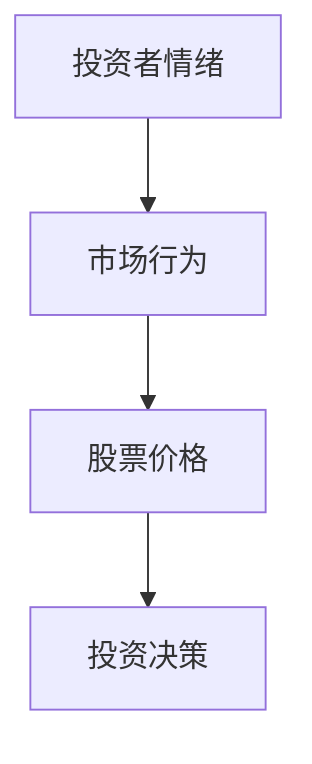
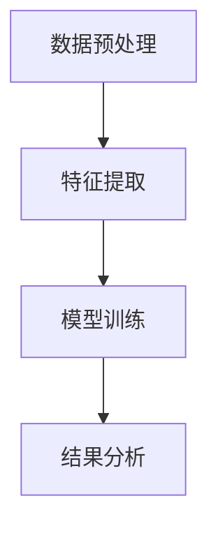
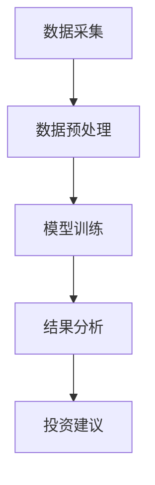
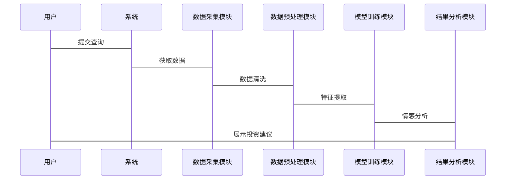

                 


```markdown
# 情感分析在投资决策中的应用

> 关键词：情感分析，投资决策，自然语言处理，机器学习，金融数据分析

> 摘要：本文探讨了情感分析在投资决策中的应用，通过分析投资者情绪对市场的影响，结合自然语言处理技术，提出了一种基于情感分析的投资决策辅助方法。文章详细介绍了情感分析的核心概念、算法原理、系统架构设计以及实际案例，为投资者提供了一种新的决策支持工具。

---

# 第1章: 情感分析与投资决策的背景介绍

## 1.1 情感分析的定义与核心概念
### 1.1.1 情感分析的定义
情感分析是自然语言处理（NLP）中的一个分支，旨在分析文本中的情感倾向，通常用于判断文本是正面、负面还是中性。

### 1.1.2 情感分析的核心要素
- **情感极性**：文本的情感倾向，如正面、负面或中性。
- **情感强度**：情感的强烈程度，如非常正面或稍微负面。
- **情感主题**：文本中表达的情感主题，如市场趋势、公司业绩等。

### 1.1.3 情感分析在投资中的应用场景
- 股票市场预测
- 新闻舆情分析
- 社交媒体情绪监控

## 1.2 投资决策中的情感因素
### 1.2.1 投资者情绪对市场的影响
投资者情绪可以影响市场的波动性，例如，过度乐观的情绪可能导致市场泡沫，而过度悲观的情绪可能导致市场崩盘。

### 1.2.2 情感分析在投资决策中的作用
通过分析投资者情绪，可以帮助投资者做出更明智的决策，避免情绪化投资。

### 1.2.3 情感分析与传统投资分析的结合
将情感分析与技术分析、基本面分析相结合，可以提高投资决策的准确性。

## 1.3 情感分析在投资中的应用现状
### 1.3.1 当前情感分析技术的发展水平
情感分析技术已经从简单的规则-based方法发展到复杂的深度学习模型。

### 1.3.2 情感分析在金融领域的应用案例
- 股票市场预测
- 风险评估
- 市场情绪监控

### 1.3.3 情感分析在投资中的挑战与机遇
- 挑战：数据质量、情感歧义、市场复杂性
- 机遇：技术进步、数据量增加、应用场景扩展

## 1.4 本章小结
本章介绍了情感分析的基本概念和其在投资中的应用场景，强调了投资者情绪对市场的影响，并指出了情感分析在投资中的挑战与机遇。

---

# 第2章: 情感分析的核心概念与联系

## 2.1 情感分析的分类与特征
### 2.1.1 情感极性分析
- 正面、负面或中性情感的分类。

### 2.1.2 情感强度分析
- 情感的强度，如非常正面、稍微正面等。

### 2.1.3 情感主题分析
- 情感的具体主题，如市场趋势、公司业绩等。

## 2.2 情感分析的特征提取方法
### 2.2.1 词袋模型（Bag of Words）
- 基于词频的特征提取。

### 2.2.2 词嵌入（Word Embedding）
- 使用如Word2Vec、GloVe等模型提取词向量。

### 2.2.3 位置权重（Positional Weighting）
- 考虑词语在文本中的位置信息。

## 2.3 情感分析特征的对比分析
| 特征提取方法 | 优点 | 缺点 |
|--------------|------|------|
| 词袋模型      | 简单易实现 | 无法捕捉语义信息 |
| 词嵌入        | 能捕捉语义信息 | 计算资源消耗大 |
| 位置权重      | 能捕捉位置信息 | 实现复杂度高 |

## 2.4 情感分析的ER实体关系图


## 2.5 本章小结
本章详细介绍了情感分析的核心概念，包括情感分类、特征提取方法，并通过对比分析和ER实体关系图，展示了情感分析在投资中的联系。

---

# 第3章: 情感分析算法原理

## 3.1 情感分析的算法选择
### 3.1.1 支持向量机（SVM）
- 适用于小规模数据，分类准确率高。

### 3.1.2 神经网络（CNN、RNN）
- 适用于大规模数据，能够捕捉复杂的特征。

### 3.1.3 随机森林（Random Forest）
- 适用于特征较多的情况，能够提供特征重要性分析。

## 3.2 情感分析算法的流程图


## 3.3 情感分析的数学模型与公式
### 3.3.1 支持向量机（SVM）
$$ \text{目标函数} = \min_{w,b,\xi} \frac{1}{2}||w||^2 + C\sum_{i=1}^n \xi_i $$
其中，\( w \) 是权重向量，\( b \) 是偏置，\( \xi_i \) 是松弛变量，\( C \) 是正则化参数。

### 3.3.2 神经网络（CNN）
$$ \text{卷积层} = \max\left(0, w \cdot x + b\right) $$
$$ \text{池化层} = \max\left(x_1, x_2, ..., x_n\right) $$

## 3.4 算法原理的通俗解释与举例
### 3.4.1 支持向量机的简单解释
SVM通过找到一个超平面，将数据分成两类，使得两类数据之间的距离最大化。

### 3.4.2 神经网络的简单解释
神经网络通过多层处理，能够捕捉复杂的模式和特征，适用于大规模数据的分析。

### 3.4.3 情感分析算法的实际案例
例如，使用Twitter上的股票相关推文进行情感分析，预测股票价格走势。

## 3.5 本章小结
本章介绍了情感分析的常见算法，包括SVM、CNN和随机森林，并通过流程图和数学公式详细讲解了算法原理。

---

# 第4章: 情感分析的系统架构设计

## 4.1 系统功能设计
### 4.1.1 数据采集模块
- 从社交媒体、新闻网站等渠道采集相关文本数据。

### 4.1.2 数据预处理模块
- 清洗数据，去除噪声，如停用词、标点符号等。

### 4.1.3 模型训练模块
- 使用训练好的情感分析模型进行预测。

### 4.1.4 结果分析模块
- 对预测结果进行分析，生成投资建议。

## 4.2 系统架构设计


## 4.3 系统接口设计
### 4.3.1 数据接口
- API接口用于数据采集和模型调用。

### 4.3.2 用户界面
- 提供用户友好的界面，展示分析结果和投资建议。

## 4.4 系统交互设计


## 4.5 本章小结
本章详细介绍了情感分析系统的架构设计，包括功能模块、系统架构图、接口设计和交互设计。

---

# 第5章: 情感分析的项目实战

## 5.1 项目背景与目标
- 项目目标：基于Twitter数据，分析市场情绪，预测股票价格走势。

## 5.2 项目环境与工具
- Python 3.8+
- Natural Language Toolkit (nltk)
- TensorFlow或Keras

## 5.3 核心代码实现
### 5.3.1 数据预处理
```python
import nltk
from nltk.corpus import twitter_samples
from nltk.sentiment import SentimentIntensityAnalyzer

# 加载数据
tweets = twitter_samples.file_names()
text = ' '.join(twitter_samples.open(tweets[0]).read().split())

# 情感分析
sia = SentimentIntensityAnalyzer()
result = sia.polarity_scores(text)
print(result)
```

### 5.3.2 模型训练
```python
import tensorflow as tf
from tensorflow.keras import layers

# 定义模型
model = tf.keras.Sequential()
model.add(layers.Embedding(input_dim=10000, output_dim=50))
model.add(layers.LSTM(64))
model.add(layers.Dense(1, activation='sigmoid'))
model.compile(optimizer='adam', loss='binary_crossentropy', metrics=['accuracy'])
model.fit(X_train, y_train, epochs=10, batch_size=32)
```

### 5.3.3 结果分析
```python
y_pred = model.predict(X_test)
print("准确率：", accuracy_score(y_test, y_pred))
```

## 5.4 项目小结
本章通过实际案例展示了情感分析在投资中的应用，从数据采集到模型训练，再到结果分析，详细介绍了项目的实施过程。

---

# 第6章: 情感分析在投资中的最佳实践与小结

## 6.1 最佳实践
### 6.1.1 数据质量的重要性
- 数据来源可靠，样本量充足。

### 6.1.2 模型选择的策略
- 根据数据量和复杂度选择合适的算法。

### 6.1.3 结果验证的方法
- 使用交叉验证、AUC-ROC曲线等方法评估模型性能。

## 6.2 注意事项
- 情感分析不能完全替代传统投资分析方法。
- 情感分析结果仅供参考，需结合其他因素进行决策。

## 6.3 拓展阅读
- 《自然语言处理入门》
- 《机器学习实战》
- 《情感分析在金融中的应用》

## 6.4 本章小结
本章总结了情感分析在投资中的最佳实践，提出了数据质量、模型选择和结果验证的重要性，并提供了进一步学习的资源。

---

# 参考文献
1. [书籍名]，作者，出版社，年份。
2. [论文名]，作者，期刊，年份。
3. [网络资源]，访问日期。

---

通过以上目录结构，文章系统地介绍了情感分析在投资决策中的应用，从理论到实践，为投资者提供了一种新的决策支持工具。
```

