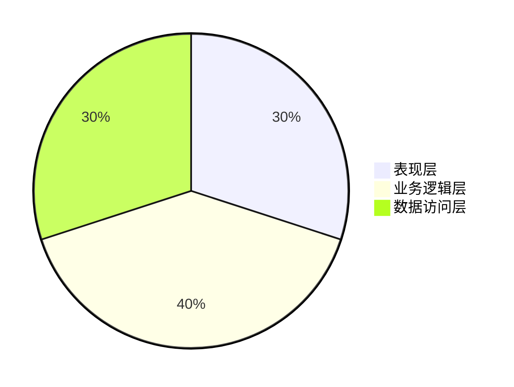

                 

# 技术栈选择与评估

> 关键词：技术栈选择，技术评估，系统架构，项目实战，技术选型

> 摘要：技术栈的选择和评估是软件开发中的关键环节，直接影响项目的成功。本文系统地分析了技术栈的核心概念、评估方法、企业级选型策略，并通过实际案例展示了技术栈的选择过程。通过本文，读者可以掌握技术栈选择的关键点和最佳实践。

---

## 第一部分：技术栈选择与评估的背景与基础

### 第1章：技术栈的定义与重要性

#### 1.1 技术栈的定义
技术栈是指一组用于构建软件系统的技术组件，包括编程语言、框架、工具和库。这些组件协同工作，满足项目的需求。例如，前端技术栈可能包括HTML、CSS、JavaScript和React框架。

#### 1.2 技术栈的重要性
- **项目成功的关键**：选择合适的技术栈能够提高开发效率、降低维护成本，并提升系统的性能和安全性。
- **团队能力的匹配**：团队熟悉的技术栈可以提高开发效率，减少学习成本。
- **未来扩展性**：选择具有强大社区支持和技术更新的技术栈，能够为项目的长期发展提供保障。

---

### 第2章：技术栈的核心概念

#### 2.1 技术栈的分类
技术栈可以分为前端、后端、数据库和开发工具等类别。以下是一个简单的分类表格：

| 类别    | 示例技术栈 |
|---------|------------|
| 前端    | React, Vue.js, HTML/CSS |
| 后端    | Node.js, Python, Java |
| 数据库   | MySQL, MongoDB, Redis |
| 开发工具 | Git, Docker, Jenkins |

#### 2.2 技术选型的影响因素
选择技术栈时，需要综合考虑以下因素：

| 因素          | 描述 |
|---------------|------|
| 项目需求      | 功能需求、性能需求 |
| 团队能力      | 开发经验、学习曲线 |
| 未来维护      | 社区支持、生态系统 |

---

## 第二部分：技术栈评估的方法与工具

### 第3章：技术栈评估方法

#### 3.1 定性评估
定性评估主要通过对比分析和专家意见进行：

- **对比分析**：比较不同技术栈的优缺点，例如React和Vue.js的性能对比。
- **社区活跃度**：评估技术栈的社区支持，GitHub仓库的活跃度是一个重要指标。

#### 3.2 定量评估
定量评估通过具体数据进行分析：

- **性能指标**：如响应时间、资源利用率。
- **安全性**：评估技术栈的漏洞数量和修复速度。

---

### 第4章：企业级技术栈的选择策略

#### 4.1 技术选型的组织架构
企业可以选择中心化或去中心化的选型模式。中心化模式由技术委员会统一决策，而去中心化模式允许各团队自行选择技术栈。

#### 4.2 技术架构设计
在企业级项目中，通常采用分层架构或微服务架构：

- **分层架构**：将系统分为表现层、业务逻辑层和数据访问层。
- **微服务架构**：将系统分解为独立的服务，通过API进行通信。

---

## 第三部分：技术栈评估与选型的系统分析

### 第5章：系统分析与架构设计

#### 5.1 问题场景分析
假设我们正在开发一个电商系统，需求包括用户管理、订单处理和支付功能。我们需要选择合适的技术栈来满足这些需求。

#### 5.2 系统功能设计
- **领域模型设计**：设计用户、订单和支付的实体关系。
- **数据流设计**：从用户输入到系统处理，再到输出的流程。

#### 5.3 系统架构设计
以下是一个分层架构的mermaid图：

---

## 第四部分：技术栈选型的项目实战

### 第6章：项目实战与案例分析

#### 6.1 案例分析
**项目背景**：开发一个在线教育平台，需求包括课程管理、用户注册和视频播放功能。

**技术选型过程**：
- **前端**：选择React框架，因为它有丰富的组件库和活跃的社区。
- **后端**：选择Node.js和Express框架，因为它适合构建API。
- **数据库**：选择MongoDB，因为它支持灵活的数据结构。

**实施结果**：项目成功上线，系统性能稳定，团队开发效率提高。

---

## 第五部分：最佳实践与未来趋势

### 第7章：最佳实践与小结

#### 7.1 技术选型的关键点
- **充分调研**：了解各种技术栈的优缺点。
- **团队能力匹配**：选择团队熟悉的技术栈。
- **未来扩展性**：选择具有长期支持的技术栈。

#### 7.2 评估工具与资源
- **开源工具**：TIOBE指数、Stack Overflow开发者调查。
- **在线资源**：GitHub趋势、技术博客和论坛。

#### 7.3 未来趋势与建议
- **新技术的影响**：人工智能和自动化工具将改变技术栈的选择。
- **持续学习**：技术发展迅速，需要不断学习和更新知识。

---

### 附录：常用技术栈评估工具

#### 附录A：技术栈评估工具列表

| 工具名称       | 描述                     |
|----------------|--------------------------|
| TIOBE指数       | 技术语言的流行度指数     |
| Stack Overflow 调查 | 开发者使用情况调查     |

---

通过本文，读者可以系统地了解技术栈选择与评估的方法和策略，并能够将这些知识应用到实际项目中。选择合适的技术栈是项目成功的关键，而系统化的评估和分析则是确保技术选型正确的重要步骤。

