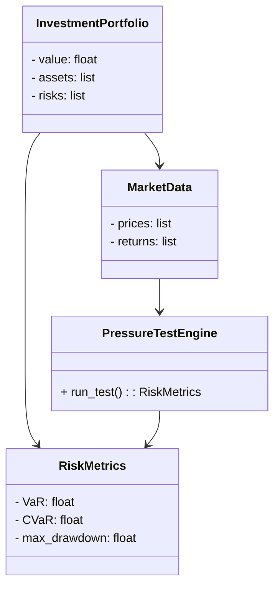
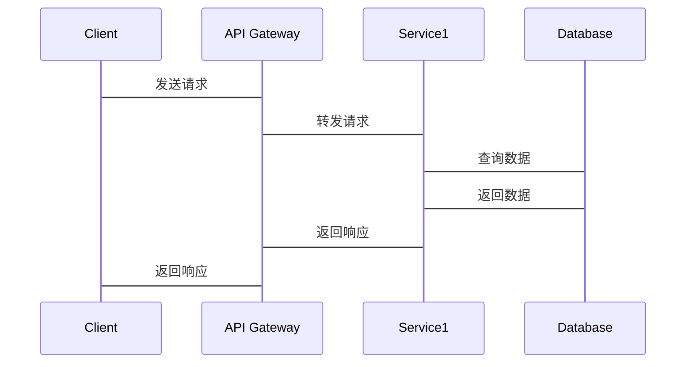

                 


# 投资组合压力测试：评估极端情景下的风险敞口

> **关键词**：投资组合压力测试、风险敞口、VaR、CVaR、蒙特卡洛模拟、情景分析、风险管理

> **摘要**：  
投资组合压力测试是评估投资组合在极端市场情景下可能承受的损失的重要工具。本文将从压力测试的背景与概念出发，详细探讨其核心概念、算法原理、系统设计、实际案例以及最佳实践。通过结合数学模型、Python代码实现和实际案例分析，帮助读者全面理解如何在投资组合管理中应用压力测试，以有效评估和管理风险敞口。

---

## 第一部分: 投资组合压力测试的背景与概念

### 第1章: 投资组合压力测试的背景与概念

#### 1.1 压力测试的基本定义
##### 1.1.1 什么是压力测试
压力测试是一种用于评估投资组合在极端市场条件下可能承受的损失的方法。通过模拟各种极端情景（如市场崩盘、利率上升、流动性危机等），压力测试帮助投资者和机构了解其投资组合在不利条件下的表现。

##### 1.1.2 压力测试的目的与意义
压力测试的主要目的是评估投资组合在极端市场条件下的风险敞口，并帮助投资者制定应对策略。其意义在于：
- 识别潜在风险点。
- 评估投资组合的稳健性。
- 帮助机构制定资本充足性计划。

##### 1.1.3 压力测试的适用场景
压力测试适用于以下场景：
- 金融机构的风险管理。
- 投资组合的业绩评估。
- 投资策略的验证。

#### 1.2 投资组合风险敞口的定义
##### 1.2.1 风险敞口的定义与分类
风险敞口是指投资组合在特定市场条件下的潜在损失。常见的风险敞口类型包括：
- 市场风险敞口。
- 利率风险敞口。
- 汇率风险敞口。

##### 1.2.2 风险敞口的度量方法
风险敞口的度量方法包括：
- 最大回撤（Maximum Drawdown）。
- VaR（Value at Risk）。
- CVaR（Conditional Value at Risk）。

##### 1.2.3 风险敞口与投资组合的关系
风险敞口是投资组合在特定情景下的潜在损失，反映了投资组合对市场波动的敏感性。

#### 1.3 压力测试与风险管理
##### 1.3.1 压力测试在风险管理中的作用
压力测试是风险管理的重要工具，能够帮助机构识别潜在风险并制定应对策略。

##### 1.3.2 压力测试的监管要求
许多国家的金融监管机构要求金融机构定期进行压力测试，以确保其资本充足性和流动性。

##### 1.3.3 压力测试的实施流程
压力测试的实施流程包括：
1. 确定测试目标。
2. 设计测试情景。
3. 选择测试方法。
4. 实施测试并分析结果。
5. 制定应对策略。

---

## 第二部分: 压力测试的核心概念与方法论

### 第2章: 压力测试的核心概念与方法论

#### 2.1 压力测试的主要类型
##### 2.1.1 情景分析法
情景分析法是通过模拟特定市场情景（如经济衰退、市场崩盘）来评估投资组合的表现。

##### 2.1.2 蒙特卡洛模拟法
蒙特卡洛模拟法是一种基于随机数生成的模拟方法，用于评估投资组合在多种可能情景下的表现。

##### 2.1.3 历史模拟法
历史模拟法是通过回顾历史市场数据，评估投资组合在历史极端情景下的表现。

#### 2.2 压力测试的情景生成
##### 2.2.1 压力情景的定义与分类
压力情景是指可能导致投资组合重大损失的极端市场条件。常见的压力情景包括：
- 市场崩盘。
- 利率上升。
- 汇率波动。

##### 2.2.2 压力情景的选择标准
选择压力情景的标准包括：
- 情景的极端性。
- 情景的相关性。
- 情景的可模拟性。

##### 2.2.3 压力情景的构建方法
压力情景的构建方法包括：
- 基于历史数据的构建。
- 基于模型的构建。
- 综合分析法。

#### 2.3 风险度量指标
##### 2.3.1 VaR（Value at Risk）
VaR是在给定置信水平下，投资组合可能承受的最大损失。

公式：
$$ VaR = \text{损失在某一置信水平下的最大值} $$

##### 2.3.2 CVaR（Conditional Value at Risk）
CVaR是在VaR的基础上，考虑超过VaR部分的平均损失。

公式：
$$ CVaR = E[Loss | Loss \geq VaR] $$

##### 2.3.3 其他风险指标
其他风险指标包括：
- 最大回撤。
- 风险价值系数。

---

## 第三部分: 投资组合压力测试的数学模型与算法

### 第3章: 投资组合压力测试的数学模型与算法

#### 3.1 VaR模型
##### 3.1.1 VaR的定义与计算公式
VaR是衡量投资组合在给定置信水平下的潜在损失。

公式：
$$ VaR = \text{损失在某一置信水平下的最大值} $$

##### 3.1.2 VaR的计算方法
1. **蒙特卡洛模拟法**
   - 生成大量随机市场情景。
   - 计算投资组合在每种情景下的损失。
   - 找到VaR对应的损失值。

2. **历史模拟法**
   - 使用历史市场数据。
   - 计算投资组合在历史数据中的损失。
   - 找到VaR对应的损失值。

##### 3.1.3 VaR的优缺点
- 优点：简单易懂，计算速度快。
- 缺点：假设市场数据符合正态分布，可能无法反映极端情景。

#### 3.2 蒙特卡洛模拟法
##### 3.2.1 蒙特卡洛模拟的基本原理
蒙特卡洛模拟通过生成大量随机数，模拟投资组合在不同市场情景下的表现。

##### 3.2.2 蒙特卡洛模拟的步骤
1. 确定市场变量的概率分布。
2. 生成随机数。
3. 计算投资组合在每种情景下的损失。
4. 分析结果并计算VaR等指标。

##### 3.2.3 蒙特卡洛模拟的Python实现
```python
import numpy as np

# 示例代码：计算投资组合的VaR
def calculate_var(portfolio_value, confidence_level, num_simulations=10000):
    np.random.seed(42)
    losses = []
    for _ in range(num_simulations):
        # 生成随机市场情景
        market_scenario = np.random.normal(0, 1)
        loss = portfolio_value * (-market_scenario)
        losses.append(loss)
    # 排序损失
    losses.sort()
    # 计算VaR
    var_index = int(num_simulations * (1 - confidence_level))
    var_loss = losses[var_index]
    return var_loss

# 示例使用
portfolio_value = 1000000  # 投资组合价值
confidence_level = 0.99  # 置信水平99%
var_result = calculate_var(portfolio_value, confidence_level)
print(f"VaR at {confidence_level} confidence level: {var_result}")
```

---

## 第四部分: 投资组合压力测试的系统分析与架构设计

### 第4章: 投资组合压力测试的系统分析与架构设计

#### 4.1 系统功能设计
##### 4.1.1 领域模型
Mermaid 类图：


#### 4.2 系统架构设计
Mermaid 架构图：
```mermaid
archi
    title InvestmentPortfolioPressureTestSystem
    client --> API Gateway: HTTP 请求
    API Gateway --> Load Balancer
    Load Balancer --> Service1
    Load Balancer --> Service2
    Service1 --> Database
    Service2 --> Database
    Database --> FileStorage
```

#### 4.3 系统交互设计
Mermaid 序列图：


---

## 第五部分: 投资组合压力测试的项目实战

### 第5章: 投资组合压力测试的项目实战

#### 5.1 环境安装
- 安装Python环境。
- 安装相关库（如NumPy、Pandas、Matplotlib）。

#### 5.2 数据准备
- 收集历史市场数据。
- 数据清洗与预处理。

#### 5.3 模型实现
##### 5.3.1 压力测试模型实现
```python
import numpy as np
import pandas as pd
import matplotlib.pyplot as plt

# 示例代码：压力测试模型
def pressure_test(portfolio, scenarios):
    results = []
    for scenario in scenarios:
        loss = portfolio.value * scenario
        results.append(loss)
    return results

# 示例使用
portfolio = InvestmentPortfolio(value=1000000, assets=['stock', 'bond'])
scenarios = [-0.2, -0.1, 0, 0.1, 0.2]
results = pressure_test(portfolio, scenarios)
print(results)
```

##### 5.3.2 风险指标计算
```python
def calculate_risk_metrics(losses):
    VaR = np.quantile(losses, 0.99)
    CVaR = np.mean(losses[losses >= VaR])
    max_drawdown = max(losses) - min(losses)
    return VaR, CVaR, max_drawdown

VaR, CVaR, max_drawdown = calculate_risk_metrics(losses)
print(f"VaR: {VaR}\nCVaR: {CVaR}\nMax Drawdown: {max_drawdown}")
```

#### 5.4 实际案例分析
##### 5.4.1 案例背景
- 投资组合：股票和债券组合。
- 目标：评估在市场崩盘情景下的风险敞口。

##### 5.4.2 数据分析与结果解读
- 计算VaR、CVaR等指标。
- 分析投资组合在极端情景下的表现。

---

## 第六部分: 投资组合压力测试的最佳实践

### 第6章: 投资组合压力测试的最佳实践

#### 6.1 数据质量的重要性
- 数据的完整性和准确性。
- 数据的代表性。

#### 6.2 模型选择的注意事项
- 模型的适用性。
- 模型的参数设置。

#### 6.3 结果解释与应用
- 结果的可视化。
- 结果的决策支持。

#### 6.4 小结
压力测试是投资组合风险管理的重要工具，通过合理选择情景和模型，可以帮助投资者更好地应对市场波动。

---

## 总结
投资组合压力测试是评估极端市场情景下风险敞口的重要方法。通过本文的详细讲解，读者可以了解压力测试的核心概念、算法原理、系统设计和实际应用。希望本文能为投资组合管理提供有价值的参考。

---

**注**：以上内容为部分章节内容，完整文章可根据上述大纲进一步扩展和详细编写。

