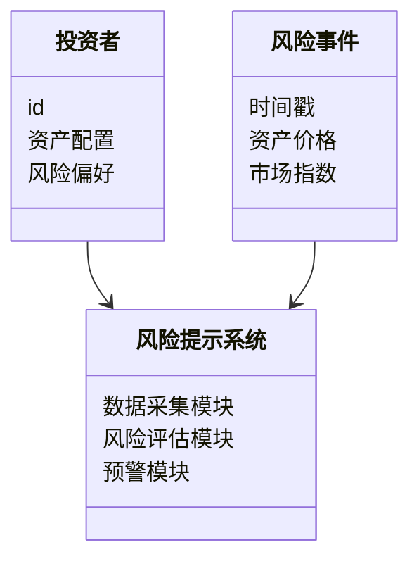
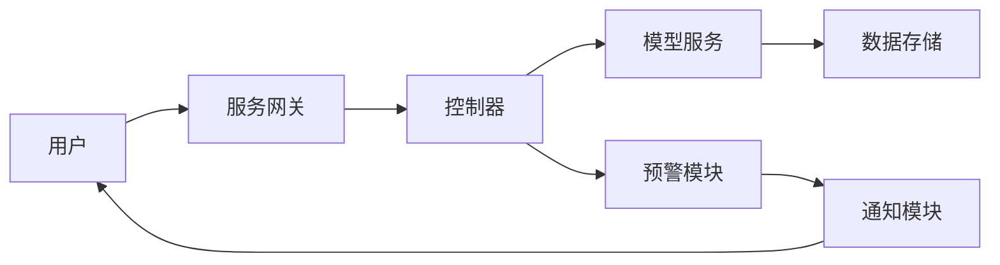

                 


# 投资风险提示系统

> 关键词：投资风险提示系统，风险管理，金融数据分析，算法模型，系统架构设计

> 摘要：投资风险提示系统是一种利用数据分析和机器学习算法，对金融市场中的投资风险进行实时监测和预警的系统。本文从系统概述、核心概念、算法原理、系统架构设计、项目实战到最佳实践，详细探讨投资风险提示系统的构建与应用。通过本文，读者可以了解如何利用技术手段有效管理投资风险，提升投资决策的科学性和准确性。

---

## 目录大纲

### 第一部分：投资风险提示系统概述

### 第1章：投资风险提示系统概述

#### 1.1 投资风险的重要性
- 1.1.1 投资风险的定义
- 1.1.2 投资风险的分类
- 1.1.3 投资风险对投资者的影响

#### 1.2 投资风险提示系统的背景
- 1.2.1 金融市场的发展与投资风险
- 1.2.2 现有风险提示方法的局限性
- 1.2.3 投资风险提示系统的需求与目标

#### 1.3 投资风险提示系统的功能与作用
- 1.3.1 系统的主要功能
- 1.3.2 系统的作用与价值
- 1.3.3 系统的适用范围与边界

#### 1.4 本章小结

---

### 第二部分：投资风险提示系统的核心概念与联系

### 第2章：投资风险提示系统的核心概念与联系

#### 2.1 投资风险的核心概念
- 2.1.1 风险的构成要素
- 2.1.2 风险的度量方法
- 2.1.3 风险与收益的关系

#### 2.2 投资风险提示系统的核心要素
- 2.2.1 数据采集与处理
- 2.2.2 风险评估模型
- 2.2.3 预警机制与反馈系统

#### 2.3 投资风险提示系统的实体关系图


#### 2.4 本章小结

---

### 第三部分：投资风险提示系统的算法原理

### 第3章：风险评估算法原理

#### 3.1 风险评估的核心算法
- 3.1.1 机器学习在风险评估中的应用
- 3.1.2 常见的风险评估算法
- 3.1.3 算法的选择与优化

#### 3.2 风险评估模型的数学模型
- 3.2.1 线性回归模型
  $$ y = \beta_0 + \beta_1x_1 + \beta_2x_2 + \ldots + \beta_nx_n + \epsilon $$
- 3.2.2 支持向量机模型
- 3.2.3 随机森林模型

#### 3.3 算法流程图


#### 3.4 本章小结

---

### 第四部分：投资风险提示系统的系统分析与架构设计

### 第4章：系统分析与架构设计

#### 4.1 问题场景介绍
- 4.1.1 风险评估的典型场景
- 4.1.2 系统需要解决的核心问题
- 4.1.3 系统的目标与范围

#### 4.2 项目介绍
- 4.2.1 项目背景
- 4.2.2 项目目标
- 4.2.3 项目范围与限制

#### 4.3 系统功能设计
- 4.3.1 领域模型设计


#### 4.4 系统架构设计


#### 4.5 系统接口设计
- 4.5.1 数据接口
- 4.5.2 模型接口
- 4.5.3 预警接口

#### 4.6 系统交互设计
```mermaid
sequenceDiagram
   参与者 投资者
    actor 投资者
    被动者 系统
    被动者 系统
    投资者 -> 系统: 提交资产配置
    系统 -> 数据采集模块: 获取市场数据
    数据采集模块 -> 系统: 返回市场数据
    系统 -> 风险评估模块: 计算风险评分
    风险评估模块 -> 系统: 返回风险评分
    系统 -> 预警模块: 发出预警信号
    预警模块 -> 投资者: 发送预警通知
```

#### 4.7 本章小结

---

### 第五部分：投资风险提示系统的项目实战

### 第5章：项目实战

#### 5.1 环境安装与配置
- 5.1.1 系统运行环境要求
- 5.1.2 Python库的安装（如numpy、pandas、scikit-learn等）
- 5.1.3 数据库的安装与配置（如MySQL或MongoDB）

#### 5.2 系统核心实现
- 5.2.1 数据采集模块的实现
- 5.2.2 风险评估模型的实现
- 5.2.3 预警模块的实现

#### 5.3 核心代码实现
```python
import numpy as np
from sklearn.ensemble import RandomForestRegressor

# 示例代码：风险评估模型的实现
class RiskAssessmentModel:
    def __init__(self):
        self.model = RandomForestRegressor(n_estimators=100, random_state=42)
    
    def train(self, features, labels):
        self.model.fit(features, labels)
    
    def predict(self, features):
        return self.model.predict(features)
```

#### 5.4 实际案例分析
- 5.4.1 数据来源与预处理
- 5.4.2 模型训练与验证
- 5.4.3 系统运行与结果展示

#### 5.5 本章小结

---

### 第六部分：投资风险提示系统的最佳实践

### 第6章：最佳实践与注意事项

#### 6.1 系统优化建议
- 6.1.1 数据源的多样性与质量
- 6.1.2 模型的可解释性与鲁棒性
- 6.1.3 系统的实时性与稳定性

#### 6.2 使用中的注意事项
- 6.2.1 数据隐私与安全
- 6.2.2 系统的可扩展性
- 6.2.3 用户的教育与培训

#### 6.3 未来的发展方向
- 6.3.1 新算法的应用
- 6.3.2 多模态数据的融合
- 6.3.3 人机协作的优化

#### 6.4 本章小结

---

## 总结

投资风险提示系统的建设是一个复杂而重要的任务，需要结合金融知识、数据分析能力和系统架构设计的 expertise。通过本文的详细讲解，读者可以系统地了解投资风险提示系统的构建过程，并能够在实际应用中灵活运用相关技术。希望本文能为投资风险管理领域的从业者和研究者提供有价值的参考与启发。

