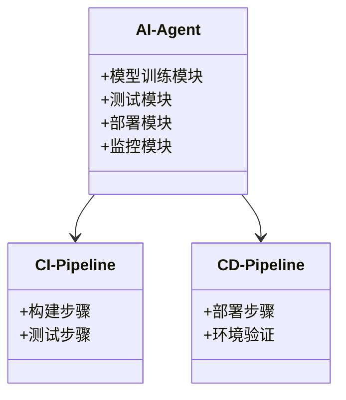

                 


# 持续集成/持续部署：自动化AI Agent的更新流程

> 关键词：持续集成、持续部署、AI Agent、自动化更新、DevOps、CI/CD Pipeline、机器学习模型

> 摘要：本文详细探讨了持续集成/持续部署（CI/CD）在自动化AI Agent更新流程中的应用。通过分析CI/CD的核心概念、算法原理、系统架构设计以及实际项目案例，展示了如何通过CI/CD Pipeline实现AI Agent的高效、可靠的更新流程。

---

## 第1章 持续集成/持续部署与AI Agent概述

### 1.1 持续集成/持续部署的背景与意义

#### 1.1.1 软件开发中的持续集成
持续集成（CI）是一种软件开发实践，通过自动化构建、测试和集成代码变更，确保团队频繁地将代码集成到主分支中，减少集成风险。CI的核心在于自动化，使用工具如Jenkins、GitHub Actions等，确保每次代码提交都能快速反馈构建和测试结果。

#### 1.1.2 持续部署的核心理念
持续部署（CD）是CI的延伸，专注于将代码从开发环境逐步推向生产环境。CD强调自动化构建、测试、验证和部署流程，确保每个代码变更都能安全地发布到生产环境。CD的关键在于通过自动化管道减少人工干预，确保每个部署都是可重复和可靠的。

#### 1.1.3 AI Agent在现代软件开发中的角色
AI Agent是一种能够感知环境、执行任务并适应变化的智能实体。在现代软件开发中，AI Agent常用于自动化决策、数据分析、用户交互等领域。由于AI Agent的复杂性和动态性，其更新和部署需要高效的流程管理，而CI/CD正是实现这一目标的关键。

### 1.2 AI Agent的定义与特点

#### 1.2.1 AI Agent的基本概念
AI Agent是一种智能实体，能够通过感知环境、推理和学习来执行特定任务。AI Agent可以是独立的软件程序，也可以是嵌入在更大系统中的组件。其核心能力包括感知、推理、学习和执行。

#### 1.2.2 AI Agent的核心特点
- **智能性**：能够理解和适应复杂环境。
- **自主性**：能够在没有人工干预的情况下执行任务。
- **反应性**：能够实时感知环境变化并做出响应。
- **学习能力**：能够通过数据和经验改进自身性能。

#### 1.2.3 AI Agent与传统软件的区别
AI Agent与传统软件的主要区别在于其智能性和自主性。传统软件通常基于固定的逻辑执行任务，而AI Agent能够通过机器学习模型动态调整行为，适应新的输入和环境变化。

### 1.3 持续集成/持续部署在AI Agent中的应用

#### 1.3.1 AI Agent开发的挑战
AI Agent的开发涉及复杂的模型训练、数据处理和部署流程。由于模型的复杂性和频繁更新的需求，传统的手动部署方式效率低下，容易引入错误。

#### 1.3.2 持续集成/持续部署的解决方案
通过CI/CD Pipeline，可以自动化AI Agent的构建、测试和部署流程，确保每次代码变更都能快速、安全地发布到目标环境。CI/CD不仅提高了开发效率，还减少了人为错误和部署风险。

#### 1.3.3 AI Agent更新流程的自动化优势
自动化更新流程能够快速响应模型优化和环境变化，确保AI Agent始终处于最新状态。同时，自动化流程减少了人工干预，提高了部署的一致性和可靠性。

### 1.4 本章小结
本章介绍了持续集成/持续部署的核心理念，以及AI Agent的特点和开发挑战。通过CI/CD Pipeline实现AI Agent的自动化更新流程，能够显著提高开发效率和系统可靠性。

---

## 第2章 持续集成/持续部署的核心概念

### 2.1 持续集成的核心原理

#### 2.1.1 CI Pipeline的定义与组成
CI Pipeline是一个自动化流程，将代码变更从提交到集成环境中的各个步骤规范化。典型的CI Pipeline包括以下步骤：
1. 提交代码到版本控制仓库。
2. 触发构建。
3. 下载依赖。
4. 编译代码。
5. 运行单元测试和集成测试。
6. 反馈测试结果。

#### 2.1.2 CI工具的工作流程
CI工具（如Jenkins、GitHub Actions）通过监听版本控制仓库的事件，自动触发构建和测试流程。测试结果通过CI工具的界面反馈给开发者，帮助开发者快速定位问题。

#### 2.1.3 CI与传统集成的区别
传统的集成方式通常是在开发周期末期进行一次性集成，容易引入合并冲突和功能缺陷。而CI通过频繁集成和自动化测试，能够及时发现并修复问题，提高代码质量。

### 2.2 持续部署的核心原理

#### 2.2.1 CD Pipeline的定义与组成
CD Pipeline是一个自动化流程，将代码从开发环境逐步推向测试和生产环境。典型的CD Pipeline包括以下步骤：
1. 构建和测试（与CI Pipeline相同）。
2. 部署到测试环境。
3. 执行手动或自动的环境验证。
4. 部署到生产环境。

#### 2.2.2 CD工具的工作流程
CD工具（如Jenkins、Kubernetes）通过自动化配置和脚本，实现代码从测试到生产的逐步部署。每个部署步骤都经过严格的验证，确保系统稳定性。

#### 2.2.3 CD与传统部署的区别
传统部署方式通常依赖人工操作，容易引入人为错误。而CD通过自动化流程和环境一致性，确保每个部署都是可重复和可靠的。

### 2.3 持续集成与持续部署的关系

#### 2.3.1 CI与CD的协同工作
CI和CD是相辅相成的过程。CI确保代码变更的正确性，CD确保代码变更的可部署性。两者结合，能够实现从代码提交到生产部署的完整自动化流程。

#### 2.3.2 CI/CD Pipeline的完整流程
典型的CI/CD Pipeline包括以下阶段：
1. 提交代码。
2. 自动构建和测试（CI阶段）。
3. 手动或自动触发部署（CD阶段）。
4. 部署到测试环境。
5. 手动或自动触发生产部署。
6. 部署到生产环境。

#### 2.3.3 CI/CD在AI Agent中的应用
在AI Agent的开发中，CI/CD Pipeline用于自动化模型训练、测试和部署流程。通过CI/CD，可以确保每次模型更新都能快速、安全地发布到目标环境。

### 2.4 本章小结
本章详细讲解了CI和CD的核心原理及其在AI Agent开发中的应用。通过CI/CD Pipeline，可以实现从代码提交到生产部署的完整自动化流程，提高开发效率和系统可靠性。

---

## 第3章 持续集成/持续部署的算法原理讲解

### 3.1 CI/CD Pipeline的算法流程

#### 3.1.1 算法输入与输出
**输入**：代码变更、构建工具、测试用例、部署脚本  
**输出**：构建结果、测试结果、部署结果

#### 3.1.2 算法的步骤分解
1. 提交代码到版本控制仓库。
2. 触发CI Pipeline。
3. 下载依赖。
4. 编译代码。
5. 运行单元测试和集成测试。
6. 反馈测试结果。
7. 手动或自动触发CD Pipeline。
8. 部署到测试环境。
9. 执行环境验证。
10. 部署到生产环境。

#### 3.1.3 算法的优化策略
- 使用缓存技术减少构建时间。
- 并行执行测试用例。
- 自动化环境清理和资源分配。

### 3.2 自动化测试的算法实现

#### 3.2.1 测试用例生成算法
1. 分析系统需求，设计测试场景。
2. 根据测试场景生成测试用例。
3. 执行测试用例，记录结果。

#### 3.2.2 测试执行算法
1. 执行测试用例。
2. 记录测试结果，包括通过、失败和错误。
3. 反馈测试结果到CI工具。

#### 3.2.3 测试结果分析算法
1. 统计测试结果，计算测试覆盖率。
2. 生成测试报告，包括通过率、失败原因和建议。

### 3.3 模型部署的算法实现

#### 3.3.1 模型打包算法
1. 将训练好的模型打包为可执行文件或容器镜像。
2. 配置模型运行环境，包括依赖库和配置文件。

#### 3.3.2 模型部署算法
1. 将模型部署到目标环境。
2. 配置环境变量，启动模型服务。
3. 监控模型运行状态，记录日志。

#### 3.3.3 模型监控算法
1. 实时监控模型运行状态，包括CPU、内存使用情况。
2. 记录模型输出结果，分析模型性能。
3. 反馈监控结果到监控系统，触发警报。

### 3.4 本章小结
本章详细讲解了CI/CD Pipeline和自动化测试、模型部署的算法实现。通过算法的优化和自动化，能够显著提高AI Agent的开发和部署效率。

---

## 第4章 系统分析与架构设计方案

### 4.1 系统功能设计

#### 4.1.1 领域模型设计
领域模型展示了系统中各个实体及其关系。AI Agent系统的核心实体包括：模型训练模块、测试模块、部署模块和监控模块。



#### 4.1.2 功能模块划分
系统功能模块包括：
- **模型训练模块**：负责模型的训练和优化。
- **测试模块**：负责模型的单元测试和集成测试。
- **部署模块**：负责模型的打包和部署。
- **监控模块**：负责模型的实时监控和性能分析。

#### 4.1.3 功能流程设计
功能流程从代码提交开始，经过CI Pipeline的构建和测试，再到CD Pipeline的部署和监控，形成一个完整的闭环。

### 4.2 系统架构设计

#### 4.2.1 系统架构图
系统架构展示了各个组件之间的关系和交互。AI Agent系统采用分层架构，包括数据层、服务层和应用层。


#### 4.2.2 组件之间的关系
- 数据层：存储训练数据和模型文件。
- 服务层：负责模型训练、测试和部署。
- 应用层：提供用户界面和API接口。

### 4.3 系统接口设计

#### 4.3.1 接口定义
系统接口包括：
- **训练接口**：接收训练数据，返回训练好的模型。
- **测试接口**：接收测试用例，返回测试结果。
- **部署接口**：接收部署环境，返回部署状态。

#### 4.3.2 接口调用流程
1. 用户调用训练接口，开始模型训练。
2. 训练完成后，调用测试接口，执行自动化测试。
3. 测试通过后，调用部署接口，开始模型部署。
4. 部署完成后，系统自动启动监控模块，实时监控模型运行状态。

#### 4.3.3 接口的版本控制
系统接口采用Semantic Versioning（语义版本控制），确保不同版本之间的兼容性和可维护性。

### 4.4 系统交互设计

#### 4.4.1 用户与系统的交互流程
1. 用户通过用户界面提交代码变更。
2. 系统触发CI Pipeline，开始构建和测试。
3. 测试结果反馈给用户，用户根据结果决定是否继续部署。
4. 用户触发CD Pipeline，开始部署流程。
5. 部署完成后，系统反馈结果给用户。

#### 4.4.2 系统内部组件的交互流程
1. CI Pipeline调用测试模块，执行自动化测试。
2. 测试模块调用数据层，获取测试用例和依赖数据。
3. 测试完成后，CI Pipeline调用部署模块，开始部署流程。
4. 部署模块调用CD Pipeline，执行环境验证和部署。

#### 4.4.3 交互流程的优化
- 使用队列管理，避免多个CI/CD Pipeline冲突。
- 实施限流策略，防止资源过度消耗。

### 4.5 本章小结
本章详细分析了AI Agent系统的功能设计、架构设计和交互设计。通过合理的架构和接口设计，能够确保系统的高效性和可扩展性。

---

## 第5章 项目实战

### 5.1 环境安装与配置

#### 5.1.1 开发环境的搭建
- 操作系统：Linux（推荐）或macOS。
- 开发工具：安装Jenkins、Docker、Git等工具。
- 依赖管理：使用virtualenv或Conda管理Python依赖。

#### 5.1.2 工具链的安装
- CI工具：Jenkins、GitHub Actions。
- CD工具：Jenkins、Kubernetes。
- 其他工具：Docker、pytest。

#### 5.1.3 环境变量的配置
- 设置Jenkins的HOME路径。
- 配置Git仓库的访问权限。
- 设置Docker的镜像仓库地址。

### 5.2 系统核心实现

#### 5.2.1 CI/CD Pipeline的实现
1. 在Jenkins中创建一个新的Pipeline job。
2. 编写Jenkinsfile，定义CI/CD Pipeline的步骤。
3. 配置GitHub webhook，自动触发Pipeline。

#### 5.2.2 自动化测试的实现
1. 使用pytest编写单元测试和集成测试。
2. 在CI Pipeline中集成pytest，自动化执行测试用例。
3. 使用Jenkins的测试报告插件生成测试报告。

#### 5.2.3 模型部署的实现
1. 使用Docker将模型打包为镜像。
2. 在CD Pipeline中配置Docker Compose，自动化部署模型服务。
3. 使用Kubernetes进行容器编排，实现模型的弹性伸缩。

### 5.3 案例分析与详细解读

#### 5.3.1 实际案例分析
案例背景：一个基于TensorFlow的图像分类AI Agent的更新流程。
实现步骤：
1. 提交代码到GitHub仓库。
2. GitHub webhook触发Jenkins Pipeline。
3. CI Pipeline自动构建、下载依赖、编译代码、运行测试。
4. 测试通过后，触发CD Pipeline，部署模型到测试环境。
5. 测试环境验证通过后，部署到生产环境。

#### 5.3.2 代码应用解读与分析
- **Jenkinsfile**：
  ```groovy
  pipeline {
      stages {
          stage('Build') {
              steps {
                  sh 'pip install -r requirements.txt'
              }
          }
          stage('Test') {
              steps {
                  sh 'pytest tests/unit_tests.py'
                  sh 'pytest tests/integration_tests.py'
              }
          }
          stage('Deploy') {
              steps {
                  sh 'docker build -t ai-agent .'
                  sh 'docker push ai-agent'
              }
          }
      }
  }
  ```
- **Dockerfile**：
  ```dockerfile
  FROM python:3.8-slim
  WORKDIR /app
  COPY requirements.txt .
  RUN pip install --no-cache-dir -r requirements.txt
  COPY . .
  EXPOSE 8000
  CMD ["python", "main.py"]
  ```

### 5.4 本章小结
本章通过一个实际案例，详细讲解了AI Agent的CI/CD Pipeline实现。通过代码示例和实际操作，读者可以掌握如何在项目中应用CI/CD技术。

---

## 第6章 总结与展望

### 6.1 本章总结
本文详细探讨了持续集成/持续部署在自动化AI Agent更新流程中的应用。通过分析CI/CD的核心概念、算法原理、系统架构设计以及实际项目案例，展示了如何通过CI/CD Pipeline实现AI Agent的高效、可靠的更新流程。

### 6.2 未来展望
随着AI技术的不断发展，AI Agent的更新流程将更加复杂和多样化。未来的CI/CD Pipeline需要支持更多的模型类型、更复杂的环境配置以及更智能的自动化策略。此外，AI与DevOps的结合将进一步加深，推动CI/CD技术在AI领域的广泛应用。

### 6.3 最佳实践 Tips
- **自动化优先**：尽可能自动化重复性任务，减少人工干预。
- **测试覆盖率**：确保测试用例覆盖所有关键功能和边界条件。
- **环境一致性**：使用容器化技术确保开发、测试和生产环境的一致性。
- **监控与反馈**：实时监控系统运行状态，及时反馈异常情况。

### 6.4 小结
通过本文的学习，读者可以掌握CI/CD在AI Agent更新中的核心技术和应用方法。希望本文能为相关领域的开发者提供有价值的参考和启发。

---

# 结束语

持续集成/持续部署是现代软件开发中的关键技术，其在AI Agent更新流程中的应用为AI技术的快速发展提供了有力支持。通过本文的详细讲解，读者可以全面了解CI/CD的核心概念、算法原理和实际应用，掌握如何在项目中实现自动化更新流程。希望本文能为AI领域的开发者提供有益的指导，推动AI技术的进一步发展。

