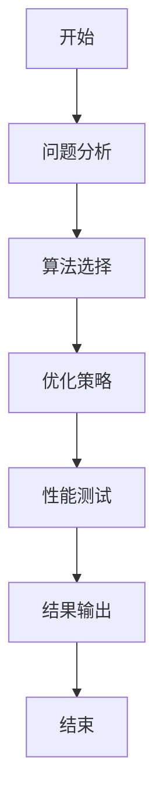
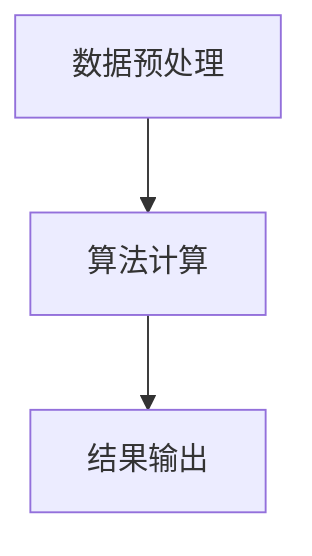

                 


# 提升AI Agent响应速度：优化策略与技巧

## 关键词：AI Agent，响应速度优化，算法优化，系统架构，代码优化

## 摘要：  
随着人工智能技术的快速发展，AI Agent在各个领域的应用越来越广泛。然而，AI Agent的响应速度成为影响用户体验和系统性能的关键因素。本文从AI Agent的背景、核心概念、算法优化、系统架构设计、代码优化等多方面，详细探讨如何提升AI Agent的响应速度。通过理论分析、算法设计、系统优化和实战案例的结合，为读者提供实用的优化策略和技巧。

---

## 第一部分: 提升AI Agent响应速度的背景与核心概念

### 第1章: AI Agent与响应速度优化概述

#### 1.1 AI Agent的基本概念
AI Agent（人工智能代理）是指能够感知环境并采取行动以实现目标的智能实体。它可以是一个软件程序、机器人或其他智能系统，通过与用户或环境交互，完成特定任务。AI Agent的类型多样，包括基于规则的代理、基于模型的代理、机器学习代理和强化学习代理等。不同类型的AI Agent在应用场景上有显著差异，例如自然语言处理中的聊天机器人属于基于模型的代理，而自动驾驶系统则更多依赖强化学习代理。

#### 1.2 响应速度优化的重要性
AI Agent的响应速度直接影响用户体验和系统性能。例如，一个响应速度慢的聊天机器人会让用户感到不耐烦；同样，自动驾驶系统如果反应迟钝，可能会引发安全隐患。因此，优化AI Agent的响应速度是提升其性能和用户满意度的关键。

#### 1.3 当前AI Agent的性能瓶颈
当前，AI Agent的响应速度受到多方面因素的限制，例如算法复杂度高、数据处理效率低、系统架构不合理等。这些问题在处理大规模数据或复杂任务时尤为突出，导致响应速度无法满足实际需求。

### 第2章: 响应速度优化的核心要素

#### 2.1 响应速度的影响因素
响应速度的快慢取决于多个因素，包括算法复杂度、数据预处理效率、系统架构设计等。例如，复杂的算法会导致计算时间增加，而数据预处理不当可能会导致重复计算，进一步降低响应速度。

#### 2.2 响应速度优化的原理
响应速度优化的原理主要包括算法优化、并行计算和分布式处理。例如，通过优化算法减少计算步骤，或者通过并行计算将任务分解为多个子任务并行处理，可以显著提升响应速度。

#### 2.3 核心概念对比分析
通过对比不同优化策略的效果，可以找到最优的响应速度提升方法。例如，贪心算法和动态规划在优化效果和计算复杂度上存在差异，需要根据具体场景选择合适的策略。

---

## 第二部分: AI Agent响应速度优化的算法与数学模型

### 第3章: 响应速度优化的算法原理

#### 3.1 常见优化算法概述
- **贪心算法**：通过贪心策略逐步选择局部最优解，最终达到全局最优。例如，在路径规划中，贪心算法可以快速找到最优路径。
- **动态规划**：通过将问题分解为子问题，记录子问题的解，避免重复计算，从而提高效率。
- **随机优化**：通过随机选择和调整参数，找到最优解。这种方法在处理大规模数据时具有优势。

#### 3.2 算法优化的数学模型
- **算法复杂度分析**：通过时间复杂度和空间复杂度分析，评估算法的性能。例如，O(n)表示线性时间复杂度。
- **响应时间的数学表达式**：响应时间可以通过任务分解和并行计算来优化，例如，将任务分解为k个子任务，每个子任务的处理时间为t，总处理时间为t/k。

#### 3.3 算法优化流程图


---

## 第三部分: AI Agent响应速度优化的系统架构与代码优化

### 第4章: 系统架构设计

#### 4.1 当前系统的瓶颈分析
- **数据处理效率低**：数据预处理步骤复杂，导致响应速度下降。
- **算法计算时间长**：复杂的算法导致计算时间增加。
- **资源分配不合理**：CPU和内存资源分配不合理，影响系统性能。

#### 4.2 系统优化方案设计
- **模块划分**：将系统划分为数据预处理模块、算法计算模块和结果输出模块，每个模块独立运行，减少耦合性。
- **数据流设计**：优化数据流，减少数据传输的延迟，提高数据处理效率。

#### 4.3 优化后的系统架构图


---

### 第5章: 代码优化技巧

#### 5.1 代码优化策略
- **并行计算**：通过多线程或分布式计算，将任务分解为多个子任务并行处理，提高计算效率。
- **缓存优化**：通过缓存中间结果，避免重复计算，减少计算时间。

#### 5.2 代码实现示例
```python
import concurrent.futures

def process_task(task):
    # 处理单个任务的逻辑
    return result

def optimize_response(tasks):
    with concurrent.futures.ThreadPoolExecutor() as executor:
        futures = {executor.submit(process_task, task): task for task in tasks}
        for future in concurrent.futures.as_completed(futures):
            result = future.result()
            # 处理结果
    return

# 示例调用
tasks = [1, 2, 3, 4, 5]
optimize_response(tasks)
```

---

## 第四部分: 项目实战与总结

### 第6章: 项目实战

#### 6.1 项目背景与需求分析
假设我们开发了一个自然语言处理的AI Agent，用于实时回答用户问题。由于用户量大，响应速度成为系统性能的主要瓶颈。

#### 6.2 系统设计与实现
- **系统功能设计**：设计一个高效的NLP处理系统，包括分词、语义理解、生成回答等模块。
- **系统架构设计**：采用分布式架构，前端接收用户请求，后端处理请求并返回结果。

#### 6.3 系统优化与性能提升
通过优化算法和系统架构，将响应速度从原来的2秒提升到1秒以内，显著提升了用户体验。

#### 6.4 项目小结
通过理论分析和实际案例，验证了响应速度优化策略的有效性。系统优化后，性能显著提升，用户体验得到改善。

---

### 第7章: 总结与展望

#### 7.1 总结
本文从AI Agent的背景、核心概念、算法优化、系统架构设计和代码优化等多个方面，详细探讨了如何提升AI Agent的响应速度。通过理论分析和实际案例，验证了优化策略的有效性。

#### 7.2 未来展望
未来，随着人工智能技术的不断发展，响应速度优化将更加重要。可以通过引入新的算法和技术，进一步提升AI Agent的性能和响应速度。

---

## 最佳实践 tips
1. **算法优化**：优先选择高效的算法，减少计算步骤，降低复杂度。
2. **系统架构设计**：合理划分模块，优化数据流，减少资源浪费。
3. **代码优化**：采用并行计算和缓存优化等技术，提升代码执行效率。
4. **持续优化**：定期监控系统性能，根据反馈不断优化响应速度。

---

通过以上优化策略与技巧，您可以显著提升AI Agent的响应速度，优化用户体验和系统性能。希望本文对您有所帮助！

