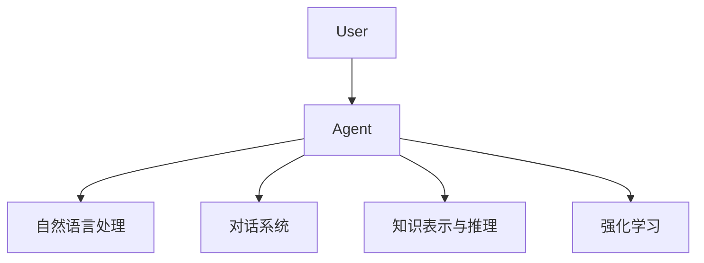
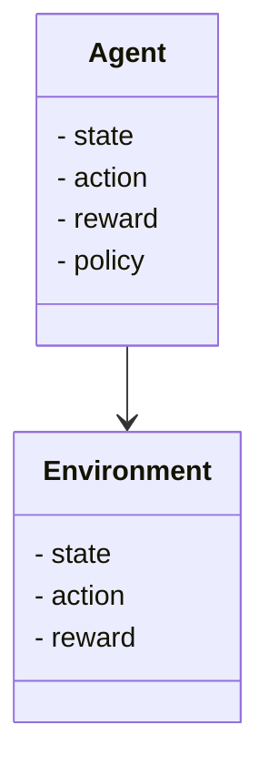
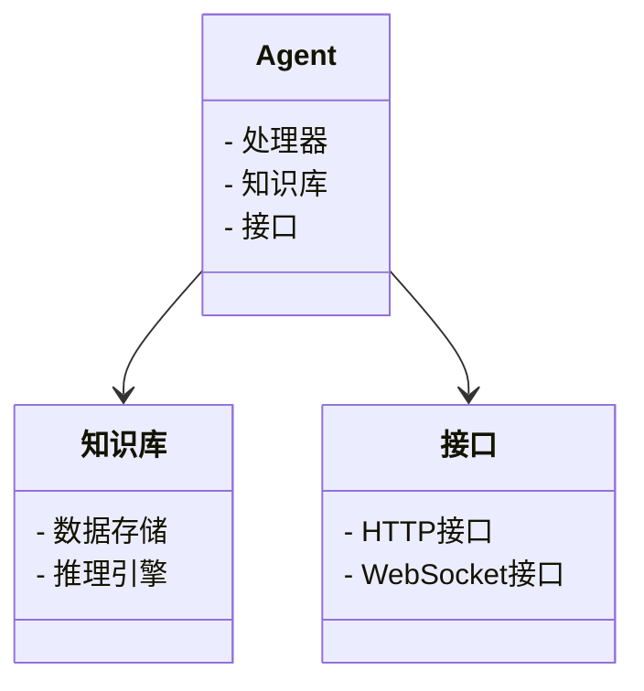
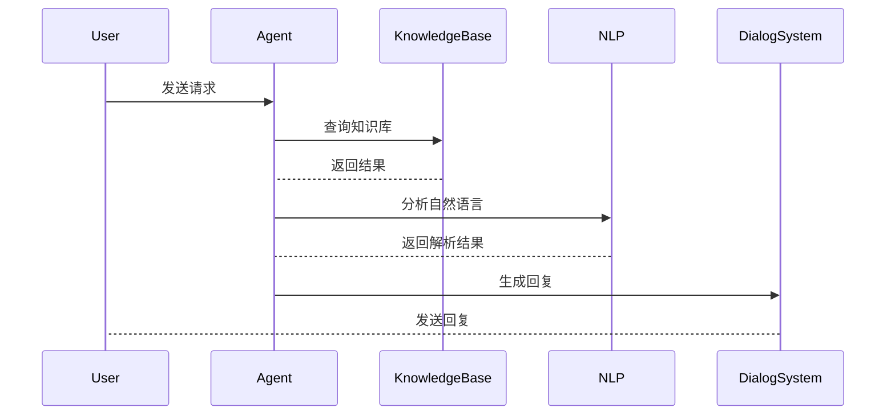

                 


# 搭建AI Agent开发环境：必要工具与框架

## 关键词：AI Agent、开发环境、工具、框架、自然语言处理、对话系统

## 摘要：AI Agent作为一种智能化的软件实体，正在广泛应用于各个领域。本文将详细介绍搭建AI Agent开发环境所需的核心工具与框架，从自然语言处理、对话系统、知识表示与推理到强化学习算法，系统地探讨如何选择和配置这些工具，帮助开发者高效地构建AI Agent系统。

---

# 第一部分: AI Agent开发环境概述

## 第1章: AI Agent开发环境的背景与概念

### 1.1 AI Agent的基本概念

#### 1.1.1 什么是AI Agent
AI Agent（人工智能代理）是指能够感知环境、执行任务并做出决策的智能实体。它可以在各种场景中与用户交互，执行复杂任务，甚至进行自主学习和优化。

#### 1.1.2 AI Agent的类型与特点
AI Agent可以根据功能和应用场景分为多种类型：
- **简单反应式Agent**：基于当前感知做出反应，如基于规则的聊天机器人。
- **基于模型的反射式Agent**：维护内部状态并根据状态变化做出决策。
- **目标驱动的Agent**：根据预设目标执行任务。
- **学习型Agent**：通过机器学习技术不断优化自身行为。

#### 1.1.3 AI Agent开发环境的重要性
AI Agent的开发需要一个高效的环境，包括工具、框架和算法支持，以简化开发流程，提升效率和性能。

### 1.2 AI Agent的应用场景

#### 1.2.1 自然语言处理中的AI Agent
AI Agent在自然语言处理中的应用包括文本生成、情感分析、机器翻译等任务。

#### 1.2.2 人机交互中的AI Agent
通过对话系统实现与用户的交互，如智能客服、虚拟助手等。

#### 1.2.3 企业级应用中的AI Agent
在企业中用于自动化流程、数据分析、决策支持等场景。

### 1.3 搭建AI Agent开发环境的意义
- **提升开发效率**：通过工具和框架的集成，减少重复劳动。
- **降低开发成本**：利用开源框架和工具，降低开发和维护成本。
- **促进技术创新**：通过高效的开发环境，快速实现和验证新算法。

### 1.4 本章小结
本章介绍了AI Agent的基本概念、类型和应用场景，并强调了搭建开发环境的重要性。

---

## 第2章: AI Agent开发环境的核心工具与框架

### 2.1 自然语言处理工具

#### 2.1.1 Python的自然语言处理库
- **NLTK**：Natural Language Toolkit，用于文本处理、分词、句法分析等任务。
- **spaCy**：专注于文本处理和实体识别，支持多种语言。

#### 2.1.2 基于深度学习的NLP框架
- **TensorFlow**：谷歌的深度学习框架，支持多种NLP任务。
- **PyTorch**：Facebook的开源深度学习框架，适合动态计算和研究。

### 2.2 对话系统框架

#### 2.2.1 Rasa框架
Rasa是一个开源的对话系统框架，支持自然语言处理和对话管理。

#### 2.2.2 Microsoft Bot Framework
微软提供的Bot Framework，用于构建和部署对话式AI应用。

#### 2.2.3 Dialogflow
Google的对话平台，支持自然语言理解、对话管理和集成。

### 2.3 知识表示与推理工具

#### 2.3.1 知识图谱构建工具
- **Ubergraph**：用于构建和管理知识图谱。
- **Wikidata**：开放的知识库，支持结构化数据的存储和查询。

#### 2.3.2 推理引擎
- **RDFox**：基于规则的推理引擎，支持知识图谱的推理。
- **Drools**：基于规则的专家系统，用于复杂的推理任务。

### 2.4 强化学习与决策框架

#### 2.4.1 OpenAI Gym
OpenAI提供的强化学习环境，支持算法开发和测试。

#### 2.4.2 TensorFlow Agents
TensorFlow框架中的强化学习库，用于构建和训练智能体。

### 2.5 开发环境搭建工具

#### 2.5.1 虚拟环境管理工具
- **Anaconda**：基于Python的虚拟环境管理工具，支持包管理和环境隔离。
- **virtualenv**：轻量级的虚拟环境管理工具。

#### 2.5.2 代码版本控制工具
- **Git**：版本控制工具，用于代码的管理和协作。
- **GitHub**：基于Git的代码托管平台，支持团队协作和代码共享。

### 2.6 本章小结
本章介绍了AI Agent开发环境中常用的工具和框架，包括自然语言处理、对话系统、知识表示与推理以及强化学习相关的工具。

---

## 第3章: AI Agent开发环境的核心概念与联系

### 3.1 核心概念原理

#### 3.1.1 自然语言处理
自然语言处理（NLP）是AI Agent实现文本理解和生成的核心技术。通过NLP工具，AI Agent能够理解和生成人类语言。

#### 3.1.2 对话系统
对话系统是AI Agent与用户交互的桥梁，通过对话管理算法实现上下文理解和对话生成。

#### 3.1.3 知识表示与推理
知识表示与推理是AI Agent实现智能决策的基础，通过知识图谱和推理引擎，AI Agent能够基于知识库进行推理和决策。

#### 3.1.4 强化学习
强化学习是AI Agent优化自身行为的核心技术，通过与环境的交互，AI Agent能够学习和优化其决策策略。

### 3.2 核心概念联系

#### 3.2.1 概念属性特征对比表格
| 概念       | 描述                                                                 |
|------------|----------------------------------------------------------------------|
| 自然语言处理| 处理和理解人类语言的技术，如分词、句法分析、文本生成。               |
| 对话系统   | 基于对话历史和上下文理解，生成合适的回复。                        |
| 知识表示与推理| 通过知识图谱和推理引擎，实现基于知识的决策和理解。               |
| 强化学习   | 通过与环境的交互，学习最优策略，优化AI Agent的行为。               |

#### 3.2.2 ER实体关系图



### 3.3 算法原理

#### 3.3.1 强化学习算法

```mermaid
graph TD
    Start --> Action
    Action --> Reward
    Reward --> State
    State --> Next State
    Next State --> Action
```

数学公式：
$$
Q(s, a) = r + \gamma \max Q(s', a')
$$

其中：
- $s$ 表示当前状态，
- $a$ 表示动作，
- $r$ 表示奖励，
- $\gamma$ 表示折扣因子，
- $s'$ 表示下一个状态。

---

## 第4章: AI Agent开发环境的系统架构与设计

### 4.1 问题场景介绍
搭建AI Agent开发环境需要考虑多个方面，包括功能设计、架构设计、接口设计和交互设计。

### 4.2 系统功能设计



### 4.3 系统架构设计



### 4.4 系统接口设计
AI Agent需要与外部系统进行交互，常见的接口包括HTTP接口和WebSocket接口。

### 4.5 系统交互设计



### 4.6 本章小结
本章介绍了AI Agent开发环境的系统架构与设计，包括功能设计、架构设计和交互设计。

---

## 第5章: AI Agent开发环境的项目实战

### 5.1 环境安装
搭建开发环境需要安装Python、虚拟环境管理工具和相关框架。

### 5.2 系统核心实现源代码

```python
# 示例代码：基于Rasa框架实现一个简单的对话系统
from rasa.core.agent import Agent
from rasa.core.policies import RulePolicy
from rasa.core.actions import Action
from rasa.core.events import SlotSet

class ActionHello(Action):
    def name(self):
        return "action_hello"

    def run(self, dispatcher, tracker, domain):
        dispatcher utter_message("Hello, how can I help you?")
        return []

agent = Agent("domain.yml", policies=[RulePolicy()], actions=[ActionHello()])
```

### 5.3 代码应用解读与分析
代码实现了一个简单的对话系统，基于Rasa框架，定义了一个自定义动作`ActionHello`，并在启动时加载该动作。

### 5.4 实际案例分析
通过一个具体的案例，分析如何使用Rasa框架搭建一个简单的对话系统。

### 5.5 本章小结
本章通过实际案例，展示了如何在AI Agent开发环境中进行项目开发。

---

## 第6章: 总结与展望

### 6.1 本章总结
本文详细介绍了搭建AI Agent开发环境的必要工具与框架，包括自然语言处理、对话系统、知识表示与推理和强化学习相关的工具。

### 6.2 未来展望
随着AI技术的不断发展，AI Agent开发环境将更加智能化和高效化，未来可能会出现更多功能强大的工具和框架。

### 6.3 最佳实践 tips
- 熟悉常用的NLP工具和对话系统框架。
- 善于利用开源社区的资源和文档。
- 不断学习和更新技术知识，跟上AI领域的最新发展。

### 6.4 本章小结
本文总结了AI Agent开发环境的核心工具与框架，并对未来的发展进行了展望。

---

# 结语
搭建AI Agent开发环境需要选择合适的工具和框架，了解其核心概念和算法原理，并通过实际项目进行实践。希望本文能为读者提供有价值的参考，帮助他们高效地构建AI Agent系统。

