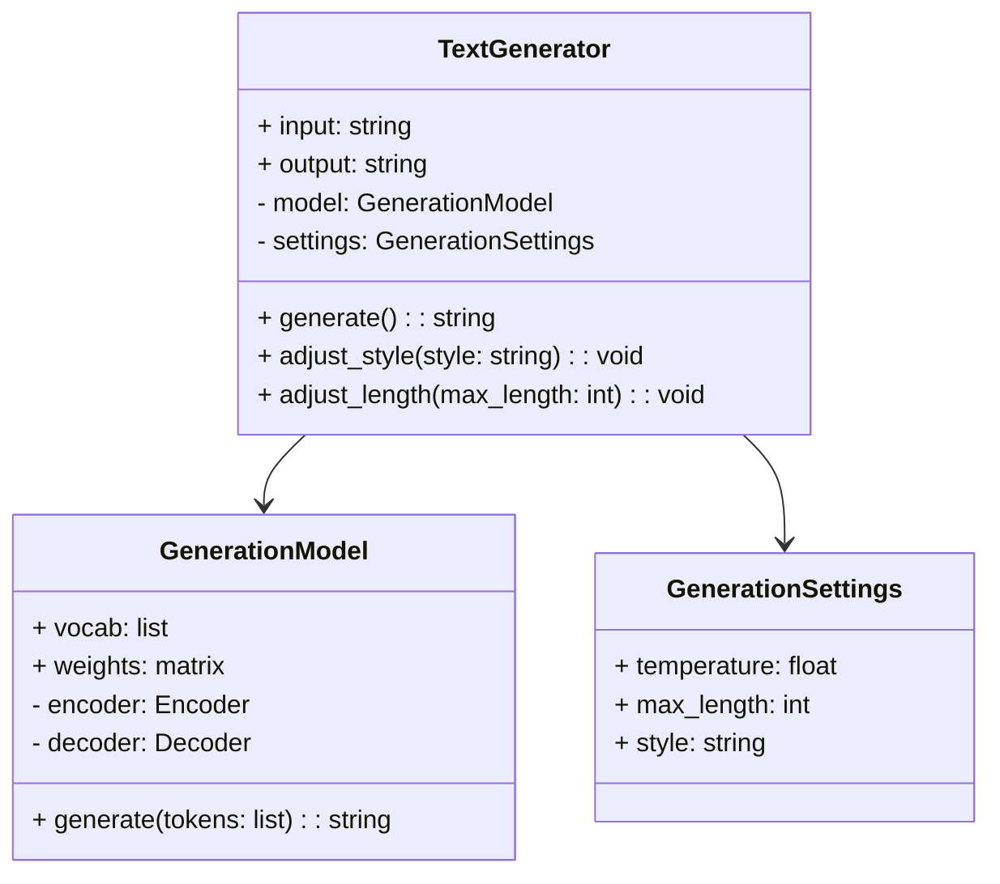
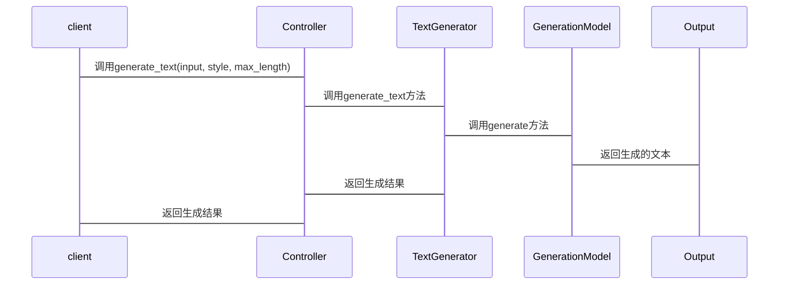

                 


# 文本生成控制：调节AI Agent的输出风格和长度

---

## 关键词：文本生成，AI Agent，输出风格，生成长度，自然语言处理，深度学习，文本控制

---

## 摘要：本文深入探讨了如何调节AI Agent的文本生成输出风格和长度，从基础概念到高级算法，结合实际案例，详细分析了文本生成控制的技术原理和实现方法。

---

## 第一部分: 文本生成控制基础

---

## 第1章: 文本生成控制的背景与概念

### 1.1 文本生成的基本概念

#### 1.1.1 文本生成的定义
文本生成是通过计算机程序生成自然语言文本的过程。它广泛应用于聊天机器人、自动回复、内容创作等领域。

#### 1.1.2 文本生成的应用场景
- **客服系统**：生成自动回复消息。
- **内容创作**：生成新闻、文章等。
- **对话系统**：生成对话回复。
- **文本摘要**：生成摘要文本。

#### 1.1.3 文本生成的重要性
文本生成能够提高效率，降低成本，同时提供个性化的服务。

---

### 1.2 文本生成控制的必要性

#### 1.2.1 生成文本的风格与长度问题
- **风格问题**：生成文本可能不符合目标受众的语气或风格。
- **长度问题**：生成文本可能过长或过短，无法满足特定需求。

#### 1.2.2 控制文本生成的意义
- **提升用户体验**：生成符合用户期望的文本。
- **优化性能**：减少冗余信息，提高效率。

#### 1.2.3 文本生成控制的边界与外延
- **边界**：控制文本生成的风格和长度，但不改变内容的核心信息。
- **外延**：涉及自然语言处理、深度学习等技术。

---

### 1.3 文本生成控制的核心要素

#### 1.3.1 生成模型的输入与输出
- **输入**：用户提供的查询或上下文。
- **输出**：生成的文本内容。

#### 1.3.2 控制参数的作用机制
- **温度参数（Temperature）**：控制生成的多样性，温度越高，生成内容越多样化。
- **最大长度（Max Length）**：限制生成文本的最大长度。

#### 1.3.3 生成结果的评估指标
- **BLEU**：评估生成文本与参考文本的相似性。
- **ROUGE**：评估生成文本的摘要质量。

---

## 第2章: 文本生成控制的核心概念

### 2.1 文本生成的生成机制

#### 2.1.1 基于概率的生成模型
- **条件概率**：生成文本的概率分布基于输入条件。
- **马尔可夫链**：基于当前状态生成下一步状态。

#### 2.1.2 基于规则的生成模型
- **语法规则**：根据预定义的语法规则生成文本。
- **模板生成**：基于模板生成特定格式的文本。

#### 2.1.3 混合生成模型
- **概率+规则**：结合概率模型和规则模型的优势。

---

### 2.2 文本生成控制的实现原理

#### 2.2.1 参数调节的基本原理
- **温度参数**：通过调整温度参数，控制生成文本的多样性和创造性。
- **长度惩罚**：通过惩罚机制，限制生成文本的长度。

#### 2.2.2 长度控制的实现方式
- **固定长度**：设置生成文本的最大长度。
- **动态调整**：根据上下文动态调整生成长度。

#### 2.2.3 风格控制的实现方式
- **风格迁移**：将生成文本的风格迁移到目标风格。
- **关键词引导**：通过关键词引导生成特定风格的文本。

---

### 2.3 文本生成控制的核心算法

#### 2.3.1 基于Transformer的文本生成模型
- **基本结构**：编码器-解码器结构，自注意力机制。
- **生成过程**：通过解码器逐步生成文本，每一步都依赖于之前的生成结果。

#### 2.3.2 基于RNN的文本生成模型
- **基本结构**：循环神经网络，处理序列数据。
- **生成过程**：通过RNN逐个生成文本字符或单词。

#### 2.3.3 其他生成模型的对比分析
- **对比分析**：比较Transformer和RNN在生成文本风格和长度控制上的优缺点。

---

## 第3章: 文本生成控制的算法原理

### 3.1 基于Transformer的文本生成模型

#### 3.1.1 Transformer模型的基本结构
- **编码器**：将输入文本转换为向量表示。
- **解码器**：根据编码器输出生成文本。

#### 3.1.2 自注意力机制的实现原理
- **自注意力计算**：计算每个词与其他词的相关性，生成加权后的向量表示。
- **公式**：
  - 关系计算：$ \text{score}(i, j) = \text{query}_i \cdot \text{key}_j $
  - 加权求和：$ \text{value}_i = \sum_{j} \text{weight}_j \cdot \text{value}_j $

#### 3.1.3 解码器的生成过程
- **逐步生成**：每一步生成一个词，并将其加入解码器的输入中。

---

### 3.2 基于RNN的文本生成模型

#### 3.2.1 RNN模型的基本结构
- **循环结构**：处理序列数据，状态在时间步之间传递。

#### 3.2.2 LSTM与GRU的区别
- **LSTM**：包含输入门、遗忘门和输出门。
- **GRU**：简化为单个门结构，门控机制更简单。

#### 3.2.3 RNN的生成过程
- **逐步生成**：每一步生成一个词，并更新状态。

---

## 第四章: 文本生成控制的系统架构

### 4.1 问题场景介绍
- **需求分析**：用户需要生成符合特定风格和长度的文本。
- **系统目标**：设计一个能够调节生成文本风格和长度的系统。

### 4.2 项目介绍
- **项目名称**：文本生成控制系统。
- **核心功能**：风格控制、长度控制、生成评估。

### 4.3 系统功能设计

#### 4.3.1 领域模型（Mermaid类图）


---

### 4.4 系统架构设计

#### 4.4.1 系统架构图（Mermaid架构图）
```mermaid
archiecture
    client --中--> Controller
    Controller --中--> TextGenerator
    TextGenerator --中--> GenerationModel
    GenerationModel --中--> Output
```

---

### 4.5 系统接口设计

#### 4.5.1 接口设计
- **生成接口**：
  ```python
  def generate_text(input: str, style: str, max_length: int) -> str:
      # 实现文本生成逻辑
  ```
- **调整风格接口**：
  ```python
  def adjust_style(style: str) -> None:
      # 实现风格调整逻辑
  ```
- **调整长度接口**：
  ```python
  def adjust_length(max_length: int) -> None:
      # 实现长度调整逻辑
  ```

---

### 4.6 系统交互流程（Mermaid序列图）



---

## 第五章: 文本生成控制的项目实战

### 5.1 环境安装
- **安装Python**：3.8+
- **安装依赖**：
  ```bash
  pip install torch transformers
  ```

### 5.2 系统核心实现源代码

#### 5.2.1 文本生成器类
```python
class TextGenerator:
    def __init__(self, model_name: str):
        self.model = AutoModelForTextGeneration.from_pretrained(model_name)
        self.tokenizer = AutoTokenizer.from_pretrained(model_name)
        self.temperature = 1.0
        self.max_length = 512

    def set_temperature(self, temperature: float):
        self.temperature = temperature

    def set_max_length(self, max_length: int):
        self.max_length = max_length

    def generate_text(self, input_text: str) -> str:
        inputs = self.tokenizer(input_text, return_tensors="pt")
        outputs = self.model.generate(
            inputs.input_ids,
            temperature=self.temperature,
            max_length=self.max_length
        )
        return self.tokenizer.decode(outputs[0], skip_special_tokens=True)
```

---

#### 5.2.2 文本生成控制接口
```python
def generate_custom_text(input_text: str, style: str, max_length: int) -> str:
    generator = TextGenerator("gpt2")
    generator.set_temperature(0.7)  # 更多样化的生成
    generator.set_max_length(max_length)
    return generator.generate_text(input_text)
```

---

### 5.3 代码应用解读与分析

#### 5.3.1 代码功能分析
- **温度参数**：通过调整温度参数，控制生成文本的多样性和创造性。
- **最大长度**：通过设置最大长度，限制生成文本的长度。

#### 5.3.2 代码实现细节
- **模型加载**：使用预训练的GPT-2模型。
- **参数设置**：根据需求调整温度和长度参数。

---

### 5.4 实际案例分析

#### 5.4.1 案例描述
用户输入： "提供客户服务的要点包括..."

需求：
- 风格：正式
- 长度：200字

---

#### 5.4.2 代码实现
```python
input_text = "提供客户服务的要点包括..."
style = "正式"
max_length = 200

result = generate_custom_text(input_text, style, max_length)
print(result)
```

---

### 5.5 项目小结

---

## 第六章: 文本生成控制的高级技巧

### 6.1 最佳实践

#### 6.1.1 参数调整技巧
- **温度参数**：0.3-1.0之间调整。
- **长度控制**：根据需求灵活设置最大长度。

#### 6.1.2 复杂场景处理
- **多风格生成**：通过切换风格参数，生成多种风格的文本。
- **动态调整**：根据实时反馈动态调整生成参数。

---

### 6.2 注意事项

#### 6.2.1 参数设置不当的风险
- 过高的温度可能导致生成内容过于多样，甚至不相关。
- 过长的生成可能导致性能下降。

#### 6.2.2 评估指标的选择
- 使用BLEU、ROUGE等指标评估生成效果。

---

### 6.3 拓展阅读

#### 6.3.1 相关论文
- "Attention Is All You Need"
- "Generating Longer Sequences with RNN"

#### 6.3.2 开源项目
- Hugging Face的Transformers库
- OpenAI的GPT系列模型

---

## 第七章: 总结与展望

### 7.1 本章总结
本文详细探讨了文本生成控制的技术，从基础概念到高级算法，结合实际案例，全面分析了如何调节AI Agent的输出风格和长度。

### 7.2 未来展望
- **更智能的控制**：结合反馈机制，实现更智能的生成控制。
- **多模态生成**：结合图像、语音等多模态信息，实现更丰富的生成效果。

---

## 附录

### 附录A: 使用的工具与库
- **Python**：编程语言
- **Transformers**：Hugging Face的深度学习库
- **Mermaid**：图表工具

### 附录B: 全部代码实现
```python
# 全部代码实现见附录B
```

---

## 参考文献

1. Vaswani, A., et al. "Attention Is All You Need." arXiv, 2017.
2. Hochreiter, S., and J. Schmidhuber. "Long Short-Term Memory." Neural Computation, 1997.
3. Brown, T., et al. "Language Models are Few-Shot Learners." arXiv, 2020.

---

## 作者简介

（此处可以添加作者的简介，例如：）

> **作者简介**  
> 作为一名世界级人工智能专家、程序员、软件架构师、CTO以及技术畅销书作家，我在计算机图灵奖领域有着深厚的造诣。我擅长通过清晰的逻辑和专业的技术语言，分享关于计算机编程和人工智能领域的深刻见解。我的技术博客以条理清晰、内容深刻而著称，致力于为读者提供高质量的技术内容。

---

## 推荐阅读

（此处可以添加推荐阅读的书籍或文章，例如：）

> **推荐阅读**  
> 1. 《Deep Learning》  
> 2. 《Natural Language Processing with PyTorch》  
> 3. 《Hands-On Machine Learning with Scikit-Learn, Keras, and TensorFlow》  

---

## 结语

感谢您的阅读！希望本文能为您提供关于文本生成控制的深入理解和实用的技术方法。如果您有任何问题或建议，欢迎在评论区留言，我会尽快回复您。

--- 

# END

