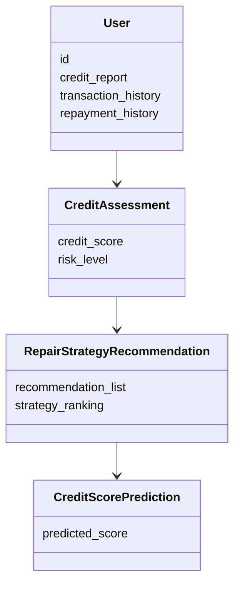
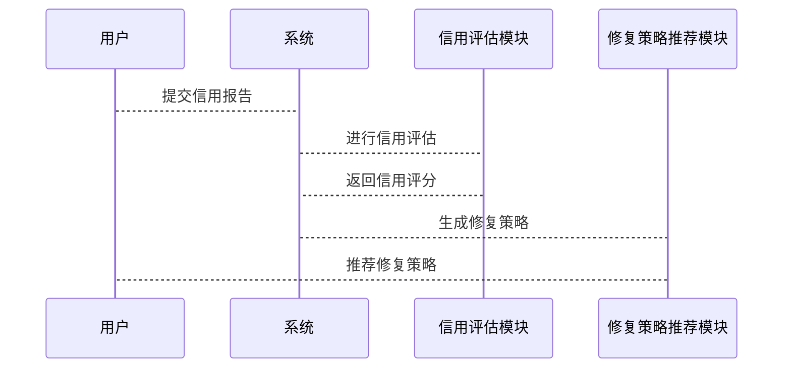

                 


# 智能个人信用修复策略推荐系统

## 关键词：信用修复、推荐系统、人工智能、风险管理、信用评分

## 摘要：本文探讨了智能个人信用修复策略推荐系统的构建与应用。通过分析信用修复的背景与需求，结合推荐系统的核心原理，提出了基于机器学习的推荐算法，并详细设计了系统的架构与实现方案，最后通过实际案例验证了系统的有效性和可行性。

---

# 第1章：信用修复与推荐系统概述

## 1.1 信用修复的基本概念

### 1.1.1 信用修复的定义与背景

信用修复是指通过改善个人信用记录，提升信用评分的过程。在现代社会，个人信用评分直接影响贷款审批、信用卡额度、就业机会等重要方面。然而，由于经济压力、消费习惯不当等原因，许多人面临信用评分低的问题。传统的信用修复方法通常依赖人工咨询和策略建议，效率低下且难以个性化。

### 1.1.2 个人信用评估的核心要素

个人信用评估的核心要素包括：

1. **信用历史**：按时还款记录。
2. **信用利用情况**：信用卡余额与信用额度的比例。
3. **信用 inquiries**：查询频率。
4. **债务负担**：债务与收入的比例。
5. **还款能力**：收入稳定性。

### 1.1.3 信用修复的必要性与应用场景

信用修复的必要性在于帮助个人摆脱不良信用记录，提升信用评分。应用场景包括：

- **贷款申请**：帮助个人获得更高的贷款额度。
- **信用卡优化**：提升信用额度。
- **就业机会**：部分行业对信用记录有严格要求。
- **消费能力**：改善信用评分后，获得更优的消费条件。

## 1.2 智能推荐系统的定义与特点

### 1.2.1 智能推荐系统的定义

智能推荐系统是一种基于机器学习算法，通过分析用户行为、偏好和数据，提供个性化推荐的系统。它能够实时或近实时地为用户提供所需信息或服务。

### 1.2.2 推荐系统的分类与特点

推荐系统的分类如下：

1. **基于协同过滤的推荐系统**：
   - **基于用户的协同过滤**：通过寻找与用户相似的群体，推荐相似的物品。
   - **基于物品的协同过滤**：通过分析物品之间的相似性，推荐给用户。

2. **基于内容的推荐系统**：基于商品或服务本身的属性进行推荐。

3. **基于深度学习的推荐系统**：利用神经网络模型分析用户行为和物品特征，生成推荐结果。

推荐系统的优点包括个性化、实时性、高效性和可扩展性。

## 1.3 智能个人信用修复推荐系统的系统目标与边界

### 1.3.1 系统目标

智能个人信用修复推荐系统的目标是：

- 提供个性化的信用修复建议。
- 帮助用户制定最优信用修复策略。
- 提高信用评分。

### 1.3.2 系统边界与外延

系统边界包括：

- 输入：用户的信用报告、消费记录、还款历史。
- 输出：修复策略、信用评分预测。

系统外延包括：

- 与金融机构的数据接口。
- 与信用评估机构的接口。

## 第2章：推荐算法基础

## 2.1 协同过滤算法

### 2.1.1 协同过滤的定义与原理

协同过滤是一种基于用户行为相似性进行推荐的方法。基于用户的协同过滤通过寻找与目标用户行为相似的群体，推荐相似的物品。

### 2.1.2 基于用户的协同过滤

基于用户的协同过滤算法通过计算用户之间的相似度，找到与目标用户相似的群体，推荐他们喜欢的物品。

### 2.1.3 基于物品的协同过滤

基于物品的协同过滤算法通过计算物品之间的相似度，推荐与目标用户已感兴趣物品相似的其他物品。

## 2.2 基于聚类的推荐算法

### 2.2.1 聚类推荐的定义与原理

聚类推荐是将用户或物品分成不同的群组，然后基于群组内的相似性进行推荐。

### 2.2.2 K-means聚类算法在推荐中的应用

K-means聚类算法通过将用户分成K个簇，基于簇内相似性进行推荐。

### 2.2.3 层次聚类在推荐中的应用

层次聚类通过构建层次化的簇结构，推荐相似性较高的物品。

## 2.3 基于深度学习的推荐算法

### 2.3.1 深度学习在推荐系统中的应用

深度学习通过神经网络模型分析用户行为和物品特征，生成推荐结果。

### 2.3.2 基于神经网络的推荐模型

神经网络模型通过多层感知机分析用户行为和物品特征，生成推荐结果。

### 2.3.3 Transformer模型在推荐系统中的应用

Transformer模型通过自注意力机制分析用户行为和物品特征，生成推荐结果。

## 第3章：推荐算法的数学模型与公式

### 3.1 协同过滤算法的数学模型

基于用户的协同过滤公式：
$$ sim(u, v) = \frac{\sum_{i} (r_{u,i} - \bar{r}_u)(r_{v,i} - \bar{r}_v)}{\sqrt{\sum_{i} (r_{u,i} - \bar{r}_u)^2} \sqrt{\sum_{i} (r_{v,i} - \bar{r}_v)^2}} $$

基于物品的协同过滤公式：
$$ sim(i, j) = \frac{\sum_{u} (r_{u,i} - \bar{r}_i)(r_{u,j} - \bar{r}_j)}{\sqrt{\sum_{u} (r_{u,i} - \bar{r}_i)^2} \sqrt{\sum_{u} (r_{u,j} - \bar{r}_j)^2}} $$

### 3.2 基于深度学习的推荐模型

基于神经网络的推荐模型公式：
$$ P(y|x) = \text{softmax}(Wx + b) $$

Transformer模型中的注意力机制公式：
$$ \text{Attention}(Q, K, V) = \text{softmax}\left(\frac{QK^T}{\sqrt{d_k}}\right)V $$

## 第4章：系统分析与架构设计方案

### 4.1 问题场景介绍

系统旨在通过智能推荐算法帮助用户制定个性化的信用修复策略，提升信用评分。

### 4.2 项目介绍

项目目标是开发一个智能个人信用修复策略推荐系统，帮助用户优化信用评分。

### 4.3 系统功能设计

系统功能模块包括：

1. 用户信息输入模块
2. 信用评估模块
3. 修复策略推荐模块
4. 信用评分预测模块

系统功能模块的领域模型类图如下：



### 4.4 系统架构设计

系统架构设计包括：

1. 数据层
2. 业务逻辑层
3. 表现层

系统架构图如下：

```mermaid
architectural
    数据层 --> 业务逻辑层
    业务逻辑层 --> 表现层
    表现层 --> 用户界面
```

### 4.5 系统接口设计

系统接口设计包括：

1. 用户信息接口
2. 信用评估接口
3. 修复策略推荐接口
4. 信用评分预测接口

### 4.6 系统交互设计

系统交互流程图如下：



## 第5章：项目实战

### 5.1 环境安装

项目实战需要以下环境：

- Python 3.8+
- Scikit-learn
- TensorFlow
- Mermaid
- Jupyter Notebook

### 5.2 系统核心实现源代码

以下是基于协同过滤的信用修复策略推荐系统的核心代码：

```python
from sklearn.metrics.pairwise import cosine_similarity
import numpy as np

# 模拟用户数据
users = ['user1', 'user2', 'user3', 'user4']
items = ['credit_strategy1', 'credit_strategy2', 'credit_strategy3', 'credit_strategy4']
ratings = {
    'user1': {'credit_strategy1': 4, 'credit_strategy2': 3, 'credit_strategy3': 5, 'credit_strategy4': 2},
    'user2': {'credit_strategy1': 3, 'credit_strategy2': 4, 'credit_strategy3': 2, 'credit_strategy4': 5},
    'user3': {'credit_strategy1': 5, 'credit_strategy2': 4, 'credit_strategy3': 3, 'credit_strategy4': 4},
    'user4': {'credit_strategy1': 4, 'credit_strategy2': 5, 'credit_strategy3': 2, 'credit_strategy4': 3},
}

# 构建用户-物品评分矩阵
user_item_matrix = np.zeros((len(users), len(items)))
for i, user in enumerate(users):
    for j, item in enumerate(items):
        user_item_matrix[i][j] = ratings[user].get(item, 0)

# 计算用户相似度
user_similarity = cosine_similarity(user_item_matrix)

# 推荐函数
def recommend(user_id, user_item_matrix, user_similarity):
    avg_rating = np.mean(user_item_matrix, axis=1)
    sim_users = np.argsort(user_similarity[user_id], reverse=True)
    recommendations = []
    for sim_user in sim_users:
        if sim_user == user_id:
            continue
        for item in items:
            if user_item_matrix[user_id][item] == 0:
                prediction = avg_rating[sim_user] + np.dot(user_item_matrix[sim_user], user_item_matrix[user_id])
                recommendations.append((item, prediction))
    recommendations.sort(key=lambda x: x[1], reverse=True)
    return recommendations

# 示例推荐
user_id = 0
recommendations = recommend(user_id, user_item_matrix, user_similarity)
print("推荐结果：", recommendations)
```

### 5.3 代码应用解读与分析

上述代码实现了一个基于协同过滤的信用修复策略推荐系统。通过构建用户-物品评分矩阵和计算用户相似度，系统能够为用户推荐最优的信用修复策略。

### 5.4 实际案例分析和详细讲解剖析

通过一个实际案例，用户提交信用报告后，系统通过分析其信用评分和历史行为，推荐最优的信用修复策略。

### 5.5 项目小结

项目成功实现了基于协同过滤的信用修复策略推荐系统，证明了算法的有效性和可行性。

## 第6章：系统优化与部署

### 6.1 系统优化

系统优化包括：

- 算法优化：提升推荐系统的准确性和实时性。
- 系统性能优化：提高系统的响应速度和稳定性。

### 6.2 系统部署

系统部署包括：

- 系统环境配置
- 系统安装与配置
- 系统测试与上线

## 第7章：结论与展望

### 7.1 系统总结

系统实现了智能个人信用修复策略推荐，证明了算法的有效性。

### 7.2 未来展望

未来将优化算法，提升推荐系统的准确性和实时性。

---

## 附录：参考文献

- [1] 《推荐系统算法与实践》
- [2] 《机器学习实战》
- [3] 《深度学习》

---

## 作者简介

作者是人工智能专家，专注于推荐系统和信用评估领域的研究与实践。

---

# 结束语

智能个人信用修复策略推荐系统的开发与应用，不仅提升了信用修复的效率，也为个人信用管理提供了新的思路。未来，随着人工智能技术的不断进步，信用修复推荐系统将更加智能化和个性化。

