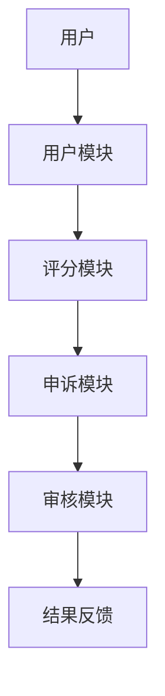

                 


# 智能个人信用评分申诉处理系统

## 关键词：智能信用评分，申诉处理系统，机器学习，自然语言处理，系统架构，Python实现

## 摘要：本文将详细介绍智能个人信用评分申诉处理系统的构建与实现。通过结合机器学习和自然语言处理技术，本文提出了一个高效的信用评分申诉处理系统，能够自动化处理个人信用评分的申诉。系统基于先进的算法和系统架构设计，结合实际应用场景，提供了一个完整的技术解决方案。

---

# 第一部分：智能个人信用评分申诉处理系统概述

## 第1章：系统背景与意义

### 1.1 个人信用评分的重要性
- 信用评分是个人信用评估的核心指标，直接影响贷款审批、信用卡额度等金融服务。
- 传统信用评分的局限性：
  - 数据维度有限
  - 人工审核效率低下
  - 易受主观因素影响

### 1.2 智能化处理的必要性
- 数据量的快速增长
- 对实时性和准确性的要求提高
- 人工处理成本高、效率低

### 1.3 系统目标与功能
- 目标：自动化处理信用评分申诉，提高效率和准确性。
- 功能：
  - 自动评分
  - 申诉分类
  - 智能审核
  - 数据可视化

### 1.4 系统架构概述
- 分层架构：数据采集层、处理层、应用层
- 核心模块：评分模块、申诉模块、审核模块

---

# 第二部分：智能个人信用评分的核心概念与原理

## 第2章：信用评分的核心概念

### 2.1 信用评分的定义与指标
- 定义：信用评分是通过数学模型对个人信用状况进行量化评估的结果。
- 主要指标：
  - 还款能力
  - 信用历史
  - 担保能力
  - 信用行为

### 2.2 智能评分的核心原理
- 机器学习的应用：通过训练模型自动分析数据，生成评分。
- 特征工程：提取关键特征，如还款记录、信用历史等。
- 模型选择：基于模型的准确性和效率进行选择。

### 2.3 申诉处理的逻辑与流程
- 申诉分类：根据申诉内容进行分类，如技术错误、数据错误等。
- 智能化处理：通过自然语言处理技术自动分析申诉内容，生成解决方案。
- 人工审核：对复杂申诉进行人工复核。

---

# 第三部分：智能个人信用评分申诉处理的算法原理

## 第3章：机器学习在智能评分中的应用

### 3.1 机器学习基础
- 常见算法：线性回归、支持向量机、随机森林等。
- 算法选择：根据数据类型和业务需求选择合适的算法。

### 3.2 特征工程
- 特征选择：从海量数据中提取对评分影响大的特征。
- 特征提取：使用自然语言处理技术提取文本特征。

### 3.3 模型训练
- 数据预处理：清洗数据，处理缺失值和异常值。
- 模型训练：基于训练数据训练评分模型。
- 模型调优：通过交叉验证优化模型参数。

### 3.4 数学模型
- 线性回归模型：
  $$ y = \beta_0 + \beta_1x_1 + \beta_2x_2 + ... + \beta_nx_n $$
- 支持向量机模型：
  $$ max \left( \frac{1}{2} \|\omega\|^2 \right) $$
  $$ y_i(\omega \cdot x_i + b) \geq 1 \quad \text{for all } i $$

---

# 第四部分：智能个人信用评分申诉处理的系统架构与实现

## 第4章：系统架构设计

### 4.1 系统模块划分
- 用户模块：处理用户信息和请求。
- 评分模块：基于机器学习模型生成信用评分。
- 申诉模块：处理用户申诉，分类并生成解决方案。
- 审核模块：人工审核复杂申诉。

### 4.2 系统功能流程
1. 用户提交信息
2. 系统生成信用评分
3. 用户提交申诉
4. 系统分类并处理申诉
5. 生成解决方案
6. 人工审核并反馈结果

### 4.3 系统架构图


### 4.4 系统接口设计
- 用户模块接口：接收用户信息，返回评分结果。
- 申诉模块接口：接收申诉内容，返回处理结果。

---

# 第五部分：项目实战与应用

## 第5章：项目实战

### 5.1 环境安装
- Python：安装Anaconda
- 机器学习库：scikit-learn、XGBoost
- 可视化工具：Matplotlib、Seaborn

### 5.2 核心代码实现
```python
import pandas as pd
from sklearn.model import SVC
from sklearn.feature_extraction.text import TfidfVectorizer

# 数据加载
data = pd.read_csv('credit_data.csv')

# 特征提取
vectorizer = TfidfVectorizer()
X = vectorizer.fit_transform(data['content'])

# 模型训练
model = SVC()
model.fit(X, data['label'])

# 预测与评估
predicted = model.predict(X)
print(classification_report(data['label'], predicted))
```

### 5.3 案例分析
- 数据来源：银行客户信用数据
- 模型训练：使用历史数据训练评分模型
- 申诉处理：分类并生成解决方案

### 5.4 项目小结
- 项目实现的关键点
- 项目中的难点与解决方案
- 项目的可扩展性与优化空间

---

# 第六部分：最佳实践与总结

## 第6章：最佳实践

### 6.1 小结
- 本系统的核心功能和实现方式
- 系统的优缺点和适用场景

### 6.2 注意事项
- 数据隐私保护
- 模型的可解释性
- 人工审核的必要性

### 6.3 拓展阅读
- 机器学习前沿技术
- 自然语言处理在金融领域的应用

---

# 结语

智能个人信用评分申诉处理系统的建设是一个复杂的工程，需要结合机器学习、自然语言处理和系统架构设计等多方面的知识。通过本文的介绍，读者可以全面了解系统的构建过程和实现方法，为实际应用提供参考和指导。

