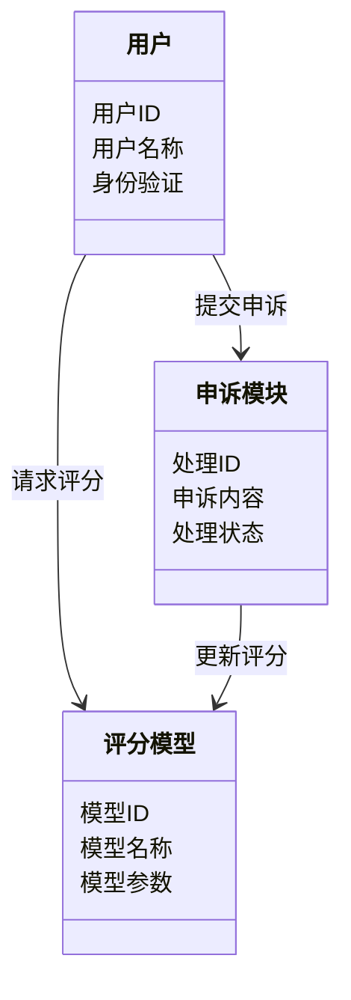
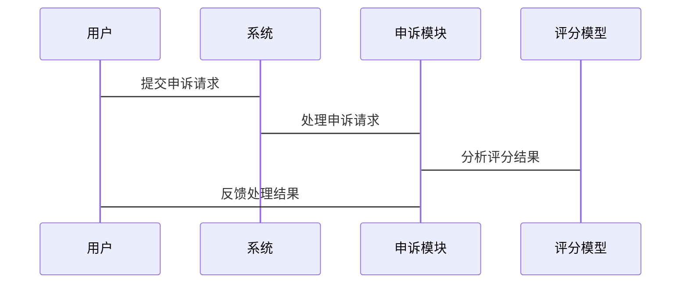

                 


# 《智能个人信用评分申诉系统》

> 关键词：智能信用评分、个人信用、申诉系统、人工智能、评分模型、自然语言处理

> 摘要：本文详细探讨了智能个人信用评分申诉系统的构建与实现，从背景介绍、核心概念、算法原理、系统架构到项目实战，结合实际案例和代码实现，深入分析了系统的各个组成部分和实现细节。本文旨在为读者提供一个清晰的思路，帮助他们理解如何利用人工智能技术来优化个人信用评分申诉流程。

---

# 第一部分: 智能个人信用评分申诉系统背景与核心概念

## 第1章: 智能个人信用评分申诉系统的背景介绍

### 1.1 问题背景与问题描述

#### 1.1.1 传统信用评分的局限性
传统信用评分主要依赖于人工审核和简单的评分模型，存在以下问题：
- **效率低**：人工审核耗时长，难以快速响应用户的申诉请求。
- **准确性差**：简单的评分模型难以捕捉复杂的信用行为，可能导致评分不公。
- **透明性不足**：用户难以理解评分结果背后的逻辑，导致申诉困难。

#### 1.1.2 个人信用评分申诉的痛点
- **申诉流程复杂**：用户需要通过邮件或电话联系客服，流程繁琐且耗时。
- **申诉结果不透明**：用户不清楚申诉处理的具体过程，难以信任评分结果。
- **缺乏智能化支持**：申诉处理过程中缺乏智能化工具，导致效率低下。

#### 1.1.3 智能化信用评分申诉的需求
- **快速响应**：利用人工智能技术快速处理用户的申诉请求。
- **高准确性**：通过复杂的评分模型和自然语言处理技术提高申诉结果的准确性。
- **透明性与可解释性**：用户能够理解评分结果背后的逻辑，增强信任感。

### 1.2 问题解决与边界外延

#### 1.2.1 智能化信用评分申诉的核心目标
- 提供高效的申诉处理流程。
- 提供准确的申诉结果。
- 提供透明的评分逻辑，增强用户体验。

#### 1.2.2 系统边界与外延
- **输入**：用户提交的申诉请求、相关信用数据。
- **输出**：处理后的申诉结果、评分调整建议。
- **边界**：系统仅处理个人信用评分申诉，不涉及企业信用或其他类型的信用评分。

#### 1.2.3 核心问题的解决思路
- 利用机器学习算法构建评分模型。
- 使用自然语言处理技术分析用户的申诉内容。
- 提供可视化界面供用户查询申诉进度和结果。

### 1.3 核心概念与组成要素

#### 1.3.1 核心概念定义
- **智能信用评分系统**：基于机器学习算法的评分系统，能够实时更新用户的信用评分。
- **申诉机制**：用户对评分结果有异议时，可以通过系统提交申诉，系统自动处理并反馈结果。

#### 1.3.2 核心要素的组成与关系
- **评分模型**：用于计算用户的信用评分。
- **申诉模块**：处理用户的申诉请求。
- **用户界面**：供用户查询评分和提交申诉。

#### 1.3.3 系统的边界与交互
- **用户**：提交申诉请求，查询评分结果。
- **评分模型**：计算用户的信用评分。
- **申诉模块**：处理用户的申诉请求，反馈结果。

## 第2章: 核心概念与联系

### 2.1 智能信用评分系统的核心原理

#### 2.1.1 评分模型的构建与优化
- **数据收集**：收集用户的信用数据，包括还款记录、信用历史等。
- **特征工程**：提取关键特征，如逾期率、借款金额等。
- **模型训练**：使用机器学习算法（如线性回归、随机森林）训练评分模型。
- **模型优化**：通过交叉验证和调参优化模型性能。

#### 2.1.2 智能评分的实时性与准确性
- **实时性**：系统能够实时更新用户的信用评分。
- **准确性**：通过复杂的评分模型提高评分的准确性。

#### 2.1.3 模型的可解释性与透明性
- **可解释性**：用户能够理解评分结果背后的逻辑。
- **透明性**：系统提供评分结果的详细解释，增强用户信任。

### 2.2 申诉机制的实现原理

#### 2.2.1 申诉请求的接收与处理
- **接收请求**：用户通过系统提交申诉请求。
- **自动处理**：系统自动分析申诉内容，判断是否需要调整评分。

#### 2.2.2 申诉审核的智能化流程
- **自然语言处理**：使用NLP技术分析用户的申诉内容，提取关键信息。
- **评分调整**：根据分析结果，调整用户的信用评分。

#### 2.2.3 申诉结果的反馈机制
- **反馈结果**：系统将处理结果反馈给用户，包括评分调整建议。

### 2.3 核心概念的ER实体关系图

```mermaid
erDiagram
    user {
        用户ID
        用户名称
        身份验证
    }
    credit_score {
        评分记录
        评分时间
        评分值
    }
    appeal_record {
        申诉ID
        申诉内容
        处理状态
        处理时间
    }
    system {
        系统ID
        系统名称
    }
    user -|> credit_score : 关联评分记录
    user -|> appeal_record : 提交申诉
    credit_score -|> system : 系统评分
    appeal_record -|> system : 系统处理申诉
```

---

## 第3章: 算法原理讲解

### 3.1 评分模型的构建与优化

#### 3.1.1 算法选择与实现

- **线性回归模型**
  - **公式**：$$y = \beta_0 + \beta_1x_1 + \beta_2x_2 + \ldots + \beta_nx_n$$
  - **实现步骤**：
    1. 数据预处理：归一化特征。
    2. 模型训练：使用最小二乘法求解系数。
    3. 模型评估：计算均方误差（MSE）和R²值。

- **随机森林模型**
  - **公式**：无固定公式，基于树结构的集成模型。
  - **实现步骤**：
    1. 数据预处理：特征选择。
    2. 模型训练：构建多棵决策树。
    3. 模型评估：计算准确率和F1分数。

#### 3.1.2 评分模型的训练代码

```python
# 线性回归模型训练代码
from sklearn.linear_model import LinearRegression
from sklearn.metrics import mean_squared_error, r2_score

# 数据预处理
X = df[['特征1', '特征2', ...]]
y = df['评分值']

# 训练模型
model = LinearRegression()
model.fit(X, y)

# 模型评估
y_pred = model.predict(X)
print('均方误差:', mean_squared_error(y, y_pred))
print('R²值:', r2_score(y, y_pred))
```

#### 3.1.3 评分模型的优化

- **交叉验证**：使用k折交叉验证优化模型。
- **超参数调优**：使用网格搜索或随机搜索调整模型参数。

### 3.2 申诉处理的自然语言处理模型

#### 3.2.1 NLP模型的选择与实现

- **BERT模型**
  - **输入**：用户的申诉文本。
  - **输出**：文本分类结果（如是否需要调整评分）。

#### 3.2.2 NLP模型的训练代码

```python
# BERT模型训练代码（简化版）
from transformers import BertTokenizer, BertModel
import torch

# 加载预训练模型
tokenizer = BertTokenizer.from_pretrained('bert-base-chinese')
model = BertModel.from_pretrained('bert-base-chinese')

# 定义输入
inputs = tokenizer("用户的申诉内容", return_tensors="pt", padding=True, truncation=True)

# 前向传播
outputs = model(**inputs)
features = outputs.last_hidden_state[:, 0, :].detach().numpy()

# 分类预测
# （此处省略分类器代码，实际可根据需求实现）
```

---

## 第4章: 系统分析与架构设计方案

### 4.1 问题场景介绍

- **场景描述**：用户申请贷款时，系统自动计算信用评分，用户对评分结果有异议时，可以通过系统提交申诉，系统自动处理并反馈结果。

### 4.2 系统功能设计

#### 4.2.1 领域模型类图



#### 4.2.2 系统架构设计


#### 4.2.3 系统接口设计

- **评分查询接口**：用户查询信用评分。
- **申诉提交接口**：用户提交申诉请求。
- **申诉处理接口**：系统处理申诉请求。

#### 4.2.4 系统交互序列图



---

## 第5章: 项目实战

### 5.1 环境安装

- **Python**：安装Python 3.8及以上版本。
- **库依赖**：安装TensorFlow、Scikit-learn、Flask等。

```bash
pip install numpy pandas scikit-learn flask transformers
```

### 5.2 系统核心实现源代码

#### 5.2.1 评分模型的训练代码

```python
# 线性回归模型训练代码
import numpy as np
import pandas as pd
from sklearn.linear_model import LinearRegression
from sklearn.metrics import mean_squared_error, r2_score

# 数据预处理
data = pd.read_csv('credit_data.csv')
X = data[['特征1', '特征2', ...]]
y = data['评分值']

# 训练模型
model = LinearRegression()
model.fit(X, y)

# 模型保存
import joblib
joblib.dump(model, 'credit_score_model.pkl')
```

#### 5.2.2 申诉处理的API代码

```python
# 申诉处理API
from flask import Flask, request, jsonify
import joblib
import torch
from transformers import BertTokenizer, BertModel

app = Flask(__name__)

# 加载评分模型
model = joblib.load('credit_score_model.pkl')

# 加载NLP模型
tokenizer = BertTokenizer.from_pretrained('bert-base-chinese')
nlp_model = BertModel.from_pretrained('bert-base-chinese')

@app.route('/submit_appeal', methods=['POST'])
def submit_appeal():
    data = request.json
    appeal_content = data['content']
    
    # NLP处理
    inputs = tokenizer(appeal_content, return_tensors="pt", padding=True, truncation=True)
    outputs = nlp_model(**inputs)
    features = outputs.last_hidden_state[:, 0, :].detach().numpy()
    
    # 处理申诉
    # （此处省略具体逻辑，实际可根据需求实现）
    
    return jsonify({'status': 'success', 'message': '申诉已提交，正在处理中'})

if __name__ == '__main__':
    app.run(debug=True)
```

### 5.3 代码解读与分析

- **评分模型训练代码**：使用线性回归模型训练评分模型，并保存模型以便后续使用。
- **申诉处理API**：通过Flask构建API，接收用户的申诉内容，使用NLP模型分析内容，并反馈处理结果。

### 5.4 实际案例分析

#### 5.4.1 案例描述
用户提交申诉，内容为“我的信用评分被误评为3分，实际应为4分”。

#### 5.4.2 系统处理流程
1. 系统接收申诉请求。
2. 使用NLP模型分析申诉内容，提取关键信息。
3. 调用评分模型重新计算用户的信用评分。
4. 反馈处理结果，用户评分调整为4分。

### 5.5 项目小结

- **核心代码实现**：实现了评分模型的训练和申诉处理的API。
- **系统优势**：提高了申诉处理的效率和准确性，增强了用户体验。

---

## 第6章: 总结与展望

### 6.1 最佳实践 tips

- **数据隐私保护**：在处理用户数据时，需严格保护用户隐私。
- **模型解释性**：确保评分结果的透明性和可解释性，增强用户信任。
- **持续优化**：定期更新评分模型，确保评分结果的准确性。

### 6.2 小结

本文详细探讨了智能个人信用评分申诉系统的构建与实现，从背景介绍、核心概念、算法原理到系统架构和项目实战，为读者提供了一个全面的思路。

### 6.3 注意事项

- 在实际应用中，需注意数据隐私和模型解释性的问题。
- 系统的性能优化和安全性保障是后续工作的重点。

### 6.4 拓展阅读

- **推荐书籍**：《机器学习实战》、《自然语言处理入门》。
- **推荐论文**：相关领域的最新研究论文。

---

# 附录

## 附录A: 术语解释

- **信用评分**：根据用户的信用历史和行为，计算出的分数，用于评估用户的信用风险。

## 附录B: 参考文献

- [1] 周志华. 《机器学习实战》. 清华大学出版社, 2016.
- [2] 李航. 《统计学习习》. 清华大学出版社, 2018.

---

# 结束语

通过本文的详细讲解，读者可以深入了解智能个人信用评分申诉系统的构建与实现，掌握相关的核心技术与实现细节。希望本文能为读者提供有价值的参考和启发。

