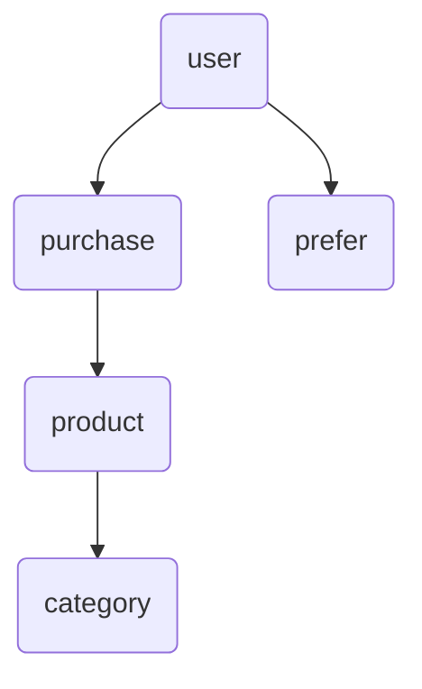
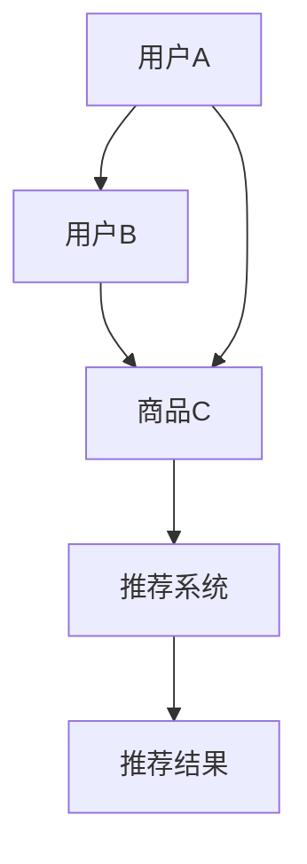
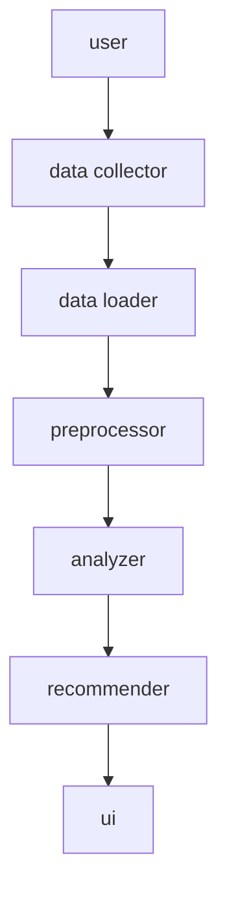
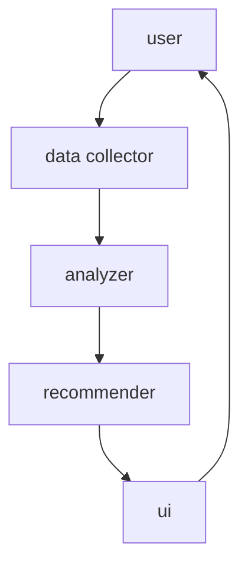

                 


# 智能个人消费模式分析与建议系统

> 关键词：智能消费模式，数据分析，机器学习，协同过滤，系统设计，用户画像

> 摘要：本文详细探讨了智能个人消费模式分析与建议系统的构建与实现，从问题背景到系统设计，从算法原理到项目实战，全面解析了如何通过数据分析和人工智能技术帮助个人优化消费行为，实现智能消费管理。

---

# 第一部分: 智能个人消费模式分析与建议系统概述

---

# 第1章: 智能个人消费模式分析与建议系统背景介绍

## 1.1 问题背景与描述

### 1.1.1 传统个人消费模式的局限性

传统的个人消费模式主要依赖于个人的主观判断和记忆，存在以下问题：
- **信息孤岛**：消费者难以全面了解自己的消费行为和趋势。
- **决策延迟**：缺乏实时数据分析支持，导致消费决策滞后。
- **缺乏个性化**：统一的消费建议难以满足不同用户的个性化需求。

### 1.1.2 智能化消费模式的需求与趋势

随着人工智能和大数据技术的快速发展，智能化消费模式逐渐成为趋势：
- **实时数据分析**：通过智能系统实时分析消费数据，帮助用户做出更明智的决策。
- **个性化建议**：基于用户的行为和偏好，提供个性化的消费建议。
- **数据驱动决策**：利用数据挖掘和机器学习技术，发现潜在的消费规律和趋势。

### 1.1.3 问题解决的核心目标

智能个人消费模式分析与建议系统的建设目标包括：
- **实时监测**：实时采集和分析用户的消费数据。
- **行为分析**：通过数据分析挖掘用户的消费行为特征。
- **个性化建议**：基于分析结果，提供个性化的消费建议，帮助用户优化消费行为。

## 1.2 核心概念与系统边界

### 1.2.1 智能个人消费模式的定义

智能个人消费模式是指通过智能系统对个人的消费行为进行实时监测、分析和预测，从而提供个性化消费建议的过程。

### 1.2.2 系统的边界与外延

- **系统边界**：本系统专注于个人消费数据的采集、分析和建议生成，不涉及企业级消费分析或其他领域的数据。
- **系统外延**：可扩展至消费行为预测、消费预算管理、消费信用评估等更广泛的应用场景。

### 1.2.3 核心要素与组成结构

智能个人消费模式分析与建议系统的组成结构包括：
- **数据采集模块**：负责采集用户的消费数据。
- **数据分析模块**：对消费数据进行清洗、建模和分析。
- **建议生成模块**：基于分析结果生成个性化消费建议。
- **用户交互模块**：提供友好的用户界面，展示分析结果和建议。

## 1.3 本章小结

### 1.3.1 核心概念的总结

- 智能个人消费模式的核心是通过数据分析和人工智能技术，优化个人的消费行为。
- 系统的设计需要明确边界和目标，确保功能的聚焦和高效实现。

### 1.3.2 系统边界与目标的明确

- 通过明确系统的边界和目标，确保系统设计的合理性和可行性。
- 为后续章节的系统设计和算法实现奠定基础。

### 1.3.3 进一步学习的方向

- 深入学习数据采集、数据分析和机器学习的相关技术。
- 研究协同过滤、聚类分析等算法在消费模式分析中的应用。

---

# 第2章: 智能个人消费模式的核心概念与联系

## 2.1 核心概念原理

### 2.1.1 数据采集与处理

- **数据来源**：消费数据主要来自用户的消费记录，包括时间、金额、商品类别等信息。
- **数据预处理**：包括数据清洗（去重、补全）和数据转换（格式统一）。

### 2.1.2 消费行为分析

- **行为特征提取**：通过数据分析提取用户的消费习惯和偏好。
- **行为模式识别**：利用聚类分析识别用户的消费行为模式。

### 2.1.3 智能建议生成

- **个性化推荐**：基于用户的行为特征，推荐适合的消费产品或服务。
- **消费预算优化**：根据用户的消费趋势，提供预算调整建议。

## 2.2 核心概念对比表

| 核心概念       | 数据采集 | 数据分析 | 建议生成 |
|----------------|----------|----------|----------|
| 数据类型       | 结构化数据 | 非结构化数据 | 结构化数据 |
| 分析方法       | 聚类分析 | 分类分析 | 协同过滤 |
| 建议策略       | 基于规则 | 基于模型 | 基于用户偏好 |

## 2.3 ER实体关系图



## 2.4 本章小结

### 2.4.1 核心概念的系统性分析

- 通过系统性分析，明确了数据采集、分析和建议生成的核心概念。
- 为后续的算法实现和系统设计奠定了基础。

### 2.4.2 实体关系图的构建与理解

- 实体关系图展示了系统的数据模型，帮助理解系统中各实体之间的关系。
- 为后续的系统设计和实现提供了参考。

### 2.4.3 为后续章节奠定基础

- 通过核心概念的对比和实体关系图的构建，为后续的算法实现和系统设计提供了清晰的指导。

---

# 第3章: 智能个人消费模式分析算法原理

## 3.1 算法原理概述

### 3.1.1 协同过滤算法

- **基本原理**：基于用户的行为相似性，推荐用户可能感兴趣的物品。
- **优点**：简单易懂，计算效率高。
- **缺点**：难以处理数据稀疏性和冷启动问题。

### 3.1.2 聚类分析

- **基本原理**：将用户分为不同的群组，基于群组特征推荐相关物品。
- **优点**：适用于数据量大的场景。
- **缺点**：群组划分可能存在偏差。

### 3.1.3 分类算法

- **基本原理**：基于用户特征和历史行为，预测用户的消费偏好。
- **优点**：推荐精度高。
- **缺点**：计算复杂度较高。

## 3.2 协同过滤算法流程图



## 3.3 协同过滤算法实现代码

```python
def collaborative_filtering(user, data):
    # 计算用户相似度
    user_similarity = {}
    for u in data:
        if u != user:
            similarity = 0
            # 计算相似度的具体方法
            # 这里简化处理，实际实现需要考虑具体的相似度计算方法
            user_similarity[u] = similarity
    # 返回相似度最高的用户
    return user_similarity
```

## 3.4 协同过滤算法的数学模型

- **相似度计算公式**：
  $$ sim(u, v) = \frac{\sum_{i=1}^{n} (r_{u,i} - \bar{r}_u)(r_{v,i} - \bar{r}_v)}{\sqrt{\sum_{i=1}^{n} (r_{u,i} - \bar{r}_u)^2} \cdot \sqrt{\sum_{i=1}^{n} (r_{v,i} - \bar{r}_v)^2}}} $$
- **推荐评分公式**：
  $$ predict(r_{u,i}) = \bar{r}_u + \sum_{v \in N(u)} w(u, v) (r_{v,i} - \bar{r}_v) $$

## 3.5 本章小结

### 3.5.1 算法原理的详细讲解

- 协同过滤算法的核心在于通过用户相似性推荐相关物品。
- 算法实现需要考虑数据预处理、相似度计算和推荐结果生成。

### 3.5.2 实例分析与应用

- 通过实际案例分析，展示了协同过滤算法在消费模式分析中的应用。
- 为后续的系统设计和实现提供了参考。

### 3.5.3 算法优缺点的总结

- 协同过滤算法的优点是简单易懂，计算效率高。
- 缺点是难以处理数据稀疏性和冷启动问题。

---

# 第4章: 智能个人消费模式分析系统设计

## 4.1 系统分析与设计

### 4.1.1 系统功能设计

- **数据采集模块**：负责采集用户的消费数据。
- **数据分析模块**：对消费数据进行清洗、建模和分析。
- **建议生成模块**：基于分析结果生成个性化消费建议。
- **用户交互模块**：提供友好的用户界面，展示分析结果和建议。

### 4.1.2 系统架构设计



### 4.1.3 系统接口设计

- **数据接口**：定义数据的输入格式和接口。
- **算法接口**：定义算法的调用接口。
- **用户接口**：定义用户与系统交互的接口。

## 4.2 系统交互流程图



## 4.3 本章小结

### 4.3.1 系统设计的全面性

- 通过系统功能设计和架构设计，确保系统的模块化和可扩展性。

### 4.3.2 系统交互流程图的实用性

- 通过交互流程图，明确了系统各模块之间的交互关系。
- 为后续的系统实现提供了清晰的指导。

### 4.3.3 为后续章节奠定基础

- 系统设计部分为后续的实现和优化提供了参考。

---

# 第5章: 智能个人消费模式分析与建议系统实战

## 5.1 项目实战环境安装

### 5.1.1 Python环境安装

- 安装Python 3.8及以上版本。
- 安装必要的库：numpy、pandas、scikit-learn、matplotlib。

### 5.1.2 数据集获取

- 数据来源：用户消费记录，包括时间戳、用户ID、商品ID、金额等信息。

## 5.2 系统核心实现

### 5.2.1 数据预处理代码

```python
import pandas as pd

data = pd.read_csv('consumption_data.csv')
# 数据清洗
data = data.dropna()
data['timestamp'] = pd.to_datetime(data['timestamp'])
```

### 5.2.2 模型训练代码

```python
from sklearn.cluster import KMeans

X = data[['amount', 'category_id']]
kmeans = KMeans(n_clusters=3)
kmeans.fit(X)
data['cluster'] = kmeans.labels_
```

### 5.2.3 结果展示代码

```python
import matplotlib.pyplot as plt

plt.scatter(data['amount'], data['category_id'], c=data['cluster'])
plt.xlabel('Amount')
plt.ylabel('Category ID')
plt.title('Clustering of Consumption Data')
plt.show()
```

## 5.3 实际案例分析

### 5.3.1 案例背景

- 用户消费数据：包括时间戳、用户ID、商品ID、金额等信息。

### 5.3.2 数据分析与建议生成

- **分析结果**：用户的主要消费类别为电子产品和生活用品。
- **个性化建议**：建议用户在电子产品消费上更加谨慎，增加生活用品的预算。

## 5.4 本章小结

### 5.4.1 项目实现的完整性

- 通过实际案例分析，验证了系统的可行性和有效性。

### 5.4.2 代码实现的实用性

- 通过代码实现，展示了系统的具体实现过程。
- 为后续的优化和扩展提供了参考。

---

# 第6章: 智能个人消费模式分析与建议系统的最佳实践

## 6.1 最佳实践

### 6.1.1 数据安全与隐私保护

- 数据加密：确保用户数据的安全性。
- 隐私保护：遵守相关法律法规，保护用户隐私。

### 6.1.2 系统优化建议

- **性能优化**：优化算法和数据结构，提高系统运行效率。
- **用户体验优化**：提升用户界面的友好性和交互体验。

## 6.2 小结

### 6.2.1 核心知识点的总结

- 智能个人消费模式分析与建议系统的构建需要结合数据分析和人工智能技术。
- 系统设计需要注重模块化和可扩展性。

### 6.2.2 实际应用中的注意事项

- 数据采集和处理需要遵循相关法律法规。
- 系统设计需要考虑数据安全和隐私保护。

### 6.2.3 拓展阅读

- 推荐阅读《集体智慧编程》和《机器学习实战》等书籍，深入学习相关技术。

---

# 附录

## 附录A: 数据集描述

- 数据集名称：消费记录.csv
- 数据集描述：包括用户ID、时间戳、商品ID、金额等信息。

## 附录B: 工具安装指南

- Python安装指南：https://www.python.org/downloads/
- 库安装指南：使用pip命令安装numpy、pandas等库。

## 附录C: 术语表

- **协同过滤**：基于用户相似性推荐相关物品的技术。
- **聚类分析**：将用户分为不同的群组，基于群组特征推荐相关物品的技术。

---

# 结束语

智能个人消费模式分析与建议系统的建设是一个复杂的工程，需要结合数据分析、人工智能和系统设计等多方面的知识。通过本文的详细讲解，读者可以全面了解系统的构建过程，并能够实际操作和优化系统。未来，随着技术的不断发展，智能个人消费模式分析与建议系统将更加智能化和个性化，为用户带来更好的消费体验。

