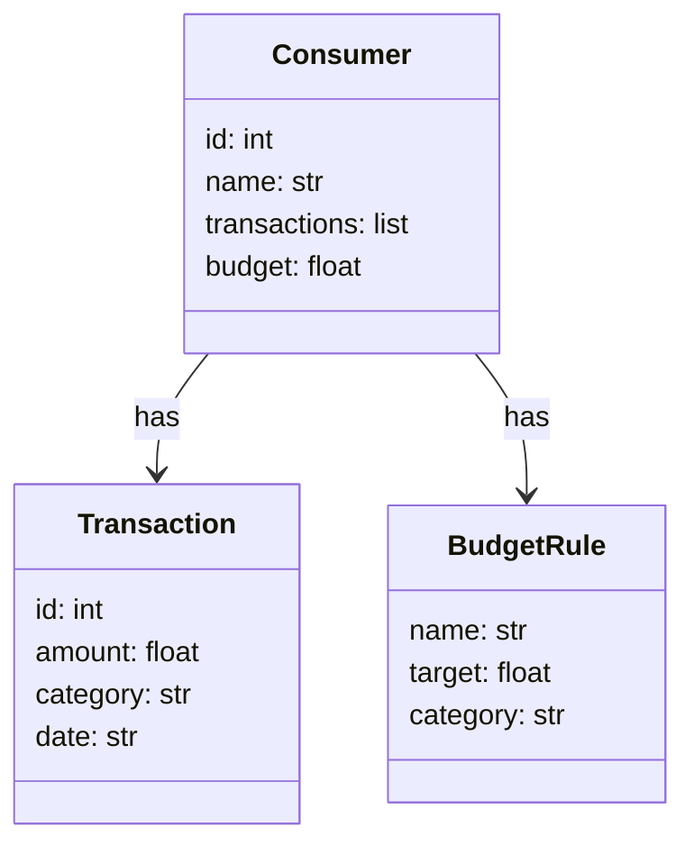
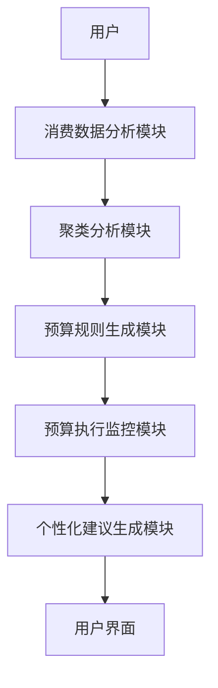

                 


# 智能个人消费模式分析与预算管理系统

> 关键词：智能消费分析，预算管理，数据驱动，个性化建议，系统设计

> 摘要：本文探讨了智能个人消费模式分析与预算管理系统的构建与实现。通过分析当前消费模式的复杂性与传统管理方式的局限性，提出了一种基于数据驱动的智能消费分析与预算管理系统，结合聚类分析和线性规划算法，设计了系统的功能模块与架构，并通过实际案例展示了系统的应用效果。

---

## 第一部分: 背景介绍

### 第1章: 问题背景

#### 1.1 问题背景
随着经济的发展和消费习惯的多样化，个人消费模式变得越来越复杂。传统的消费管理方式难以满足人们对高效、个性化预算管理的需求。传统的消费管理模式依赖人工记录和简单的统计分析，存在数据碎片化、分析效率低、建议不够个性化等问题。

#### 1.2 问题描述
- **数据碎片化**：消费数据来源多样，难以整合，导致分析结果不完整。
- **分析效率低**：传统分析方法依赖人工操作，效率低下，难以实时响应。
- **建议不够个性化**：传统预算管理缺乏对个体消费习惯的深入分析，导致建议的普适性较强，个性化不足。

#### 1.3 问题解决
通过引入智能技术，包括数据挖掘、机器学习和优化算法，可以实现消费数据的高效整合、分析与可视化，从而提供个性化的消费建议和预算管理方案。

#### 1.4 边界与外延
系统功能的边界主要集中在消费数据的采集、分析与预算管理上，不涉及外部支付系统或其他外部服务的直接集成。系统的扩展性设计允许未来增加更多功能模块，如信用评分、消费预测等。

#### 1.5 核心概念与联系
智能消费分析与预算管理的核心概念包括消费数据分析、预算目标设定和个性化建议生成。这些概念之间的联系通过数据流和功能模块相互作用体现，形成一个完整的消费管理闭环。

---

## 第二部分: 核心概念与联系

### 第2章: 核心概念原理

#### 2.1 智能消费分析
智能消费分析通过采集和整合消费数据，利用数据挖掘和机器学习算法，识别消费模式和趋势，为用户提供数据驱动的消费洞察。

#### 2.2 预算管理
预算管理基于智能分析结果，帮助用户设定合理的预算目标，并通过实时监控和优化调整，确保预算执行的有效性。

#### 2.3 个性化消费建议
个性化消费建议根据用户的消费习惯和偏好，提供定制化的消费建议，帮助用户优化消费结构，实现财务目标。

### 第3章: 核心概念属性特征对比

#### 3.1 智能消费分析与传统消费分析对比
| 对比维度         | 智能消费分析                     | 传统消费分析                     |
|------------------|----------------------------------|----------------------------------|
| 数据处理         | 高效、自动化                     | 低效、人工化                     |
| 分析方法         | 数据挖掘、机器学习               | 统计分析、简单模型               |
| 结果展示         | 可视化图表、动态更新             | 表格、静态报告                   |

#### 3.2 预算管理与传统预算管理对比
| 对比维度         | 智能预算管理                     | 传统预算管理                     |
|------------------|----------------------------------|----------------------------------|
| 管理方式         | 数据驱动、实时调整               | 人工制定、周期性调整             |
| 执行效率         | 高效、自动化                     | 低效、依赖人工                   |
| 调整灵活性       | 灵活、基于实时数据               | 稳定、基于固定周期               |

---

## 第三部分: 算法原理讲解

### 第4章: 聚类分析算法

#### 4.1 聚类分析原理
聚类分析是一种无监督学习算法，用于将消费数据分成若干类别，识别消费模式。

#### 4.2 算法流程
1. 数据预处理：清洗和归一化数据。
2. 特征选择：提取关键消费特征。
3. 聚类实现：使用K-means算法进行聚类。
4. 结果分析：对聚类结果进行标签化和可视化。

#### 4.3 聚类分析的数学模型
$$ \text{目标函数} = \sum_{i=1}^{k} \sum_{j=1}^{n_i} (x_{ij} - \mu_i)^2 $$
其中，$k$为聚类数，$n_i$为第$i$个聚类的样本数，$x_{ij}$为第$j$个样本的特征值，$\mu_i$为第$i$个聚类的中心点。

#### 4.4 代码实现
```python
from sklearn.cluster import KMeans
from sklearn.preprocessing import StandardScaler

# 数据预处理
data = ...  # 消费数据
scaler = StandardScaler()
data_scaled = scaler.fit_transform(data)

# 聚类实现
kmeans = KMeans(n_clusters=3, random_state=42)
clusters = kmeans.fit_predict(data_scaled)
```

---

## 第四部分: 系统分析与架构设计

### 第5章: 系统功能设计

#### 5.1 领域模型类图


#### 5.2 系统架构设计


---

## 第五部分: 项目实战

### 第6章: 实战指导

#### 6.1 环境安装
- 安装Python和必要的库（如Pandas、Scikit-learn、Matplotlib）。

#### 6.2 核心代码实现
```python
import pandas as pd
from sklearn.cluster import KMeans
from sklearn.preprocessing import StandardScaler

# 数据加载
data = pd.read_csv('consumption.csv')

# 数据预处理
scaler = StandardScaler()
data_scaled = scaler.fit_transform(data[['amount', 'category_code', 'date_diff']])

# 聚类实现
kmeans = KMeans(n_clusters=4, random_state=42)
clusters = kmeans.fit_predict(data_scaled)

# 可视化
import matplotlib.pyplot as plt
plt.scatter(data_scaled[:, 0], data_scaled[:, 1], c=clusters, cmap='viridis')
plt.xlabel('消费金额')
plt.ylabel('消费类别')
plt.title('消费聚类结果')
plt.show()
```

---

## 第六部分: 最佳实践

### 第7章: 总结与展望

#### 7.1 小结
智能个人消费模式分析与预算管理系统通过数据驱动的方法，实现了消费数据的高效分析与个性化管理，为用户提供了科学的消费建议。

#### 7.2 注意事项
- 数据隐私保护是系统设计中的重要考虑因素。
- 算法的选择应根据实际数据特征进行调整。
- 系统的可扩展性设计需要充分考虑未来功能的增加。

#### 7.3 拓展阅读
- 关于数据挖掘的书籍：《数据挖掘导论》。
- 关于机器学习的书籍：《机器学习实战》。

--- 

# 结语
通过本文的详细讲解，读者可以全面了解智能个人消费模式分析与预算管理系统的构建与实现。希望本文能为相关领域的研究和实践提供有价值的参考。

