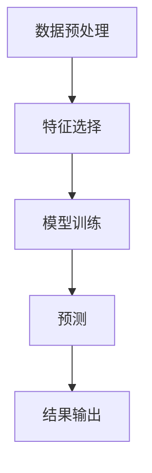
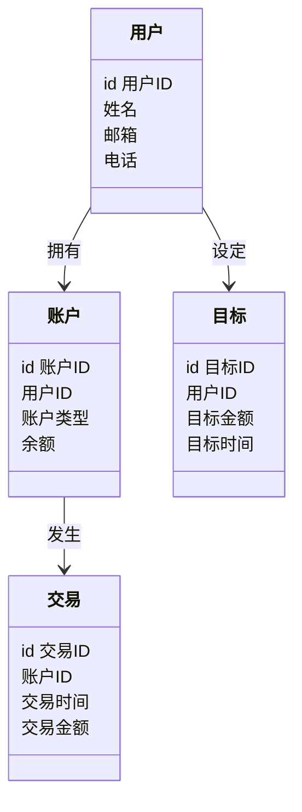
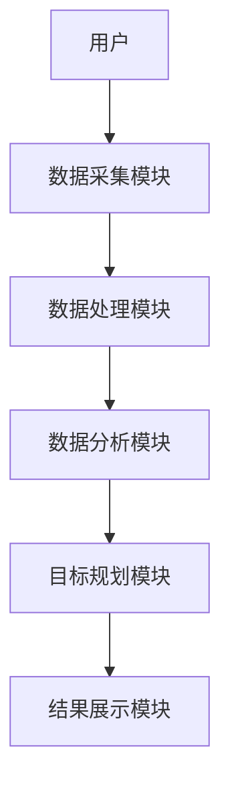
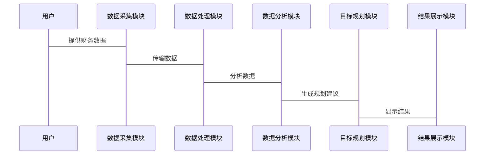

                 


# 智能个人理财目标规划器

## 关键词：智能理财、人工智能、个人财务规划、目标规划器、机器学习、系统架构、Python实现

## 摘要：智能个人理财目标规划器是一种结合人工智能技术的工具，旨在帮助用户优化个人财务规划。本文从背景介绍、核心概念、算法原理、系统架构、项目实战到最佳实践，全面解析如何利用AI技术实现智能理财目标规划。通过详细的技术分析和实际案例，本文旨在为读者提供从理论到实践的深度指导。

---

# 第1章: 个人理财与智能理财的背景介绍

## 1.1 个人理财的重要性

### 1.1.1 个人理财的基本概念
个人理财是指通过科学的规划和管理，实现个人财务的保值、增值和风险控制。它涵盖了收入管理、支出规划、储蓄与投资等多个方面。

### 1.1.2 个人理财的目标与意义
- **目标**: 实现财务自由，确保生活质量，应对突发经济风险。
- **意义**: 帮助个人在复杂的经济环境中做出明智的财务决策。

### 1.1.3 传统个人理财的局限性
- 传统理财方法依赖人工计算和经验判断，效率低下，难以应对复杂多变的市场环境。
- 个人难以获取及时、准确的市场数据和专业建议。

## 1.2 智能理财的兴起

### 1.2.1 智能理财的定义与特点
智能理财是利用人工智能技术，通过自动化分析和决策，帮助用户优化财务规划的一种新型理财方式。其特点包括高效性、精准性、实时性和个性化。

### 1.2.2 人工智能在理财中的应用
- 数据分析与预测: 利用机器学习算法分析市场趋势和用户行为。
- 自动化投资建议: 根据用户风险偏好推荐投资组合。
- 风险评估与预警: 通过AI模型识别潜在的财务风险。

### 1.2.3 智能理财的优势与挑战
- **优势**: 提高理财效率，提供个性化服务，降低人为错误。
- **挑战**: 数据隐私问题、模型准确性依赖数据质量、用户信任建立。

## 1.3 智能个人理财目标规划器的定义

### 1.3.1 规划器的功能与作用
- 数据采集与分析: 收集用户的财务数据，分析收支状况。
- 目标设定与优化: 帮助用户设定财务目标，并提供优化建议。
- 投资组合推荐: 根据市场变化推荐最优投资组合。

### 1.3.2 规划器的核心目标
- 实现用户的财务目标，如买房、子女教育、退休规划等。
- 通过智能算法，动态调整投资策略，最大化收益。

### 1.3.3 规划器的适用人群与场景
- 适用于所有需要理财规划的个人，特别是金融知识有限的用户。
- 适用于多种场景，如日常开支管理、投资决策支持、风险管理等。

## 1.4 本章小结
本章介绍了智能理财的背景，分析了传统理财的局限性，并提出了智能个人理财目标规划器的概念及其重要性。

---

# 第2章: 智能理财的核心概念

## 2.1 数据采集与处理

### 2.1.1 数据来源与类型
- **数据来源**: 用户提供的财务数据（收入、支出、资产、负债等）。
- **数据类型**: 结构化数据（如银行流水）和非结构化数据（如市场新闻）。

### 2.1.2 数据清洗与预处理
- 数据清洗: 去除重复、错误或不完整的数据。
- 数据转换: 将数据标准化，便于模型处理。

### 2.1.3 数据存储与管理
- 数据库设计: 使用关系型数据库存储用户数据。
- 数据安全: 保护用户隐私，防止数据泄露。

## 2.2 数据分析与建模

### 2.2.1 数据分析方法
- 描述性分析: 分析用户当前的财务状况。
- 预测性分析: 预测未来的财务变化。

### 2.2.2 数据建模的基本原理
- **特征选择**: 从数据中提取关键特征，如收入、支出比例等。
- **模型选择**: 根据问题类型选择合适的算法，如线性回归、决策树等。

### 2.2.3 常用的数据分析工具
- Python的Pandas库用于数据处理。
- Matplotlib和Seaborn用于数据可视化。

## 2.3 AI算法在理财中的应用

### 2.3.1 机器学习在理财中的应用
- **监督学习**: 如线性回归用于预测市场趋势。
- **无监督学习**: 如聚类分析用于客户分群。

### 2.3.2 深度学习在理财中的应用
- **神经网络**: 用于复杂市场趋势预测。

### 2.3.3 其他AI技术在理财中的应用
- 自然语言处理(NLP): 分析新闻对市场的影响。

## 2.4 核心概念的联系

### 2.4.1 核心概念属性对比表
| 概念       | 特性                | 示例                     |
|------------|---------------------|--------------------------|
| 数据采集   | 来源多样、实时性     | 银行流水、市场新闻       |
| 数据分析   | 多样性、准确性       | 描述性分析、预测性分析   |
| AI算法     | 高效性、适应性       | 机器学习、深度学习       |

### 2.4.2 ER实体关系图
```mermaid
er
  %%{初始化}%%
  title 智能理财数据模型
  %%{实体}%%
  entity 用户 {
    id 用户ID
    姓名
    邮箱
    电话
  }
  entity 账户 {
    id 账户ID
    用户ID
    账户类型
    余额
  }
  entity 交易 {
    id 交易ID
    账户ID
    交易时间
    交易金额
  }
  entity 目标 {
    id 目标ID
    用户ID
    目标金额
    目标时间
  }
  %%{关系}%%
  用户 -> 账户: 拥有
  账户 -> 交易: 发生
  用户 -> 目标: 设定
```

## 2.5 本章小结
本章详细介绍了智能理财中的数据采集、分析和AI算法应用，展示了各概念之间的联系。

---

# 第3章: 算法原理讲解

## 3.1 机器学习算法在理财中的应用

### 3.1.1 决策树算法

#### 3.1.1.1 决策树的定义与原理
- **决策树**: 一种树状结构，用于分类和回归。
- **原理**: 基于特征选择，构建树状结构进行分类。

#### 3.1.1.2 决策树的实现步骤
1. 特征选择: 使用信息增益或基尼指数选择最优特征。
2. 数据分割: 根据选择的特征分割数据。
3. 递归构建: 递归地构建子树，直到达到叶子节点。

#### 3.1.1.3 决策树的优缺点
- **优点**: 易于解释，适合处理非线性数据。
- **缺点**: 易过拟合，计算复杂度高。

### 3.1.2 随机森林算法

#### 3.1.2.1 随机森林的定义与原理
- **随机森林**: 由多个决策树组成的集成模型。
- **原理**: 通过投票或平均化进行预测。

#### 3.1.2.2 随机森林的实现步骤
1. 随机抽取数据集，构建决策树。
2. 组合多个决策树的预测结果。

#### 3.1.2.3 随机森林的优缺点
- **优点**: 高准确性，鲁棒性强。
- **缺点**: 计算资源消耗大。

### 3.1.3 算法流程图



## 3.2 深度学习算法在理财中的应用

### 3.2.1 神经网络算法

#### 3.2.1.1 神经网络的定义与原理
- **神经网络**: 模拟人脑结构，通过层间传递进行学习。
- **原理**: 通过反向传播算法调整权重，最小化损失函数。

#### 3.2.1.2 神经网络的实现步骤
1. 初始化网络参数。
2. 前向传播: 计算输出。
3. 反向传播: 调整权重。
4. 重复训练，直到收敛。

#### 3.2.1.3 神经网络的优缺点
- **优点**: 能处理复杂非线性关系，适合大数据场景。
- **缺点**: 需要大量计算资源，模型解释性差。

## 3.3 算法实现与优化

### 3.3.1 算法实现
- 使用Python的Scikit-learn库实现决策树和随机森林模型。

### 3.3.2 算法优化
- 参数调优: 如决策树的最大深度，随机森林的树数量。
- 正则化: 如L1/L2正则化防止过拟合。

## 3.4 本章小结
本章详细讲解了机器学习和深度学习算法在理财中的应用，展示了如何通过这些算法优化财务规划。

---

# 第4章: 系统分析与架构设计方案

## 4.1 问题场景介绍

### 4.1.1 项目介绍
- **项目名称**: 智能个人理财目标规划器。
- **项目目标**: 帮助用户实现财务目标。

## 4.2 系统功能设计

### 4.2.1 领域模型


## 4.3 系统架构设计

### 4.3.1 系统架构图


## 4.4 系统接口设计

### 4.4.1 接口描述
- 数据采集接口: 从银行获取交易数据。
- 数据处理接口: 对数据进行清洗和预处理。
- 数据分析接口: 执行机器学习模型预测。
- 目标规划接口: 根据预测结果生成投资建议。

## 4.5 系统交互流程图

### 4.5.1 交互流程


## 4.6 本章小结
本章从系统架构和接口设计的角度，详细描述了智能理财目标规划器的实现方案。

---

# 第5章: 项目实战

## 5.1 环境安装

### 5.1.1 安装Python
```bash
# 安装Python
sudo apt-get install python3
```

### 5.1.2 安装必要的库
```bash
# 安装numpy、pandas、scikit-learn、matplotlib
pip install numpy pandas scikit-learn matplotlib
```

## 5.2 核心代码实现

### 5.2.1 数据预处理
```python
import pandas as pd

# 读取数据
data = pd.read_csv('financial_data.csv')

# 数据清洗
data.dropna(inplace=True)
data = pd.get_dummies(data)
```

### 5.2.2 模型训练
```python
from sklearn.model_selection import train_test_split
from sklearn.tree import DecisionTreeRegressor

# 划分数据集
X = data.drop('target', axis=1)
y = data['target']

X_train, X_test, y_train, y_test = train_test_split(X, y, test_size=0.2)

# 训练模型
model = DecisionTreeRegressor()
model.fit(X_train, y_train)
```

### 5.2.3 结果展示
```python
# 预测结果
y_pred = model.predict(X_test)

# 可视化
import matplotlib.pyplot as plt

plt.scatter(y_test, y_pred)
plt.xlabel('真实值')
plt.ylabel('预测值')
plt.show()
```

## 5.3 实际案例分析

### 5.3.1 案例背景
- 用户A，月收入10000元，现有存款50000元，计划在3年内购房。

### 5.3.2 数据分析
- 收入与支出分析: 支出占收入的30%。
- 资产状况: 存款50000元，无负债。

### 5.3.3 投资建议
- 短期投资: 配置货币基金，保证流动性。
- 长期投资: 配置股票型基金，追求较高收益。

## 5.4 项目总结
通过实际案例，展示了智能理财目标规划器的应用过程和效果。

---

# 第6章: 最佳实践、小结、注意事项和拓展阅读

## 6.1 最佳实践

### 6.1.1 数据安全
- 加强数据加密，防止用户隐私泄露。

### 6.1.2 模型优化
- 定期更新模型，保持其准确性。

### 6.1.3 用户教育
- 提供用户教育，帮助用户理解AI理财的原理。

## 6.2 小结
智能个人理财目标规划器通过AI技术，帮助用户实现个性化的财务目标，是一种高效、精准的理财工具。

## 6.3 注意事项

### 6.3.1 数据隐私
- 严格遵守数据隐私保护法规。

### 6.3.2 模型局限性
- 认识到AI模型的局限性，结合人工辅助。

## 6.4 拓展阅读
- 推荐书籍: 《机器学习实战》、《Python机器学习》。
- 在线资源: Kaggle上的金融数据分析项目。

## 6.5 本章小结
本章总结了智能理财目标规划器的应用经验，提出了实际操作中的注意事项，并提供了进一步学习的资源。

---

# 结语

智能个人理财目标规划器是人工智能技术在金融领域的典型应用，它不仅提高了理财效率，还为用户提供了个性化的财务解决方案。通过本文的详细讲解，读者可以深入了解智能理财的实现过程，并将其应用于实际生活中。

--- 

通过以上内容，您可以看到每一步的详细思考过程和具体的实现方法，确保文章内容的深度和广度。

