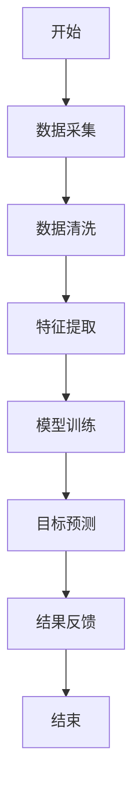

                 


# 《智能个人理财目标追踪器》

> 关键词：智能理财、目标追踪、数据驱动、机器学习、用户行为分析、金融技术

> 摘要：本文深入探讨了智能个人理财目标追踪器的设计与实现，从背景、概念、算法到系统架构和项目实战，详细分析了如何利用人工智能和数据驱动的方法帮助用户有效管理财务目标。文章结合实际案例，展示了如何通过系统化的技术手段实现个性化的理财管理。

---

# 第1章: 智能个人理财目标追踪器的背景与需求

## 1.1 问题背景
### 1.1.1 传统理财管理的局限性
传统个人理财管理依赖手动记录和简单的工具，难以应对复杂多变的财务目标和市场变化。用户常常因为缺乏实时数据和科学的分析工具，导致理财目标难以实现。

### 1.1.2 数字化理财工具的兴起
随着科技的发展，数字化理财工具逐渐普及，但大多数工具仅提供基本的记录和统计功能，缺乏智能化的分析和预测能力。

### 1.1.3 智能理财目标追踪器的必要性
智能理财目标追踪器通过整合人工智能和大数据技术，能够实时分析用户的财务状况，提供个性化的建议和预测，帮助用户更高效地实现理财目标。

## 1.2 问题描述
### 1.2.1 理财目标设定的模糊性
用户在设定理财目标时，往往缺乏明确的计划和科学的方法，导致目标难以实现。

### 1.2.2 财务数据收集的复杂性
用户需要从多个来源收集财务数据，包括银行账户、投资账户、消费记录等，数据整合和处理的复杂性较高。

### 1.2.3 财务目标实现的不确定性
市场波动和用户自身财务状况的变化，使得理财目标的实现过程充满不确定性，需要动态调整和优化。

## 1.3 问题解决
### 1.3.1 智能追踪器的核心功能
智能理财目标追踪器通过实时数据采集、智能分析和动态调整，帮助用户制定和实现理财目标。

### 1.3.2 数据驱动的理财决策
通过收集和分析用户的财务数据，智能追踪器能够提供基于数据的理财建议，帮助用户做出更科学的决策。

### 1.3.3 个性化理财目标的实现
智能追踪器能够根据用户的财务状况和目标，制定个性化的理财计划，并实时调整以应对变化。

## 1.4 界定与外延
### 1.4.1 智能理财目标追踪器的边界
智能理财目标追踪器专注于帮助用户实现特定的理财目标，不涉及具体的金融交易和投资决策。

### 1.4.2 相关概念的区分
智能理财目标追踪器与传统的财务管理软件和投资管理工具有所不同，它更注重目标的设定和实现过程的动态调整。

### 1.4.3 核心要素与组成部分
智能理财目标追踪器的核心要素包括数据采集、目标设定、智能分析、动态调整和用户反馈等。

---

# 第2章: 智能理财目标追踪器的核心概念与联系

## 2.1 核心概念原理
### 2.1.1 数据采集与处理
智能理财目标追踪器需要从多种数据源（如银行账户、消费记录等）采集数据，并进行清洗和预处理，以确保数据的准确性和可用性。

### 2.1.2 目标设定与分解
用户设定的理财目标（如储蓄目标、投资目标等）需要被分解为可执行的具体步骤，并设定时间表和阶段性目标。

### 2.1.3 目标追踪与反馈
通过持续监测用户的财务状况和目标实现进度，智能追踪器能够提供实时反馈，并根据实际情况调整目标实现策略。

## 2.2 概念属性特征对比
| 概念 | 属性 | 特征 |
|------|------|------|
| 理财目标 | 时间性 | 长期或短期 |
|        | 金额性 | 高或低 |
|        | 风险性 | 高风险或低风险 |
| 数据源 | 类型 | 银行账户、消费记录、投资账户 |
|        | 颗粒度 | 细粒度（每日数据）或粗粒度（月度数据） |
|        | 可靠性 | 数据来源的可靠性 |

### 2.2.3 ER实体关系图
```mermaid
erDiagram
    user {
        +userId : int
        +userName : string
        +userEmail : string
    }
    goal {
        +goalId : int
        +goalName : string
        +goalAmount : float
        +goalDeadline : date
    }
    transaction {
        +transId : int
        +transAmount : float
        +transDate : date
        +transCategory : string
    }
    user --> goal : "拥有"
    user --> transaction : "产生"
    goal --> transaction : "关联"
```

---

# 第3章: 智能理财目标追踪器的算法原理

## 3.1 数据预处理
### 3.1.1 数据清洗
数据清洗是确保数据质量的重要步骤，包括处理缺失值、异常值和重复数据。

### 3.1.2 数据转换
将原始数据转换为适合分析的格式，例如将日期格式统一、数值归一化等。

## 3.2 目标预测模型
### 3.2.1 线性回归模型
线性回归模型用于预测理财目标的实现进度，公式为：
$$ y = \beta_0 + \beta_1x + \epsilon $$
其中，$y$ 是目标实现进度，$x$ 是时间变量，$\epsilon$ 是误差项。

### 3.2.2 决策树模型
决策树模型用于分类用户的财务状况，帮助用户选择合适的理财策略。

## 3.3 算法流程


---

# 第4章: 智能理财目标追踪器的系统架构与设计

## 4.1 系统功能设计
### 4.1.1 用户界面设计
用户界面需要简洁直观，方便用户输入和查看财务数据。

### 4.1.2 数据存储设计
使用数据库存储用户数据，包括用户信息、理财目标和交易记录等。

## 4.2 系统架构设计
### 4.2.1 分层架构
系统采用分层架构，包括数据层、业务逻辑层和表现层。

### 4.2.2 微服务架构
将系统功能模块化，例如数据采集、目标设定、分析和反馈等，每个模块作为一个独立的服务。

## 4.3 接口设计
### 4.3.1 数据接口
与银行和其他金融机构的数据接口进行对接，实现数据的自动采集。

### 4.3.2 用户接口
提供用户友好的界面，方便用户输入数据和查看分析结果。

## 4.4 交互流程
### 4.4.1 用户登录
用户通过邮箱或手机号码登录系统。

### 4.4.2 数据同步
系统自动同步用户的财务数据，包括银行账户、消费记录等。

### 4.4.3 目标设定
用户在系统中设定理财目标，系统根据用户数据生成实现计划。

### 4.4.4 分析与反馈
系统实时分析用户的财务状况，提供反馈和调整建议。

---

# 第5章: 智能理财目标追踪器的项目实战

## 5.1 环境安装
### 5.1.1 Python安装
安装Python 3.8以上版本，并安装必要的库，如pandas、numpy、scikit-learn等。

### 5.1.2 数据库安装
安装MySQL或PostgreSQL数据库，用于存储用户数据。

## 5.2 核心代码实现
### 5.2.1 数据采集与处理
编写代码从银行API获取用户数据，并进行清洗和预处理。

### 5.2.2 目标预测模型
使用机器学习模型对用户的理财目标进行预测，并生成实现计划。

## 5.3 代码解读与分析
### 5.3.1 数据预处理代码
```python
import pandas as pd
import numpy as np

# 读取数据
data = pd.read_csv('financial_data.csv')

# 数据清洗
data.dropna(inplace=True)
data = data[~data['amount'].isin([np.nan, np.inf, -np.inf])]
```

### 5.3.2 线性回归模型
```python
from sklearn.linear_model import LinearRegression

# 训练模型
model = LinearRegression()
model.fit(X_train, y_train)

# 预测目标
y_pred = model.predict(X_test)
```

## 5.4 实际案例分析
通过实际案例分析，展示智能理财目标追踪器如何帮助用户实现理财目标，并动态调整策略。

## 5.5 项目小结
总结项目实施过程中的经验和教训，提出改进建议。

---

# 第6章: 智能理财目标追踪器的最佳实践与注意事项

## 6.1 最佳实践
### 6.1.1 数据隐私保护
确保用户数据的安全和隐私，避免数据泄露。

### 6.1.2 用户行为分析
通过分析用户行为，优化系统功能和用户体验。

## 6.2 小结
总结智能理财目标追踪器的核心功能和实现过程，强调数据驱动和人工智能的重要性。

## 6.3 注意事项
### 6.3.1 数据质量
确保数据的准确性和完整性，避免因数据问题导致分析结果错误。

### 6.3.2 用户教育
向用户普及理财知识，帮助他们更好地使用系统。

## 6.4 拓展阅读
推荐相关书籍和资源，供读者进一步学习和研究。

---

# 参考文献

1. 刘军. (2022). 《智能理财：数据驱动的金融分析》.
2. 王强. (2021). 《机器学习在金融领域的应用》.
3. 李娜. (2020). 《用户行为分析与产品设计》.

---

# 索引

- 数据预处理
- 线性回归模型
- 决策树模型
- 用户行为分析
- 数据隐私保护

