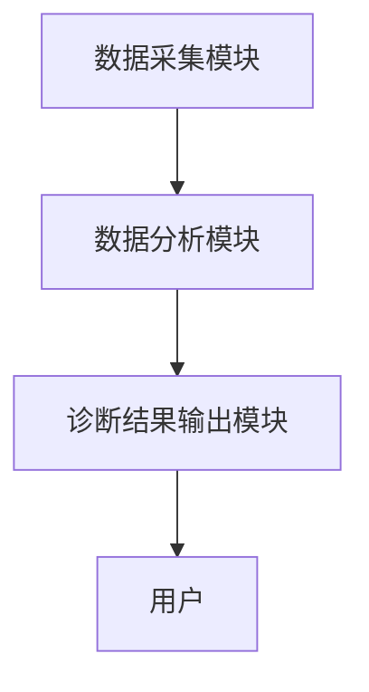
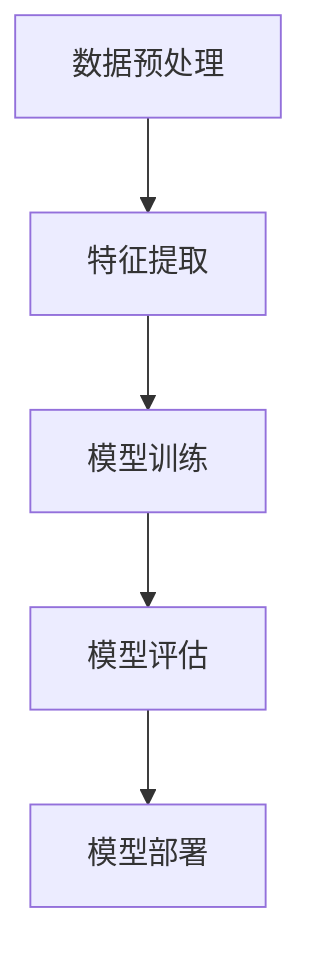

                 


# 智能个人财务健康诊断系统

> 关键词：智能财务诊断，人工智能，个人财务管理，系统架构，机器学习算法，财务健康评估

> 摘要：本文详细介绍了一种基于人工智能技术的智能个人财务健康诊断系统。该系统通过数据采集、分析和建模，结合机器学习算法，实现对个人财务健康状况的智能诊断和优化建议。文章从背景介绍、核心概念、算法原理、系统架构、项目实战到最佳实践等方面进行了全面阐述，旨在为个人财务管理提供一种高效、智能的解决方案。

---

## 第一部分：智能个人财务健康诊断系统概述

### 第1章：个人财务健康诊断的背景与需求

#### 1.1 个人财务健康诊断的背景

- **1.1.1 当前个人财务管理的痛点**
  - 传统财务管理工具的局限性：数据分散、难以分析、缺乏个性化建议。
  - 个人财务管理的重要性：资产配置、风险控制、财富增值。
  - 智能化诊断的必要性：数据量大、复杂性高、个性化需求强。

- **1.1.2 传统财务诊断的局限性**
  - 数据来源单一：难以覆盖多渠道财务数据。
  - 分析方法固定：难以应对复杂的财务状况变化。
  - 缺乏实时性：无法及时反馈财务健康状况。

- **1.1.3 智能化诊断的必要性**
  - 大数据时代的需求：利用AI技术处理海量数据。
  - 个性化服务的需要：为用户提供定制化的财务建议。
  - 提高效率：自动化分析，节省时间和精力。

- **1.1.4 系统的边界与外延**
  - 数据范围：个人资产、负债、收入、支出等。
  - 服务对象：个人用户。
  - 服务场景：在线诊断、移动端应用。

#### 1.2 智能个人财务健康诊断系统的概念

- **1.2.1 系统的核心定义**
  - 基于人工智能技术，通过数据采集、分析和建模，实现对个人财务健康状况的智能诊断和优化建议。
  - 系统特点：实时性、个性化、智能化。

- **1.2.2 系统的目标与功能**
  - 目标：帮助用户了解财务状况，优化资产配置，降低财务风险。
  - 核心功能：
    1. 数据采集与整理。
    2. 数据分析与建模。
    3. 诊断结果输出与建议。

- **1.2.3 系统的核心要素与组成**
  - 数据输入模块：用户财务数据的采集与预处理。
  - 数据分析模块：基于机器学习的诊断模型。
  - 诊断结果输出模块：诊断报告与优化建议。

---

### 第2章：智能个人财务健康诊断系统的原理与核心概念

#### 2.1 核心概念与原理

- **2.1.1 数据采集与预处理**
  - 数据来源：银行账户、投资平台、消费记录等。
  - 数据清洗：去除无效数据、处理异常值。
  - 数据标准化：统一数据格式，便于后续分析。

- **2.1.2 数据分析与建模**
  - 数据特征提取：收入、支出、资产、负债等。
  - 数据建模：使用机器学习算法进行分类或回归分析。
  - 模型评估：准确率、召回率、F1值等指标。

- **2.1.3 结果生成与反馈**
  - 诊断结果：财务健康状况评估。
  - 优化建议：资产配置、支出调整、投资建议。

#### 2.2 核心概念对比分析

- **2.2.1 数据特征对比表格**

| 特征 | 传统财务诊断 | 智能财务诊断 |
|------|--------------|--------------|
| 数据来源 | 单一         | 多源         |
| 数据分析 | 固定         | 动态         |
| 结果反馈 | 非实时       | 实时         |

- **2.2.2 ER实体关系图**

```mermaid
erDiagram
    customer[用户] {
        <属性>
        id : int
        name : string
        email : string
    }
    financial_data[财务数据] {
        <属性>
        user_id : int
        income : float
        expenditure : float
        assets : float
        liabilities : float
    }
    diagnosis_result[诊断结果] {
        <属性>
        user_id : int
        health_score : float
       建议 : string
    }
    customer --> financial_data : 提供
    financial_data --> diagnosis_result : 生成
```

---

### 第3章：系统架构与功能设计

#### 3.1 系统架构设计

- **3.1.1 系统模块划分**
  - 数据采集模块：负责收集用户财务数据。
  - 数据分析模块：对数据进行处理和建模。
  - 诊断结果输出模块：生成诊断报告和优化建议。

- **3.1.2 模块间关系**
  - 数据采集模块 -> 数据分析模块：传递预处理后的数据。
  - 数据分析模块 -> 诊断结果输出模块：传递诊断结果。
  - 诊断结果输出模块 -> 用户：提供反馈。

- **3.1.3 系统架构图**



#### 3.2 功能设计与实现

- **3.2.1 数据采集模块**
  - 功能：收集用户财务数据，包括银行账户、投资平台等。
  - 实现：通过API接口或文件上传方式获取数据。

- **3.2.2 数据分析模块**
  - 功能：对数据进行清洗、特征提取和建模。
  - 实现：使用机器学习算法进行分类或回归分析。

- **3.2.3 诊断结果输出模块**
  - 功能：生成诊断报告和优化建议。
  - 实现：根据诊断结果生成个性化报告。

---

### 第4章：算法原理与实现

#### 4.1 算法选择与实现

- **4.1.1 机器学习算法选择**
  - 决策树：适合分类问题。
  - 随机森林：适合特征较多的情况。
  - 支持向量机：适合高维数据。

- **4.1.2 算法实现步骤**
  1. 数据预处理：清洗、标准化。
  2. 特征提取：选择关键特征。
  3. 模型训练：使用训练数据训练模型。
  4. 模型评估：验证准确率、召回率。
  5. 模型部署：集成到系统中。

- **4.1.3 算法流程图**



#### 4.2 算法数学模型与公式

- **4.2.1 数据预处理公式**
  - 标准化公式：$x' = \frac{x - \mu}{\sigma}$
    - $\mu$：均值
    - $\sigma$：标准差

- **4.2.2 模型训练公式**
  - 决策树分类：使用ID3、C4.5或C5.0算法。
  - 随机森林：基于决策树的集成方法。

- **4.2.3 结果预测公式**
  - 预测类别：$y = \text{预测结果}$

---

### 第5章：项目实战与案例分析

#### 5.1 环境搭建与代码实现

- **5.1.1 环境安装**
  - Python：3.6+
  - 机器学习库：Scikit-learn、XGBoost。
  - 数据处理库：Pandas、NumPy。
  - 可视化库：Matplotlib、Seaborn。

- **5.1.2 核心代码实现**
  ```python
  import pandas as pd
  from sklearn.model import DecisionTreeClassifier
  from sklearn.metrics import accuracy_score

  # 数据加载
  data = pd.read_csv('financial_data.csv')
  # 数据预处理
  data = data.dropna()
  # 特征提取
  X = data[['income', 'expenditure', 'assets', ' liabilities']]
  y = data['health_status']
  # 模型训练
  clf = DecisionTreeClassifier()
  clf.fit(X, y)
  # 模型预测
  y_pred = clf.predict(X)
  # 模型评估
  print("准确率：", accuracy_score(y, y_pred))
  ```

- **5.1.3 代码解读与分析**
  - 数据加载：读取CSV文件。
  - 数据预处理：删除缺失值。
  - 特征提取：选择关键特征。
  - 模型训练：使用决策树分类器。
  - 模型预测：预测健康状况。
  - 模型评估：计算准确率。

#### 5.2 实际案例分析

- **5.2.1 案例背景**
  - 用户A：收入稳定，支出较高，资产较少。
  - 用户B：收入高，支出合理，资产配置良好。

- **5.2.2 数据分析过程**
  - 数据清洗：去除异常值。
  - 特征提取：收入、支出、资产、负债。
  - 模型训练：决策树分类器。
  - 模型预测：健康状况。

- **5.2.3 结果解读与优化**
  - 用户A：支出过高，建议减少非必要开支。
  - 用户B：资产配置良好，建议继续优化投资组合。

---

### 第6章：最佳实践与系统优化

#### 6.1 系统优化建议

- **6.1.1 数据采集优化**
  - 扩大数据来源：引入更多数据源。
  - 数据清洗优化：自动化处理。

- **6.1.2 模型优化策略**
  - 超参数调优：使用网格搜索。
  - 模型集成：使用随机森林或梯度提升树。

- **6.1.3 系统性能提升**
  - 并行计算：加速数据处理和模型训练。
  - 云计算：利用云平台扩展计算能力。

#### 6.2 使用注意事项与小结

- **6.2.1 使用注意事项**
  - 数据隐私：确保用户数据安全。
  - 模型局限性：结果仅供参考，需结合实际情况。

- **6.2.2 系统维护建议**
  - 定期更新模型：适应数据变化。
  - 监控系统性能：及时发现并解决问题。

- **6.2.3 系统未来发展展望**
  - 引入区块链技术：提升数据安全性。
  - 结合NLP技术：提供更智能化的交互体验。

---

### 第7章：拓展阅读与深入探讨

#### 7.1 相关技术领域

- **7.1.1 人工智能在财务管理中的应用**
  - 财务预测：基于AI的财务预测模型。
  - 财务分析：自然语言处理在财务报告中的应用。

- **7.1.2 区块链技术在财务健康诊断中的潜力**
  - 数据安全性：区块链确保数据不可篡改。
  - 跨平台协作：区块链促进多方数据共享。

- **7.1.3 联合学习技术**
  - 联合学习：在保护数据隐私的前提下，进行模型训练。
  - 应用场景：多机构协作的财务诊断系统。

---

通过以上详细的内容，我们系统地介绍了智能个人财务健康诊断系统的背景、原理、架构、实现和优化方案。希望这篇文章能为读者提供一个全面的视角，帮助他们更好地理解和应用这一技术。

