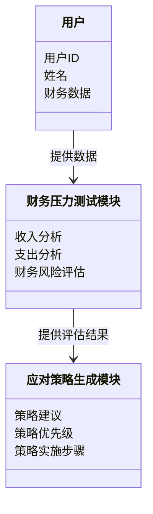
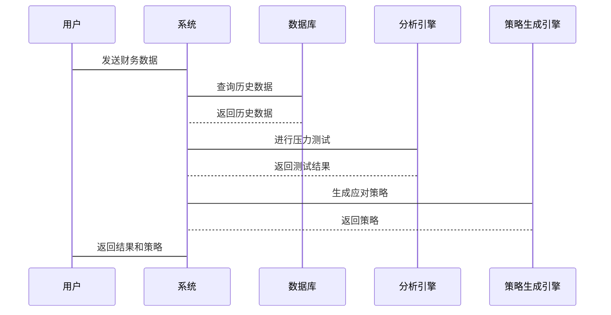

                 


# 智能个人财务压力测试与应对策略生成

## 关键词：智能财务、压力测试、机器学习、应对策略、大数据分析

## 摘要：本文探讨如何利用智能技术，如机器学习和大数据分析，进行个人财务压力测试，并生成应对策略。通过分析财务数据，识别潜在风险，并提供个性化建议，帮助个人有效管理财务状况。

---

# 第一部分: 智能个人财务压力测试的背景与基础

## 第1章: 背景与核心概念

### 1.1 问题背景

#### 1.1.1 个人财务压力的定义与特征
- 定义：个人因经济状况变化导致的财务困境，如收入减少、债务增加等。
- 特征：突发性、持续性、复杂性，影响个人生活质量。

#### 1.1.2 智能技术在财务管理中的应用现状
- 人工智能用于预测市场趋势、自动化记账。
- 大数据分析技术帮助识别消费模式和风险点。

#### 1.1.3 个人财务压力测试的必要性与意义
- 提前识别风险，避免财务危机。
- 为个人提供科学的财务管理工具。

### 1.2 核心概念与联系

#### 1.2.1 压力测试的核心原理
- 分析极端情况下财务状况的变化。
- 评估应对策略的有效性。

#### 1.2.2 应对策略生成的关键要素
- 收入调整、支出优化、债务重组。

#### 1.2.3 核心概念对比表格
| 概念 | 描述 |
|------|------|
| 压力测试 | 评估极端情况下的财务承受能力 |
| 应对策略 | 具体的调整措施和行动计划 |

#### 1.2.4 ER实体关系图（Mermaid流程图）
```mermaid
erDiagram
    user {
        用户信息
        账户信息
        收支记录
    }
    压力测试模块 {
        收入来源
        支出项目
        财务风险
    }
    应对策略模块 {
        策略类型
        策略优先级
        实施步骤
    }
```

## 第2章: 技术基础与数据来源

### 2.1 智能技术基础

#### 2.1.1 人工智能在财务管理中的应用
- 自然语言处理用于解析财务文档。
- 机器学习用于预测财务风险。

#### 2.1.2 大数据分析技术的原理与优势
- 数据清洗：处理缺失值和异常值。
- 数据挖掘：发现隐藏的财务模式。

#### 2.1.3 机器学习算法在压力测试中的作用
- 使用随机森林进行分类，预测财务危机的可能性。

### 2.2 数据来源与处理

#### 2.2.1 个人财务数据的获取与分类
- 来源：银行流水、投资记录、消费账单。
- 分类：收入、支出、资产、负债。

#### 2.2.2 数据清洗与预处理方法
- 删除重复数据，填充缺失值，标准化格式。

#### 2.2.3 数据存储与管理策略
- 使用数据库管理结构化数据，采用分布式存储提升效率。

---

# 第二部分: 压力测试与应对策略生成的算法原理

## 第3章: 压力测试模型与算法

### 3.1 压力测试模型

#### 3.1.1 蒙特卡洛模拟的原理与实现
- 原理：模拟多种可能的市场情况，评估其对财务状况的影响。
- 实现：使用Python的numpy库生成随机数，模拟极端情况。

#### 3.1.2 情景分析法的应用与优缺点
- 应用：设定特定情景（如失业、医疗紧急支出）进行测试。
- 优点：直观，便于解释；缺点：情景有限，难以覆盖所有可能性。

#### 3.1.3 机器学习模型在压力测试中的应用
- 使用XGBoost进行分类，判断财务状况是否健康。

### 3.2 应对策略生成算法

#### 3.2.1 基于规则的策略生成方法
- 规则示例：若月收入减少10%，优先削减非必要开支。

#### 3.2.2 基于机器学习的策略生成模型
- 使用聚类算法将用户分为不同风险等级，提供定制化建议。

#### 3.2.3 群决策与优化算法在策略生成中的应用
- 使用遗传算法优化策略，提高应对效率。

## 第4章: 算法实现与数学模型

### 4.1 算法实现

#### 4.1.1 蒙特卡洛模拟的Python实现代码
```python
import numpy as np

# 生成10000次模拟数据
simulations = 10000
results = []
for _ in range(simulations):
    # 假设收入和支出的波动情况
    income = np.random.normal(5000, 1000)
    expenses = np.random.normal(4000, 500)
    net_income = income - expenses
    results.append(net_income)

# 统计结果
import pandas as pd
df = pd.DataFrame(results)
print(df.describe())
```

#### 4.1.2 机器学习模型的训练与部署代码
```python
from sklearn.ensemble import RandomForestClassifier
from sklearn.model_selection import train_test_split

# 数据准备
X = df[['income', 'expenses']]
y = df['is Danger']
X_train, X_test, y_train, y_test = train_test_split(X, y, test_size=0.2)

# 训练模型
model = RandomForestClassifier()
model.fit(X_train, y_train)

# 预测
predictions = model.predict(X_test)
print("Accuracy:", accuracy_score(y_test, predictions))
```

### 4.2 数学模型与公式

#### 4.2.1 蒙特卡洛模拟的概率计算公式
$$ P(\text{财务危机}) = \frac{\text{模拟中出现危机的次数}}{\text{总模拟次数}} $$

#### 4.2.2 机器学习模型的损失函数
$$ L = \frac{1}{n}\sum_{i=1}^{n}(y_i - \hat{y}_i)^2 $$

---

# 第三部分: 系统分析与架构设计

## 第4章: 系统分析与架构设计

### 4.1 问题场景介绍
- 用户输入财务数据，系统分析并生成压力测试结果和应对策略。

### 4.2 系统功能设计

#### 4.2.1 领域模型（Mermaid类图）


### 4.3 系统架构设计（Mermaid架构图）
```mermaid
container 用户端 {
    web界面
    API接口
}
container 服务端 {
    数据库
    分析引擎
    策略生成引擎
}
用户端 --> 服务端: 请求处理
服务端 --> 数据库: 数据存取
```

### 4.4 系统接口设计
- 用户接口：REST API，接收财务数据，返回测试结果和策略。
- 数据库接口：处理数据存储和检索。

### 4.5 系统交互（Mermaid序列图）


---

# 第四部分: 项目实战

## 第5章: 项目实战

### 5.1 环境安装

#### 5.1.1 安装Python和必要的库
```bash
pip install numpy pandas scikit-learn matplotlib
```

#### 5.1.2 安装数据库和工具
- 使用SQLite或MySQL存储数据。

### 5.2 核心代码实现

#### 5.2.1 数据采集与预处理
```python
import pandas as pd
import numpy as np

# 读取数据
data = pd.read_csv('financial_data.csv')

# 数据清洗
data.dropna(inplace=True)
data['income'].fillna(data['income'].mean(), inplace=True)
```

#### 5.2.2 压力测试模块
```python
from sklearn.ensemble import RandomForestClassifier

# 划分数据集
X = data[['income', 'expenses']]
y = data['is Danger']
X_train, X_test, y_train, y_test = train_test_split(X, y, test_size=0.2)

# 训练模型
model = RandomForestClassifier()
model.fit(X_train, y_train)

# 预测
predictions = model.predict(X_test)
print("Accuracy:", accuracy_score(y_test, predictions))
```

#### 5.2.3 应对策略生成模块
```python
def generate_strategy(predicted_risk):
    if predicted_risk == 1:
        return "优先增加收入，减少高息支出"
    else:
        return "优化现有支出，建立应急基金"
```

### 5.3 案例分析

#### 5.3.1 案例背景
- 用户A，月收入5000元，月支出4000元，突然失去工作。

#### 5.3.2 数据分析与处理
- 收入减少，支出不变，净收入为负，存在财务危机。

#### 5.3.3 算法实现
- 使用模型预测，用户A的危机概率为80%。

#### 5.3.4 应对策略生成
- 生成策略：优化支出，优先处理高息债务，寻找短期收入来源。

### 5.4 项目总结

#### 5.4.1 核心代码实现总结
- 数据预处理、模型训练和策略生成是关键步骤。

#### 5.4.2 实际案例分析总结
- 系统成功识别高风险情况，并提供可行的应对策略。

#### 5.4.3 项目小结
- 成功实现智能财务压力测试与应对策略生成系统。

---

# 第五部分: 最佳实践与总结

## 第6章: 最佳实践与总结

### 6.1 最佳实践 tips

#### 6.1.1 数据隐私保护
- 使用加密技术，确保数据安全。

#### 6.1.2 系统可扩展性
- 设计模块化架构，便于功能扩展。

#### 6.1.3 用户教育
- 提供用户教育，帮助他们理解系统结果。

### 6.2 小结

#### 6.2.1 核心知识点回顾
- 压力测试模型、应对策略生成算法、系统架构设计。

#### 6.2.2 重要注意事项
- 数据质量、模型可解释性、用户隐私保护。

### 6.3 拓展阅读

#### 6.3.1 推荐书籍
- 《机器学习实战》
- 《数据驱动的金融分析》

#### 6.3.2 在线资源
- Kaggle上的财务数据分析项目
- TensorFlow和PyTorch的官方文档

---

# 结语

智能个人财务压力测试与应对策略生成是一个复杂的系统工程，涉及多方面的技术与知识。通过本文的详细讲解，希望能够帮助读者掌握相关的核心概念、算法原理和系统设计方法。未来，随着技术的不断发展，智能财务管理系统将变得更加高效和人性化，为个人用户提供更优质的财务管理服务。

--- 

（注：以上目录和内容仅为示例，实际撰写时需要根据具体需求进行调整和补充。）

