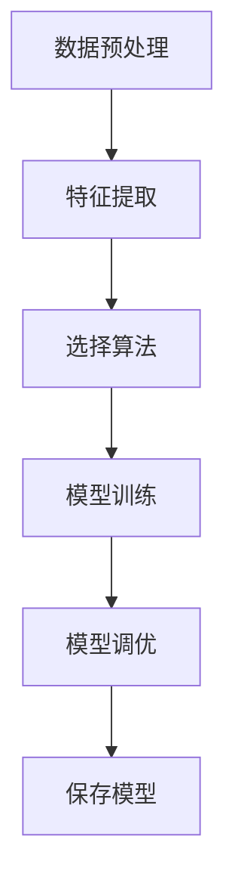
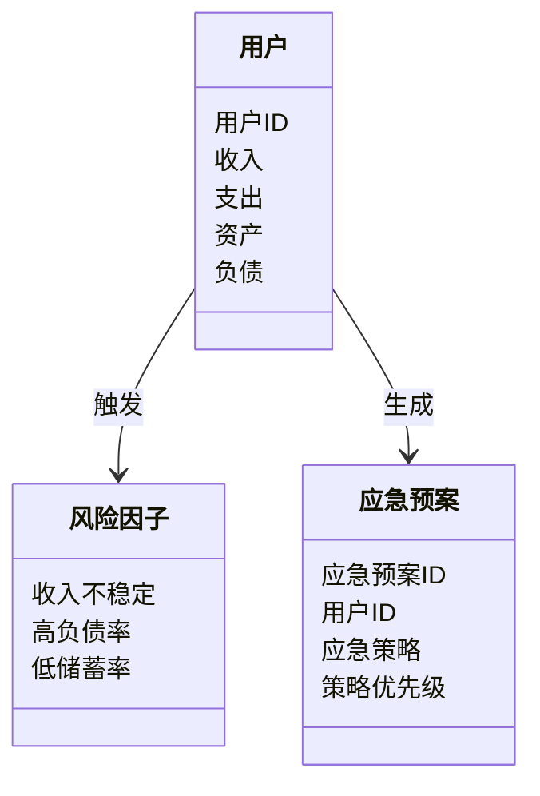

                 


# 智能个人财务应急预案生成器

> 关键词：智能财务、应急预案生成器、人工智能、风险管理、数据驱动

> 摘要：本文介绍了一种基于人工智能的智能个人财务应急预案生成器，旨在通过数据分析和智能算法优化个人财务风险管理。文章从背景介绍、核心概念、算法原理、系统架构、项目实战到最佳实践，详细阐述了智能财务应急预案生成器的设计与实现过程。

---

## 第1章：背景介绍

### 1.1 问题背景

在当今社会，个人财务管理变得越来越复杂。经济波动、收入变化和意外支出都可能导致财务状况恶化，甚至引发危机。传统的财务应急预案往往依赖于个人的经验或简单的模板，难以应对复杂多变的财务风险。

智能技术的发展为财务风险管理提供了新的可能性。通过人工智能，我们可以实时分析财务数据，预测潜在风险，并自动生成应对方案。这不仅提高了效率，还显著提升了预案的科学性和准确性。

### 1.2 问题描述

传统的财务应急预案存在以下问题：
1. **缺乏个性化**：统一的模板难以适应不同人的财务状况。
2. **信息更新慢**：难以实时跟踪收入和支出变化。
3. **风险预测不足**：无法有效预测突发事件对财务的影响。
4. **执行难度大**：复杂的预案难以有效执行。

智能财务应急预案生成器的目标是通过AI技术，实时分析个人财务数据，自动生成个性化且动态调整的应急预案。

### 1.3 解决策方案

智能财务应急预案生成器通过以下方式优化财务风险管理：
1. **数据驱动**：利用机器学习算法分析历史和实时数据。
2. **智能预测**：预测潜在风险并提供应对策略。
3. **动态调整**：根据实际情况自动优化预案。

### 1.4 边界与外延

- **适用范围**：适用于个人用户，帮助管理日常财务风险。
- **限制条件**：不适用于企业财务或涉及法律合规的复杂情况。
- **扩展可能性**：未来可扩展至家庭或小型企业的财务风险管理。

---

## 第2章：核心概念与联系

### 2.1 智能生成器的原理概述

智能财务应急预案生成器通过以下步骤工作：
1. **数据采集**：收集用户的收入、支出、资产和负债等数据。
2. **数据分析**：利用机器学习模型识别财务风险。
3. **预案生成**：根据分析结果，生成个性化应急预案。

### 2.2 核心概念对比分析

表2-1：传统与智能财务应急预案的对比

| 特性                | 传统方法                     | 智能生成器                  |
|---------------------|------------------------------|-----------------------------|
| 数据来源            | 静态数据，定期更新           | 实时数据，动态更新          |
| 风险预测能力        | 低，依赖人工经验             | 高，基于机器学习模型        |
| 应急方案生成        | 固定模板，缺乏个性化         | 动态生成，高度个性化         |
| 调整能力            | 低，手动调整                 | 高，自动优化                |

### 2.3 数据模型与关系图

图2-1：数据模型的ER图

```mermaid
erDiagram
    user{
        <name>
        <income>
        <expenses>
        <assets>
        <liabilities>
    }
    risk_factors {
        <income_unstable>
        <high_debt>
        <low_savings>
    }
   应急预案表 {
        <预案ID>
        <用户ID>
        <策略>
        <优先级>
    }
    user --> risk_factors : "触发风险"
    user --> 应急预案表 : "生成预案"
```

---

## 第3章：算法原理

### 3.1 数据预处理

#### 3.1.1 数据清洗与标准化

数据清洗步骤：
1. **去除重复数据**：确保每条数据唯一。
2. **处理缺失值**：使用均值或中位数填充。
3. **去除异常值**：识别并剔除明显错误的数据。

标准化方法：
使用标准差标准化，公式为：
$$ z = \frac{x - \mu}{\sigma} $$
其中，$$\mu$$ 是均值，$$\sigma$$ 是标准差。

### 3.2 模型训练流程

图3-1：模型训练流程



#### 3.2.1 算法选择与训练策略

使用随机森林进行分类任务，模型训练代码示例：

```python
from sklearn.ensemble import RandomForestClassifier
from sklearn.model_selection import train_test_split
import pandas as pd

# 加载数据
data = pd.read_csv('financial_data.csv')
X = data.drop('risk_level', axis=1)
y = data['risk_level']

# 划分训练集和测试集
X_train, X_test, y_train, y_test = train_test_split(X, y, test_size=0.2)

# 初始化模型
model = RandomForestClassifier(n_estimators=100, max_depth=5, random_state=42)

# 训练模型
model.fit(X_train, y_train)

# 预测与评估
score = model.score(X_test, y_test)
print(f'模型准确率：{score}')
```

### 3.3 模型调优

使用网格搜索优化参数：

```python
from sklearn.model_selection import GridSearchCV

# 定义参数网格
param_grid = {
    'n_estimators': [50, 100, 150],
    'max_depth': [5, 10, 15],
    'min_samples_split': [2, 5, 8]
}

# 网格搜索优化
grid_search = GridSearchCV(model, param_grid, cv=5)
grid_search.fit(X_train, y_train)

# 输出最佳参数
print(grid_search.best_params_)
```

---

## 第4章：系统分析与架构设计

### 4.1 系统功能设计

图4-1：领域模型类图



### 4.2 系统架构设计

图4-2：系统架构图

```mermaid
archiecture
    客户端 --> API网关 : 请求
    API网关 --> 数据库 : 查询
    数据库 --> 分析引擎 : 分析
    分析引擎 --> AI模型 : 预测
    AI模型 --> 数据库 : 存储结果
    数据库 --> API网关 : 返回结果
    API网关 --> 客户端 : 响应
```

### 4.3 系统接口设计

表4-1：系统接口设计

| 接口名称 | 输入参数 | 输出参数 | 描述                  |
|---------|----------|----------|-----------------------|
| 生成预案 | 用户ID   | 应急预案ID | 返回生成的预案         |
| 查询风险 | 用户ID   | 风险等级 | 返回用户风险等级       |
| 更新数据 | 用户ID   | 状态     | 更新用户财务数据       |

---

## 第5章：项目实战

### 5.1 环境配置

安装所需库：

```bash
pip install pandas scikit-learn matplotlib
```

### 5.2 核心代码实现

```python
import pandas as pd
from sklearn.ensemble import RandomForestClassifier
from sklearn.model_selection import train_test_split
from sklearn.metrics import accuracy_score

# 加载数据
data = pd.read_csv('financial_data.csv')

# 特征工程
X = data.drop('risk_level', axis=1)
y = data['risk_level']

# 划分数据集
X_train, X_test, y_train, y_test = train_test_split(X, y, test_size=0.2)

# 初始化模型
model = RandomForestClassifier()

# 训练模型
model.fit(X_train, y_train)

# 预测
y_pred = model.predict(X_test)

# 评估
print(f'准确率：{accuracy_score(y_test, y_pred)}')
```

### 5.3 功能实现与分析

1. **数据预处理模块**：清洗和标准化数据，确保模型输入质量。
2. **模型训练模块**：训练随机森林模型，优化参数。
3. **应急预案生成模块**：根据模型预测结果，生成个性化预案。

### 5.4 实际案例分析

以用户A为例，分析其财务数据，生成应急方案：

1. **数据输入**：收入3000元/月，支出2000元/月，资产10万元，负债5万元。
2. **模型分析**：预测用户存在较高风险。
3. **生成预案**：建议减少非必要开支，增加紧急储备金。

---

## 第6章：最佳实践

### 6.1 经验总结

1. **数据质量**：确保数据准确性和完整性。
2. **模型调优**：通过网格搜索优化模型性能。
3. **用户反馈**：及时收集用户反馈，不断优化系统。

### 6.2 小结

智能个人财务应急预案生成器通过AI技术，显著提升了财务风险管理的效率和效果。通过数据驱动和智能算法，用户可以轻松制定个性化且动态调整的应急预案，有效应对财务风险。

### 6.3 注意事项

1. **数据隐私**：确保用户数据安全。
2. **模型局限性**：AI模型可能存在预测偏差。
3. **用户教育**：提高用户对财务风险管理的认识。

### 6.4 拓展阅读

建议阅读《机器学习实战》和《风险管理与金融模型》以深入理解相关内容。

---

通过以上章节的详细阐述，我们全面介绍了智能个人财务应急预案生成器的设计与实现过程，希望为读者提供有价值的参考和启发。

