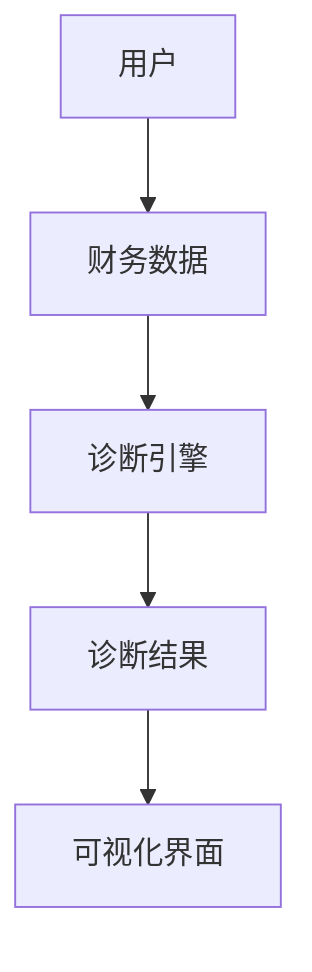
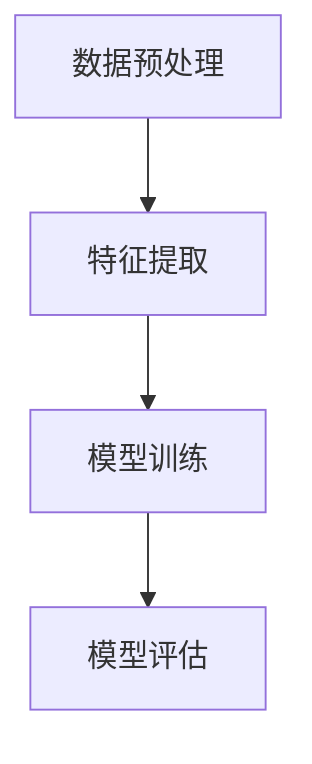
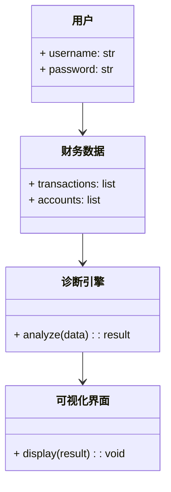
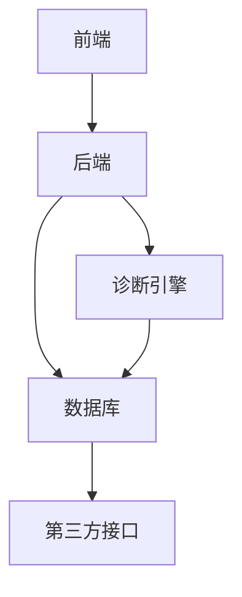
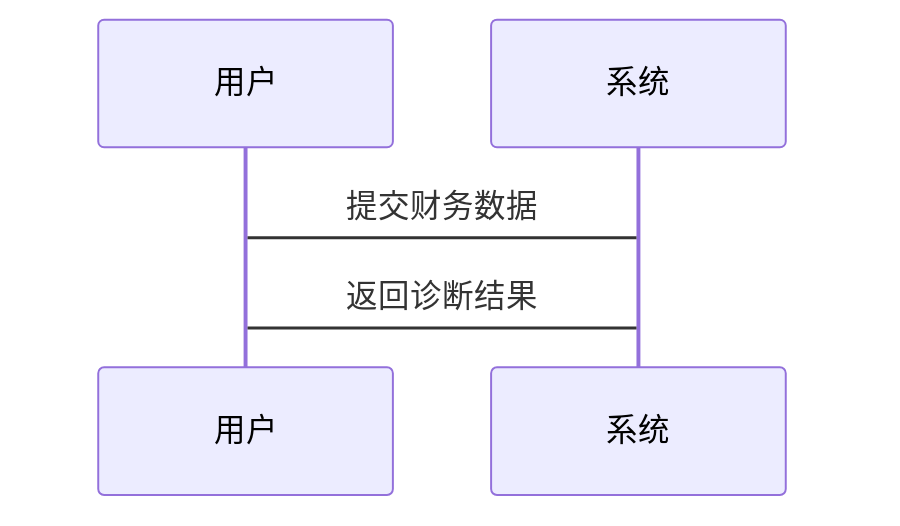

                 


# 智能个人财务状况诊断系统

## 关键词：
智能诊断、个人财务、机器学习、数据可视化、财务健康评估、AI财务顾问

## 摘要：
《智能个人财务状况诊断系统》通过结合机器学习和数据分析技术，构建一个智能化的个人财务管理工具。本文从问题背景、系统架构、算法原理到实际应用，全面解析该系统的实现过程，帮助读者理解如何利用AI技术优化个人财务管理。

---

## 第一章：背景与概述

### 1.1 问题背景
随着经济的发展和个人可支配收入的增加，个人财务管理变得日益复杂。传统的财务管理方式依赖于手动记录和简单的统计分析，难以应对现代人多样化的财务需求。此外，金融市场波动、消费习惯变化等因素进一步增加了财务管理的难度。

### 1.2 问题描述
个人财务状况诊断的核心问题在于如何高效、准确地分析财务数据，并提供可行的建议。具体问题包括：
- **数据多样性**：涉及收入、支出、资产、负债等多类数据。
- **数据复杂性**：数据来源多样，格式不统一，且需要实时更新。
- **决策需求**：用户需要基于财务数据做出优化决策，如投资、消费规划等。

### 1.3 问题解决
智能个人财务状况诊断系统通过引入机器学习和大数据分析技术，实现了对财务数据的自动化采集、分析和诊断。系统能够实时更新数据，提供个性化的财务健康评估和优化建议。

### 1.4 系统的边界与外延
智能个人财务状况诊断系统专注于财务数据的分析与诊断，其边界主要集中在数据采集、分析和建议生成环节。系统的外延包括与银行、证券等金融服务的接口，以及与个人财务管理软件的集成。

---

## 第二章：核心概念与原理

### 2.1 智能诊断系统的原理
智能诊断系统的核心原理在于通过机器学习算法对财务数据进行建模和分析，生成诊断结果。具体步骤包括：
1. **数据采集**：从多种来源（如银行账户、信用卡交易等）获取财务数据。
2. **数据预处理**：清洗数据，处理缺失值和异常值。
3. **特征提取**：提取关键特征，如收入稳定性、支出结构等。
4. **模型训练**：使用机器学习算法（如随机森林、支持向量机）进行分类或回归分析。
5. **诊断结果**：生成诊断报告，并提供优化建议。

### 2.2 核心概念对比分析
以下是核心概念的对比分析表：

| 概念 | 特征 |
|------|------|
| 数据源 | 多样性、实时性、完整性 |
| 诊断算法 | 准确性、计算效率、可解释性 |
| 用户界面 | 易用性、交互性、可视化程度 |

### 2.3 实体关系图
以下是系统的实体关系图：



---

## 第三章：算法原理与实现

### 3.1 数据预处理
数据预处理是机器学习算法的基础，主要包括：
- **数据清洗**：处理缺失值、重复值和异常值。
- **数据转换**：将数据转换为模型可接受的格式（如标准化、归一化）。

### 3.2 特征提取
特征提取是提高模型性能的关键步骤，常用的特征包括：
- **收入特征**：如月均收入、收入波动率。
- **支出特征**：如月均支出、支出类别分布。
- **资产特征**：如总资产、资产流动性。

### 3.3 模型训练
以下是模型训练的流程图：



### 3.4 代码实现
以下是模型训练的Python代码示例：

```python
import pandas as pd
from sklearn.ensemble import RandomForestClassifier
from sklearn.metrics import accuracy_score

# 数据加载
data = pd.read_csv('financial_data.csv')

# 特征提取
features = ['income', 'expenses', 'assets', 'debts']
target = 'financial_health'

X = data[features]
y = data[target]

# 模型训练
model = RandomForestClassifier()
model.fit(X, y)

# 模型评估
y_pred = model.predict(X)
print(f'Accuracy: {accuracy_score(y, y_pred)}')
```

---

## 第四章：系统架构设计

### 4.1 系统功能设计
以下是系统的功能模块图：



### 4.2 系统架构设计
以下是系统的架构图：



### 4.3 接口设计
以下是系统的接口设计：



---

## 第五章：项目实战

### 5.1 环境搭建
需要安装以下工具和库：
- Python 3.8+
- Jupyter Notebook
- pandas、numpy、scikit-learn

### 5.2 核心代码实现
以下是核心代码示例：

```python
import pandas as pd
from sklearn.ensemble import RandomForestClassifier
from sklearn.metrics import accuracy_score

# 数据加载
data = pd.read_csv('financial_data.csv')

# 特征提取
features = ['income', 'expenses', 'assets', 'debts']
target = 'financial_health'

X = data[features]
y = data[target]

# 模型训练
model = RandomForestClassifier()
model.fit(X, y)

# 模型评估
y_pred = model.predict(X)
print(f'Accuracy: {accuracy_score(y, y_pred)}')

# 诊断结果可视化
importances = model.feature_importances_
indices = sorted(range(len(importances)), key=lambda x: importances[x], reverse=True)

for i in indices:
    print(f'Feature: {features[i]}, Importance: {importances[i]}')
```

### 5.3 实际案例分析
以下是实际案例分析：

```python
# 数据加载
data = pd.read_csv('financial_data.csv')

# 数据分析
data.describe()

# 可视化
import matplotlib.pyplot as plt

plt.bar(data['expenses'].value_counts().index, data['expenses'].value_counts().values)
plt.title('支出分布')
plt.show()
```

---

## 第六章：总结与展望

### 6.1 总结
智能个人财务状况诊断系统通过结合机器学习和大数据分析技术，为个人财务管理提供了高效、智能的解决方案。系统能够实时更新数据，提供个性化的诊断结果和优化建议。

### 6.2 展望
未来，智能个人财务状况诊断系统可以通过引入时间序列分析、强化学习等技术，进一步提升诊断的准确性和实时性。同时，系统的可视化界面可以更加用户友好，提供更加丰富的交互方式。

---

## 第七章：小结与注意事项

### 7.1 小结
本文详细介绍了智能个人财务状况诊断系统的实现过程，包括背景、核心概念、算法原理、系统架构、项目实战等方面的内容。

### 7.2 注意事项
- 数据隐私保护是系统设计的重要部分。
- 系统的实时性需要进一步优化。
- 模型的可解释性需要进一步提升。

### 7.3 拓展阅读
- 《机器学习实战》
- 《Python数据分析 cookbook》
- 《数据可视化指南》

