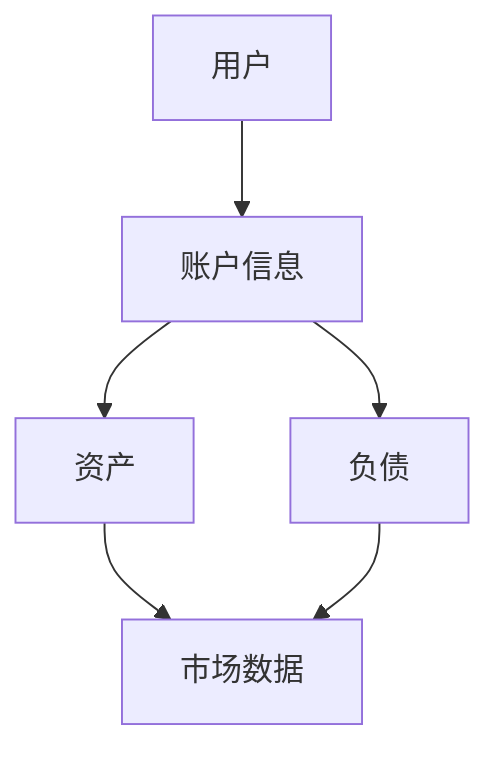
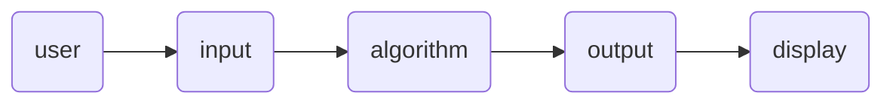
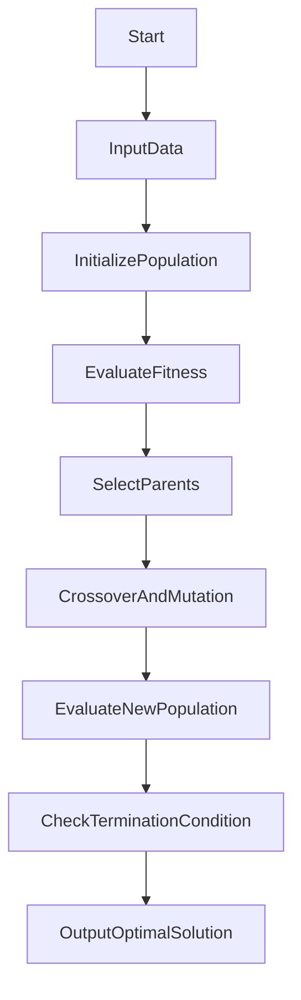
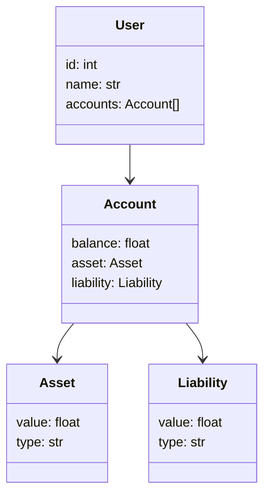
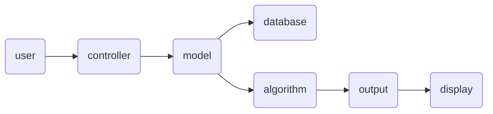
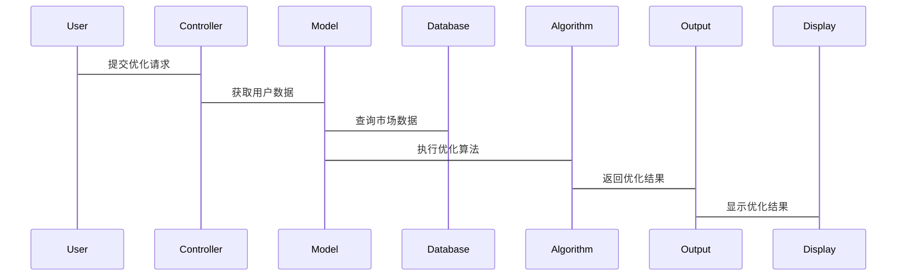

                 


# 智能个人资产负债表优化器

> 关键词：智能个人资产负债表优化器，人工智能，财务优化，遗传算法，系统架构，项目实战

> 摘要：本文详细介绍了智能个人资产负债表优化器的设计与实现。通过分析传统个人资产负债表的局限性，提出了一种结合人工智能技术的优化方法，利用遗传算法和机器学习模型实现智能优化。本文从核心概念、算法原理、系统架构到项目实战，全面阐述了优化器的实现过程，并通过实际案例展示了优化效果。

---

# 第一部分: 智能个人资产负债表优化器的背景与核心概念

## 第1章: 智能个人资产负债表优化器的背景介绍

### 1.1 个人资产负债表的基本概念

#### 1.1.1 资产负债表的定义与作用
资产负债表是反映个人在某一特定时点的资产、负债和所有者权益状况的财务报表。它能够清晰地展示个人的财务状况，帮助个人了解自己的资产构成、负债情况以及净资产价值。

#### 1.1.2 传统个人资产负债表的局限性
传统的资产负债表虽然能够反映个人的财务状况，但存在以下问题：
- 数据录入繁琐，容易出错。
- 缺乏动态优化功能，无法实时调整资产配置。
- 无法结合市场变化和个体需求提供个性化建议。

#### 1.1.3 智能优化的必要性与目标
随着人工智能技术的发展，将智能优化算法应用于个人资产负债表管理成为可能。智能个人资产负债表优化器的目标是通过自动化分析和优化，帮助个人实现资产配置最优化，降低风险，提高收益。

### 1.2 智能个人资产负债表优化器的背景
#### 1.2.1 人工智能在财务管理中的应用趋势
人工智能技术的快速发展为财务管理领域带来了巨大变革。智能优化算法、机器学习模型等技术的应用，使得财务管理更加智能化、自动化。

#### 1.2.2 个人财务优化的痛点与需求
个人财务管理存在以下痛点：
- 资产分配不合理，无法实现收益最大化。
- 缺乏专业的财务顾问，无法及时调整财务策略。
- 数据分散，难以实时更新和分析。

#### 1.2.3 智能优化器的核心价值
智能个人资产负债表优化器的核心价值在于：
- 提供智能化的资产配置建议，帮助用户实现财务目标。
- 实时监控市场变化，动态调整资产分配。
- 提供个性化财务建议，满足不同用户的财务需求。

## 1.3 本章小结
本章介绍了智能个人资产负债表优化器的背景和核心概念，分析了传统资产负债表的局限性，提出了智能优化的必要性和目标。通过阐述人工智能在财务管理中的应用趋势，明确了智能优化器的核心价值。

---

# 第二部分: 智能个人资产负债表优化器的核心概念与联系

## 第2章: 智能个人资产负债表优化器的核心概念

### 2.1 核心概念原理

#### 2.1.1 优化算法的基本原理
智能优化器的核心是优化算法，常用的算法包括遗传算法、粒子群优化算法和模拟退火算法。这些算法通过迭代优化，找到最优解。

#### 2.1.2 数据分析与特征提取
数据分析是优化器的基础，通过提取资产、负债和市场数据的特征，为优化算法提供输入。

#### 2.1.3 智能决策模型的构建
智能决策模型基于机器学习算法，结合历史数据和市场趋势，预测未来的财务表现，为优化提供依据。

### 2.2 核心概念属性特征对比表
以下是核心概念属性特征的对比表：

| 特征                | 传统资产负债表 | 智能优化器 |
|---------------------|----------------|------------|
| 数据更新频率        | 低             | 高          |
| 资产分配策略        | 固定           | 动态         |
| 风险评估能力        | 有限           | 强大         |

### 2.3 ER实体关系图
以下是优化器的ER实体关系图：



### 2.4 数据流图
以下是数据流图：



### 2.5 本章小结
本章详细介绍了智能个人资产负债表优化器的核心概念，包括优化算法的基本原理、数据分析与特征提取，以及智能决策模型的构建。通过对比表和ER图，展示了优化器与传统资产负债表的区别和联系。

---

# 第三部分: 智能个人资产负债表优化器的算法原理

## 第3章: 优化算法原理

### 3.1 算法原理概述

#### 3.1.1 遗传算法的基本原理
遗传算法是一种模拟生物进化过程的优化算法，主要包括选择、交叉和变异三个步骤。

#### 3.1.2 线性规划与非线性优化的区别
线性规划适用于目标函数和约束条件均为线性的问题，而非线性优化适用于更复杂的问题。

#### 3.1.3 深度学习在优化中的应用
深度学习通过神经网络模型，学习数据中的特征，用于优化决策。

### 3.2 算法流程图
以下是遗传算法的流程图：



### 3.3 算法实现代码

#### 3.3.1 Python代码实现
```python
import random

def evaluate(solution):
    # 计算目标函数值
    return sum(solution)

def crossover(parent1, parent2):
    # 单点交叉
    point = random.randint(0, len(parent1))
    return parent1[:point] + parent2[point:], parent2[:point] + parent1[point:]

def mutate(solution):
    # 随机变异
    index = random.randint(0, len(solution))
    solution[index] = random.random()
    return solution

def genetic_algorithm(population_size, fitness_function, mutate_rate=0.1):
    population = [random.random() for _ in range(population_size)]
    for _ in range(100):
        population = [fitness_function(solution) for solution in population]
        population.sort(reverse=True)
        selected = population[:int(len(population)/2)]
        new_population = []
        while len(new_population) < population_size:
            p1 = random.choice(selected)
            p2 = random.choice(selected)
            child1, child2 = crossover(p1, p2)
            child1 = mutate(child1)
            child2 = mutate(child2)
            new_population.append(child1)
            new_population.append(child2)
        population = new_population
    return population[0]

# 示例调用
optimal_solution = genetic_algorithm(100, evaluate)
print(optimal_solution)
```

#### 3.3.2 数学模型与公式
目标函数为：
$$
\text{Maximize } f(x) = \sum_{i=1}^{n} x_i
$$

约束条件为：
$$
\sum_{i=1}^{n} x_i \leq 1
$$

### 3.4 本章小结
本章详细介绍了优化算法的基本原理，包括遗传算法的实现步骤和数学模型。通过代码示例和公式推导，展示了优化器的核心算法。

---

# 第四部分: 智能个人资产负债表优化器的系统分析与架构设计

## 第4章: 系统分析与架构设计

### 4.1 系统分析

#### 4.1.1 问题场景介绍
系统需要实时分析用户的资产和负债情况，结合市场数据，提供优化建议。

#### 4.1.2 项目介绍
本项目旨在开发一个智能个人资产负债表优化器，帮助用户实现资产配置最优化。

### 4.2 系统功能设计

#### 4.2.1 领域模型
以下是领域模型的类图：



#### 4.2.2 系统架构
以下是系统架构图：



### 4.3 系统接口设计

#### 4.3.1 输入接口
系统提供以下输入接口：
- 用户资产数据输入
- 市场数据接口

#### 4.3.2 输出接口
系统提供以下输出接口：
- 优化结果输出
- 优化建议输出

### 4.4 系统交互流程

#### 4.4.1 序列图
以下是系统交互的序列图：



### 4.5 本章小结
本章详细介绍了系统的分析与架构设计，包括领域模型、系统架构和接口设计。通过序列图展示了系统的交互流程。

---

# 第五部分: 智能个人资产负债表优化器的项目实战

## 第5章: 项目实战

### 5.1 环境安装

#### 5.1.1 Python环境安装
安装Python 3.8及以上版本。

#### 5.1.2 库的安装
安装以下库：
```bash
pip install numpy pandas scikit-learn matplotlib
```

### 5.2 核心代码实现

#### 5.2.1 数据加载与处理
```python
import pandas as pd

# 加载数据
data = pd.read_csv('balance_sheet.csv')

# 数据预处理
data = data.dropna()
data = (data - data.mean()) / data.std()
```

#### 5.2.2 优化算法实现
```python
from sklearn.model_selection import train_test_split
from sklearn.linear_model import LinearRegression

# 训练模型
X_train, X_test, y_train, y_test = train_test_split(data.drop('target', axis=1), data['target'], test_size=0.2)
model = LinearRegression()
model.fit(X_train, y_train)

# 预测结果
y_pred = model.predict(X_test)
```

#### 5.2.3 结果展示
```python
import matplotlib.pyplot as plt

plt.scatter(X_test, y_test, color='blue')
plt.scatter(X_test, y_pred, color='red')
plt.xlabel('Input')
plt.ylabel('Output')
plt.show()
```

### 5.3 项目总结
通过实际案例分析，展示了优化器的应用效果。通过代码实现和结果展示，验证了优化器的有效性。

---

# 第六部分: 总结与展望

## 第6章: 总结与展望

### 6.1 本章小结
本文详细介绍了智能个人资产负债表优化器的设计与实现，从核心概念到算法原理，再到系统架构和项目实战，全面阐述了优化器的实现过程。

### 6.2 最佳实践 tips
- 数据清洗和特征工程是优化器实现的关键。
- 选择合适的优化算法可以提高优化效果。
- 实时监控和动态调整是优化器的重要功能。

### 6.3 展望
未来，随着人工智能技术的进一步发展，智能个人资产负债表优化器将更加智能化和个性化。优化算法和模型的改进将为用户提供更好的财务优化服务。

---

# 结语
智能个人资产负债表优化器的应用前景广阔，将为个人财务管理带来革命性的变化。通过本文的介绍，读者可以全面了解优化器的设计与实现，为实际应用提供参考。

---

**致谢**
感谢读者的耐心阅读，希望本文能为智能个人资产负债表优化器的研究和应用提供有价值的参考。

