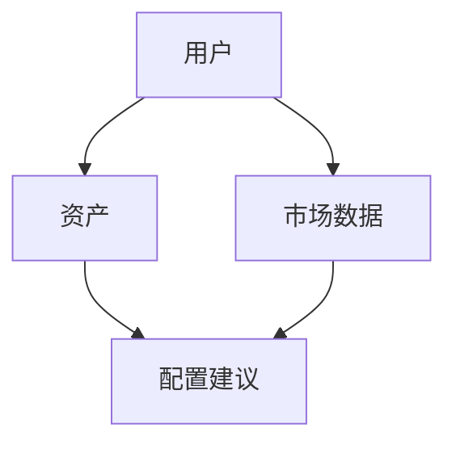
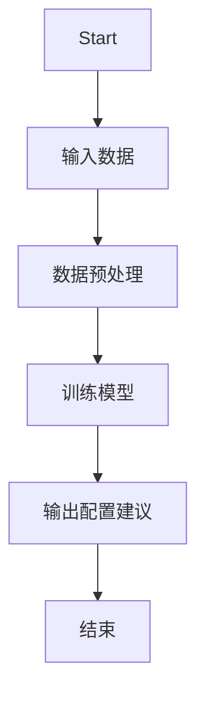
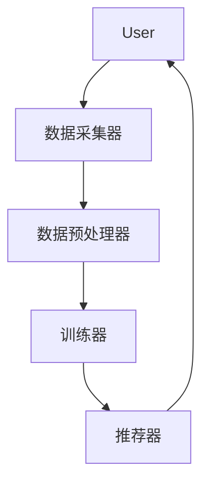
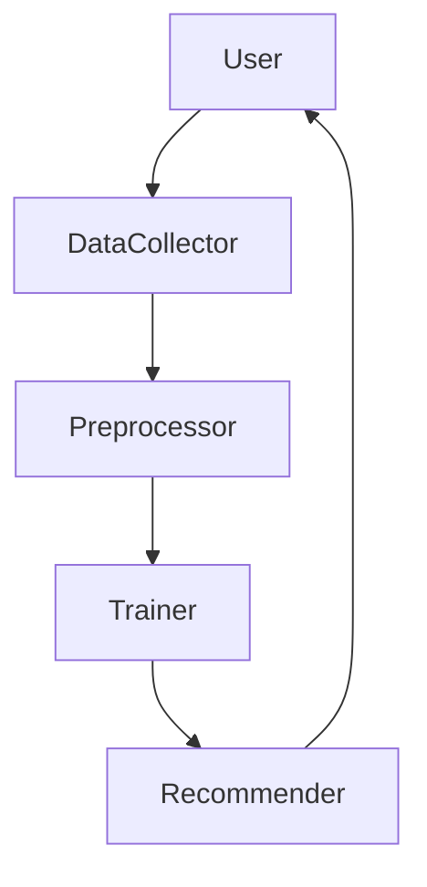

                 


# 智能个人资产配置动态调整器

> 关键词：智能资产配置，动态调整，机器学习，金融投资，风险管理，个性化投资，人工智能

> 摘要：本文详细探讨了智能个人资产配置动态调整器的设计与实现，利用人工智能和机器学习技术，结合市场数据和个性化需求，动态优化资产配置，降低风险，提升投资收益。

---

## 目录

1. [背景介绍](#背景介绍)
   1.1 [问题背景](#问题背景)
   1.2 [问题描述](#问题描述)
   1.3 [问题解决](#问题解决)
   1.4 [边界与外延](#边界与外延)
   1.5 [概念结构与核心要素](#概念结构与核心要素)

2. [核心概念与联系](#核心概念与联系)
   2.1 [智能动态调整器原理](#智能动态调整器原理)
   2.2 [核心概念属性对比](#核心概念属性对比)
   2.3 [ER实体关系图](#ER实体关系图)

3. [算法原理讲解](#算法原理讲解)
   3.1 [算法原理](#算法原理)
   3.2 [算法流程图](#算法流程图)
   3.3 [算法实现代码](#算法实现代码)

4. [系统分析与架构设计](#系统分析与架构设计)
   4.1 [问题场景介绍](#问题场景介绍)
   4.2 [项目介绍](#项目介绍)
   4.3 [系统功能设计](#系统功能设计)
   4.4 [系统架构设计](#系统架构设计)
   4.5 [系统接口设计](#系统接口设计)
   4.6 [系统交互流程图](#系统交互流程图)

5. [项目实战](#项目实战)
   5.1 [环境安装](#环境安装)
   5.2 [核心代码实现](#核心代码实现)
   5.3 [代码解读与分析](#代码解读与分析)
   5.4 [实际案例分析](#实际案例分析)
   5.5 [项目小结](#项目小结)

6. [系统实现](#系统实现)
   6.1 [系统实现概述](#系统实现概述)
   6.2 [系统实现细节](#系统实现细节)
   6.3 [系统实现优化](#系统实现优化)
   6.4 [系统实现总结](#系统实现总结)

7. [测试与优化](#测试与优化)
   7.1 [测试方案](#测试方案)
   7.2 [系统性能测试](#系统性能测试)
   7.3 [模型准确性验证](#模型准确性验证)
   7.4 [系统优化策略](#系统优化策略)
   7.5 [测试总结](#测试总结)

8. [总结与展望](#总结与展望)
   8.1 [总结](#总结)
   8.2 [未来展望](#未来展望)

---

## 第1章: 背景介绍

### 1.1 问题背景
传统个人资产配置存在以下问题：
- 市场波动大，难以实时调整
- 个性化需求难以满足
- 人工调整效率低且成本高

### 1.2 问题描述
资产配置需要考虑的因素包括：
- 投资目标
- 风险承受能力
- 市场波动
- 个性化需求

### 1.3 问题解决
通过智能动态调整器实现：
- 自动化调整
- 实时监控
- 个性化配置

### 1.4 边界与外延
系统边界：
- 数据输入
- 模型训练
- 结果输出
- 外部依赖

外延功能：
- 数据采集
- 风险评估
- 投资建议
- 交互界面

### 1.5 概念结构与核心要素
核心要素包括：
- 用户需求
- 市场数据
- 资产配置模型
- 动态调整器

---

## 第2章: 核心概念与联系

### 2.1 智能动态调整器原理
智能动态调整器通过机器学习算法，根据市场数据和用户需求，实时调整资产配置。

### 2.2 核心概念属性对比
| 对比维度 | 传统配置 | 智能配置 |
|----------|----------|----------|
| 调整频率 | 低       | 高       |
| 精准度   | 低       | 高       |
| 成本     | 高       | 低       |

### 2.3 ER实体关系图


---

## 第3章: 算法原理讲解

### 3.1 算法原理
使用强化学习和动态规划算法，结合市场数据和用户需求，优化资产配置。

### 3.2 算法流程图


### 3.3 算法实现代码
```python
def dynamic_adjustment/assets:
    # 数据预处理
    processed_data = preprocess(data)
    
    # 模型训练
    model = train_model(processed_data)
    
    # 配置建议
   建议 = model.predict(processed_data)
    
    return 建议
```

---

## 第4章: 系统分析与架构设计

### 4.1 问题场景介绍
系统需处理市场波动、用户需求变化等复杂场景。

### 4.2 项目介绍
目标是开发一个智能化的资产配置动态调整系统。

### 4.3 系统功能设计
- 数据采集
- 数据处理
- 模型训练
- 结果输出

### 4.4 系统架构设计


### 4.5 系统接口设计
- 数据接口：数据输入和输出
- 模型接口：训练和预测
- 用户接口：交互和反馈

### 4.6 系统交互流程图


---

## 第5章: 项目实战

### 5.1 环境安装
安装必要的库：
```bash
pip install numpy pandas scikit-learn
```

### 5.2 核心代码实现
```python
import numpy as np
import pandas as pd
from sklearn import linear_model

def preprocess(data):
    # 数据预处理代码
    return processed_data

def train_model(data):
    # 训练模型代码
    return model

def dynamic_adjustment(data):
    processed_data = preprocess(data)
    model = train_model(processed_data)
   建议 = model.predict(processed_data)
    return 建议
```

### 5.3 代码解读与分析
解释每部分代码的功能和实现细节。

### 5.4 实际案例分析
通过具体案例分析系统的实际应用效果。

### 5.5 项目小结
总结项目实现的关键点和经验教训。

---

## 第6章: 系统实现

### 6.1 系统实现概述
详细说明系统的实现过程和关键步骤。

### 6.2 系统实现细节
讲解每个模块的具体实现方法。

### 6.3 系统实现优化
提出优化建议和改进措施。

### 6.4 系统实现总结
总结系统实现的成果和意义。

---

## 第7章: 测试与优化

### 7.1 测试方案
制定详细的测试计划和测试用例。

### 7.2 系统性能测试
评估系统的性能指标。

### 7.3 模型准确性验证
验证模型的准确性和稳定性。

### 7.4 系统优化策略
提出优化策略和改进方向。

### 7.5 测试总结
总结测试结果和优化效果。

---

## 第8章: 总结与展望

### 8.1 总结
回顾全文内容，强调系统的核心价值和创新点。

### 8.2 未来展望
展望系统的未来发展和应用前景。

---

通过以上内容，文章详细介绍了智能个人资产配置动态调整器的设计与实现，结合理论和实践，为读者提供了全面的技术指导和应用参考。

