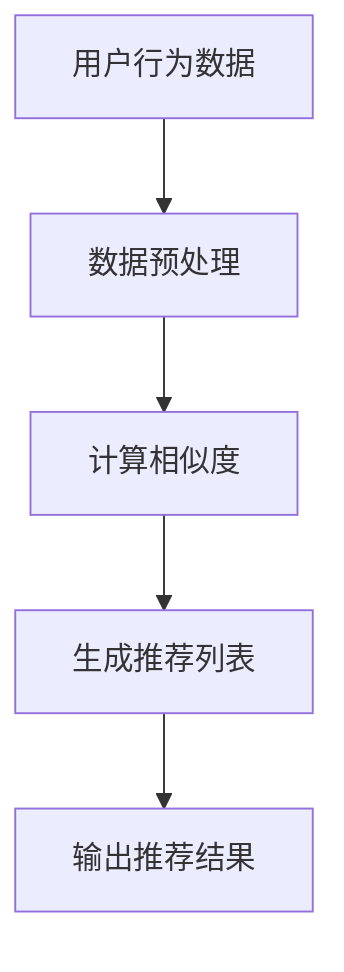
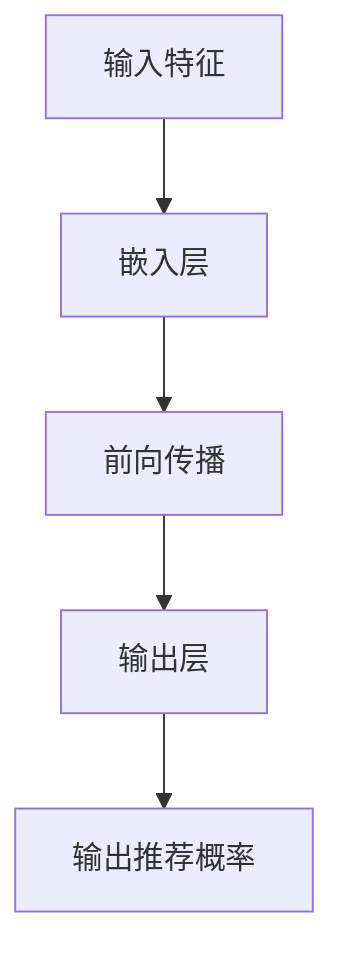
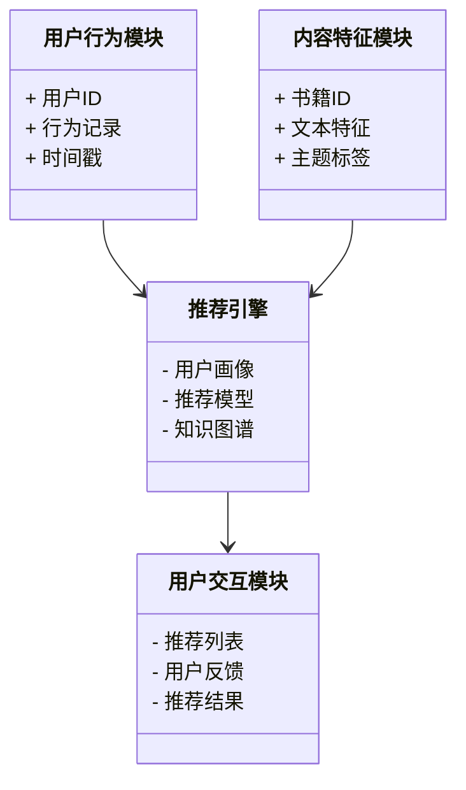

                 


# 智能书架：AI Agent的个性化阅读推荐系统

> 关键词：智能书架, AI Agent, 个性化阅读推荐, 深度学习, 推荐系统, 用户行为分析

> 摘要：本文详细探讨了AI Agent在个性化阅读推荐系统中的应用，从背景介绍、核心算法、系统架构到项目实战，全面解析智能书架的技术实现与优化方法。

---

## 第1章: 智能书架的概念与背景

### 1.1 个性化阅读推荐的背景与问题
个性化阅读推荐是通过AI技术帮助用户发现符合其兴趣的书籍或内容。传统推荐系统面临数据稀疏性、冷启动问题和实时性不足等挑战。智能书架通过AI Agent实现更精准的推荐。

#### 1.1.1 阅读推荐的背景与意义
- 阅读推荐帮助用户在海量书籍中快速找到感兴趣的内容。
- 个性化推荐能提升用户体验，增加阅读的深度和广度。

#### 1.1.2 个性化推荐的核心问题
- 如何有效表示用户的兴趣？
- 如何处理数据稀疏性和实时性问题？

#### 1.1.3 当前推荐系统的挑战与不足
- 数据稀疏性导致推荐结果不够准确。
- 冷启动问题影响新用户的推荐效果。
- 实时性不足限制了推荐的响应速度。

### 1.2 AI Agent的基本概念与技术基础
AI Agent是一种能够感知环境、执行任务的智能体。在推荐系统中，AI Agent通过分析用户行为和内容特征，提供个性化的推荐服务。

#### 1.2.1 AI Agent的定义与特点
- AI Agent具备感知和决策能力。
- 能够与用户交互，实时调整推荐策略。

#### 1.2.2 AI Agent在推荐系统中的应用
- 用户行为分析：通过自然语言处理和机器学习模型分析用户偏好。
- 内容推荐：基于知识图谱和深度学习模型生成推荐结果。

#### 1.2.3 智能书架的定义与目标
智能书架是一个基于AI Agent的个性化阅读推荐系统，目标是为用户提供精准、实时的推荐服务。

---

## 第2章: AI Agent的核心技术与原理

### 2.1 AI Agent的基本原理
AI Agent通过感知环境、分析数据、做出决策并执行推荐任务。

#### 2.1.1 AI Agent的感知与决策机制
- 感知环境：通过API或日志获取用户行为数据。
- 分析数据：利用机器学习模型处理数据。
- 决策推荐：基于分析结果生成推荐列表。

#### 2.1.2 基于知识图谱的推理能力
- 知识图谱构建：建立书籍、作者、主题的关系图谱。
- 推理能力：通过图谱推理推荐候选书籍。

#### 2.1.3 自然语言处理在AI Agent中的应用
- 文本分析：提取书籍内容的关键特征。
- 用户意图识别：理解用户的搜索或浏览意图。

### 2.2 个性化推荐的核心算法
个性化推荐算法分为协同过滤、内容推荐和深度学习模型三类。

#### 2.2.1 基于协同过滤的推荐算法
协同过滤基于用户行为数据，通过相似性计算推荐结果。

##### 1. 基于用户的协同过滤
- 计算用户之间的相似度。
- 推荐相似用户的高评分书籍。

##### 2. 基于物品的协同过滤
- 计算书籍之间的相似度。
- 推荐用户已评分的相似书籍。

##### 3. 混合推荐模型
- 结合用户和物品的特征，构建混合推荐模型。

#### 2.2.2 基于内容的推荐算法
内容推荐基于书籍内容特征，生成个性化推荐。

##### 1. 文本特征提取
- 使用TF-IDF或Word2Vec提取书籍文本特征。

##### 2. 基于内容的推荐
- 计算用户偏好与书籍内容的相似度。

#### 2.2.3 基于深度学习的推荐模型
深度学习模型通过端到端学习，捕捉复杂的用户行为模式。

##### 1. DNN推荐模型
- 输入层：用户行为特征。
- 隐藏层：提取高层特征。
- 输出层：预测推荐概率。

##### 2. Transformer模型
- 基于自注意力机制，捕捉全局特征。

##### 3. 图神经网络
- 建立用户-书籍交互图，通过图卷积网络进行推荐。

---

## 第3章: 用户行为分析与阅读偏好建模

### 3.1 用户行为分析的基础知识
用户行为分析是了解用户偏好和行为模式的关键步骤。

#### 3.1.1 用户行为的分类与特征
- 行为类型：点击、收藏、购买。
- 行为特征：时间、频率、多样性。

#### 3.1.2 用户行为数据的采集与处理
- 数据采集：日志记录、API接口。
- 数据清洗：去重、填充缺失值。
- 数据转换：特征提取、格式转换。

#### 3.1.3 用户行为分析的典型方法
- 统计分析：计算用户活跃度。
- 分群分析：将用户分为不同群体。

### 3.2 阅读偏好建模的核心方法
阅读偏好建模是通过数据建模用户兴趣的过程。

#### 3.2.1 基于用户行为的偏好建模
- 基于点击数据的偏好建模。
- 基于评分数据的偏好建模。

#### 3.2.2 基于内容的偏好建模
- 基于书籍内容特征的偏好建模。
- 基于知识图谱的偏好建模。

#### 3.2.3 综合模型的构建与优化
- 结合用户行为和内容特征，构建混合模型。
- 使用交叉验证优化模型参数。

---

## 第4章: 基于深度学习的推荐算法

### 4.1 基于神经网络的推荐模型
深度学习模型在推荐系统中表现优异。

#### 4.1.1 DNN推荐模型
- 输入层：用户和物品的特征。
- 隐藏层：提取高级特征。
- 输出层：推荐概率预测。

#### 4.1.2 Transformer架构在推荐系统中的应用
- 基于自注意力机制，捕捉全局特征。
- 用于序列推荐任务。

#### 4.1.3 图神经网络在推荐系统中的应用
- 构建用户-物品交互图。
- 使用图卷积网络进行推荐。

### 4.2 基于强化学习的推荐算法
强化学习通过试错优化推荐策略。

#### 4.2.1 强化学习的基本原理
- 状态：用户行为、时间等。
- 动作：推荐书籍。
- 奖励：用户反馈。

#### 4.2.2 强化学习在推荐系统中的应用
- 动态推荐：根据实时反馈调整推荐策略。
- 探索与利用：平衡新旧推荐。

#### 4.2.3 基于策略网络的推荐模型
- 策略网络：直接输出推荐策略。
- Q-learning：学习最优推荐策略。

---

## 第5章: 推荐系统的数学模型与公式

### 5.1 协同过滤算法的数学模型
协同过滤算法基于用户相似性或物品相似性进行推荐。

#### 5.1.1 基于用户的协同过滤公式
$$ sim(u, v) = \frac{\sum_{i} (r_{u,i} - \bar{r}_u)(r_{v,i} - \bar{r}_v)}{\sqrt{\sum_{i} (r_{u,i} - \bar{r}_u)^2} \cdot \sqrt{\sum_{i} (r_{v,i} - \bar{r}_v)^2}} $$

#### 5.1.2 基于物品的协同过滤公式
$$ sim(i, j) = \frac{\sum_{u} (r_{u,i} - \bar{r}_i)(r_{u,j} - \bar{r}_j)}{\sqrt{\sum_{u} (r_{u,i} - \bar{r}_i)^2} \cdot \sqrt{\sum_{u} (r_{u,j} - \bar{r}_j)^2}} $$

#### 5.1.3 混合推荐模型的数学表达
$$ \hat{r}_{u,i} = w_1 \cdot r_{u,i} + w_2 \cdot c_{u,i} $$

### 5.2 基于深度学习的推荐模型公式
深度学习模型通过端到端学习推荐概率。

#### 5.2.1 DNN推荐模型的数学公式
$$ P(u, i) = \sigma(W_1 X_u + W_2 X_i + b) $$

#### 5.2.2 Transformer模型的数学公式
$$ \text{Attention}(q, k, v) = \text{softmax}(\frac{qk^T}{\sqrt{d}})v $$

#### 5.2.3 图神经网络的数学公式
$$ h_i = \text{GCN}(A, h^{(0)}) $$

---

## 第6章: 算法流程图与系统架构图

### 6.1 协同过滤推荐流程图


### 6.2 深度学习推荐模型流程图


### 6.3 系统架构设计


---

## 第7章: 项目实战与优化

### 7.1 项目环境与工具安装
#### 7.1.1 环境配置
```bash
conda create -n book_recommend python=3.8
conda activate book_recommend
```

#### 7.1.2 工具安装与配置
```bash
pip install numpy pandas scikit-learn tensorflow
```

### 7.2 项目实现
#### 7.2.1 数据采集与预处理
```python
import pandas as pd

# 数据采集
data = pd.read_csv('user_behavior.csv')

# 数据清洗
data.dropna(inplace=True)
```

#### 7.2.2 推荐算法实现
```python
import tensorflow as tf

# 定义模型
model = tf.keras.Sequential([
    tf.keras.layers.Dense(64, activation='relu'),
    tf.keras.layers.Dense(1, activation='sigmoid')
])

# 编译模型
model.compile(optimizer='adam', loss='binary_crossentropy')
```

#### 7.2.3 系统集成与部署
```python
# 部署推荐系统
from flask import Flask

app = Flask(__name__)

@app.route('/recommend', methods=['POST'])
def recommend():
    # 获取用户输入
    user_id = request.json['user_id']
    # 返回推荐结果
    return jsonify({'recommendations': recommend_model.predict(user_id)})
```

### 7.3 系统优化与扩展
#### 7.3.1 性能优化
- 使用分布式训练提升模型训练速度。
- 优化数据预处理流程，减少计算开销。

#### 7.3.2 功能扩展
- 实时推荐：基于用户实时行为动态调整推荐结果。
- 多模态推荐：结合图像、视频等多模态数据进行推荐。

---

## 第8章: 总结与展望

### 8.1 全文总结
智能书架通过AI Agent实现个性化阅读推荐，利用协同过滤、深度学习等技术提升推荐精度和实时性。

### 8.2 未来展望
- 更智能的推荐算法：结合强化学习和知识图谱提升推荐效果。
- 更实时的推荐系统：优化系统架构，提升响应速度。
- 更多样化的推荐场景：扩展到多模态数据，支持更多推荐场景。

### 8.3 最佳实践 Tips
- 数据清洗和特征工程是关键，直接影响推荐效果。
- 模型调参和优化需要结合实际场景，找到最佳参数组合。
- 系统设计要注重可扩展性和可维护性，方便后续优化。

### 8.4 小结
智能书架是AI技术在个性化阅读推荐中的重要应用，未来随着技术的发展，推荐系统将更加智能和精准。

--- 

通过以上详细的目录和内容规划，我们可以系统地构建一个基于AI Agent的个性化阅读推荐系统，从理论到实践，逐步实现智能书架的开发与优化。

